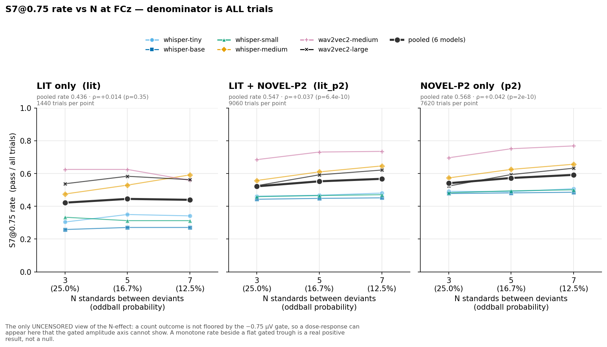
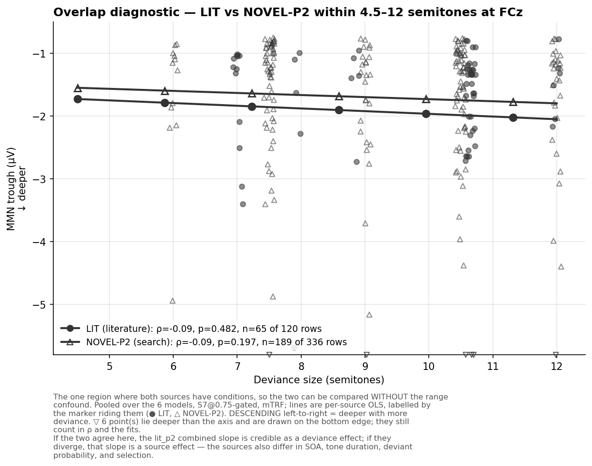
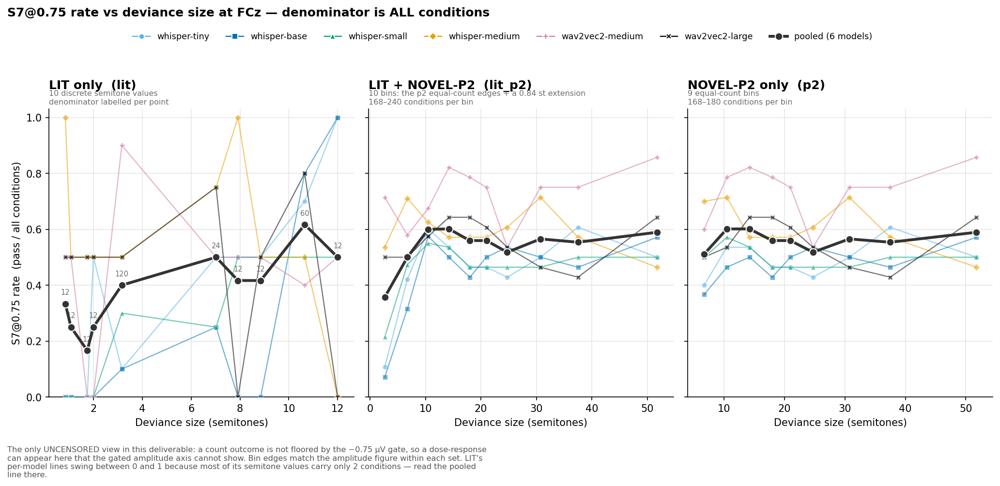

# MMN "realness" at FCz — the N-effect and deviance scaling of the S7 trough

Two dose-response checks on whether the in-silico MMN behaves like a human/clinical MMN. Both ask
the same question — **does the trough deepen as the paradigm makes the oddball more surprising?** —
along two axes the MMN literature has strong priors about:

- **The N-effect.** More standards between deviants → deeper MMN.
- **Deviance scaling.** Larger standard→deviant frequency separation → deeper MMN.

**Site:** the FCz electrode only, mTRF only, six models (whisper-large excluded — see §5.6).
**Gate:** S7@0.75 is the headline, with a fully parallel S2 (shape-only) companion.
**Status:** complete. The per-trial re-run landed 2026-08-10; all three verification gates passed,
including a byte-level reproduction of the committed FCz S2/S7 counts.

Figures are referenced by path relative to this file. `README.md` in this directory is the
figure-reading guide and should be read first if the panels are unfamiliar.

---

## The result in three sentences

**Both manipulations increase the model's MMN amplitude, but the effects are small and the gated
amplitude figures hide them.** Conditioning on a −0.75 µV floor truncates exactly the traces a weak
dose-response moves, so the S7-gated trough looks flat while the *probability of clearing the
floor given an MMN-shaped response* rises sharply with both N (z = +6.63, p = 3e-11) and deviance
(ρ = +0.071, p = 0.015). The honest summary is not "occurrence responds but magnitude doesn't" —
it is that **amplitude responds weakly, and every censored view of it understates the effect**
(§3).

---

## 1. Design, in brief

**Two condition sources**, reported side by side and never pooled into a single regression:

| | LIT | NOVEL-P2 |
|---|---|---|
| conditions | 48 = 24 literature Frequency methods × {regular, counter} | 254 = 127 selected pairs × {regular, counter} |
| semitone range | 0.84 – 12.0 (10 values) | 4.50 – 63.0 (122 values) |
| timing | SOA 200–1000 ms, duration 50–200 ms — **varies** | 580 ms / 80 ms / 10% — **fixed** |
| selection | none | **selected on the outcome** (≥5/6 model agreement in phase 1) |
| S7@0.75 at FCz | 125 / 288 rows | 856 / 1524 rows |

Three analysis sets follow: `lit` (48 conditions), `lit_p2` (302), `p2` (254). A fourth
`p2_top100` panel appears on the pooled figures only and is described in §5.7.

**Two gates.** `S7@0.75` = an interior trough in 100–240 ms recovering ≥50% within 120 ms
(**S2**), *and* trough ≤ −0.75 µV. `S2` alone drops the depth requirement. The floor is not a
minor filter: it discards **52% of LIT's S2 traces and 28% of NOVEL-P2's**. Every S7 amplitude
number in this memo is therefore a **lower bound**.

**One summary statistic** in every panel: the median with a 95% bootstrap CI of the median. The
per-bin trough distributions are strongly skewed (0 of 31 consistent with normality, Shapiro–Wilk;
skewness −2 to −3), so a mean is dragged toward the tail. `__mean_sem` companions of every
centre-and-interval figure are provided on identical axes so the choice can be audited; the
N=3→7 change agrees between the two statistics to ≤0.02 µV, so only the level moves, not the trend.

---

## 2. The N-effect

Per-trial scoring of 27,180 deviants (6 models × 302 conditions × 15 trials). The path reproduces
the pipeline's own stored `n7v1_peak` to 2.1–3.0 × 10⁻⁷, so this is the committed criterion applied
to single trials, not a re-implementation.

**All N amplitude figures use a *balanced* set** — only stimuli producing a criterion-passing MMN
at N=3 *and* 5 *and* 7. Without it the gate admits a different population at each N and the mean
moves because membership changed rather than because anything deepened. That was not hypothetical:
the unbalanced LIT panel rose visibly (unpaired p = 0.003) while paired within condition it was
null (p = 0.23, 50% of stimuli — a coin flip).

### 2.1 Gated amplitude: flat


Spearman ρ of trough vs N, computed at the (model, condition, N) cell level — the 5 variations
within a cell are the same paradigm re-rolled and are not independent, so a raw-trial ρ would
inflate n ~5×:

| set | ρ (S7) | p | ρ (S2) | p |
|---|---|---|---|---|
| `lit` | −0.064 | 0.185 | −0.023 | 0.513 |
| `lit_p2` | −0.015 | 0.378 | **−0.039** | **0.0079** |
| `p2` | −0.006 | 0.754 | **−0.041** | **0.0117** |

Gated, nothing is significant. **Ungated, both NOVEL-P2-containing sets are.** That pattern — an
effect that appears when the floor is removed — recurs throughout this memo and is the subject
of §3.

The paired within-condition test agrees and quantifies the gap:

| set | Δ (N7 − N3), S7 | p | Δ, S2 | p |
|---|---|---|---|---|
| `lit` | −0.065 µV | 0.228 | −0.054 µV | 0.116 |
| `lit_p2` | −0.049 µV | 0.0021 | **−0.080 µV** | **2.2e-05** |
| `p2` | −0.047 µV | 0.0041 | **−0.085 µV** | **8.7e-05** |

**The floor hides roughly half the amplitude effect.** −0.085 µV ungated against −0.047 µV gated.

### 2.2 The raw-data view: change is near-symmetric about zero


This is the N analogue of the deviance scatter, but plots the **within-stimulus change** rather
than raw trials — N has only 3 x-levels carrying 4,000+ trials each, so a strip plot is a solid
block, and trials within a stimulus are not independent, so a trial scatter would imply ~14,000
independent observations.

| set | n (model × stimulus) | % deepening | median Δ | IQR of Δ |
|---|---|---|---|---|
| `lit` | 130 | 50% | −0.002 µV | −0.20 … +0.14 |
| `lit_p2` | 1030 | 54% | −0.019 µV | −0.17 … +0.11 |
| `p2` | 900 | 55% | −0.020 µV | −0.16 … +0.11 |
| `p2_top100` | 505 | 57% | −0.026 µV | −0.17 … +0.09 |

**At the level of individual stimuli the N effect is barely distinguishable from a coin flip.**
The change distribution is ~±1 µV wide against a median shift of 0.02 µV. This is true, important,
and invisible in any figure that plots only the centre.

### 2.3 Per model: the pooled line averages over models that disagree


Within LIT, whisper-medium deepens in **77% of its stimuli** (median −0.483 µV, p = 6e-05), while
wav2vec2-medium (35%), whisper-base (38%) and whisper-small (40%) run the *other* way. Only 3 of 6
models share a ρ sign between the two sources, so — contrary to the expectation that N is the
identical manipulation in both — **`lit_p2` reads as a mixture for amplitude and is reported per
source**, not as an n-boost.

Per-panel y-scales are used here deliberately: the models sit ~2 µV apart while each one's change
across N is 0.05–0.35 µV, so a shared axis compresses every trend to a few percent of the axis
height. Compare *shape* across panels, not height.

### 2.4 Pass rate: a steep, robust rise



| set | N=3 | N=5 | N=7 | Cochran–Armitage trend | rise |
|---|---|---|---|---|---|
| `lit` | 0.422 | 0.445 | 0.440 | z = +0.94, p = 0.35 | +1.7 pts |
| `lit_p2` | 0.522 | 0.552 | 0.568 | z = +6.18, **p = 6e-10** | +4.6 pts |
| `p2` | 0.541 | 0.573 | 0.592 | z = +6.36, **p = 2e-10** | +5.1 pts |

**Carried by the larger models.** Within NOVEL-P2 the trend is significant for whisper-medium
(z = 4.33), wav2vec2-medium (z = 4.15) and wav2vec2-large (z = 5.55), all p < 1e-4, and absent in
whisper-tiny, -base and -small (all p > 0.35). Suggestive for a scaling project — but six models
across two architectures, matched on nothing but size, so a hypothesis rather than a result.

---

## 3. What the pass-rate effect actually is

The S7 pass rate is a product: **P(S7) = P(shape) × P(deep enough | shape)**. Decomposing it
separates "the model produces an MMN-shaped response more often" from "the response it produces is
bigger". Within NOVEL-P2:

| | P(shape) | P(deep \| shape) | P(S7) |
|---|---|---|---|
| **N = 3** | 0.773 | 0.700 | 0.541 |
| **N = 5** | 0.780 | 0.734 | 0.573 |
| **N = 7** | 0.785 | 0.754 | 0.592 |
| *trend* | +1.2 pts, ns | **z = +6.63, p = 3e-11** | z = +6.36 |

**The entire N pass-rate effect is the depth term.** The shape-pass rate barely moves. So the
"rate" result is not a separate phenomenon from amplitude — it *is* the amplitude effect, measured
by how often the trough clears a fixed threshold instead of by its conditional mean.

The same decomposition on deviance is more striking, because the two terms oppose:

| semitone tertile | P(shape) | P(deep \| shape) | P(S7) |
|---|---|---|---|
| 4.5 – 16.5 st | 0.828 | 0.689 | 0.570 |
| 16.5 – 27.0 st | 0.756 | 0.722 | 0.546 |
| 27.0 – 63.0 st | 0.748 | 0.761 | 0.569 |
| *trend* | **falls** | **ρ = +0.071, p = 0.015** | ρ = +0.005, ns |

**NOVEL-P2's flat S7 deviance rate is not a null — it is a rising amplitude effect cancelled by a
falling shape-pass rate.** Larger separations make the response bigger *and* make it less likely to
have the classical dip-and-recover shape at all, which is consistent with the >2-octave conditions
behaving like a different sound rather than a deviant (§4.3).

**Why the gated amplitude looks flat.** Conditioning on trough ≤ −0.75 µV truncates the
distribution at a fixed point. Shifting a distribution deeper pushes more of it past the threshold
— raising the *rate* — while the newly-admitted traces sit just past the floor and are therefore
shallow, pulling the *surviving mean* back up. The two partly cancel, which is exactly what the
S7-vs-S2 gap shows (−0.047 vs −0.085 µV). A flat gated trough beside a rising pass rate is the
signature of a real but modest amplitude effect seen through a threshold, not of an effect on
occurrence alone.

---

## 4. Deviance scaling

### 4.1 Pooled


Pooled Spearman ρ of trough vs semitones (negative = deeper with more deviance = MMN-like):

| set | full range (S7) | ≤ 24 st (S7) | full range (S2) | ≤ 24 st (S2) |
|---|---|---|---|---|
| `lit` | −0.311 (p = 4e-04) | −0.311 | −0.240 (p = 9e-05) | −0.240 |
| `lit_p2` | −0.096 (p = 0.003) | −0.165 (p = 3e-05) | **−0.190 (p = 3e-13)** | −0.205 (p = 6e-11) |
| `p2` | −0.065 (p = 0.056) | −0.145 (p = 9e-04) | −0.093 (p = 0.001) | −0.102 (p = 0.006) |

As with N, the ungated numbers are larger and more significant than the gated ones.

### 4.2 LIT's headline number does not survive decomposition

ρ = −0.311 is the largest single number in this deliverable. Split at the point where NOVEL-P2
begins:

| LIT sub-range | ρ | p | n | median trough |
|---|---|---|---|---|
| 0.84 – 3.16 st (low cluster) | −0.086 | 0.51 | 60 | −1.13 µV |
| 4.50 – 12 st (overlap) | −0.089 | 0.48 | 65 | −1.36 µV |
| **full range** | **−0.311** | **4e-04** | 125 | −1.27 µV |

**Flat within each half.** The whole correlation is the −1.13 → −1.36 µV *step* between two dense
method clusters — 10 of 24 methods sit at 3.16 st and 5 at 10.65 st — which also differ in SOA
(200–1000 ms) and tone duration (50–200 ms). It is a two-cluster contrast confounded with timing,
structurally the same weakness as the combined-set slope, and should never be quoted alone.

### 4.3 The effect is real below two octaves and reverses above

NOVEL-P2 is the only source with timing controlled, and it splits sharply at 24 st:

| range | ρ | p | n | median |
|---|---|---|---|---|
| 4.5 – 12 st | −0.094 | 0.20 | 189 | −1.29 µV |
| 12 – 24 st | −0.139 | 0.0095 | 347 | −1.52 µV |
| **> 24 st** | **+0.131** | **0.015** | 347 | −1.55 µV |
| ≤ 24 st | **−0.145** | **9e-04** | 519 | −1.46 µV |

Saturation is itself MMN-like — human MMN amplitude saturates with large deviance. The *reversal*
is more interesting: beyond two octaves the deviant appears to stop being processed as a deviation
from the standard, which the falling shape-pass rate in §3 independently corroborates. It is also
confounded with absolute frequency region, since large separations necessarily involve different
parts of the spectrum. **ρ = −0.145 on the ≤ 24 st subset is the cleanest deviance estimate here**:
timing fixed, 519 gated rows, and not a between-cluster or between-source contrast.

### 4.4 Is the combined set trustworthy?



LIT spans 0.84–12 st and NOVEL-P2 spans 4.50–63, so a slope fitted across the union is
substantially a **between-source contrast wearing a deviance label** — the sources also differ in
SOA, duration, deviant probability and selection, and `lit_p2` is 87% NOVEL-P2 rows. Inside the
4.50–12 st window where both have conditions:

| source | ρ | p | S7 rows |
|---|---|---|---|
| LIT | −0.089 | 0.482 | 65 / 120 |
| NOVEL-P2 | −0.094 | 0.197 | 189 / 336 |

Same sign, near-identical magnitude, near-identical median (−1.36 vs −1.29 µV) — but **both
non-significant**. This is agreement on a *null*. It does the useful negative job of ruling out a
systematic µV offset between sources driving the combined slope; it does **not** establish a
deviance effect inside the overlap. The `lit_p2` ρ should never be quoted without this pair beside
it.

### 4.5 Per model


Full-range ρ per model within `p2` (S7): whisper-small **−0.395** (p = 5e-06), whisper-base
**−0.207** (p = 0.02), whisper-tiny −0.089 (ns), whisper-medium +0.018 (ns), wav2vec2-medium +0.062
(ns), wav2vec2-large +0.079 (ns). In LIT the strongest are whisper-small (−0.829) and whisper-tiny
(−0.669).

So the deviance effect is carried by the **three smallest whisper models**, while whisper-medium
and both wav2vec2 models are flat or marginally positive. That is close to the *opposite* of the N
pass-rate split, where whisper-medium, wav2vec2-medium and wav2vec2-large carried the effect and
the small whisper models were flat (§2.4). **The two dose-response axes are not picking out the
same property of the models** — which is a caution against reading either as a general "this model
is more MMN-like" ranking.

### 4.6 Pass rate



| set | first bin → last bin | trial-level ρ |
|---|---|---|
| `lit` | 0.333 → 0.500 | **+0.215** (p = 2e-04) |
| `lit_p2` | 0.357 → 0.589 | +0.069 (p = 0.003) |
| `p2` | 0.511 → 0.589 | +0.005 (p = 0.86) |

Read this with §3: `p2`'s flat rate is two opposing effects cancelling, not an absence of one. The
LIT rise is carried by the low-deviance end that only LIT covers.

---

## 5. Interpretation limits

**5.1 N is confounded with oddball probability by construction.** The generator sets rare-tone
probability to 1/(N+1), so N = 3/5/7 means 25% / 16.7% / 12.5%. A deepening trough is genuinely
MMN-like but cannot separate local spacing from global rarity; both are real mechanisms in humans.
*(Note the generator's labels are inverted relative to the tones' roles — the frequent background
tone is named "deviant" and the rare oddball "standard". The axis labels here are in role terms
and are correct; see §18.7 of the repository overview.)*

**5.2 NOVEL-P2 is selected on the outcome variable.** Phase 2 admitted only pairs reaching ≥5/6
model agreement on S7 at FCz in phase 1 — essentially the quantity plotted here. It answers *"among
stimuli that reliably evoke a model MMN, does amplitude scale?"*, not *"does deviance drive
amplitude?"*. Its larger n does not make it the stronger claim.

**5.3 NOVEL-P2's range is truncated from below by that selection.** Of the full 903-pair grid, 0 of
42 pairs below 2 st and 0 of 41 between 2–4 st survived; the minimum selected separation is
4.50 st. The small-deviance end — where the effect should be weakest and the trend most diagnostic
— is absent, and LIT is the only coverage there.

**5.4 NOVEL-P2 trades a timing confound for a frequency-region one.** Fixing SOA, duration and
deviant probability is a genuine advantage over LIT. But `f_low` ranges 200–4,525 Hz and `f_high`
up to 7,611 Hz, so large separations necessarily involve different absolute frequency regions where
model and cochlear sensitivity differ.

**5.5 LIT's coverage is lumpy and confounded with timing.** See §4.2 — this is not a cosmetic
caveat, it is the whole of LIT's −0.311.

**5.6 Six models, not seven.** whisper-large is excluded from every figure, table and statistic,
for two independent reasons: its predicted µV run ~20–35× every other model (median S7-passing LIT
trough at FCz −37.3 µV against a −1.08…−1.75 µV band for the other six), which would dominate any
raw-µV mean and force a symlog axis; and it was never run in the novel search, so including it
would make `lit` and `p2` incomparable. **It was not tested here — it did not quietly fail.**

**5.7 The `p2_top100` panel is selected on the outcome twice.** It is the first 100 rows of the
search's own phase-2 ranking (by model agreement, then trough depth), on top of NOVEL-P2's own
selection. Its S7 pass rate is 83% against p2's 56% and its troughs are deeper by construction
(median −1.57 vs −1.49 µV). It bounds the best responders; it does not estimate an effect size, and
no statistic in this memo is computed on it. Reassuringly, it reproduces p2's *shape* — the same
non-monotone N pattern and the same dip-and-recovery in deviance — so the trends are not an
artefact of averaging in weak responders.

**5.8 Predicted µV are not literature EEG µV.** Ridge shrinks the mTRF's predicted amplitude, and
the 0.75 µV floor is calibrated to the models' own predicted-trough distribution, not to a clinical
scale. Absolute depths (medians −1.27 to −1.57 µV) are **not** comparable to published MMN
amplitudes. Only direction and monotonicity transfer.

**5.9 Why this matters for clinical work.** Essentially every clinical MMN finding — the
schizophrenia literature especially — is an **amplitude reduction**. A readout whose amplitude
tracks the driving manipulations only weakly is a correspondingly weak substrate for modelling
that. §3 argues the underlying amplitude sensitivity is real but that our measurement compresses
it; establishing how much is measurement and how much is the model is the highest-value follow-up.

---

## 6. Provenance and reproduction

| artefact | path |
|---|---|
| per-trial scoring | `analyze_mmn_per_trial_n.py` → `mmn_per_trial_n_fcz.csv` (4,320 + 22,860 rows) |
| N figures + stats | `n_effect_plots.py` → 4 stats CSVs |
| deviance figures + stats | `deviance_scaling_s7gated.py` → 1 stats CSV |
| shared vocabulary | `mmn_dose_response_common.py` |
| figure-reading guide | `README.md` |
| cluster runbook | `handoff_per_trial_deviants_n_effect.md` |

```bash
conda activate mbs-env
python aux/analysis_MMN_realness_checks/deviance_scaling_s7gated.py --gate s7   # and --gate s2
python aux/analysis_MMN_realness_checks/n_effect_plots.py           --gate s7   # and --gate s2
```

Output is byte-reproducible: fixed SVG hash salt, suppressed SVG timestamps, and a seeded
bootstrap. Scoring primitives are imported from `analyze_mmn_criteria` /
`analyze_mmn_criteria_s5_s6`, never reimplemented, with knobs identical to `analyze_mmn_s7_roi.py`.
The driver patch that made the per-trial analysis possible, and the two cluster re-runs it
required, are documented in §18 of `aux/sophies_repository_overview.md`.
