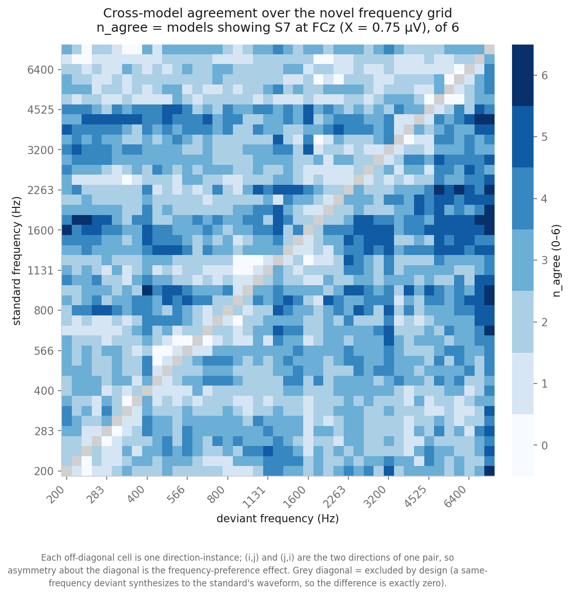
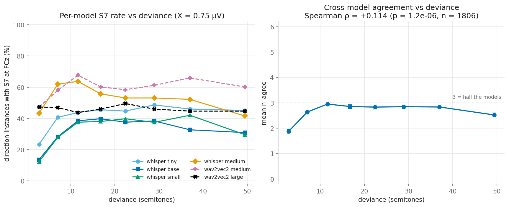
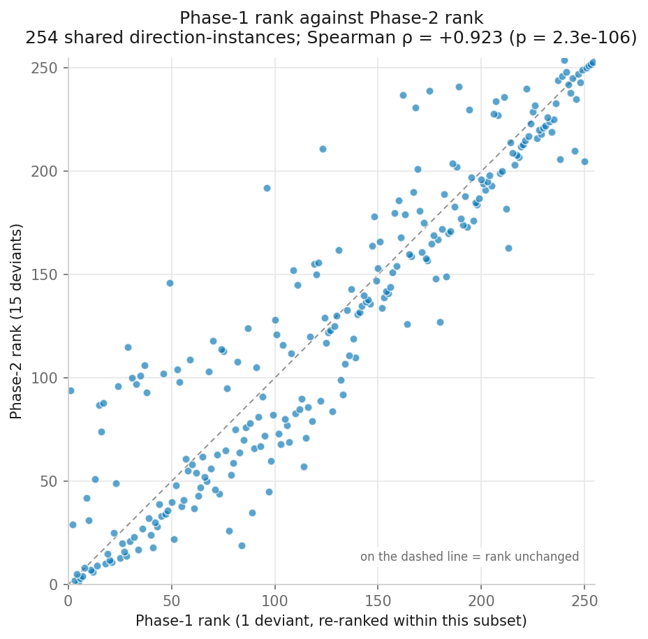

# Novel tone-pair stimulus search — results

> ⚠️ **STATUS (2026-07-25): SCAFFOLD — no cluster data yet.** Every numeric slot below is a
> placeholder marked `‹TBD›`. The code that fills them is written, smoke-tested against synthetic
> fixtures, and documented in `aux/sophies_repository_overview.md` §17, but Phases 1 and 2 have not
> been run. **Do not cite anything in this file until this banner is removed.** Fill each section
> from the console output of the script named in its provenance header — do not re-derive numbers
> by hand.

> **Extends** `aux/analysis_with_counter/results_analysis_with_counter.md`, which screened the
> **24 literature frequency methods** × 7 models. This memo screens a **528-pair novel frequency
> grid** × 6 models (whisper-large excluded — it alone was 51% of the literature screen's cost),
> mTRF only, at the FCz electrode, at a fixed µV floor of X = 0.75.
> 528 unordered pairs × {regular, counter} = **1,056 direction-instances** in Phase 1; the
> top **145 pairs** (= 290 direction-instances) are re-evaluated in Phase 2.

> **The question.** The literature screen tested whatever pairs published MMN studies happened to
> use. This asks whether pairs *absent* from that literature drive stronger and more
> model-consistent responses — and, as a second-order but reusable result, whether a cheap 4-clip
> screen predicts a full 32-clip evaluation well enough to be a general search strategy.

---

## Caveats — all load-bearing, all apply to every section below

**1 — Phase 1 is one deviant draw; Phase 2 is the mean of fifteen.** Phase 1 scores each condition
from a single realization (N7/var1); Phase 2 averages all 15. The models are deterministic, so the
difference between the phases is **not measurement noise** — it is one sample from the
stochastic-prefix distribution versus its mean. Rankings can legitimately shift. Quantifying that
shift (Section 3) is a deliverable, not a failure.

**2 — Amplitude shrinkage: these are not human-scale microvolts.** mTRF predictions are ~4×
amplitude-shrunk. X = 0.75 µV is calibrated to the *model's own* trough distribution
(median ≈ −0.8 µV), not to literature EEG scale (human MMN ≈ 1–5 µV). **Do not read `trough_uv` or
`mean_uv` as a literature-comparable amplitude**, and never compare `trough_uv` across models.

**3 — Out-of-domain mapping.** Speech-trained models with a speech-fit mapping are being applied to
pure tones. This caveat applies equally to the literature screen, so the *comparison* in Section 4
is fair, but it limits any absolute claim about these stimuli.

**4 — The grid is coarse, with one exception.** Every ladder step is 2.000 semitones (12.25%), so
that is the resolution almost everywhere — coarser than 4 of the 24 literature frequency methods
(0.84, 1.07, 1.74, 1.99 st). The single exception is 7184↔7500 Hz at **0.745 st (4.4%)**, finer
than any literature method but sitting far above their 600–1000 Hz band, with no published
counterpart to compare against. Treat this as a coarse-to-fine search of a wide space, **not a
threshold study**, and do not generalise the one fine pair to the rest of the range.

**5 — wav2vec2 comparability.** Mapped on 10 s windows with `PCA_VAR=0.95`, vs whisper's 30 s and
`pca_var=None`. Its test r is a loose sanity gate only, not a like-for-like quality figure.

---

## Section 1 — What the grid covers, and what it cost

> **Code:** `scripts/build_novel_grid_csv.py`, `scripts/slurm_mmn_extract_batch.sh`
> **Data:** `data/metadata/novel_grid_frequency_metadata.csv`,
> `outputs/results_novel_search/grid_index.csv`
> **Design.** 33 frequencies: a 32-rung ladder from 200 Hz in exact 2.000-semitone steps (to
> 7184 Hz), plus 7500 Hz. Semitone spacing keeps every step the same perceptual size and puts
> octaves exactly on the grid (200/400/800/1600/3200/6400); the 7500 extra holds the top of the
> range and creates one irregular 0.745 st rung. → 528 unordered pairs. Both directions of each
> pair are synthesized by the existing counterbalancing, so the 528 rows cover all **1,056
> ordered** combinations. The diagonal is
> excluded by construction: a same-frequency "deviant" synthesizes to a waveform byte-identical to
> the standard, so the difference is exactly zero. The graded control is the smallest-Δf pairs.

**Table 1. Extraction spend, each phase against its own budget** — from `sacct`, not the estimate.
The phase sizes are fixed by design (528 pairs, then the top 145); the budgets are what they are
measured against, not an input to the selection.

| | dirs | clips/dir | budget CHF | predicted CHF | **actual CHF** |
|---|---|---|---|---|---|
| Phase 1 | 1,056 | 2 | 110 | ≈123.4 | ‹TBD› |
| Phase 2 | 290 | 14 (new only) | 220 | ≈221.6 | ‹TBD› |
| **total** | | | 330 | ≈345.0 | **‹TBD›** |

Reported separately, **not** charged to the budget: in-silico MMN (~1.9 CHF Phase 1, ~0.6 CHF
Phase 2, both with `--save_plots false`), audio synthesis, ranking, plots.

The predictions already include the per-array-task model-load overhead (≈0.27 core-h), which the
raw per-clip cost table omits; at 2 clips per task that is ≈9.4 CHF of the Phase-1 figure and is
why both phases are expected to run modestly over. The pair count does **not** move in response —
it is a flat 145 by design. See §17.4 of the repository overview.

### Section 1 summary
- ‹TBD: did each phase land within its own budget; if not, where did the cost model go wrong›

---

## Section 2 — Does the novel grid produce cross-model agreement, and does it track deviance?

> **Code:** `scripts/rank_novel_phase1.py` (console sanity checks),
> `aux/analysis_novel_search/plots/novel_search_plots.py`
> **Data:** `outputs/results_novel_search/phase1_ranked_directions.csv`
> **Definitions.** **S2** = negative trough in 100–240 ms that recovers ≥50% of its depth within
> 120 ms. **S7@X** = `S2 AND (trough_uv ≤ −X µV)`; here X = 0.75, at FCz, mTRF.
> **n_agree** = how many of the 6 models show S7 (0–6). **mean_uv** = mean `trough_uv` across
> *only* the agreeing models — averaging in models that failed S2 would mix in latencies that are
> not MMN latencies. Undefined when `n_agree = 0`.

**Table 2. Direction-instances by n_agree tier (Phase 1, /1056).** ‹TBD›

**Table 3. n_agree vs deviance, by octile.** ‹TBD — plus Spearman ρ(pct_deviance, n_agree)›

A monotone rise then plateau is the expected deviance-scaling signature. **A flat relationship
would say the metric is not tracking deviance at all** and would undercut every ranking below —
read this table before Section 4.





### Section 2 summary
- ‹TBD: direct answer — does agreement rise with deviance, and where does it plateau›

---

## Section 3 — Is a 4-clip screen a valid proxy for a 32-clip evaluation?

> **Code:** `scripts/rank_novel_phase2.py`
> **Data:** `outputs/results_novel_search/phase2_final_ranking.csv`
> **Method.** Spearman ρ between the Phase-1 and Phase-2 rankings over the 290 shared
> direction-instances. Phase-1 ranks are positions in the full 1,056-instance list, so they are
> **re-ranked within the shared subset** before correlating — otherwise the comparison would be
> against a population Phase 2 never scored.

This is the **methodological** result and the most reusable thing in this memo: it says whether
the two-phase design generalises to future searches, independently of which tone pairs won.

**Table 4. Rank stability.** ‹TBD — ρ, p, n; % of instances keeping their n_agree tier; median and
90th-percentile |rank shift|›



Re-read Caveat 1 before interpreting: a moderate ρ is the expected consequence of one draw versus
a 15-draw mean, not evidence that the screen is broken. The number that matters practically is the
**tier-retention rate at the top** — whether pairs that looked 6/6 on one deviant stay 6/6 on
fifteen.

### Section 3 summary
- ‹TBD: is the cheap screen a valid proxy; at what tier does it stop being reliable›

---

## Section 4 — Do novel pairs beat the literature pairs?

> **Code:** `scripts/rank_novel_phase1.py` (`report_vs_literature`), `scripts/rank_novel_phase2.py`
> **Data:** novel rankings vs `outputs/results_24freq_7models/mmn_s7_roi.csv`, **scored
> identically** — same S7@0.75, same FCz, same mTRF, same 6 models (whisper-large dropped from the
> literature side too, so the comparison is like-for-like).

**Table 5. n_agree distribution, novel vs literature.** ‹TBD›

**Table 6. Best pair on each side.** ‹TBD›

**Table 7. Where the best novel pairs sit in frequency/deviance space** relative to the literature
methods. ‹TBD›

The honest null result to watch for: the literature screen found cross-model agreement to be near
chance (see Section 11 of `results_analysis_with_counter.md` — "10 of 48 pairs where all 7 agree"
against 6.9 expected by chance, p = 0.087). **If the novel grid's top tier is likewise consistent
with chance, say so plainly** — a wider search space does not by itself create agreement, and
reporting that is the result.

### Section 4 summary
- ‹TBD: direct answer — does any novel pair beat the best literature pair on n_agree, then mean_uv›

---

## Section 5 — The consensus set

> **Code:** `scripts/rank_novel_phase2.py` (`build_consensus`)
> **Data:** `outputs/results_novel_search/consensus_set.csv`
> **Definition.** Pairs where **both directions** reach n_agree = 6/6, sorted by the mean of the
> two directions' `mean_uv`. Requiring both directions is what distinguishes a deviance response
> from a **frequency preference** — a pair that only works one way is telling you the models like
> one of its two tones, not that they detect the change.

**Table 8. Consensus set.** ‹TBD — pair, f_low, f_high, semitones, % deviance, mean_uv of each
direction, and the direction gap›

**Table 9. Direction asymmetry across the whole grid.** ‹TBD — how often the two directions of a
pair land in different tiers; mean |regular − counter|›

An empty consensus set is a publishable outcome, not a pipeline fault (see Decision 0 in
`aux/analysis_with_counter/MMN_pipeline_analysis_decisions_notes_062226_with_counter.md`).

### Section 5 summary
- ‹TBD: the headline recommendation — which pairs, if any, to take forward›

---

## Reproducing this memo

Full run guide: `aux/sophies_repository_overview.md` §17.5 (Stages A–J). In short, after the
cluster stages and the rsync back:

```bash
python scripts/analyze_mmn_s7_roi.py --predictions_root outputs/insilico_mmn_predictions_novel \
    --dip_uv_threshold 0.75 --out outputs/results_novel_search/phase1_mmn_s7_roi.csv
python scripts/rank_novel_phase1.py          # top 145 pairs -> 290 method dirs
# ... Phase 2 ...
python scripts/rank_novel_phase2.py
python aux/analysis_novel_search/plots/novel_search_plots.py
```

*Sections 1–5 are filled from the console output of the script named in each provenance header.
Figures are written by `plots/novel_search_plots.py`; the ranking CSVs are the source of record.*
