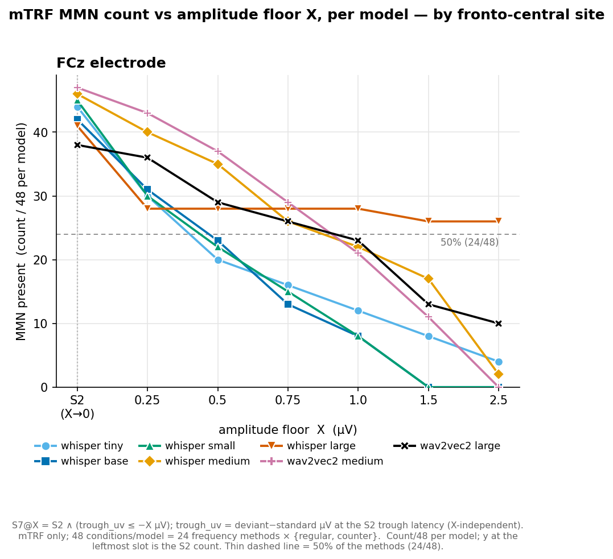
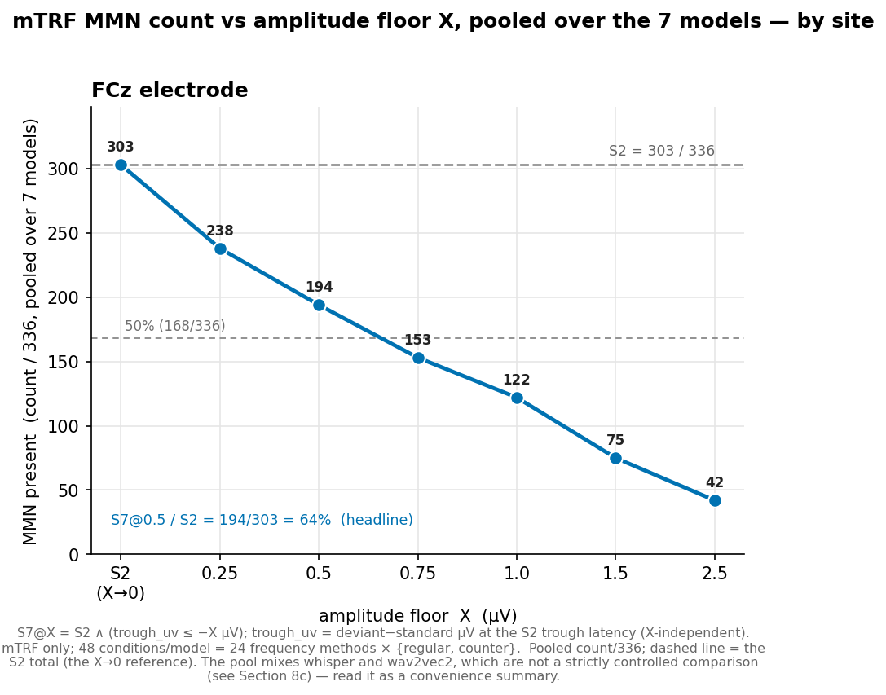
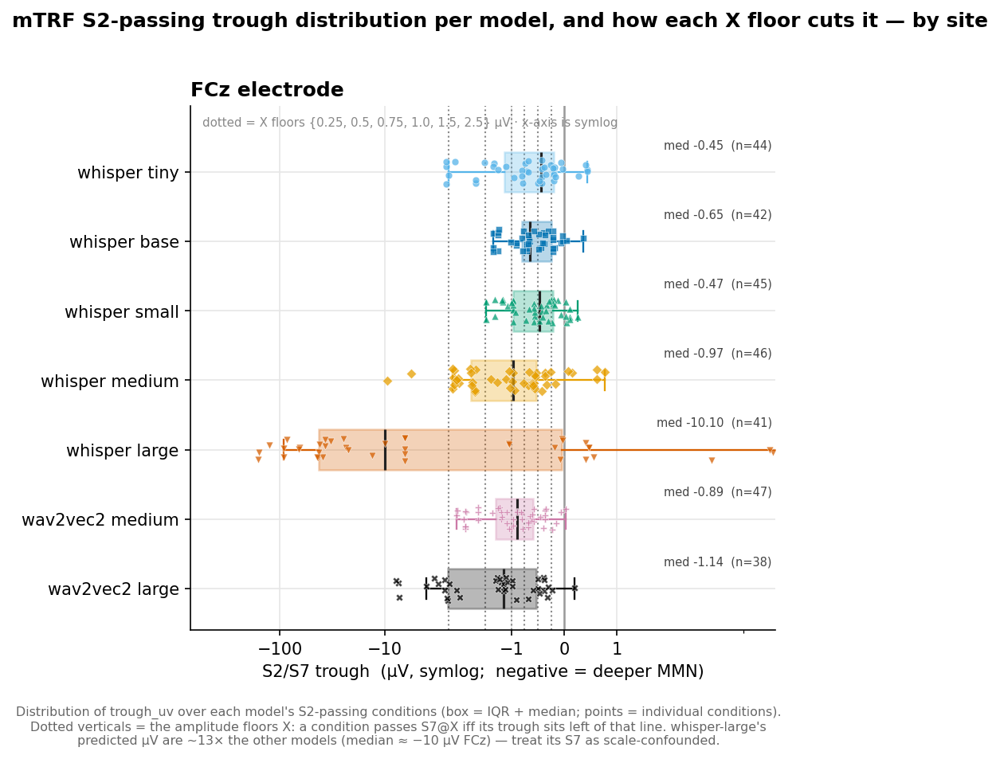
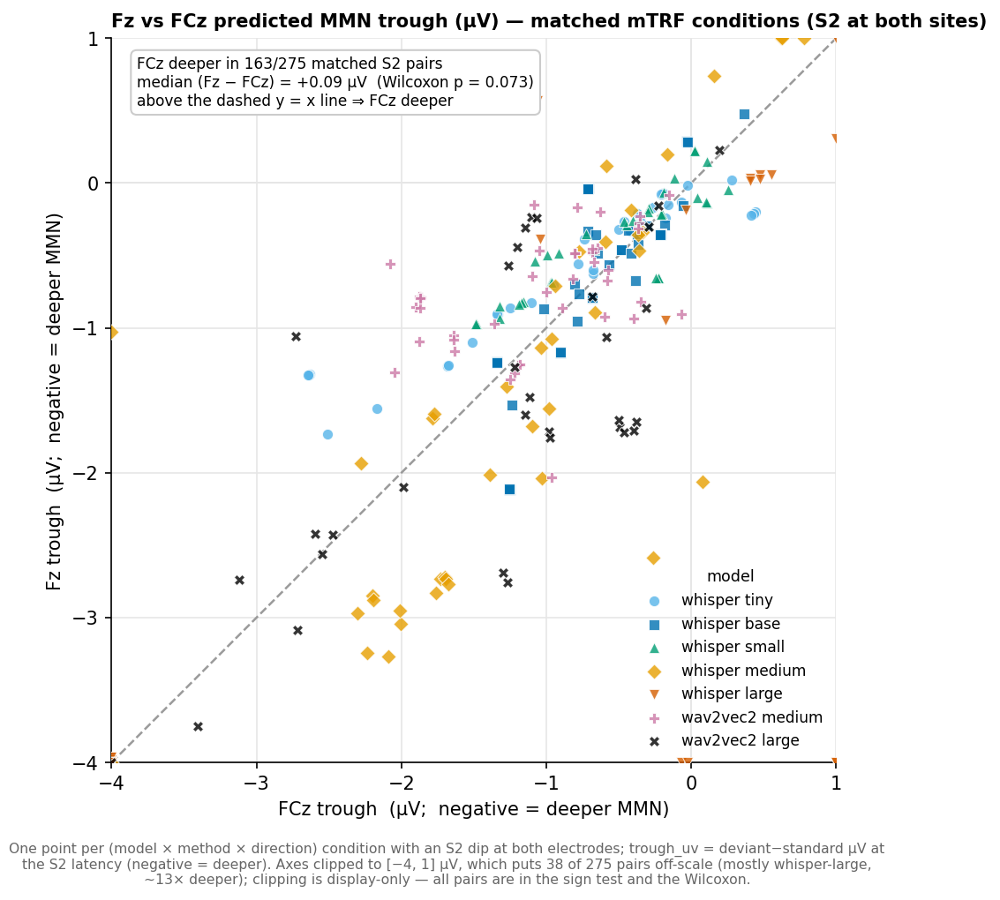
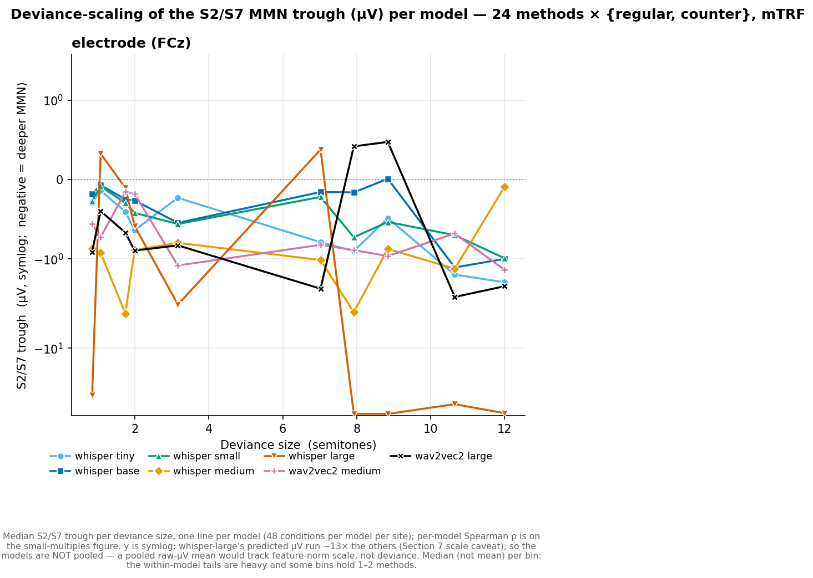
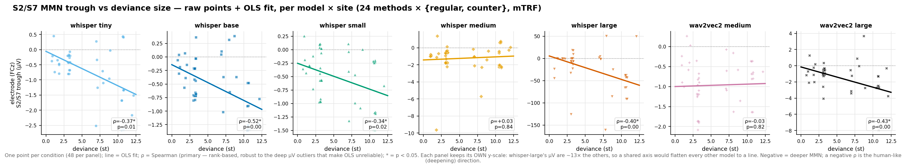
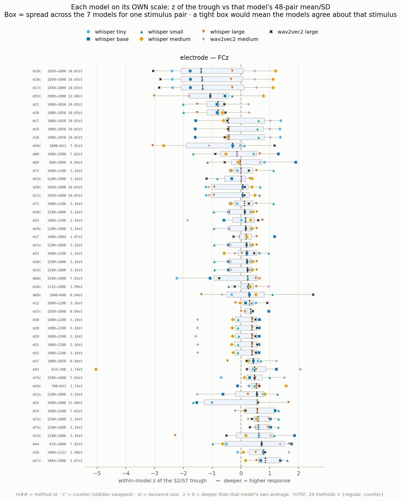
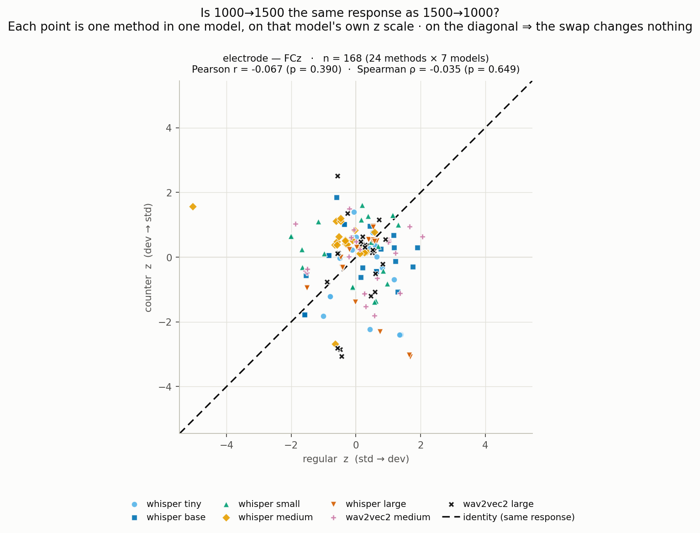
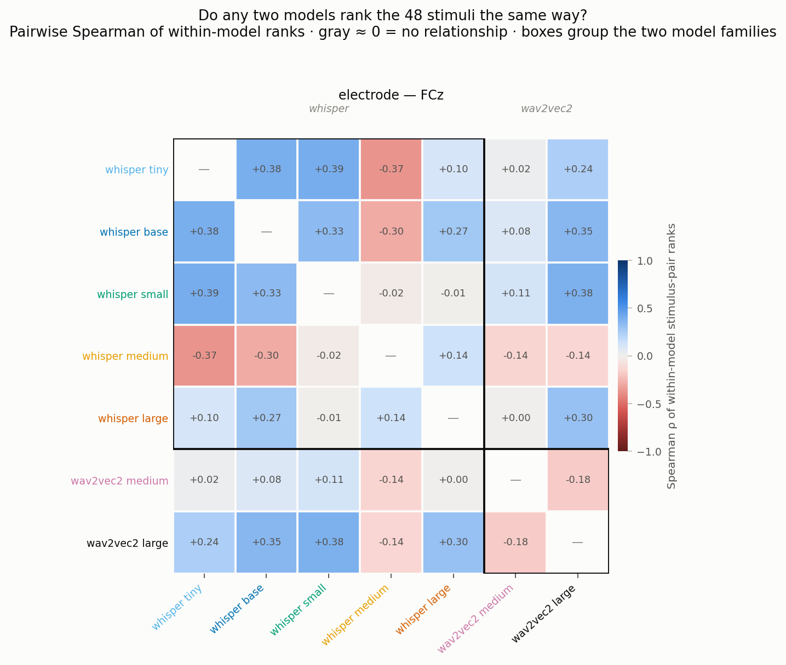

# In-Silico MMN — Sections 7–11 on the trailing-floor-corrected screen (mTRF × electrodes)

> **What this is.** A self-contained restatement of **Sections 7, 8, 8b, 8c, 10 and 11** of
> `aux/analysis_with_counter/results_analysis_with_counter.md` on the **trailing-floor re-screen**, at the
> **FCz electrode** only. It **supersedes those six sections** of the parent memo, which were computed on
> stimuli whose epochs ended before the MMN criteria finished reading (below). Every number here is
> recomputed from **`outputs/results_soafix/mmn_s7_roi.csv`**; nothing is scaled, interpolated or carried
> over. Section numbers are kept at their original values (7, 8, 8b, 8c, 10, 11) because the sections
> cross-reference each other and the parent by number.
>
> **Sections not reproduced here** — 0b, 1–6, the Cross-Method Comparisons, and 9 — remain in the parent
> memo on the **older 10-method / 4-model vintage** (20 conditions per model, mTRF + encoder;
> denominators /20, /40, /80, /160). They are **not comparable** to anything in this document, and the
> trailing-floor correction has **not** been applied to them.

---

## The correction

`compute_tone_slots` (`scripts/00aa_generate_audio_stimuli.py`) laid every clip out as
`[leftover][ISI][tone 1][ISI] … [tone K][ISI]`, pushing all slack to the front, so a clip ended exactly
one SOA after the final tone's onset. The MMN criteria read out to **360 ms** past that tone, and S2's
recovery search (`scripts/analyze_mmn_criteria.py:117-118`) is a bare `post = z[imin+1 : imin+1+6]` slice
with **no end guard**, while the trough may sit as late as 240 ms. On short-SOA literature rows the epoch
ended first, so the criterion was silently evaluated on whatever samples existed; where the trough landed
on the final sample, `post` came back **empty** and S2 returned `False` without ever being tested.
Nothing errored. The fix is a uniform layout rule — **trailing silence = max(400, SOA)**.

**Damage in the superseded screen**, measured over all 336 cells (7 models × 48 conditions, FCz/mTRF):

| | per model | total |
| --- | --- | --- |
| conditions ending before 360 ms | 24 of 48 | — |
| truncated recovery searches | 9–14 | 62 over the six SEARCH_MODELS |
| trough on the final sample (S2 forced `False`) | 3, in 4 of 7 models | 12 cells |
| scoring window `n_win` | 4–7 instead of 7 | — |

**This is not simply "more window".** Regenerating the 12 sub-400 ms literature `method_id`s
(10, 17, 18, 19, 28, 29, 30, 31, 32, 37, 53, 60) also shifted the leading silence by 400 − SOA
(50–100 ms) and dropped one tone in three of the ten changed method/family pairs, so the stochastic
prefix is a **different draw** and the predicted trace genuinely moves. Troughs shifted **in both
directions**, and several conditions got *worse* — the delta columns show this, and the prose below
matches them. The other 12 ids (9, 12, 20, 21, 27, 33, 43, 44, 55, 72, 74, 75) are byte-identical audio,
reused via symlink.

**Verification** (`scripts/verify_soafix_predictions.py`, re-run for this memo — **PASSES** over all 336
cells at FCz/mTRF): `max(400, soa_ms) − max(time_ms)` = 19.000–19.125 ms for all five whisper models and
39.000–39.125 ms for both wav2vec2 models; `min max(time_ms)` = 380.875 ms (whisper) / 360.875 ms
(wav2vec2), every instance **≥ 360**; `n_win` = **7 uniformly** (was 4–7); **zero** troughs on a final
sample (was 12 cells) and **zero** truncated recovery searches (was 62); and the 24 unchanged conditions
score **bit-identically** — 8232/8232 rows exact on `trough_uv` and `min_uv`, max|Δ| = 0.000e+00, with
`s2` / `s7` / `is_counter` all matching.

> Note `soa_ms − max(time_ms)` is **not** the invariant. Post-fix it reads as low as **−180.9 ms** for the
> SOA-200 ids *by design*, because the epoch ends one edge before the reserved tail, `max(400, SOA)`.

---

## Scope — mTRF × electrodes only

The re-screen ran `insilico_mmn_electrodes.py` **only**. What exists on each side:

| | old `results_24freq_7models` | new `results_soafix` |
| --- | --- | --- |
| electrode × mtrf | 16464 | **16464** |
| electrode × encoder | 1960 | 0 |
| parcel × mtrf | 4704 | 0 |
| parcel × encoder | 560 | 0 |
| **total** | 23688 | **16464** |
| `roi` values | C3 C4 Cz F3 F4 FCz Fz central frontal | C3 C4 Cz F3 F4 FCz Fz |

The electrode × mTRF slice matches the old one **row-for-row (16464 = 16464)**, so it regenerates exactly
and every cell has an old counterpart to difference against. **There is no frontal-parcel and no encoder
arm on the corrected data.** No parcel number from the old screen is carried into any table here as if
current, and the parcel driver was not re-run — out of scope. The consequences are handled explicitly in
**7b**, **Section 8**, **Section 10** and **Sections 8b/11** below.

Layers are unchanged: whisper-tiny `blocks.0`, whisper-base `blocks.0`, whisper-small `blocks.1`,
whisper-medium `blocks.12`, whisper-large `blocks.21`, wav2vec2-medium `encoder.layers.2`, wav2vec2-large
`encoder.layers.12`. Denominators are unchanged: **/48 per model** (24 frequency methods ×
{regular, counter}) and **/336 pooled** over the 7 models. Only the *site* axis shrank.

## How to read the Δ columns

> **Sign convention — Δ is NEW minus OLD, everywhere in this document, without exception.**
>
> - For **counts**, `+` means **more** conditions pass.
> - For **µV troughs**, values are **negative** and **more negative is a deeper MMN**. So a **negative Δ
>   means the trough deepened** and a **positive Δ means it grew shallower**. Do not read "−0.5" as a
>   weakening — it is a strengthening.
> - For **retention percentages and correlations**, Δ is the plain arithmetic difference.
>
> Deltas are computed by joining the two CSVs on
> `(model, mapping, method, roi_kind, roi, dip_uv_threshold)` — the same key
> `verify_soafix_predictions.py` uses, verified **unique on both sides** — after restricting **both** to
> `mapping == "mtrf"` and `roi_kind == "electrode"`.
>
> **Correctness check carried by every table.** The 24 unchanged conditions
> (9, 12, 20, 21, 27, 33, 43, 44, 55, 72, 74, 75 × both directions) **must** show **Δ = 0 exactly**. This
> was asserted before publication on the per-condition table (48b) and on the dose–response bins that
> rest on a single unchanged method (1.07, 1.74, 7.92, 8.84, 12.00 st — all Δ = +0.00). Deltas are
> rounded to the precision of the value beside them; anything with no old counterpart is written
> **n/a**, never blank or zero-filled.

## The three standing caveats (they govern every µV number in 7 / 8 / 8b / 8c)

Restated inline because a reader of this document does not have the parent's preamble.

1. **X is calibrated to the model, not to the literature (the ~4× shrinkage).** The mTRF's predicted µV
   are regularization-shrunk (~4×), so the model's predicted-µV scale need **not** match literature EEG µV
   (a literature MMN is ≈ 1–5 µV, ~3 µV typical peak; Duncan et al. 2009). X is calibrated to **each
   model's own predicted-µV trough distribution** (Table 31), not to the literature. **Do not read X as a
   literature-comparable amplitude.**
2. **The shrinkage is model-dependent.** whisper-large's predicted µV run far above the other models, so
   an absolute-µV floor confounds MMN depth with the model's internal feature-norm scale; read its S7
   counts as **scale-inflated**. **This caveat's magnitude changed on the corrected data** — at FCz the
   ratio is now **~13×**, not the ~40× the parent memo quotes (see 7a). It is smaller, but it has not
   gone away. The scale-robust comparisons remain the z-scored **S2** rate and the **within-model S7/S2
   retention**, not the raw S7 count.
3. **wav2vec2 is not a controlled match to whisper.** The two wav2vec2 models are pretrained
   **self-supervised (NOT ASR)** — `facebook/wav2vec2-base` (our *medium*) and `facebook/wav2vec2-large`
   (our *large*) — and their mTRF was fit under a different protocol: **10 s/10 s** windows versus
   whisper's **30 s/10 s** (both with **no PCA**, `pca_var=None`), with MMN features extracted at a 10 s
   window. So the pooled **/336** totals are a **convenience summary, not a controlled contrast**;
   per-model columns are the honest unit of comparison.

---

## Section 7 — Amplitude-gated MMN (S2 vs S7) across ROI options

> **Code:** `scripts/analyze_mmn_s7_roi.py` → **Data:** `outputs/results_soafix/mmn_s7_roi.csv` — the
> trailing-floor re-screen: 24 methods × {regular, counter} = **48 conditions per model per site**,
> **mTRF only**, **all 7 models**, **electrodes only**. Predictions under
> `outputs/insilico_mmn_predictions_soafix/`. Baseline for every Δ:
> `outputs/results_24freq_7models/mmn_s7_roi.csv`.
>
> **Definitions.** **S2** = interior trough in 100–240 ms with ≥ 50% recovery — X-independent.
> **S7@X** = `S2 AND (trough_uv ≤ −X µV)`, so **S7 ⊆ S2** in every cell. **trough_uv** = the signed
> deviant−standard µV depth at the S2 trough latency (negative = deeper MMN), carried X-independently in
> the CSV. **When a single floor is quoted the headline is X = 0.5 µV;** the calibration sweep
> {0.25 … 2.5} (Table 31) and the reporting sweep {0.25, 0.5, 0.75, 1.0, 1.5, 2.5} (Table 33) are below —
> the **0.25 and 2.5 bookends are always reported**, since the models converge at the lenient end and
> separate hardest at the strict end.
>
> **Encoder deferred**, as in the parent: the attention encoder was not run on the 24-method set, and the
> re-screen did not run it either.

### 7a · µV-trough calibration (Table 31)

Signed µV trough at the S2 latency over the **S2-passing** traces, pooled across the **seven
fronto-central electrodes** (Fz, F3, F4, FCz — frontal; Cz, C3, C4 — central), 48 × 7 models × 7
electrodes = **2352 traces**. `n` is the TOTAL number of traces in the group; **`no threshold (S2)`** is
the S2-passing count (the X→0 point); `min / med / max` are over the S2-passing troughs; each `≤ −X`
column is the S7 count.

**Table 31. Predicted µV-trough distribution and S7 counts over the fronto-central electrode set (mTRF)**

| mTRF × kind | n (total) | min | med | max | no threshold (S2) | ≤ −0.25 | ≤ −0.5 | ≤ −0.75 | ≤ −1.0 | ≤ −1.5 | ≤ −2.0 | ≤ −2.5 |
| --- | --- | --- | --- | --- | --- | --- | --- | --- | --- | --- | --- | --- |
| **mTRF × electrode (new)** | 2352 | −628.96 | **−1.26** | +229.78 | **1949** | 1632 | 1434 | 1262 | 1105 | 860 | 703 | 576 |
| Δ vs old screen | 0 | +0.00 | **−0.08** | +0.00 | **+173** | +167 | +147 | +126 | +130 | +104 | +85 | +57 |
| *mTRF × parcel* | *n/a* | *n/a* | *n/a* | *n/a* | *n/a* | *n/a* | *n/a* | *n/a* | *n/a* | *n/a* | *n/a* | *n/a* |

*Table note — the `n/a` row.* The parent's Table 31 carried a **mTRF × parcel** row (672 traces, the
frontal and central parcels). The re-screen produced **no parcel rows at all**, so there is no new value
and no delta to report; the old parcel numbers are deliberately not restated here, since a parcel figure
sitting beside corrected electrode figures would read as current when it is not.

**S2 rises by 173 traces (1776 → 1949 of 2352, 75.5% → 82.9%)** — the direct payoff of the fix: recovery
searches that used to run off the end of the epoch now complete, and the 12 cells where the trough sat on
the final sample (S2 forced `False` on an empty slice) are now actually tested. The median S2-passing
trough deepens slightly, **−1.18 → −1.26 µV (Δ −0.08)**, so the **X = 0.5 µV headline still sits
*shallower* than the typical trough**, which is the property that makes it a lenient-but-nontrivial floor.

**But the floor's grip tightened, not loosened.** Retention of S2 at each floor is essentially flat or
slightly *down* despite the larger S2 pool: 0.25 µV keeps **83.7%** (was 82.5%), the 0.5 headline
**73.6%** (was 72.5%), 1.0 µV **56.7%** (was 54.9%), and the 2.5 bookend **29.6%** (was 29.2%). The
extra S2 traces the fix recovered are, on average, **shallow** ones — they clear the shape bar and then
die at the amplitude bar. The extreme min/max (−629 … +230 µV) are unchanged to the last decimal, because
they come from unchanged conditions.

**Caveat 2, recomputed — the whisper-large scale gap narrowed sharply.** At FCz its median S2-passing
trough is now **−10.10 µV** against **−34.01 µV** before (Δ **+23.91**, i.e. much shallower), while the
other six models' medians barely move (median of medians −0.74 → −0.77 µV). The inflation factor is
therefore **~13×**, not the **~46×** the old screen showed and the parent memo rounds to "~40×". The
qualitative caveat stands — whisper-large still clears absolute-µV floors far more easily than any other
model, and its S7 counts are still scale-inflated — but **any claim quoting "~40×" against this data is
wrong**, and the reason is instructive: much of that 40× lived in the very conditions the fix
regenerated.

### 7b · S2 → S7 at the FCz reporting site (Table 33)

> **Retitled.** The parent's 7b is *"S2 → S7 at the **two** fronto-central reporting sites
> (Tables 32–33)"* — the frontal parcel and the FCz electrode. **There is now one.** The corrected screen
> has no parcel rows, so **the parcel-vs-electrode comparison is unavailable on this data**, the parent's
> Table 32 has no successor here, and Table 33 keeps its number.

Present-count **n/48 per model**; the **Total** column is **n/336**. Rows are the shape verdict `S2` and
the amplitude-gated `S7@X` for X ∈ {**0.25**, 0.5, 0.75, 1.0, 1.5, **2.5**} µV, each computed from
`trough_uv`. Cells are `new (Δ)` — the table is 7 models wide, so the delta is inline. By construction
S7 ⊆ S2, so every S7 row ≤ the S2 row. The **X = 0.5 µV headline** row is bolded. **whisper-large's
counts are scale-inflated** (caveat 2) and the **Total** column pools whisper with the differently-trained
wav2vec2 models (caveat 3) — read both as summaries, not controlled contrasts.

**Table 33. mTRF — FCz electrode** (new count, Δ vs the old screen)

| Criterion | whisper-tiny | whisper-base | whisper-small | whisper-medium | whisper-large | wav2vec2-medium | wav2vec2-large | Total (n/336) |
| --- | --- | --- | --- | --- | --- | --- | --- | --- |
| S2 | 44 (+3) | 42 (+3) | 45 (+3) | 46 (+11) | 41 (+3) | 47 (+6) | 38 (+9) | 303 (+38) |
| S7@0.25 | 30 (+0) | 31 (+1) | 30 (+3) | 40 (+8) | 28 (−2) | 43 (+8) | 36 (+9) | 238 (+27) |
| **S7@0.5** | **20 (−6)** | **23 (+2)** | **22 (+4)** | **35 (+9)** | **28 (−2)** | **37 (+4)** | **29 (+7)** | **194 (+18)** |
| S7@0.75 | 16 (+0) | 13 (+1) | 15 (+1) | 26 (+4) | 28 (−2) | 29 (+5) | 26 (+6) | 153 (+15) |
| S7@1.0 | 12 (+0) | 8 (+3) | 8 (−4) | 22 (+2) | 28 (−2) | 21 (+5) | 23 (+6) | 122 (+10) |
| S7@1.5 | 8 (+0) | 0 (+0) | 0 (+0) | 17 (+2) | 26 (−4) | 11 (−1) | 13 (+6) | 75 (+3) |
| S7@2.5 | 4 (+0) | 0 (+0) | 0 (+0) | 2 (−2) | 26 (−4) | 0 (−1) | 10 (+6) | 42 (−1) |

**What moved, and why.** **S2 rises in every model** (+3 to +11, pooled 265 → 303 of 336) — that is the
fix working exactly as designed. **S7 rises much less** (+18 at the headline) and **falls outright at the
strict end** (S7@2.5, −1 pooled). Two mechanisms, pulling opposite ways:

- **Conditions the fix rescued are shallow.** whisper-medium gains the most shape (+11 S2) and converts
  most of it (+9 at 0.5 µV), but pooled retention still drops from 66% to **64%**.
- **The re-drawn prefix moved troughs in both directions.** **whisper-tiny loses 6 conditions at the 0.5
  headline while gaining 3 on S2** — its S2 → S7@0.5 retention collapses from **63% to 45%**, the largest
  single regression in this document. **whisper-large loses 2–4 at every floor**, consistent with 7a's
  finding that its inflated troughs shrank by ~3.4×. Neither is an error to explain away: S2 held, the
  troughs simply moved.
- **wav2vec2-large is the clearest winner** (+9 S2, +6 to +9 at every floor from 0.25 up), which is the
  predicted case landing — see 7c.

### 7c · Section 7 summary

- **Calibration (Table 31).** Median S2-passing trough ≈ **−1.26 µV** (Δ −0.08), so the **X = 0.5 µV
  headline** still sits shallower than the typical trough and keeps ≈ **74%** of S2 (Δ +1.1 points).
  Across the sweep: 0.25 µV keeps **83.7%**, 0.75 µV **64.8%**, 1.0 µV **56.7%**, 1.5 µV **44.1%**, and
  the 2.5 bookend **29.6%**. The floor's shape is unchanged; only the pool it acts on got bigger.
- **mTRF S2 → S7@0.5 attrition at FCz (Table 33).** S2 **303/336** → S7@0.5 **194/336** (**64%**
  retained, was 66%) — tiny 44→20 (**45%**, was 63%), base 42→23 (55%, was 54%), small 45→22 (49%, was
  43%), medium 46→35 (76%, was 74%), large 41→28 (68%, was 79%), wav2vec2-medium 47→37 (79%, was 80%),
  wav2vec2-large 38→29 (76%, was 76%). **Retention fell slightly overall even though every model's S2
  rose** — the recovered conditions are shallow.
- **The 0.5 µV floor still reorders the models vs S2, and the order itself changed.** The S2 order is now
  wav2vec2-medium(47) > whisper-medium(46) > small(45) > tiny(44) > base(42) > large(41) >
  wav2vec2-large(38); under S7@0.5 it becomes wav2vec2-medium(37) > medium(35) > wav2vec2-large(29) >
  large(28) > base(23) > small(22) > **tiny(20)**. **whisper-tiny is now the model that collapses
  hardest** — the role whisper-small played on the old screen. whisper-base and whisper-small still both
  reach **0** by 1.5 µV. whisper-large is still the flat line (28 at every floor from 0.25 to 1.0), but
  it is no longer top of the strict end by a wide margin — **wav2vec2-large now beats every whisper model
  except large itself at 2.5 µV** (10 vs 4/0/0/2).
- **The predicted empty-slice case landed.** `method_19_counter` on **wav2vec2-large** went
  **s2 = False, trough −15.870 µV** (the empty-`post` artefact) → **s2 = True, trough −7.902 µV**. The
  same holds for `method_17/18/19_counter` (3 → 4 models agreeing at FCz), and the **regular**
  `method_17/18/19` went from **1 model to 7** on S2 (Table 48b) — the single largest per-condition
  movement anywhere in this document.
- **But some cells got worse, and the mechanism is mostly benign.** `method_10_counter` fell **7 → 3**
  models at S7@0.5 and **5 → 1** at S7@0.75; `method_53_counter` rose 6 → 7 at S7@0.5 but fell **5 → 4**
  at S7@0.75 (Table 48b). Counting only the six SEARCH_MODELS at the X = 0.75 floor — the novel-search
  memo's framing, not this document's — that is **4 → 1** and **4 → 3** respectively, and **across those
  six S2 remained `True` in every cell**: the troughs simply shrank below the floor. `method_10_counter`
  is the clean illustration — whisper-base **−0.772 → −0.387 µV**, wav2vec2-medium **−0.832 → −0.396**,
  whisper-medium **−2.781 → −0.684** — all still S2-positive, all now under 0.75. Several baseline passes
  were marginal (0.77–0.83 µV against a 0.75 floor) and a re-drawn stochastic prefix flipped them.
  **One cell in that method did lose S2**, and it is the scale outlier: whisper-large's
  `method_10_counter` went **s2 = True, −86.726 µV → s2 = False, −0.116 µV**, which is the same collapse
  of its inflated scale that 7a measures. Neither is a regression in the fix — they are the cost of a
  genuinely different draw.
- **Scale caveats.** X remains calibrated to each model's own (~4× shrunk) trough distribution, not to
  literature µV (caveat 1); the shrinkage is still model-dependent, but **whisper-large's inflation is now
  ~13×, not ~40×** (caveat 2, recomputed in 7a). Compare models with the z-scored **S2** rate and the
  **within-model S7/S2 retention**, not the raw S7 count. The full sweep is retained in the CSV, so a
  revised headline X is a one-line recompute from `trough_uv`.
- **Encoder and frontal parcel both deferred** — neither was run on the corrected stimuli.

---

## Section 8 — Which fronto-central site to report under an absolute-µV criterion (X = 0.5 µV)

> **Re-scoped, and the original question is deferred.** The parent's Section 8 asks which of **two
> canonical options** to report — the pooled **frontal parcel** or the single **FCz electrode** — and its
> answer ("report the parcel; it is more amplitude-robust") rests entirely on having both. **That question
> is unanswerable on the corrected data**, which has no parcel arm. The **parcel-vs-electrode comparison
> is therefore deferred to a future parcel re-screen**, and nothing in this section should be read as
> bearing on it.
>
> What the new CSV *does* support is the comparison the parent never ran: **among the seven
> fronto-central electrodes** (Fz, F3, F4, FCz, Cz, C3, C4). That is what this section now asks — *which
> single electrode to report* — and the answer turns out to be interesting on its own terms.

> **Code / Data:** `scripts/analyze_mmn_s7_roi.py` → `outputs/results_soafix/mmn_s7_roi.csv`. Every number
> is recomputed at the **X = 0.5 µV** headline from the X-independent `trough_uv`. Pooled counts are
> **/336** (48 conditions × 7 models). The /336 pool mixes whisper and wav2vec2 (caveat 3) — but the
> *site contrast* below is within-condition (the same 336 conditions are scored at all seven electrodes),
> so the between-electrode conclusion does not depend on the pool being controlled.

**1 · Shape (S2) is broadly comparable across the seven electrodes, and the midline leads.** S2 fires on
**303/336 (90%)** at FCz, 298 at C3, 291 at Fz, and 257–273 at the four remaining sites — a 46-condition
spread. Every electrode gained S2 from the fix (Δ +16 to +38).

**2 · The µV floor splits them hard — and not along the midline/lateral axis you would expect from
shape.** Applying the 0.5 µV floor retains **89% at F3** and **88% at F4** but only **64% at FCz**, **64%
at C3** and **58% at Fz**.

**Table 36. S2 → S7 retention at the seven fronto-central electrodes, across the floor sweep** (mTRF,
pooled /336). Cells are `S7@X count (% of that electrode's S2)`; the Δ beneath each count is the change in
**count** vs the old screen. The **0.5 headline** column is bolded and the **0.25 / 2.5 bookends** are
shown.

| Electrode | S2 (/336) | Δ S2 | median S2 trough (µV) | Δ med | S7@0.25 | **S7@0.5** | S7@0.75 | S7@1.0 | S7@1.5 | S7@2.5 |
| --- | --- | --- | --- | --- | --- | --- | --- | --- | --- | --- |
| **F3** | 264 | +27 | **−3.18** | −0.20 | 238 (90%) | **235 (89%)** | 230 (87%) | 223 (84%) | 203 (77%) | 160 (61%) |
| Δ (count) | | | | | +38 | **+42** | +40 | +41 | +40 | +29 |
| **F4** | 257 | +27 | **−3.73** | −0.12 | 229 (89%) | **227 (88%)** | 216 (84%) | 212 (82%) | 196 (76%) | 157 (61%) |
| Δ (count) | | | | | +29 | **+32** | +24 | +29 | +34 | +20 |
| **Cz** | 263 | +24 | −1.35 | −0.10 | 225 (86%) | **204 (78%)** | 185 (70%) | 165 (63%) | 115 (44%) | 55 (21%) |
| Δ (count) | | | | | +20 | **+27** | +25 | +31 | +14 | +11 |
| **C4** | 273 | +21 | −1.34 | +0.00 | 232 (85%) | **214 (78%)** | 191 (70%) | 169 (62%) | 119 (44%) | 71 (26%) |
| Δ (count) | | | | | +20 | **+19** | +16 | +11 | +1 | −3 |
| **FCz** | **303** | +38 | −0.78 | +0.01 | 238 (79%) | **194 (64%)** | 153 (50%) | 122 (40%) | 75 (25%) | 42 (14%) |
| Δ (count) | | | | | +27 | **+18** | +15 | +10 | +3 | −1 |
| **C3** | 298 | +20 | −0.72 | +0.03 | 248 (83%) | **190 (64%)** | 146 (49%) | 106 (36%) | 74 (25%) | 40 (13%) |
| Δ (count) | | | | | +23 | **+9** | +7 | −4 | −1 | −3 |
| **Fz** | 291 | +16 | −0.69 | +0.09 | 222 (76%) | **170 (58%)** | 141 (48%) | 108 (37%) | 78 (27%) | 51 (18%) |
| Δ (count) | | | | | +10 | **+0** | −1 | +12 | +13 | +4 |

Rows are ordered by S7@0.5 retention. *Table note — no `frontal parcel` row appears: the corrected screen
produced no parcel data, so a parcel row would have no new value (**n/a**), and pasting the old screen's
parcel numbers beside corrected electrode numbers would misrepresent them as current.*

**3 · The cause is amplitude, and it tracks laterality, not the frontal/central split.** The two
**lateral frontal** electrodes have S2-passing troughs **4–5× deeper** in µV than the midline ones —
median **−3.18 µV (F3)** and **−3.73 µV (F4)** against **−0.69 (Fz)**, **−0.78 (FCz)** and **−0.72
(C3)** — and a fixed 0.5 µV floor therefore barely touches them (89%/88% retained) while it removes a
third of FCz's and over 40% of Fz's. The ordering **F3/F4 ≫ Cz/C4 ≫ FCz/C3/Fz** is stable across the
entire sweep, and it **widens** with the floor: at the 0.25 bookend the spread is 76–90% (14 points); at
2.5 µV it is 13–61% (48 points).

**The split is robust to the whisper-large scale artifact.** Excluding whisper-large, F3 still retains
**91%** (213/235) and F4 **91%** (203/224) against FCz's **63%** (166/262) and Fz's **55%** (136/246),
and the median troughs are −3.05 / −3.63 vs −0.71 / −0.65 µV. So the lateral advantage is not an artefact
of large's inflated µV.

**4 · What moved vs the old screen.** Every electrode gained S2, but **the gains did not distribute
evenly through the floor**. F3 and F4 converted almost all of theirs (+38/+42 and +29/+32 at 0.25/0.5),
whereas **Fz converted none at the headline (Δ +0 at S7@0.5 despite +16 S2)** and C3 nearly none (+9 from
+20). FCz sits in between. At the strict end four of seven electrodes actually **lost** conditions
(FCz −1, C3 −3, C4 −3 at 2.5 µV). The pattern is consistent throughout this document: the fix recovers
**shape**, and the recovered conditions are disproportionately **shallow**.

**5 · Recommendation, stated within its limits.** Among **single electrodes** under an absolute-µV
criterion, **F3 or F4 is markedly the more amplitude-robust choice** — each keeps ≈ ⅞ of its mTRF S2
troughs at 0.5 µV, where **Fz discards ≈ ⅖ and FCz ≈ ⅓**, purely because the midline predicted troughs
are shallower, not because their shape is worse (FCz has the *highest* S2 rate of all seven). **FCz
remains the reporting site for this document** — it is what the parent memo reports, what Sections 8b/8c/
10/11 use, and the conservative choice, which will understate the count. **Whether any pooled parcel
still beats every lone electrode, as the parent concluded, cannot be tested here and is deferred.**
By construction S7 ⊆ S2, so S7 ≤ S2 in every cell above. **Encoder comparison deferred.**

---

## Section 8b — mTRF amplitude-floor figures (trailing-floor screen)

Figures for Sections 7–8 on the corrected 24-method / 7-model mTRF screen. **Each is now a single panel —
the FCz electrode** — where the parent's were a 2-panel row (frontal parcel | FCz electrode); the parcel
panel has no corrected data behind it. Generated by
`aux/analysis_with_counter/plots/sec8b_mtrf_plots.py` with
`--s7_csv outputs/results_soafix/mmn_s7_roi.csv --out_dir aux/analysis_with_counter/plots_soafix
--sites electrode:FCz`; S7@X is computed from the X-independent `trough_uv`. Model colours are the 7-slot
Okabe–Ito `MODEL_STYLE` (worst pair separation ΔE = 17.9 under protanopia/deuteranopia simulation, above
the ΔE ≥ 12 target), and every series carries a distinct marker, so identity is never colour-alone.

> **Figures show the new data only.** Deltas are a table device, not a plot device. The old two-panel
> figures remain untouched under `plots/` for side-by-side reading, under the same filenames.

**Read.**
- **The floor still cuts S2 monotonically, and FCz still loses roughly a third of its S2 at the
  headline.** The bookends bracket the effect: at **X = 0.25** FCz keeps **238/303 = 79%**, at the **0.5
  headline 194/303 = 64%**, and by **X = 2.5** only **42/303 = 14%**. Against the old screen the pooled
  count is higher at every floor except 2.5 (Δ +38 S2, +18 at 0.5, **−1** at 2.5) while the *retention*
  is slightly lower at every floor — the recovered conditions are shallow ones.
- **Per model,** **whisper-tiny now collapses fastest** (44 S2 → 30 at 0.25 → **20** at 0.5 → 4 at 2.5),
  taking the role whisper-small held on the old screen; **whisper-base and whisper-small both still reach
  0** at 1.5 and 2.5. **whisper-large is still the flat line** — unchanged at 28/48 from X = 0.25 through
  X = 1.0 and 26 at 1.5/2.5 — but its predicted µV are now **~13×** the others rather than ~40× (7a), so
  the flat line is less extreme than the parent's version of this figure. **wav2vec2-medium is the most
  floor-robust normal-scale model at the headline** (47 S2 → 37), but it now falls to **0 by 2.5 µV**;
  **wav2vec2-large is the most floor-robust at the strict end** (38 S2 → 10 at 2.5, second only to
  whisper-large).
- **Trough distribution (symlog x):** six models cluster around the 0.5–1.5 µV floors (medians −0.45 to
  −1.14 µV); whisper-large sits ~13× deeper at **−10.10 µV**.

**Figure 1 — MMN count /48 per model vs the amplitude floor X ∈ {S2 (X→0), 0.25, 0.5, 0.75, 1.0, 1.5, 2.5} µV:**

**Figure 2 — pooled count /336 vs the same floors, S2 total as the X→0 reference:**

**Figure 3 — trough_uv distribution per model over its S2-passing conditions (symlog x; dotted floors at −0.25/−0.5/−0.75/−1.0/−1.5/−2.5 µV):**

---

## Section 8c — Fz vs FCz: the two midline MMN electrodes, compared in µV

This subsection is **already electrode-only and is unaffected by the parcel drop** — it is the one section
here that restates without re-scoping. It zooms into the two canonical single-electrode midline sites,
**Fz** and **FCz**, and asks how the model's predicted MMN **trough amplitude (µV)** differs between them,
matched condition-for-condition. **mTRF only**; **all 7 models**.

> **Data:** `outputs/results_soafix/mmn_s7_roi.csv`, `roi ∈ {Fz, FCz}` (electrode kind). `trough_uv` =
> deviant−standard µV at the S2 trough latency (negative = deeper), X-independent. The paired test uses
> the conditions with an **S2 dip at both** electrodes (mTRF **n = 275**, was 245, **Δ +30**), matched on
> (model × method × direction).

**Table 37c. Fz vs FCz — shape and predicted µV trough (mTRF, /336)**

Retention cells are `S7@X / S2` as a % of that electrode's S2; the **0.5 headline** is bolded and the
**0.25 / 2.5 bookends** are shown alongside the rest of the sweep. Δ rows are percentage-point changes.

| Electrode | S2 (/336) | Δ | median S2 trough (µV) | Δ | S7@0.25 | **S7@0.5** | S7@0.75 | S7@1.0 | S7@1.5 | S7@2.5 |
| --- | --- | --- | --- | --- | --- | --- | --- | --- | --- | --- |
| Fz | 291 | +16 | −0.69 | +0.09 | 76% | **58%** | 48% | 37% | 27% | 18% |
| Δ (pts) | | | | | −1 | **−4** | −4 | +2 | +3 | +1 |
| FCz | 303 | +38 | −0.78 | +0.01 | 79% | **64%** | 50% | 40% | 25% | 14% |
| Δ (pts) | | | | | −1 | **−2** | −2 | −2 | −2 | −2 |

The two electrodes still track each other across the whole sweep and still cross near the strict end
(Fz is marginally *ahead* at 1.5 and 2.5), which is the point: **Fz and FCz remain near-interchangeable at
every floor.**

**What the data show.**
- **They capture the same response, and slightly more clearly than before.** S2 fires at comparable rates
  (Fz 291/336 vs FCz 303/336) and the two electrodes' predicted trough depths remain **strongly
  correlated** across matched conditions (Pearson **r = +0.71** over the six normal-scale models —
  **unchanged to two decimals**; whisper-large's scale inflates the raw pooled r to **+0.95**, up from
  +0.91; scale-free Spearman over all 7 is **ρ = +0.78**, unchanged).
- **FCz is still the deeper of the two on the paired comparison — but the effect weakened, and is now
  n.s. on the full set.** The marginal medians remain effectively tied (**Fz −0.69 vs FCz −0.78 µV**).
  Across the **275** conditions with an S2 dip at both sites, **FCz has the deeper predicted trough in
  163/275 (59%)** — down from **158/245 (64%)**, Δ **−5 points** — with median paired difference
  Fz − FCz = **+0.09 µV** (was +0.13, Δ **−0.04**) and Wilcoxon **p = 0.073**, i.e. **no longer
  significant** (was p = 0.002). Excluding whisper-large the direction still strengthens but far less
  than before: **FCz deeper in 144/234 (62%)**, median **+0.09 µV**, **p = 0.021** (was 70%, +0.15 µV,
  p = 2×10⁻⁷).
- **The per-model picture is where the change is largest.** FCz-deeper share: tiny **85%** (was 92%),
  small **76%** (was 83%), wav2vec2-medium **71%** (unchanged), base **54%** (was 63%), and **whisper-
  medium now reverses at 42%** (was 62% — the only model to change sign). whisper-large moves the other
  way, **46%** (was 37%), and wav2vec2-large stays reversed at **36%** (was 37%). So the FCz-deeper
  direction now holds in **four** of the six normal-scale models rather than five.
- **Consequence for reporting.** The 0.5 µV floor still retains slightly more of FCz's S2 (**64% vs
  58%**, a 6-point gap, up from 4) — but with the paired test n.s. on the full set, the honest statement
  is that **Fz and FCz are interchangeable for this screen**, and the small FCz advantage should not be
  leaned on.
- **Both remain shallow midline electrodes.** Section 8's re-scoped table puts them **last and
  second-last of seven** on floor robustness, far behind the lateral frontal pair (F3 −3.18 µV / 89%
  retained, F4 −3.73 µV / 88%). Whether a pooled **parcel** still beats every lone electrode — the
  parent's Section 8 conclusion — **cannot be tested on this data and is deferred.**

(The Section-8b trough-distribution figure shows the same per-model picture at FCz.)

**Literature context (brief).** Unchanged by the correction — both Fz and FCz are excellent electrodes
for capturing the auditory MMN, and our predicted-µV comparison remains consistent with the standard EEG
account:
- **Fz is the historical standard.** The MMN is a frontally-distributed ERP peaking over
  frontal/frontocentral regions; standard caps use **Fz** as the primary frontal node, so it is the most
  widely cited benchmark for MMN amplitude/latency. Use Fz when replicating classic oddball paradigms.
- **FCz is often preferred in modern high-density studies**, because the generator's field maximum
  frequently lands slightly below Fz, at FCz or between the two. Our data still lean that way, though
  **more weakly than on the old screen** (paired p = 0.073 vs 0.002).
- **Or use both.** Grouping fronto-central electrodes into a **region-of-interest cluster** is the
  standard robustness recommendation. Note that the specific spatial-pooling *quantification* the parent's
  Section 8 offered (the frontal parcel's trough being ~2× deeper) **rests on parcel data this document
  does not have**; what this screen can show is that the **lateral** frontal electrodes F3/F4 are far
  deeper than the midline pair (Section 8).

---

## Section 10 — Deviance-scaling on the trailing-floor mTRF screen

**The question.** Does the MMN trough deepen as the physical deviance grows — the human deviance-scaling
law (Näätänen; Sams et al. 1985; Tiitinen et al. 1994)? Re-run at **FCz** on the corrected screen.

> **Code:** `aux/analysis_with_counter/plots/deviance_scaling_plots_24freq_7models.py` (run with
> `--s7_csv outputs/results_soafix/mmn_s7_roi.csv --out_dir aux/analysis_with_counter/plots_soafix
> --sites electrode:FCz`). **Data:** `outputs/results_soafix/mmn_s7_roi.csv`, mTRF only.
> **Stats/binned CSVs:** `plots_soafix/deviance_scaling_stats_24freq_7models.csv`,
> `plots_soafix/deviance_scaling_binned_24freq_7models.csv`.

> ⚠️ **The headline dissociation is gone from this document, and not because it was refuted.** The
> parent's Section 10 headline is that the deviance law appears **only at FCz** (ρ = −0.23, p = 2×10⁻⁵)
> and is **absent at the frontal parcel** (ρ = −0.02, p = 0.72). **That is a two-site claim and cannot be
> restated on electrode-only data.** This section reports the **FCz result alone**; the frontal-parcel arm
> — and therefore the dissociation — is **deferred to a future parcel re-screen**. Do not read the
> FCz-only result below as confirming or refuting it.

**Methods (concise).**
- **MMN amplitude** = the S2/S7 trough `trough_uv`, the deviant−standard difference wave **in µV at the
  S2 trough latency** — the exact quantity the S7 gate tests. Signed µV: **negative = deeper MMN**;
  X-independent.
- **Reporting site:** **FCz** (single target, no ROI averaging).
- **Deviance size** = `12 · |log₂(f_dev / f_std)|` **semitones**, read from the canonical stimulus metadata
  (`data/metadata/literature_frequency_intensity_duration_metadata.csv`, `change_type == Frequency`) —
  the same source the stimulus generator uses. Symmetric, so each regular/counter pair shares one value.
  **10 sizes spanning 0.84 → 12.0 st.**
- **Sample:** 24 methods × {regular, counter} × 7 models = **336 rows**, mTRF only.
- **Statistics:** **Spearman ρ** is primary — rank-based, immune both to the deep single-site µV outliers
  and to the cross-model µV scale spread. A **S2-passing-only** ρ is given for reference.

> **Scale caveat — pooling raw µV is still meaningless here.** whisper-large's predicted µV run ~13× every
> other model at FCz (7a), so a pooled mean per deviance bin is dominated by it. The models are therefore
> **never pooled in raw µV**: Table 41's row uses the **rank** statistic only, Table 43 excludes
> whisper-large, and the figures are per-model (symlog y / own-scale panels). The **wav2vec2 comparability
> caveat** (caveat 3) applies here too.

### 10a · Pooled at FCz (Table 41)

**Table 41. Deviance-scaling of the S2/S7 trough at FCz** (mTRF, n = 336)

| Site | Spearman ρ | Δ ρ | p (ρ) | S2-only ρ | Δ ρ | p | n (S2) | Δ n |
| --- | --- | --- | --- | --- | --- | --- | --- | --- |
| electrode — FCz | **−0.268** | **−0.040** | **6.3 × 10⁻⁷** | **−0.251** | **−0.053** | **9.8 × 10⁻⁶** | 303 | +38 |
| *parcel — frontal* | *n/a* | *n/a* | *n/a* | *n/a* | *n/a* | *n/a* | *n/a* | *n/a* |

*Table note.* The parcel row carries **n/a** rather than the old screen's ρ = −0.02: there is no corrected
parcel data, and repeating the stale value beside a corrected one would invite exactly the cross-vintage
comparison this memo exists to prevent.

**The FCz deviance law strengthened.** ρ moves from **−0.228 to −0.268** (Δ −0.040, i.e. more negative =
more human-like) and the p-value tightens by nearly two orders of magnitude (2.4 × 10⁻⁵ → 6.3 × 10⁻⁷).
The S2-only subset moves the same way (−0.198 → −0.251, p = 1.2 × 10⁻³ → 9.8 × 10⁻⁶) on a larger S2 pool
(265 → 303). The pooled OLS
slope also became interpretable-looking (−0.815, p = 0.003, was −0.555, p = 0.069) but is **still not
reported as interpretable** — in µV it tracks feature-norm spread rather than deviance. **Spearman is the
statistic to read.**

### 10b · Per model (Table 42)

**Table 42. Per-model deviance-scaling at FCz — mTRF Spearman ρ** (n = 48 per model)

Significance: \* p < 0.05, \*\* p < 0.01, \*\*\* p < 0.001. **Negative = the human-like (deepening)
direction; positive = anti-scaling.** Δ is new − old, so a **negative Δ means the model became more
human-like**.

| Model | FCz ρ | Δ ρ | FCz S2-only ρ (n) | Δ ρ |
| --- | --- | --- | --- | --- |
| whisper-tiny | **−0.37\*** | +0.02 | −0.35\* (44) | +0.25 |
| whisper-base | **−0.52\*\*\*** | −0.01 | −0.60\*\*\* (42) | −0.11 |
| whisper-small | **−0.34\*** | −0.12 | −0.39\*\* (45) | +0.04 |
| whisper-medium | +0.03 | +0.04 | +0.09 (46) | −0.26 |
| whisper-large | **−0.40\*\*** | −0.11 | −0.45\*\* (41) | −0.11 |
| wav2vec2-medium | −0.03 | +0.05 | +0.02 (47) | −0.06 |
| wav2vec2-large | **−0.43\*\*** | −0.13 | −0.48\*\* (38) | −0.42 |

**Five of seven models now deepen significantly at FCz, and — crucially — nothing reverses.** On the old
screen four of seven were significant (tiny, base, large, wav2vec2-large) and **whisper-medium reversed
significantly on the S2-only subset (+0.35\*)**. That reversal is **gone**: whisper-medium's S2-only ρ is
now **+0.09 (p = 0.53, n.s.)**, a Δ of −0.26 on a pool that grew from 35 to 46 conditions. **whisper-small
crosses into significance** (−0.22 n.s. → **−0.34\***) and **wav2vec2-large's S2-only ρ moves furthest of
any cell** (−0.06 n.s. → **−0.48\*\***, Δ −0.42) — the direct consequence of the empty-slice fix, which
gave that model 9 extra S2 conditions including the `method_17/18/19_counter` cases. The two models that
do not scale (whisper-medium, wav2vec2-medium) are **flat, not reversed** (ρ = +0.03 and −0.03, both
n.s.).

### 10c · Dose–response (Table 43)

**Table 43. Median S2/S7 trough at FCz (µV; negative = deeper) by deviance size** — **6 normal-scale
models** (whisper-large excluded; its ~13× µV would dominate every cell). `n/cell` = methods × 2
directions × 6 models. **A negative Δ means the bin deepened.**

| Deviance (st) | Example stimulus | # methods | FCz (µV) | Δ | n/cell |
| --- | --- | --- | --- | --- | --- |
| 0.84 | 1000→1050 Hz | 1 | −0.36 | −0.10 | 12 |
| 1.07 | 1000→1064 Hz | 1 | −0.45 | **+0.00** | 12 |
| 1.74 | 633→700 Hz | 1 | −0.32 | **+0.00** | 12 |
| 1.99 | 1000→1122 Hz | 1 | −0.45 | +0.29 | 12 |
| 3.16 | 1000→1200 Hz | 10 | −0.66 | −0.07 | 120 |
| 7.02 | 1000→1500 Hz | 2 | −0.81 | −0.08 | 24 |
| 7.92 | 633→1000 Hz | 1 | −0.68 | **+0.00** | 12 |
| 8.84 | 600→1000 Hz | 1 | −0.47 | **+0.00** | 12 |
| 10.65 | 1000→1850 Hz | 5 | −1.26 | −0.16 | 60 |
| 12.00 | 1000→2000 Hz | 1 | −1.00 | **+0.00** | 12 |

**The five bolded `+0.00` rows are the free correctness check.** Sizes 1.07, 1.74, 7.92, 8.84 and 12.00 st
each rest on a single **unchanged** method (27, 43, 44, 09, 55 respectively), so their medians **must** be
identical across screens — and they are, exactly. A nonzero delta on any of them would mean the join was
wrong.

**FCz descends more cleanly than before** (−0.36 → −1.00 µV smallest to largest deviant, with the deepest
cell at 10.65 st), which is the strengthened ρ = −0.268. The largest single improvement is the **10.65 st
bin (Δ −0.16)** — five methods including 17/18/19, the ones the empty-slice fix rescued. The **1.99 st
bin moved the wrong way (Δ +0.29, shallower)**: that is `method_10`, one of the regenerated ids, and the
same shrinkage that dropped `method_10_counter` from 4 agreeing models to 1 (7c). It was the deepest
small-deviance cell on the old screen and is now unremarkable — which, since it is **one stimulus, not a
replicated estimate**, is if anything a more honest picture.

> **Design caveat — the deviance axis is badly unbalanced** (unchanged by the correction, since the method
> set is unchanged). The 24 methods do **not** spread evenly over the 10 sizes: **3.16 st carries 10
> methods (140 of 336 conditions) and 10.65 st carries 5 (70)** — together **63%** — while six of the ten
> sizes rest on a **single method** (14 conditions). The trend is anchored by two clusters, and any
> single-method size is one stimulus, not a replicated estimate. This is a property of the
> literature-derived method set, not of the analysis.

**Figure 1 — median trough per deviance size, one line per model (symlog y):**

**Figure 2 — raw points + OLS fit, per model (small multiples, own y-scale per panel):**

### Section 10 summary

- **At FCz the deviance law is stronger and cleaner than on the old screen.** **ρ = −0.268,
  p = 6.3 × 10⁻⁷** (Δ −0.040; S2-only −0.251, p = 3.1 × 10⁻⁶, Δ −0.053). The correction did not
  manufacture this — it was already there at ρ = −0.228 — but a larger, un-truncated S2 pool sharpened it.
- **Nothing reverses any more.** The parent's one FCz reversal — **whisper-medium's S2-only ρ = +0.35\***
  — is gone (**+0.09, n.s.**), and five of seven models now deepen significantly (tiny, base, small,
  large, wav2vec2-large). The two non-scalers are flat, not anti-scaling. **The claim "a criterion that
  the mTRF shows the human deviance law is model-dependent" still holds** — two of seven models show
  nothing — but the stronger claim that some models run *anti*-human at FCz **no longer has support**.
- **The dissociation is out of scope, not disproved.** The parent's headline — the law at FCz but absent
  at the frontal parcel — needs both sites. This document reports FCz only; **the frontal-parcel arm is
  deferred.**
- **Section 10 vs Section 9 — the caveat has to be re-scoped, not imported.** The parent's vintage flag
  warns readers off Section 9's frontal-parcel result *using Section 10's parcel null*. **That argument is
  unavailable here**, because this document has no parcel arm; repeating it would lean on a result this
  document does not contain. What can be said from this data: **Section 9's FCz result (ρ = −0.29) is
  reproduced and strengthened here (ρ = −0.268 on 24 methods × 7 models, p = 6.3 × 10⁻⁷)**, so the two
  screens agree at FCz. **Section 9's frontal-parcel claim is neither confirmed nor refuted by this
  document** — it remains disputed by the *old* Section 10, and settling it requires a corrected parcel
  re-screen. Until then, cite Section 9's frontal-parcel deviance result only with that dispute noted.
- **Reading guide.** Compare models with the **rank** statistic (Spearman), never the pooled µV slope or
  a pooled bin mean — whisper-large's ~13× scale still makes those track feature-norm size rather than
  deviance. The encoder is **deferred** (not run on the corrected stimuli).

---

## Section 11 — Cross-model stimulus concordance: do the same stimuli drive the response?

**The question.** **Do the 7 models agree on which oddballs are easy and which are hard?** If the
in-silico MMN is a property of the **stimulus**, all 7 should rank the 48 stimulus pairs similarly. If it
is a property of the **model**, each has its own idiosyncratic favourites and the rankings should be
unrelated. **Reported at FCz only** — the parent reported both sites, and the parcel arm has no corrected
data.

> **Code:** `aux/analysis_with_counter/plots/sec11_concordance_plots.py` (run with
> `--s7_csv outputs/results_soafix/mmn_s7_roi.csv --out_dir aux/analysis_with_counter/plots_soafix
> --sites electrode:FCz`). **Data:** `outputs/results_soafix/mmn_s7_roi.csv`, mTRF only,
> `dip_uv_threshold == 0.25` (one row per stimulus pair — `s2` and `trough_uv` are X-independent).
> **Verified 48 stimulus pairs × 7 models before any statistic was computed.**
> **Stats/CSVs:** `plots_soafix/sec11_stats.csv`, `plots_soafix/sec11_stimulus_pairs.csv`,
> `plots_soafix/sec11_per_pair_agreement.csv`.
>
> **Terminology.** The **48** are **stimulus pairs** — ordered (standard → deviant), so 1000→1200 and
> 1200→1000 are two *distinct* pairs. The **24** are **methods**; each contributes one regular and one
> counter pair. That split is what lets 11e/11i pair a method's two directions against each other.

**Methods (concise).**
- **Response height** = `trough_uv`. **Sign: NEGATIVE = deeper = HIGHER response.** Throughout,
  **"high response" means most negative**; ranks are taken so **rank 1 = most negative**, and the script
  *asserts* that on load.
- **Every cross-model statistic is rank-based or within-model z.** The 48 pairs are ranked **within each
  model**, and only the rankings are compared.
- **Statistics:** **Kendall's W** (7 raters × 48 items, tie-corrected) with a permutation null (5000
  shuffles of each model's ranking independently); **pairwise Spearman** of within-model ranks;
  **Fleiss' κ** for binary calls against a permutation null that **preserves each model's own base rate**.

> **Scale trap — why nothing here uses raw µV.** `trough_uv` is **not comparable across models**:
> whisper-large's predicted µV run ~13× the others at FCz (median S2 trough **−10.10 µV**, vs −0.45 µV
> for whisper-tiny), and wav2vec2-large (−1.14 µV) sits ~2.5× above whisper-tiny. Any cross-model
> comparison of raw µV would measure feature-norm scale, not response. So this section never pools raw
> µV — it ranks or z-scores **within** each model first.

### 11a · Continuous concordance — do the models order the stimuli the same way? (Table 44)

**Kendall's W — still above chance, but weaker than before and closer to the null.** Ranking the 48
stimulus pairs within each model gives **W = 0.222 at FCz (p = 0.005)**, down from **0.245 (p = 6 × 10⁻⁴)**
— **Δ −0.023** — against an unchanged permutation **null mean of 0.142** (null p95 = 0.190). So the models
still share *some* common ordering, but W is now **~1.6× the null** rather than ~1.7×, and the permutation
p is an order of magnitude less decisive. **W ≈ 0.22 remains a long way from agreement.**

**Dropping whisper-large now slightly *raises* W** (0.222 → **0.230**, p = 0.031; the old screen showed
0.245 → 0.237, a fall), so the concordance is still not an artefact of its scale — as expected, since
ranks are scale-free. Restricting to the **5 whisper models** gives **0.274** (p = 0.036), down from
**0.320** (p = 0.001): even one architecture, one training objective and one fit protocol buys **less**
agreement on the corrected data than the parent reported.

**Table 44. Pairwise Spearman ρ of within-model stimulus-pair ranks at FCz** (21 pairs; the 7×7 matrix is
in Figure 2 and `sec11_stats.csv`)

| Block | mean ρ (new) | Δ | [min, max] (new) |
| --- | --- | --- | --- |
| all pairs (21) | **+0.092** | −0.027 | [−0.369, +0.394] |
| within-whisper (10) | **+0.092** | −0.058 | [−0.369, +0.394] |
| whisper ↔ wav2vec2 (10) | **+0.119** | −0.003 | [−0.145, +0.381] |
| within-wav2vec2 (1) | **−0.177** | +0.039 | — |

- **The typical pair of models agrees even less than before.** Mean ρ ≈ **+0.09** (was +0.12) — under 1%
  shared variance. **No pair anywhere exceeds ρ = +0.394**, down from +0.556.
- **The family effect has inverted at FCz.** Within-whisper (+0.092) is now **below** whisper↔wav2vec2
  (+0.119); on the old screen it was above (+0.150 vs +0.122). "Same architecture ⇒ same stimulus
  preferences" was already not a clean story at this site; on the corrected data it is not a story at all.
- **The two wav2vec2 models still *anti*-correlate** (−0.177, was −0.216) — the only same-family pair, and
  it still disagrees. **whisper-medium is still the whisper outlier**, negative with tiny (−0.37), base
  (−0.30) and small (−0.03). The models that hang together remain **tiny / base / small** (ρ +0.33 to
  +0.39), the small end of the whisper family — but note **wav2vec2-large now correlates with that trio
  about as well as they do with each other** (+0.24 / +0.35 / +0.38).

### 11b · Binary agreement — and why "6 of 7 models agree" means nothing here (Figure 3)

**This is still the section's most important negative result, and the corrected data makes it sharper.**
S2 base rates rose from 0.44–0.92 per model to **0.79–0.98** (pooled **0.902**, was 0.789) — the fix
pushed them toward the ceiling. A null in which every model fires at its own rate but on *unrelated*
stimulus pairs now delivers **22.9 unanimous stimulus pairs by chance** (was 8.7). Observed unanimity is
**27/48** (was 9/48) — a rise of **+18 conditions that is almost entirely the null moving with it**.

Chance-corrected, **FCz's S2 agreement fell from κ = +0.137 (p = 2 × 10⁻⁴) to κ = +0.070 (p = 0.016)**
(Δ **−0.067**) — still nominally above chance, but now well inside "slight" on any conventional κ scale.
At the **S7@0.5** headline it collapses: **κ = +0.008 (p = 0.26, n.s.)**, down from **+0.121
(p = 4 × 10⁻⁴)**, Δ **−0.113**.

> **A raw agreement count is uninterpretable when base rates are this high — and they are now higher.**
> "27 of 48 stimulus pairs where all 7 models agree" sounds overwhelming and is **worth 4.1 conditions
> above a chance expectation of 22.9** (p = 0.026). Any future claim of the form "N of 7 models agree" on
> this screen must be reported against this null, not on its own.

### 11c · Consensus stimuli (Table 45)

**Table 45. Consensus-high and consensus-low stimulus pairs at FCz.** `mean %ile` = mean **within-model
percentile of response height** across the 7 models (**100 = deepest = highest response**); `SD` = spread
of that percentile across models; `n S2` = models calling S2 present. Δ columns are new − old on the same
stimulus pair.

| Rank | Stimulus pair | Deviance (st) | std→dev (Hz) | SOA (ms) | mean %ile | Δ | SD | n S2 | Δ |
| --- | --- | --- | --- | --- | --- | --- | --- | --- | --- |
| high | method_21 | 10.65 | 1000→1850 | 500 | 82.4 | +0.3 | 17.7 | 6/7 | +0 |
| high | method_20 | 10.65 | 1000→1850 | 500 | 81.5 | +0.3 | 18.9 | 6/7 | +0 |
| high | method_55 **counter** | 12.00 | 2000→1000 | 500 | 75.7 | −0.6 | 31.1 | 6/7 | +0 |
| high | method_19 **counter** | 10.65 | 1850→1000 | 200 | 71.7 | n/a¹ | 38.2 | 7/7 | +1 |
| high | method_18 **counter** | 10.65 | 1850→1000 | 200 | 70.5 | n/a¹ | 36.4 | 7/7 | +1 |
| high | method_17 **counter** | 10.65 | 1850→1000 | 200 | 69.9 | n/a¹ | 36.6 | 7/7 | +1 |
| low | method_10 | 1.99 | 1000→1122 | 300 | 32.2 | n/a¹ | 25.2 | 6/7 | +1 |
| low | method_43 **counter** | 1.74 | 700→633 | 510 | 31.3 | **+0.0** | 20.4 | 6/7 | **+0** |
| low | method_74 | 7.02 | 1000→1500 | 1000 | 30.1 | −1.8 | 27.2 | 6/7 | **+0** |
| low | method_72 **counter** | 3.16 | 1200→1000 | 500 | 22.5 | −4.2 | 16.4 | 5/7 | **+0** |
| low | method_75 **counter** | 3.16 | 1200→1000 | 500 | 21.6 | −4.2 | 13.3 | 6/7 | **+0** |
| low | method_27 **counter** | 1.07 | 1064→1000 | 900 | 17.9 | +1.8 | 18.8 | 4/7 | **+0** |

¹ **n/a — the pair was not in the old screen's top-6 or bottom-6**, so it has no published counterpart to
difference against. `method_10` (regular) and `method_17/18/19_counter` entered these lists on the
corrected data. The percentile itself is a *rank within a re-ranked set*, so differencing it against a
non-adjacent old rank would be misleading; the `n S2` column is differenced because it is an absolute
count. Rows drawn from **unchanged** methods (43c, 74, 72c, 75c, 27c) correctly show **Δ n S2 = +0** —
that is the invariant this table can carry. Their *percentiles* legitimately move anyway (72c and 75c by
−4.2), because a percentile is a rank **within the re-ranked 48**, and the pairs around them moved.

- **The consensus is still weak at the extremes.** The deepest consensus stimulus pair reaches only the
  **82nd percentile** on average — if the models agreed, a consensus-high stimulus would sit near 100.
  Three of the six consensus-high rows carry **SD ≈ 31–38 percentile points**: the models place the same
  stimulus anywhere from the top to the bottom of their own rankings.
- **The 1850→1000 counters are now unanimous on shape (7/7 S2, Δ +1 each) and near the top of the
  ranking.** This is the empty-slice fix landing, and it is the single largest change in this table.
- **The consensus-low list is now dominated by *small and mid* deviants** — 1.99, 1.74, 3.16, 3.16, 1.07
  st, plus method_74 (7.02 st, **SOA 1000 ms**, the longest in the set). method_74 being consensus-low
  *despite* a large deviant remains the one hint that **SOA** may matter more than deviance size; with a
  single method at SOA 1000 this is **one stimulus, not a replicated estimate**, and cannot be tested here.
- **method_10 (regular) is new to the consensus-low list**, consistent with 7c and Table 43's 1.99 st bin
  going shallower.

### 11d · Is it just deviance size? (Table 46)

Section 10 found FCz trough depth tracks deviance more strongly than before (ρ = −0.268, p = 6 × 10⁻⁷), so
"which stimuli are high" could partly be "which deviants are big" — **shared physics, not shared stimulus
preference**. Two controls:

**Table 46. Concordance at FCz, controlling for deviance size**

| Control | W (new) | Δ | p (new) | p (old) |
| --- | --- | --- | --- | --- |
| all 48 stimulus pairs | **0.222** | −0.023 | 0.005 | 6 × 10⁻⁴ |
| within the 3.16 st block (n = 20) | **0.182** | +0.027 | 0.18 (n.s.) | 0.36 (n.s.) |
| deviance-residualised ranks (n = 48) | **0.157** | −0.042 | **0.29 (n.s.)** | **0.031** |

*(3.16 st block: 10 methods × 2 directions = 20 stimulus pairs, the largest balanced block; null mean
0.143, p95 0.219. Excluding whisper-large: block W = 0.252, p = 0.056 — the one cell that moves toward
significance.)*

**The two controls now agree, where the parent's disagreed — and both point away from a stimulus effect.**
- **Within the balanced 3.16 st block, concordance is still at chance.** W = **0.182** against a null mean
  of **0.143** — nominally above, but **p = 0.18**, and n = 20 is underpowered (null p95 = 0.219, so only
  W ≳ 0.22 would be detectable). Same verdict as the parent, slightly higher point estimate.
- **Deviance-residualised ranks over all 48 no longer retain the effect.** W falls **0.199 → 0.157**
  (Δ −0.042) and, decisively, **crosses out of significance: p = 0.031 → p = 0.29**. On the old data the
  surviving residual W was the evidence that the models shared *something other than* linear deviance;
  **on the corrected data that evidence is gone at FCz.**
- **Reading the two together:** the modest shared ordering the models do have is now **fully consistent
  with being coarse deviance structure** — it does not survive residualising deviance out, and it does not
  appear within a fixed deviance size. That is the parent's *FCz* reading ("this is exactly Section 10's
  ρ reappearing as concordance") **strengthened**. The parent's *frontal* loose end — a residualised
  W = 0.273 that survived while Section 10 found no frontal deviance effect — **is not restated here and
  cannot be checked**, since there is no corrected parcel arm.

### 11e · Direction check — does any of it survive the counter swap? (Table 47)

Each method has a **regular** and a **counter** version (standard/deviant frequencies swapped) — same two
tones, same SOA, same deviance size, roles reversed. **If a stimulus effect is real, it should survive the
swap.**

**Table 47. Regular ↔ counter rank correlation at FCz, paired on the 24 methods, within model**
(Spearman ρ of the method's regular rank vs its counter rank, computed inside each model.)

| Model | FCz ρ (new) | Δ | p (new) | FCz ρ (old) |
| --- | --- | --- | --- | --- |
| whisper-tiny | −0.264 | +0.023 | 0.212 | −0.287 |
| whisper-base | **+0.261** | +0.131 | 0.218 | +0.130 |
| whisper-small | **+0.077** | +0.407 | 0.722 | −0.330 |
| whisper-medium | −0.339 | −0.192 | 0.105 | −0.147 |
| whisper-large | +0.136 | −0.046 | 0.527 | +0.182 |
| wav2vec2-medium | **+0.013** | +0.326 | 0.952 | −0.313 |
| wav2vec2-large | **+0.145** | +0.254 | 0.498 | −0.109 |
| **mean** | **+0.004** | **+0.129** | — | **−0.125** |
| **n positive / n significant** | **5/7 · 0/7** | +3 / +0 | — | 2/7 · 0/7 |

**This is the largest reversal of a parent conclusion in this document, and it must be stated plainly.**
The parent's finding at FCz was that the stimulus effect "does not survive the swap — it inverts", on a
mean ρ of **−0.125** with only 2 of 7 models positive. **On the corrected data the mean is +0.004 and
5 of 7 models are positive.** The inversion at FCz **is not there**.

**But this is not evidence of a stimulus effect either.** **Not one of the seven cells is significant**
(all p ≥ 0.10, uncorrected across 7 tests), the mean is **indistinguishable from zero**, and the two
models that moved most (whisper-small +0.41, wav2vec2-medium +0.33) simply crossed from
weakly-negative to weakly-positive. The honest reading is that at FCz the swap **destroys** the
relationship rather than inverting it: **regular tells you nothing about counter, in either direction.**
The parent's stronger claim — that the effect actively *inverts* — rested largely on the **frontal
parcel** (mean −0.198, the one significant cell), which **this document cannot check**.

**The clearest single illustration, methods 17/18/19, has correspondingly softened.** On the old screen
the three **regular** versions (1000→1850) sat at median within-model **z = +0.30 to +0.32** — shallower
than each model's average — while the **counter** versions (1850→1000) sat at **−1.19 to −1.25**. On the
corrected data the regular versions have moved to **z = −0.42 to −0.44** (deeper than average), while the
counters deepened further to **−1.33 to −1.39**. So both directions are now on the *same* side of their
models' averages; the counters are simply deeper. **Same tone pair, same SOA, same deviance size — a real
asymmetry remains, but it is a difference of degree, not the opposite-ends-of-the-ranking flip the parent
describes.** Those three regular pairs went from **1 of 7 models calling S2 to 7 of 7** (Table 48b), which
is exactly the empty-slice artefact being removed.

### 11f · Per-stimulus-pair agreement across the amplitude floor (Table 48b)

This subsection fixes the **stimulus pair** and asks **how many of the 7 models call it present** as the
floor rises from S2 to 2.5 µV. **S7@X = S2 AND `trough_uv ≤ −X`, so the criteria are nested**
(S7@2.5 ⊆ S7@1.5 ⊆ … ⊆ S7@0.25 ⊆ S2) — asserted on every row. Rows are the **48 stimulus pairs** (regular
and counter kept separate, since 11e shows they are not the same stimulus). **c** = counter. Cells are
`count (Δ)`.

**The floor still costs agreement, steadily.** The mean number of models calling a pair present falls from
**6.31/7 (S2) to 0.88/7 (S7@2.5)**, against **5.52 → 0.90** on the old screen: **the fix raises the
shape end substantially (+0.79) and the strict end not at all (−0.02)**, so the *slope* of the collapse
is steeper than before.

**Table 48b. Per-stimulus-pair agreement at FCz** (models calling the criterion present, of 7; Δ vs the
old screen). **Rows marked ‡ are the 24 unchanged conditions and must be all-zero deltas.**

| Stimulus pair | std→dev (Hz) | S2 | S7@0.25 | S7@0.5 | S7@0.75 | S7@1.0 | S7@1.5 | S7@2.5 |
| --- | --- | --- | --- | --- | --- | --- | --- | --- |
| method_09 ‡ | 600→1000 | 6 (+0) | 5 (+0) | 5 (+0) | 4 (+0) | 4 (+0) | 2 (+0) | 2 (+0) |
| method_09 **c** ‡ | 1000→600 | 5 (+0) | 5 (+0) | 3 (+0) | 3 (+0) | 2 (+0) | 1 (+0) | 1 (+0) |
| method_10 | 1000→1122 | 6 (+1) | 3 (−1) | 3 (+0) | 3 (+0) | 2 (+0) | 0 (−2) | 0 (−2) |
| method_10 **c** | 1122→1000 | 6 (−1) | 6 (−1) | 3 (−4) | 1 (−4) | 1 (−2) | 1 (−2) | 0 (−2) |
| method_12 ‡ | 1000→1200 | 6 (+0) | 6 (+0) | 3 (+0) | 3 (+0) | 2 (+0) | 1 (+0) | 1 (+0) |
| method_12 **c** ‡ | 1200→1000 | 6 (+0) | 4 (+0) | 3 (+0) | 3 (+0) | 2 (+0) | 2 (+0) | 1 (+0) |
| method_17 | 1000→1850 | **7 (+6)** | 5 (+4) | 4 (+3) | 4 (+4) | 4 (+4) | 3 (+3) | 2 (+2) |
| method_17 **c** | 1850→1000 | 7 (+1) | 6 (+1) | 6 (+1) | 5 (+1) | 5 (+1) | 3 (+1) | 3 (+1) |
| method_18 | 1000→1850 | **7 (+6)** | 5 (+4) | 4 (+4) | 4 (+4) | 4 (+4) | 3 (+3) | 2 (+2) |
| method_18 **c** | 1850→1000 | 7 (+1) | 6 (+1) | 6 (+2) | 5 (+1) | 5 (+1) | 3 (+1) | 3 (+1) |
| method_19 | 1000→1850 | **7 (+6)** | 5 (+4) | 4 (+3) | 4 (+4) | 4 (+4) | 3 (+3) | 1 (+1) |
| method_19 **c** | 1850→1000 | 7 (+1) | 6 (+1) | 6 (+1) | 5 (+1) | 5 (+1) | 3 (+1) | 3 (+1) |
| method_20 ‡ | 1000→1850 | 6 (+0) | 6 (+0) | 6 (+0) | 6 (+0) | 4 (+0) | 2 (+0) | 1 (+0) |
| method_20 **c** ‡ | 1850→1000 | 7 (+0) | 6 (+0) | 5 (+0) | 4 (+0) | 4 (+0) | 3 (+0) | 1 (+0) |
| method_21 ‡ | 1000→1850 | 6 (+0) | 6 (+0) | 6 (+0) | 6 (+0) | 4 (+0) | 2 (+0) | 1 (+0) |
| method_21 **c** ‡ | 1850→1000 | 7 (+0) | 6 (+0) | 4 (+0) | 4 (+0) | 4 (+0) | 3 (+0) | 1 (+0) |
| method_27 ‡ | 1000→1064 | 4 (+0) | 4 (+0) | 3 (+0) | 2 (+0) | 2 (+0) | 1 (+0) | 0 (+0) |
| method_27 **c** ‡ | 1064→1000 | 4 (+0) | 2 (+0) | 1 (+0) | 1 (+0) | 0 (+0) | 0 (+0) | 0 (+0) |
| method_28 | 1000→1200 | 7 (+1) | 5 (+2) | 4 (+1) | 3 (+0) | 3 (+0) | 3 (+0) | 1 (+0) |
| method_28 **c** | 1200→1000 | 7 (+1) | 6 (+0) | 5 (−1) | 3 (+0) | 2 (−1) | 0 (−1) | 0 (−1) |
| method_29 | 1000→1200 | 7 (+1) | 5 (+1) | 4 (+1) | 3 (+0) | 3 (+0) | 3 (+0) | 1 (+0) |
| method_29 **c** | 1200→1000 | 7 (+1) | 6 (+0) | 5 (−1) | 3 (+0) | 2 (−1) | 0 (−1) | 0 (−1) |
| method_30 | 1000→1200 | 7 (+0) | 5 (+1) | 5 (+2) | 3 (+0) | 3 (+0) | 3 (+0) | 1 (+0) |
| method_30 **c** | 1200→1000 | 7 (+1) | 6 (+0) | 5 (−1) | 3 (+0) | 2 (−1) | 0 (−1) | 0 (−1) |
| method_31 | 1000→1200 | 7 (+1) | 5 (+1) | 4 (+1) | 3 (+0) | 3 (+0) | 3 (+1) | 1 (+0) |
| method_31 **c** | 1200→1000 | 7 (+1) | 6 (+0) | 5 (−1) | 3 (+0) | 2 (−1) | 0 (−1) | 0 (−1) |
| method_32 | 1000→1200 | 7 (+1) | 5 (+2) | 4 (+1) | 3 (+0) | 3 (+0) | 3 (+0) | 1 (+0) |
| method_32 **c** | 1200→1000 | 7 (+1) | 6 (+0) | 5 (−1) | 3 (+0) | 2 (−1) | 0 (−1) | 0 (−1) |
| method_33 ‡ | 1000→1200 | 6 (+0) | 6 (+0) | 4 (+0) | 2 (+0) | 1 (+0) | 1 (+0) | 0 (+0) |
| method_33 **c** ‡ | 1200→1000 | 7 (+0) | 4 (+0) | 3 (+0) | 3 (+0) | 2 (+0) | 2 (+0) | 2 (+0) |
| method_37 | 1000→1050 | 7 (+3) | 4 (+0) | 3 (+2) | 3 (+2) | 2 (+1) | 1 (+1) | 1 (+1) |
| method_37 **c** | 1050→1000 | 7 (+2) | 6 (+4) | 4 (+3) | 3 (+2) | 1 (+1) | 1 (+1) | 1 (+1) |
| method_43 ‡ | 633→700 | 5 (+0) | 4 (+0) | 2 (+0) | 2 (+0) | 2 (+0) | 1 (+0) | 1 (+0) |
| method_43 **c** ‡ | 700→633 | 6 (+0) | 4 (+0) | 2 (+0) | 0 (+0) | 0 (+0) | 0 (+0) | 0 (+0) |
| method_44 ‡ | 633→1000 | 4 (+0) | 3 (+0) | 3 (+0) | 3 (+0) | 2 (+0) | 1 (+0) | 0 (+0) |
| method_44 **c** ‡ | 1000→633 | 6 (+0) | 6 (+0) | 5 (+0) | 3 (+0) | 3 (+0) | 3 (+0) | 2 (+0) |
| method_53 | 1000→1200 | 7 (+1) | 5 (+1) | 4 (+1) | 3 (+0) | 3 (+0) | 2 (+0) | 1 (−1) |
| method_53 **c** | 1200→1000 | 7 (+1) | 7 (+1) | 7 (+1) | 4 (−1) | 2 (−1) | 2 (−1) | 2 (+0) |
| method_55 ‡ | 1000→2000 | 7 (+0) | 6 (+0) | 4 (+0) | 3 (+0) | 3 (+0) | 1 (+0) | 0 (+0) |
| method_55 **c** ‡ | 2000→1000 | 6 (+0) | 5 (+0) | 5 (+0) | 4 (+0) | 3 (+0) | 3 (+0) | 1 (+0) |
| method_60 | 1000→1500 | 5 (+1) | 4 (+0) | 4 (+0) | 4 (+1) | 4 (+1) | 2 (−1) | 1 (−1) |
| method_60 **c** | 1500→1000 | 7 (+0) | 6 (+1) | 5 (+0) | 4 (+0) | 4 (+0) | 2 (−1) | 2 (+0) |
| method_72 ‡ | 1000→1200 | 7 (+0) | 5 (+0) | 5 (+0) | 4 (+0) | 1 (+0) | 1 (+0) | 0 (+0) |
| method_72 **c** ‡ | 1200→1000 | 5 (+0) | 2 (+0) | 1 (+0) | 1 (+0) | 0 (+0) | 0 (+0) | 0 (+0) |
| method_74 ‡ | 1000→1500 | 6 (+0) | 3 (+0) | 3 (+0) | 3 (+0) | 3 (+0) | 0 (+0) | 0 (+0) |
| method_74 **c** ‡ | 1500→1000 | 4 (+0) | 3 (+0) | 2 (+0) | 2 (+0) | 2 (+0) | 0 (+0) | 0 (+0) |
| method_75 ‡ | 1000→1200 | 7 (+0) | 5 (+0) | 5 (+0) | 4 (+0) | 1 (+0) | 1 (+0) | 0 (+0) |
| method_75 **c** ‡ | 1200→1000 | 6 (+0) | 3 (+0) | 2 (+0) | 1 (+0) | 0 (+0) | 0 (+0) | 0 (+0) |
| **mean /7** | | **6.31 (+0.79)** | **4.96 (+0.56)** | **4.04 (+0.38)** | **3.19 (+0.31)** | **2.54 (+0.21)** | **1.56 (+0.06)** | **0.88 (−0.02)** |

**All 24 ‡ rows carry Δ = 0 in all seven columns** — 168 of 168 delta cells exactly zero. This is the
free correctness check the whole delta scheme rests on, and it passes on the published table.

### 11g · How many stimulus pairs do k models agree on — and is that more than chance? (Tables 49b–50)

> **These are raw counts — read them against the chance null, quoted in parentheses.** The null preserves
> **each model's own base rate** at that floor but scrambles *which* pairs it fires on. Because base rates
> are now **higher** than on the old screen, the null puts even more pairs at k = 6–7 on its own.
> **Figure 3 overlays that null on the S2 row.** A k-count cited without the null is not a finding — that
> is the lesson of 11b.

**Table 49b. Agreement-count distribution at FCz** — stimulus pairs (of 48) on which exactly k of the 7
models call the criterion present; rows sum to 48. Cells are `observed (chance null)`.

| Criterion | base rate | κ | p(κ) | k=0 | k=1 | k=2 | k=3 | k=4 | k=5 | k=6 | k=7 |
| --- | --- | --- | --- | --- | --- | --- | --- | --- | --- | --- | --- |
| S2 | 0.90 | +0.070 | 0.016 | 0 (0.0) | 0 (0.0) | 0 (0.0) | 0 (0.1) | 4 (0.9) | 4 (5.8) | 13 (18.3) | 27 (22.9) |
| S7@0.25 | 0.71 | −0.004 | 0.41 | 0 (0.0) | 0 (0.1) | 2 (0.9) | 5 (4.1) | 7 (10.8) | 14 (15.9) | 19 (12.3) | 1 (3.9) |
| S7@0.5 | 0.58 | +0.008 | 0.26 | 0 (0.1) | 2 (0.9) | 4 (4.3) | 10 (10.5) | 13 (14.7) | 13 (11.7) | 5 (5.0) | 1 (0.9) |
| S7@0.75 | 0.46 | −0.028 | 0.71 | 1 (0.5) | 4 (3.7) | 4 (10.0) | 22 (14.5) | 12 (12.0) | 3 (5.6) | 2 (1.4) | 0 (0.1) |
| S7@1.0 | 0.36 | +0.013 | 0.16 | 4 (1.7) | 5 (7.7) | 16 (14.5) | 10 (14.1) | 10 (7.5) | 3 (2.2) | 0 (0.3) | 0 (0.0) |
| S7@1.5 | 0.22 | +0.022 | 0.032 | 12 (6.6) | 12 (17.3) | 9 (15.9) | 15 (6.7) | 0 (1.3) | 0 (0.1) | 0 (0.0) | 0 (0.0) |
| S7@2.5 | 0.12 | +0.002 | 0.009 | 19 (15.3) | 19 (24.1) | 7 (7.8) | 3 (0.7) | 0 (0.0) | 0 (0.0) | 0 (0.0) | 0 (0.0) |

**Table 50. Cumulative agreement at FCz** — stimulus pairs (of 48) on which **AT LEAST** k of the 7 models
call the criterion present. The sets nest, so each row is non-decreasing left to right and is the reverse
cumulative sum of its Table-49b row (both asserted in code). Cells are `new (Δ)`.

| Criterion | ≥7 | ≥6 | ≥5 | ≥4 | ≥3 | ≥2 | ≥1 |
| --- | --- | --- | --- | --- | --- | --- | --- |
| S2 | 27 (+18) | 40 (+6) | 44 (+5) | 48 (+3) | 48 (+3) | 48 (+3) | 48 (+0) |
| S7@0.25 | 1 (+0) | 20 (+5) | 34 (+10) | 41 (+5) | 46 (+4) | 48 (+3) | 48 (+0) |
| S7@0.5 | 1 (+0) | 6 (−3) | 19 (+1) | 32 (+9) | 42 (+5) | 46 (+5) | 48 (+1) |
| S7@0.75 | 0 (+0) | 2 (+0) | 5 (+1) | 17 (+3) | 39 (+4) | 43 (+4) | 47 (+3) |
| S7@1.0 | 0 (+0) | 0 (+0) | 3 (+3) | 13 (+4) | 23 (−4) | 39 (+3) | 44 (+4) |
| S7@1.5 | 0 (+0) | 0 (+0) | 0 (+0) | 0 (+0) | 15 (+3) | 24 (+1) | 36 (−1) |
| S7@2.5 | 0 (+0) | 0 (+0) | 0 (+0) | 0 (+0) | 3 (+3) | 10 (−2) | 29 (−2) |

**Read the ≥5 and ≥4 columns — the picture is barely better than the parent's.** From **S7@1.5 upward
there is still not one stimulus pair of 48 on which even 4 of 7 models agree** (≥4 = 0 at S7@1.5 and
S7@2.5), and ≥5 falls **44 → 0** across the sweep. At **S7@1.0** the corrected data does buy 3 pairs at
≥5 where the old screen had **0** — a real but tiny gain. Only the **≥1, ≥2 and ≥3** columns stay
populated: at a clinically ordinary floor of 1 µV, the honest description of this screen remains *"some
model somewhere shows an MMN"*, not *"the models show an MMN"*.

**Unanimity still does not survive the floor.** k = 7 goes **27 → 1 → 1 → 0 → 0 → 0 → 0** (the old screen:
9 → 1 → 1 → 0 …). So the S2 unanimity **tripled** — but as 11b shows, **the chance null tripled with it**
(6.9 → 22.9), so the observed 27 is worth p = 0.026, not a discovery. **There is still not one stimulus
pair in the entire 48 where all 7 models agree an MMN of ≥ 0.75 µV is present at FCz.**

**Chance-corrected agreement never gets better than "slight", and is now worse than the parent's across
most of the sweep.** Sweeping S2 → 0.25 → 0.5 → 0.75 → 1.0 → 1.5 → 2.5, Fleiss' κ runs **+0.070, −0.004,
+0.008, −0.028, +0.013, +0.022, +0.002** (old: +0.137, +0.070, +0.121, +0.029, +0.022, +0.004, −0.040).
**κ never exceeds +0.070**, down from +0.137, and it is **n.s. from S7@0.25 upward** — one floor earlier
than the parent's S7@0.75. The reasonable prior that raising X should *help* κ (by pushing the base rate
off the ceiling) **still fails**. The two nominally significant strict cells (S7@1.5 p = 0.032, S7@2.5
p = 0.009) should not be over-read: at base rates of 0.22 and 0.12 the criterion fires on so few pairs
that κ ≈ +0.02 is estimated on very thin data, and their neighbours are n.s. **The models' amplitude calls
are, to a good approximation, independent coin flips at their own individual base rates.**

**Figure 4 — the same table as survival curves:**

### 11h · Every model on its own scale — the z view (Figure 5)

Ranks discard magnitude; the complementary within-model normalisation keeps it:
**z = (trough_uv − mean) / SD** of that model's **own 48-pair trough distribution** at FCz. This is the
second legitimate way past the scale trap — whisper-large's inflated µV cancel because they are divided by
whisper-large's own SD. **Sign is inherited: z < 0 = deeper than that model's average = higher response.**

**The boxes are wide, and slightly wider than before — the models do not agree about individual stimuli.**
The **median across-model SD of z is 0.77** (old: 0.72, **Δ +0.05** — *more* disagreement). Because z is
standardised to SD = 1 within each model, **7 mutually independent models would give ≈ 0.88** (permutation
null) and perfect agreement would give 0. The observed spread is still **reliably below the independence
null** (p = 0.0012, old p = 4 × 10⁻⁴) — the same modest shared structure Kendall's W found — but it has
moved **closer to independence**. Consistently, **all 7 models fall on the same side of their own average
for only 4 of 48 stimulus pairs** — **unchanged** from the old screen.

**The direction flip is much weaker in z than the parent reports.** Methods 17/18/19 (1000 ↔ 1850 Hz,
10.65 st, SOA 200 ms) had **regular** median z of **+0.30 / +0.31 / +0.32** at FCz on the old screen —
shallower than each model's average — against **counter** at **−1.19 / −1.23 / −1.25**. On the corrected
data the regulars sit at **−0.44 / −0.42 / −0.42** and the counters at **−1.33 / −1.35 / −1.39**: both
directions are now **on the same side** of their models' averages, and what remains is a depth difference,
not a sign flip (see 11e). The counters are still where the models *disagree* most (across-model SD ≈
1.47–1.55 vs ≈ 1.02–1.05 for the regulars), so the asymmetry is still a mean shift **and** a spread
increase — but the spread gap narrowed sharply, because the regulars' own across-model spread rose by
about a fifth (≈ 0.86 → ≈ 1.04) while the counters' fell (≈ 1.83 → ≈ 1.50).

**Figure 5 — within-model z per stimulus pair, box across the 7 models (rows sorted by median z, deepest at top):**

### 11i · Is 1000→1500 the same response as 1500→1000? (Figure 6)

Table 47 answered this in ranks, per model. Figure 6 answers it in **z**, pooled: one point per
**method × model** (24 × 7 = 168), regular z on x, counter z on y, on the identity line if the swap
changes nothing.

**It is still not the same response — but at FCz the relationship is now simply absent, not inverted.**
The cloud is off the diagonal: **Pearson r = −0.067** (old **−0.169**, Δ **+0.102**).

> **The naive p-value here is wrong, and the correct null is what settles it.** Because z is standardised
> within each model, **all 48 of a model's z values sum to zero**, which mechanically induces a *negative*
> regular↔counter correlation even under random pairing. The right null is a **re-pairing null** that
> randomly re-matches each model's regular pairs to its counter pairs, preserving every marginal and the
> sum-to-zero constraint. That null is centred at **r = −0.054** (old −0.070).
> - **New: r = −0.067 vs null mean −0.054, p = 0.43 — nothing at all.** The observed correlation is
>   essentially the constraint artefact and no more.
> - Old: r = −0.169 vs null −0.070, p = 0.077 — already n.s., and the parent's own reading of the FCz
>   cell was that the swap "destroys the relationship rather than inverting it". **The corrected data
>   makes that reading unambiguous.** The parent's *genuine inversion* verdict (p = 2 × 10⁻⁴) was a
>   **frontal-parcel** result, which this document cannot check.

Either way, **no positive correlation appears — a genuine stimulus property would require one.** A method
that is "hard" for a model in one direction is not hard for it in the other; it is simply uninformative.

**Figure 6 — regular vs counter within-model z, one point per method × model, identity line:**

### Section 11 summary

- **Direct answer, unchanged in verdict and strengthened in one respect: no — the same stimuli do *not*
  drive high responses across models. At FCz the in-silico MMN remains predominantly a property of the
  MODEL, not of the stimulus.** The models share a small, still-reliable, but **weaker** common ordering
  than the parent reports, and the attempts to pin it to the stimulus fail — one of them now more
  decisively.
- **The converging lines, restated on corrected data:**
  1. **Concordance is weak and got weaker.** Kendall's W = **0.222** (Δ −0.023) against a null mean of
     0.142 — above chance (p = 0.005) but less decisively than the parent's p = 6 × 10⁻⁴. Mean pairwise
     Spearman between two models is **+0.092** (Δ −0.027), under 1% shared variance; the best pair
     anywhere reaches only **+0.394**, down from +0.556.
  2. **Binary agreement is at or near chance, and κ fell.** FCz's S2 κ drops **+0.137 → +0.070**
     (p = 0.016), and at the S7@0.5 headline **+0.121 → +0.008 (n.s.)**. **Unanimity is barely above
     chance**: the apparent "27 of 48 stimulus pairs where all 7 agree" is **22.9 by chance**, p = 0.026.
  3. **What agreement exists no longer survives a deviance control.** Deviance-residualised W falls
     **0.199 → 0.157** and **crosses out of significance (p = 0.031 → 0.29)**; inside the balanced 3.16 st
     block W = 0.182 vs a null of 0.143, still n.s. So the shared component at FCz is now **fully
     consistent with coarse deviance structure** — which is shared physics, not shared stimulus
     preference.
  4. **The direction swap: the parent's inversion is NOT reproduced at FCz — but nothing replaces it.**
     Mean regular ↔ counter rank ρ moves **−0.125 → +0.004**, with **5 of 7 models positive** (was 2) and
     **0 of 7 significant** (unchanged). On within-model z against the re-pairing null, **r = −0.067 vs
     null −0.054, p = 0.43** — the parent's FCz r = −0.169 (p = 0.077) shrinks to nothing. The honest
     statement is that **at FCz the swap destroys the relationship**; it does not invert it, and it does
     not survive it. The parent's *inversion* verdict was carried by the **frontal parcel**, which this
     document cannot check.
  5. **Raising the amplitude floor still destroys what little agreement there is.** Mean models calling a
     pair present falls **6.31 → 0.88 /7** (old 5.52 → 0.90): the fix lifts the shape end by +0.79 and
     the strict end by **−0.02**. **From S7@1.5 upward not one of the 48 pairs has even 4 of 7 models
     agreeing**, and ≥5 falls 44 → 0. Fleiss' κ **never exceeds +0.070** at any floor and is **n.s. from
     S7@0.25 upward** — one floor earlier than before.
- **Site verdict.** **FCz: model-driven, with a small genuine shared component that is now entirely
  attributable to deviance size.** κ = +0.070 is real but slight; it is the same signal Section 10
  measures as ρ = −0.268 — the models agree that **bigger deviants go deeper** — and unlike on the old
  screen, **nothing survives residualising deviance out**. The parent's frontal-parcel verdict and its
  "unattributed residual W" loose end are **not restated here**: no corrected parcel data exists.
- **What agreement there is, is no longer a clean family story.** The whisper **tiny / base / small**
  trio still hangs together (ρ +0.33 to +0.39), but **wav2vec2-large now correlates with that trio as
  well as they do with each other** (+0.24 / +0.35 / +0.38), **whisper-medium anti-correlates with its own
  siblings** (−0.37 with tiny, −0.30 with base), and **the two wav2vec2 models still anti-correlate**
  (−0.177). Within-whisper mean ρ (+0.092) is now **below** cross-family (+0.119). Model family is a
  weak — and at FCz now an inverted — predictor of stimulus preference.
- **Reading guide.** Never compare `trough_uv` across models — **rank within model (11a–11e) or z-score
  within model (11h–11i)**; both cancel the scale, and they agree. Do not read a bare agreement count off
  this screen: with S2 base rates now **0.79–0.98**, "most models agree" is the null hypothesis, not the
  finding — more so than before. **Two nulls in this section changed a verdict the naive statistic got
  wrong** — the base-rate null (11b: 27/48 unanimous → 22.9 by chance) and the re-pairing null (11i:
  r = −0.067 → p = 0.43). Both are cheap; run them.

**Caveats (all load-bearing here).**
- **whisper-large is scale-inflated** — but **~13×** the other models at FCz, not the ~40× the parent
  quotes (7a). Its *ranks* and z-scored shape are fine; its **raw µV and absolute-µV S7 counts are a scale
  artifact**. Dropping it moves W by ≤ 0.01 here (0.222 → 0.230), so no conclusion rests on it.
- **wav2vec2 is not a controlled match to whisper** — self-supervised rather than ASR, 10 s/10 s vs
  whisper's 30 s/10 s windows (both with no PCA), layers medium = `encoder.layers.2` /
  large = `encoder.layers.12`. The **whisper ↔ wav2vec2** block of Table 44 confounds architecture,
  training objective and fit protocol; it is not a clean cross-architecture contrast.
- **The deviance axis is badly unbalanced** (Section 10's design caveat, and it bites harder here):
  **3.16 st carries 10 methods (140 of 336 stimulus pairs) and 10.65 st carries 5 (70)** — together
  **62.5%** — while **seven of the ten sizes rest on a single method** (14 pairs each: 0.84, 1.07, 1.74,
  1.99, 7.92, 8.84 and 12.00 st). Every single-method claim in Table 45 is **one stimulus, not a
  replicated estimate**.
- **Base rates are now near the ceiling** (S2 pooled 0.902, four models ≥ 0.92), which makes every raw
  agreement statistic even less informative than on the old screen and makes the permutation nulls
  correspondingly more essential.
- **Encoder and frontal parcel both deferred** — neither was run on the corrected stimuli, so this section
  has no mTRF-vs-encoder and no site-vs-site contrast.

**Figure 1 — within-model rank heatmap (48 stimulus pairs × 7 models, rows sorted by mean rank).**
Consistent rows would mean stimulus-driven; the rows are visibly noisy:

**Figure 2 — pairwise Spearman of within-model ranks (7×7, models blocked by family).** Diverging scale
with a neutral gray midpoint at ρ = 0; the full −1…+1 range is kept so weak correlations are not visually
inflated:

**Figure 3 — S2 agreement-count distribution, observed vs the base-rate-preserving chance null.** The
observed bars sit close to the null across the range:

---

*Figures and stats CSVs regenerated into `aux/analysis_with_counter/plots_soafix/` by
`plots/sec8b_mtrf_plots.py`, `plots/deviance_scaling_plots_24freq_7models.py` and
`plots/sec11_concordance_plots.py`, each run with
`--s7_csv outputs/results_soafix/mmn_s7_roi.csv --out_dir aux/analysis_with_counter/plots_soafix
--sites electrode:FCz`. Those scripts' defaults still reproduce the parent memo's two-panel figures under
`plots/`, which are left untouched. Section 7/8 count tables were cross-checked by running
`scripts/analyze_mmn_screen_24freq.py` once per CSV into separate out_dirs and joining the two
`summary_counts_by_site.csv` outputs.*
