# In-Silico MMN Results Analysis — With Counterbalanced Methods

> ⚠️ **Data-vintage flag (2026-07).** **Sections 7, 8, 8b, 8c, 10 and 11** have been updated to the
> **24-frequency screen** — 24 methods × {regular, counter} = **48 conditions per model per site**,
> **mTRF only**, for **all 7 models**: whisper (tiny, base, small, medium, large) + **wav2vec2 (medium,
> large)**; denominators **/48** per model and **/336** pooled; source
> `outputs/results_24freq_7models/mmn_s7_roi.csv`. **All other sections (0b, 1–6, the Cross-Method
> Comparisons, and 9) still report the older 10-method / 4-model screen** (20 conditions per model,
> mTRF + encoder; denominators /20, /40, /80, /160; source `outputs/results_with_counter/*.csv`, and for
> Section 9 `plots/deviance_scaling_plots.py`). The two vintages are **not directly comparable** and
> should be reconciled separately.
>
> ⚠️ **Sections 9 and 10 disagree, and Section 10 is the one on the current data.** Both ask whether the
> MMN trough deepens with deviance size. **Section 9** (20 methods × 4 models) reports the effect at
> *both* sites and "the same direction for every model". **Section 10** (24 methods × 7 models, mTRF)
> finds it **only at FCz** (ρ = −0.23, p = 2×10⁻⁵); at the **frontal parcel it is gone** (ρ = −0.02,
> p = 0.72) and **two models reverse significantly**. Section 9's prose has been left as-written pending
> reconciliation — **do not cite Section 9's frontal-parcel deviance result without reading Section 10.**
>
> Three caveats introduced in Section 7 govern every µV number in 7/8/8b/8c: (1) X is calibrated to each
> model's **own ~4×-shrunk** trough distribution, **not** to literature µV; (2) the shrinkage is
> **model-dependent** — whisper-large's predicted µV run ~40× the other models, so its absolute-µV S7
> counts are **scale-inflated**; and (3) **wav2vec2 is not a controlled match to whisper** (different
> pretraining objective, window, and PCA), so the pooled **/336** totals are a convenience summary rather
> than a controlled contrast.

> **Extends `aux/results_analysis.md`** by adding 10 counterbalanced stimulus pairs
> (standard/deviant frequencies swapped) to every analysis. Scope: 4 Whisper models
> × 2 levels (parcels, electrodes) × 20 methods (10 regular + 10 counter) × 2 mappings
> (mTRF, encoder) = **320 (model, level, mapping, method)** combinations.
> All metric definitions and section structure are identical to `aux/results_analysis.md`;
> only counts, tables, and observations are updated. See that document for full method
> descriptions, criterion definitions, and the Section 3 pre-tone baseline analysis
> (which is not repeated here as the counterbalanced stimuli use the same baseline design).

## Key motivation for counterbalancing

Adding counterbalanced pairs (where the former deviant frequency becomes the new standard
and vice versa) provides a within-stimulus control for frequency-preference artifacts. If
the in-silico MMN signal reflects genuine deviance detection — the model responding to
*unexpectedness* rather than to a specific frequency — it should appear when *either*
frequency plays the deviant role. Conversely, if the signal is driven by a frequency bias
(e.g. the model simply responds more strongly to higher-pitched tones regardless of context),
only the direction where the "preferred" frequency is deviant would show MMN. Section 0b
(below) tests this directly using the S2 criterion (interior trough + 50% recovery in
100–240 ms), which requires a genuine dip-and-recover shape and is therefore more
diagnostic than the magnitude-only C0 threshold.

---

## Section 0b — Counterbalanced analysis (S2 criterion)

> All tables in this section use the **S2 criterion** (baseline-normalised peak < 0 in
> 100–240 ms AND trough is interior to the window AND 50% depth recovery before window
> end). S2 is preferred over C0 here because it filters out ramp responses that merely
> cross zero at the window edge, which is the dominant failure mode for the encoder. C0
> counts are reported alongside S2 in Sections 1–4 for completeness.

### Aggregate per-method comparison (n/8 per cell = 4 models × 2 levels)

**Table CB-0. mTRF — S2 criterion**

| Method | Source | Stimulus | Regular (n/8) | Counter (n/8) |
| ------ | ------ | -------- | ------------- | ------------- |
| method_27 | Schall_1999a | 1000→1064 Hz | 4/8 | 6/8 |
| method_37 | Javitt_2000a | 1000→1050 Hz | 8/8 | 6/8 |
| method_43 | Michie_2000b | 633→700 Hz | 6/8 | 6/8 |
| method_44 | Michie_2000c | 633→1000 Hz | 6/8 | 8/8 |
| method_53 | Salisbury_2002a | 1000→1200 Hz | 6/8 | 7/8 |
| method_55 | Shinozaki_2002a | 1000→2000 Hz | 7/8 | 8/8 |
| method_60 | Umbricht_2003a | 1000→1500 Hz | 4/8 | 8/8 |
| method_72 | Bodatsch_2011 | 1000→1200 Hz | 8/8 | 8/8 |
| method_74 | Domjan_2012 | 1000→1500 Hz | 8/8 | 6/8 |
| method_75 | Karger_2014 | 1000→1200 Hz | 8/8 | 8/8 |
| **Total** | | | **65/80** | **71/80** |

**Table CB-0b. mTRF — S4 criterion** (tone-end-relative dip+recovery scan; included for comparison)

| Method | Source | Stimulus | Regular (n/8) | Counter (n/8) |
| ------ | ------ | -------- | ------------- | ------------- |
| method_27 | Schall_1999a | 1000→1064 Hz | 8/8 | 5/8 |
| method_37 | Javitt_2000a | 1000→1050 Hz | 8/8 | 8/8 |
| method_43 | Michie_2000b | 633→700 Hz | 6/8 | 6/8 |
| method_44 | Michie_2000c | 633→1000 Hz | 8/8 | 8/8 |
| method_53 | Salisbury_2002a | 1000→1200 Hz | 8/8 | 7/8 |
| method_55 | Shinozaki_2002a | 1000→2000 Hz | 7/8 | 8/8 |
| method_60 | Umbricht_2003a | 1000→1500 Hz | 4/8 | 8/8 |
| method_72 | Bodatsch_2011 | 1000→1200 Hz | 8/8 | 8/8 |
| method_74 | Domjan_2012 | 1000→1500 Hz | 8/8 | 7/8 |
| method_75 | Karger_2014 | 1000→1200 Hz | 8/8 | 8/8 |
| **Total** | | | **73/80** | **71/80** |

**Table CB-0c. Encoder — S2 criterion**

| Method | Source | Stimulus | Regular (n/8) | Counter (n/8) |
| ------ | ------ | -------- | ------------- | ------------- |
| method_27 | Schall_1999a | 1000→1064 Hz | 2/8 | 5/8 |
| method_37 | Javitt_2000a | 1000→1050 Hz | 1/8 | 2/8 |
| method_43 | Michie_2000b | 633→700 Hz | 2/8 | 3/8 |
| method_44 | Michie_2000c | 633→1000 Hz | 2/8 | 3/8 |
| method_53 | Salisbury_2002a | 1000→1200 Hz | 1/8 | 1/8 |
| method_55 | Shinozaki_2002a | 1000→2000 Hz | 2/8 | 5/8 |
| method_60 | Umbricht_2003a | 1000→1500 Hz | 2/8 | 2/8 |
| method_72 | Bodatsch_2011 | 1000→1200 Hz | 2/8 | 1/8 |
| method_74 | Domjan_2012 | 1000→1500 Hz | 0/8 | 2/8 |
| method_75 | Karger_2014 | 1000→1200 Hz | 2/8 | 1/8 |
| **Total** | | | **16/80** | **25/80** |

**Table CB-0d. Encoder — S4 criterion**

| Method | Source | Stimulus | Regular (n/8) | Counter (n/8) |
| ------ | ------ | -------- | ------------- | ------------- |
| method_27 | Schall_1999a | 1000→1064 Hz | 4/8 | 5/8 |
| method_37 | Javitt_2000a | 1000→1050 Hz | 2/8 | 3/8 |
| method_43 | Michie_2000b | 633→700 Hz | 2/8 | 4/8 |
| method_44 | Michie_2000c | 633→1000 Hz | 3/8 | 4/8 |
| method_53 | Salisbury_2002a | 1000→1200 Hz | 1/8 | 1/8 |
| method_55 | Shinozaki_2002a | 1000→2000 Hz | 5/8 | 5/8 |
| method_60 | Umbricht_2003a | 1000→1500 Hz | 3/8 | 3/8 |
| method_72 | Bodatsch_2011 | 1000→1200 Hz | 2/8 | 2/8 |
| method_74 | Domjan_2012 | 1000→1500 Hz | 2/8 | 4/8 |
| method_75 | Karger_2014 | 1000→1200 Hz | 2/8 | 2/8 |
| **Total** | | | **26/80** | **33/80** |

Under mTRF (S2), regular and counter totals are nearly symmetric (65 vs 71/80),
confirming bidirectionality. Under the encoder (S2), counts are uniformly low in both
directions (16 vs 25/80) — the encoder rarely produces genuine troughs under S2
regardless of direction. The counter-biased encoder totals (25 vs 16) partly reflect
whisper-small's counter-heavy C0 calls (16/20 counter vs 6/20 regular) mostly
failing S2 as expected for ramp responses. Method_60 (1000→1500 Hz) shows the largest
directional gap under mTRF S2 (regular 4/8, counter 8/8) — reliably more bidirectional
in the counter direction across both mappings. Methods 72 and 75 (1000→1200 Hz) are
the most symmetric and highest-scoring under mTRF S2 (8/8 in both directions).

---

### Regular vs counter split

**Table CB-1a. mTRF MMN counts: regular vs counterbalanced — S2 criterion** (n/10 per set)

| Model | Set | Parcels (n/10) | Electrodes (n/10) | Total (n/20) |
| ------ | ----------- | -------------- | ----------------- | ------------ |
| tiny | regular | 8/10 | 9/10 | 17/20 |
| tiny | counter | 9/10 | 9/10 | 18/20 |
| base | regular | 6/10 | 6/10 | 12/20 |
| base | counter | 10/10 | 9/10 | 19/20 |
| small | regular | 9/10 | 10/10 | 19/20 |
| small | counter | 10/10 | 9/10 | 19/20 |
| medium | regular | 9/10 | 8/10 | 17/20 |
| medium | counter | 8/10 | 7/10 | 15/20 |

**Table CB-1b. Encoder MMN counts: regular vs counterbalanced — S2 criterion** (n/10 per set)

| Model | Set | Parcels (n/10) | Electrodes (n/10) | Total (n/20) |
| ------ | ----------- | -------------- | ----------------- | ------------ |
| tiny | regular | 1/10 | 2/10 | 3/20 |
| tiny | counter | 3/10 | 2/10 | 5/20 |
| base | regular | 3/10 | 6/10 | 9/20 |
| base | counter | 2/10 | 5/10 | 7/20 |
| small | regular | 4/10 | 0/10 | 4/20 |
| small | counter | 4/10 | 4/10 | 8/20 |
| medium | regular | 0/10 | 0/10 | 0/20 |
| medium | counter | 3/10 | 2/10 | 5/20 |

Under S2, the encoder's counts collapse dramatically relative to C0 — tiny falls from
11/20 (C0 regular) to 3/20 (S2 regular). Whisper-medium drops to 0/20 regular under S2,
confirming those C0 positives were entirely ramp responses. The mTRF S2 counts stay
close to C0, with the most notable change being whisper-base regular (7→6 parcels,
7→6 electrodes) — a minor tightening driven by a borderline method_27 case.

### Agreement between regular and counter versions

**Table CB-2a. Regular ↔ counter agreement — mTRF — S2 criterion**
(n = 20 pairs per model = 10 method-bases × 2 levels)

| Model | Both MMN | Both no-MMN | Disagree |
| ------ | -------- | ----------- | -------- |
| tiny | 15/20 | 0/20 | 5/20 |
| base | 11/20 | 0/20 | 9/20 |
| small | 18/20 | 0/20 | 2/20 |
| medium | 13/20 | 1/20 | 6/20 |

**Table CB-2b. Regular ↔ counter agreement — encoder — S2 criterion**

| Model | Both MMN | Both no-MMN | Disagree |
| ------ | -------- | ----------- | -------- |
| tiny | 1/20 | 13/20 | 6/20 |
| base | 5/20 | 9/20 | 6/20 |
| small | 1/20 | 9/20 | 10/20 |
| medium | 0/20 | 15/20 | 5/20 |

### Per-method regular vs counter MMN count (across all model×level)

**Table CB-3a. mTRF: per-method-base regular vs counter — S2 criterion** (n/8 per cell = 4 models × 2 levels)

| Method | Regular (Std→Dev) | Counter (Dev→Std) | Regular MMN (n/8) | Counter MMN (n/8) |
| ------ | ----------------- | ----------------- | ----------------- | ----------------- |
| method_27 | 1000→1064 Hz | 1064→1000 Hz | 4/8 | 6/8 |
| method_37 | 1000→1050 Hz | 1050→1000 Hz | 8/8 | 6/8 |
| method_43 | 633→700 Hz | 700→633 Hz | 6/8 | 6/8 |
| method_44 | 633→1000 Hz | 1000→633 Hz | 6/8 | 8/8 |
| method_53 | 1000→1200 Hz | 1200→1000 Hz | 6/8 | 7/8 |
| method_55 | 1000→2000 Hz | 2000→1000 Hz | 7/8 | 8/8 |
| method_60 | 1000→1500 Hz | 1500→1000 Hz | 4/8 | 8/8 |
| method_72 | 1000→1200 Hz | 1200→1000 Hz | 8/8 | 8/8 |
| method_74 | 1000→1500 Hz | 1500→1000 Hz | 8/8 | 6/8 |
| method_75 | 1000→1200 Hz | 1200→1000 Hz | 8/8 | 8/8 |

**Table CB-3b. Encoder: per-method-base regular vs counter — S2 criterion** (n/8 per cell)

| Method | Regular (Std→Dev) | Counter (Dev→Std) | Regular MMN (n/8) | Counter MMN (n/8) |
| ------ | ----------------- | ----------------- | ----------------- | ----------------- |
| method_27 | 1000→1064 Hz | 1064→1000 Hz | 2/8 | 5/8 |
| method_37 | 1000→1050 Hz | 1050→1000 Hz | 1/8 | 2/8 |
| method_43 | 633→700 Hz | 700→633 Hz | 2/8 | 3/8 |
| method_44 | 633→1000 Hz | 1000→633 Hz | 2/8 | 3/8 |
| method_53 | 1000→1200 Hz | 1200→1000 Hz | 1/8 | 1/8 |
| method_55 | 1000→2000 Hz | 2000→1000 Hz | 2/8 | 5/8 |
| method_60 | 1000→1500 Hz | 1500→1000 Hz | 2/8 | 2/8 |
| method_72 | 1000→1200 Hz | 1200→1000 Hz | 2/8 | 1/8 |
| method_74 | 1000→1500 Hz | 1500→1000 Hz | 0/8 | 2/8 |
| method_75 | 1000→1200 Hz | 1200→1000 Hz | 2/8 | 1/8 |

### Summary of counterbalanced findings (S2)

**mTRF is highly bidirectional under S2.** Tables CB-2a shows 11–18/20 "both MMN" pairs
per model (55–90% bidirectionality). The "both no-MMN" cell is zero or one for every
model, so every disagreement is a marginal single-direction case rather than a systematic
asymmetry. Notably:

- **whisper-base** shows a striking counter advantage: regular 12/20 vs counter 19/20.
  Under S2, the counterbalanced stimuli produce more genuine trough-shaped responses for
  base than the originals. Methods 43 (633→700 Hz), 44 (633→1000 Hz), and 60
  (1000→1500 Hz) all flip from below-threshold in the regular direction to clear S2 positives
  in the counter direction for base, accounting for most of the 9/20 disagreements.
- **whisper-small** shows near-perfect bidirectionality: 18/20 both-MMN, 2/20 disagree —
  the strongest counterbalance result of any model under S2.
- **Per-method (Table CB-3a)**: methods 72 and 75 achieve 8/8 in both directions — the most
  symmetric and highest-confidence methods. Method 60 (regular 4/8, counter 8/8) shows the
  largest directional gap, consistent with the 633 Hz standard evoking a strong neural
  baseline that suppresses the deviance signal in the regular direction.

**Encoder is dominated by "both no-MMN" under S2.** Table CB-2b shows 9–15/20
"both no-MMN" as the dominant category per model — the encoder rarely produces genuine
troughs in either direction. The small residual disagreement (5–10/20) reflects cases where
one direction passes S2 while the other does not; these are not systematic directional biases
but rather marginal borderline cases. Per Table CB-3b, only methods 27 and 55 produce
encoder S2 counter counts ≥5/8, suggesting those two stimulus pairs generate the most
shape-reliable counter responses.

**Overall verdict on the control (S2):** mTRF results hold up strongly under the
counterbalanced control with S2 — bidirectionality is confirmed at 55–90% per model and
both-no-MMN is essentially zero, meaning every mTRF S2 positive is bidirectionally
supported. The encoder's S2 bidirectionality is uninformative (both directions mostly fail
S2), which is consistent with the encoder's already-known shape-quality deficit rather
than a specific frequency-preference artifact.

---

## Section 1 — Method A (mTRF), all 20 methods

> **Data:** `outputs/results_with_counter/mmn_results_table.csv` (320 rows).
> Aggregations below filter to `mapping=="mtrf"`. The ROI mean for parcels is
> `{frontal, central}` averaged; for electrodes it is `{Fz, FCz, Cz, FC2, F1, F2}`
> (FC1 absent from this montage). All definitions unchanged from `results_analysis.md`.

**Table 1a. Mean MMN per model × method (mTRF)**

| Model | Method | Stimulus | Type | MMN (parcels) | MMN (electrodes) |
| ------ | ------ | -------- | ---- | ------------- | ---------------- |
| tiny | method_27 | 1000→1064 Hz | regular | -0.87 | -0.78 |
| tiny | method_27_counter | 1064→1000 Hz | counter | +0.10 | +0.14 |
| tiny | method_37 | 1000→1050 Hz | regular | -0.25 | -0.30 |
| tiny | method_37_counter | 1050→1000 Hz | counter | -0.23 | -0.13 |
| tiny | method_43 | 633→700 Hz | regular | -0.61 | -0.49 |
| tiny | method_43_counter | 700→633 Hz | counter | -0.61 | -0.46 |
| tiny | method_44 | 633→1000 Hz | regular | -1.46 | -1.63 |
| tiny | method_44_counter | 1000→633 Hz | counter | -1.11 | -0.72 |
| tiny | method_53 | 1000→1200 Hz | regular | -1.04 | -0.83 |
| tiny | method_53_counter | 1200→1000 Hz | counter | -0.66 | -0.83 |
| tiny | method_55 | 1000→2000 Hz | regular | -1.43 | -1.28 |
| tiny | method_55_counter | 2000→1000 Hz | counter | -2.51 | -2.38 |
| tiny | method_60 | 1000→1500 Hz | regular | -0.56 | -0.40 |
| tiny | method_60_counter | 1500→1000 Hz | counter | -1.50 | -1.56 |
| tiny | method_72 | 1000→1200 Hz | regular | -0.96 | -0.78 |
| tiny | method_72_counter | 1200→1000 Hz | counter | -0.12 | -0.19 |
| tiny | method_74 | 1000→1500 Hz | regular | -0.58 | -0.53 |
| tiny | method_74_counter | 1500→1000 Hz | counter | -0.40 | -0.47 |
| tiny | method_75 | 1000→1200 Hz | regular | -0.95 | -0.77 |
| tiny | method_75_counter | 1200→1000 Hz | counter | -0.12 | -0.19 |
| base | method_27 | 1000→1064 Hz | regular | -0.01 | +0.02 |
| base | method_27_counter | 1064→1000 Hz | counter | -0.18 | -0.15 |
| base | method_37 | 1000→1050 Hz | regular | -0.48 | -0.38 |
| base | method_37_counter | 1050→1000 Hz | counter | -0.49 | -0.46 |
| base | method_43 | 633→700 Hz | regular | +0.02 | +0.05 |
| base | method_43_counter | 700→633 Hz | counter | -0.64 | -0.59 |
| base | method_44 | 633→1000 Hz | regular | +0.16 | +0.11 |
| base | method_44_counter | 1000→633 Hz | counter | -0.48 | -0.59 |
| base | method_53 | 1000→1200 Hz | regular | -0.31 | -0.36 |
| base | method_53_counter | 1200→1000 Hz | counter | -0.71 | -0.72 |
| base | method_55 | 1000→2000 Hz | regular | -1.44 | -1.42 |
| base | method_55_counter | 2000→1000 Hz | counter | -0.77 | -0.61 |
| base | method_60 | 1000→1500 Hz | regular | +0.43 | -0.12 |
| base | method_60_counter | 1500→1000 Hz | counter | -2.03 | -1.66 |
| base | method_72 | 1000→1200 Hz | regular | -0.40 | -0.38 |
| base | method_72_counter | 1200→1000 Hz | counter | -0.51 | -0.38 |
| base | method_74 | 1000→1500 Hz | regular | -0.06 | -0.06 |
| base | method_74_counter | 1500→1000 Hz | counter | -0.69 | -0.52 |
| base | method_75 | 1000→1200 Hz | regular | -0.40 | -0.38 |
| base | method_75_counter | 1200→1000 Hz | counter | -0.50 | -0.38 |
| small | method_27 | 1000→1064 Hz | regular | +0.30 | -0.21 |
| small | method_27_counter | 1064→1000 Hz | counter | -0.64 | -0.14 |
| small | method_37 | 1000→1050 Hz | regular | -0.21 | -0.20 |
| small | method_37_counter | 1050→1000 Hz | counter | -0.14 | -0.30 |
| small | method_43 | 633→700 Hz | regular | -0.22 | -0.17 |
| small | method_43_counter | 700→633 Hz | counter | -0.33 | -0.33 |
| small | method_44 | 633→1000 Hz | regular | -0.57 | -0.64 |
| small | method_44_counter | 1000→633 Hz | counter | -0.10 | -0.53 |
| small | method_53 | 1000→1200 Hz | regular | -0.48 | -0.18 |
| small | method_53_counter | 1200→1000 Hz | counter | -0.23 | -0.69 |
| small | method_55 | 1000→2000 Hz | regular | -0.68 | -0.81 |
| small | method_55_counter | 2000→1000 Hz | counter | -1.01 | -0.54 |
| small | method_60 | 1000→1500 Hz | regular | -0.64 | -0.42 |
| small | method_60_counter | 1500→1000 Hz | counter | -0.77 | -0.59 |
| small | method_72 | 1000→1200 Hz | regular | -0.20 | -0.13 |
| small | method_72_counter | 1200→1000 Hz | counter | -0.40 | -0.09 |
| small | method_74 | 1000→1500 Hz | regular | -0.40 | -0.25 |
| small | method_74_counter | 1500→1000 Hz | counter | -0.71 | +0.04 |
| small | method_75 | 1000→1200 Hz | regular | -0.21 | -0.14 |
| small | method_75_counter | 1200→1000 Hz | counter | -0.40 | -0.09 |
| medium | method_27 | 1000→1064 Hz | regular | -0.29 | -0.28 |
| medium | method_27_counter | 1064→1000 Hz | counter | -0.31 | -0.29 |
| medium | method_37 | 1000→1050 Hz | regular | -0.30 | -0.14 |
| medium | method_37_counter | 1050→1000 Hz | counter | +0.06 | +0.01 |
| medium | method_43 | 633→700 Hz | regular | -3.26 | -3.76 |
| medium | method_43_counter | 700→633 Hz | counter | +0.12 | -0.32 |
| medium | method_44 | 633→1000 Hz | regular | -0.41 | -0.74 |
| medium | method_44_counter | 1000→633 Hz | counter | -2.05 | -2.57 |
| medium | method_53 | 1000→1200 Hz | regular | -0.55 | -0.32 |
| medium | method_53_counter | 1200→1000 Hz | counter | -0.12 | -0.11 |
| medium | method_55 | 1000→2000 Hz | regular | +0.00 | -0.26 |
| medium | method_55_counter | 2000→1000 Hz | counter | -0.71 | -0.57 |
| medium | method_60 | 1000→1500 Hz | regular | -1.33 | -0.61 |
| medium | method_60_counter | 1500→1000 Hz | counter | -0.59 | -0.70 |
| medium | method_72 | 1000→1200 Hz | regular | -0.66 | -0.50 |
| medium | method_72_counter | 1200→1000 Hz | counter | -0.33 | -0.11 |
| medium | method_74 | 1000→1500 Hz | regular | -0.59 | -0.34 |
| medium | method_74_counter | 1500→1000 Hz | counter | -0.46 | -0.31 |
| medium | method_75 | 1000→1200 Hz | regular | -0.63 | -0.49 |
| medium | method_75_counter | 1200→1000 Hz | counter | -0.34 | -0.11 |

**Table 1b. Per-model MMN count summary — mTRF** (n/20 per level, 10 regular + 10 counter)

| Model | Parcels (n/20) | Electrodes (n/20) | Total (n/40) |
| ------ | -------------- | ----------------- | ------------ |
| tiny | 19/20 | 19/20 | 38/40 |
| base | 17/20 | 17/20 | 34/40 |
| small | 19/20 | 19/20 | 38/40 |
| medium | 17/20 | 19/20 | 36/40 |
| **Total** | **72/80** | **74/80** | **146/160** |

**Comparison to original (regular only, n/10 per level):** tiny 10/10→19/20 (stable at ~95%), base 7/10→17/20 (improves: 70%→85% — counter methods are consistently positive for base), small 9/10→19/20 (stable at 95%), medium 9+10/20→36/40 (90%). No model degrades under the counterbalanced control; base actually improves.

**Table 1c. Per-method average across models — mTRF** (pooled over all 4 models × 2 levels = 8 cells)

| Method | Stimulus | Type | Avg MMN across models |
| ------ | -------- | ---- | --------------------- |
| method_27 | 1000→1064 Hz | regular | -0.26 |
| method_27_counter | 1064→1000 Hz | counter | -0.18 |
| method_37 | 1000→1050 Hz | regular | -0.28 |
| method_37_counter | 1050→1000 Hz | counter | -0.21 |
| method_43 | 633→700 Hz | regular | -1.06 |
| method_43_counter | 700→633 Hz | counter | -0.40 |
| method_44 | 633→1000 Hz | regular | -0.65 |
| method_44_counter | 1000→633 Hz | counter | -1.02 |
| method_53 | 1000→1200 Hz | regular | -0.51 |
| method_53_counter | 1200→1000 Hz | counter | -0.51 |
| method_55 | 1000→2000 Hz | regular | -0.91 |
| method_55_counter | 2000→1000 Hz | counter | -1.14 |
| method_60 | 1000→1500 Hz | regular | -0.46 |
| method_60_counter | 1500→1000 Hz | counter | -1.18 |
| method_72 | 1000→1200 Hz | regular | -0.50 |
| method_72_counter | 1200→1000 Hz | counter | -0.27 |
| method_74 | 1000→1500 Hz | regular | -0.35 |
| method_74_counter | 1500→1000 Hz | counter | -0.44 |
| method_75 | 1000→1200 Hz | regular | -0.50 |
| method_75_counter | 1200→1000 Hz | counter | -0.27 |

Notable: methods_53, 55, 60 show equal or stronger average MMN in the counter direction; methods_43, 72, 75 show weaker counter MMN, suggesting the 633 Hz and 1200 Hz standards evoke stronger baseline responses that diminish the counter deviance signal. Method_44 (633→1000 Hz) shows a stronger counter (−1.02) than regular (−0.65).

**Table 1d. Per-model average across stimuli — mTRF** (mean and count over all 20 methods for each model)

| Model | Avg MMN across stimuli | n methods with MMN (≥1 level) |
| ------ | ---------------------- | ----------------------------- |
| tiny | -0.76 | 19/20 |
| base | -0.46 | 17/20 |
| small | -0.36 | 19/20 |
| medium | -0.63 | 18/20 |

**Table 1e. Mean MMN per model, level separated — mTRF**

| Model | Mean MMN parcels (avg across 20 methods) | Mean MMN electrodes (avg across 20 methods) |
| ------ | ---------------------------------------- | ------------------------------------------- |
| tiny | -0.79 | -0.73 |
| base | -0.47 | -0.45 |
| small | -0.40 | -0.32 |
| medium | -0.64 | -0.63 |

---

## Section 2 — Method B (encoder), all 20 methods

> Same data source as Section 1, filtered to `mapping=="encoder"`.

**Table 2a. Mean MMN per model × method (encoder)**

| Model | Method | Stimulus | Type | MMN (parcels) | MMN (electrodes) |
| ------ | ------ | -------- | ---- | ------------- | ---------------- |
| tiny | method_27 | 1000→1064 Hz | regular | -0.78 | -0.11 |
| tiny | method_27_counter | 1064→1000 Hz | counter | +0.06 | -0.09 |
| tiny | method_37 | 1000→1050 Hz | regular | -0.42 | -0.89 |
| tiny | method_37_counter | 1050→1000 Hz | counter | +0.14 | -0.12 |
| tiny | method_43 | 633→700 Hz | regular | +0.28 | +0.06 |
| tiny | method_43_counter | 700→633 Hz | counter | -0.21 | -0.25 |
| tiny | method_44 | 633→1000 Hz | regular | +0.26 | -0.12 |
| tiny | method_44_counter | 1000→633 Hz | counter | -2.52 | +0.31 |
| tiny | method_53 | 1000→1200 Hz | regular | +0.51 | -1.49 |
| tiny | method_53_counter | 1200→1000 Hz | counter | -0.41 | +0.21 |
| tiny | method_55 | 1000→2000 Hz | regular | +1.79 | -0.04 |
| tiny | method_55_counter | 2000→1000 Hz | counter | -4.35 | -0.45 |
| tiny | method_60 | 1000→1500 Hz | regular | -2.53 | +1.07 |
| tiny | method_60_counter | 1500→1000 Hz | counter | -3.34 | -1.91 |
| tiny | method_72 | 1000→1200 Hz | regular | -6.53 | +0.41 |
| tiny | method_72_counter | 1200→1000 Hz | counter | +0.44 | -0.47 |
| tiny | method_74 | 1000→1500 Hz | regular | -0.06 | +0.25 |
| tiny | method_74_counter | 1500→1000 Hz | counter | -0.27 | -0.26 |
| tiny | method_75 | 1000→1200 Hz | regular | -6.49 | +0.41 |
| tiny | method_75_counter | 1200→1000 Hz | counter | +0.44 | -0.52 |
| base | method_27 | 1000→1064 Hz | regular | +1.63 | -0.48 |
| base | method_27_counter | 1064→1000 Hz | counter | -2.43 | -0.14 |
| base | method_37 | 1000→1050 Hz | regular | +2.33 | -0.41 |
| base | method_37_counter | 1050→1000 Hz | counter | -10.37 | -0.81 |
| base | method_43 | 633→700 Hz | regular | -0.17 | -0.45 |
| base | method_43_counter | 700→633 Hz | counter | +0.09 | +0.02 |
| base | method_44 | 633→1000 Hz | regular | -0.77 | +1.15 |
| base | method_44_counter | 1000→633 Hz | counter | -7.84 | +0.05 |
| base | method_53 | 1000→1200 Hz | regular | -1.64 | -2.87 |
| base | method_53_counter | 1200→1000 Hz | counter | -0.71 | +0.97 |
| base | method_55 | 1000→2000 Hz | regular | -2.41 | -0.30 |
| base | method_55_counter | 2000→1000 Hz | counter | -1.00 | -0.84 |
| base | method_60 | 1000→1500 Hz | regular | +0.72 | -1.17 |
| base | method_60_counter | 1500→1000 Hz | counter | -5.06 | -2.03 |
| base | method_72 | 1000→1200 Hz | regular | -2.89 | -0.36 |
| base | method_72_counter | 1200→1000 Hz | counter | +0.43 | -0.98 |
| base | method_74 | 1000→1500 Hz | regular | +1.65 | +0.57 |
| base | method_74_counter | 1500→1000 Hz | counter | -1.64 | -0.34 |
| base | method_75 | 1000→1200 Hz | regular | -2.91 | -0.37 |
| base | method_75_counter | 1200→1000 Hz | counter | +0.40 | -0.97 |
| small | method_27 | 1000→1064 Hz | regular | -0.42 | +0.02 |
| small | method_27_counter | 1064→1000 Hz | counter | -1.09 | -0.87 |
| small | method_37 | 1000→1050 Hz | regular | +0.22 | +0.60 |
| small | method_37_counter | 1050→1000 Hz | counter | -0.52 | -0.81 |
| small | method_43 | 633→700 Hz | regular | +0.28 | +0.12 |
| small | method_43_counter | 700→633 Hz | counter | -0.46 | -0.53 |
| small | method_44 | 633→1000 Hz | regular | +0.87 | +1.38 |
| small | method_44_counter | 1000→633 Hz | counter | -0.27 | -2.54 |
| small | method_53 | 1000→1200 Hz | regular | +0.77 | +0.15 |
| small | method_53_counter | 1200→1000 Hz | counter | -1.15 | -0.42 |
| small | method_55 | 1000→2000 Hz | regular | -0.30 | -1.25 |
| small | method_55_counter | 2000→1000 Hz | counter | -1.61 | -0.65 |
| small | method_60 | 1000→1500 Hz | regular | +0.19 | -1.74 |
| small | method_60_counter | 1500→1000 Hz | counter | +1.85 | +0.33 |
| small | method_72 | 1000→1200 Hz | regular | -0.19 | +1.37 |
| small | method_72_counter | 1200→1000 Hz | counter | +0.37 | -2.58 |
| small | method_74 | 1000→1500 Hz | regular | +0.34 | +0.04 |
| small | method_74_counter | 1500→1000 Hz | counter | -0.38 | -0.18 |
| small | method_75 | 1000→1200 Hz | regular | -0.20 | +1.35 |
| small | method_75_counter | 1200→1000 Hz | counter | +0.33 | -2.57 |
| medium | method_27 | 1000→1064 Hz | regular | -0.18 | +0.01 |
| medium | method_27_counter | 1064→1000 Hz | counter | -0.88 | -0.11 |
| medium | method_37 | 1000→1050 Hz | regular | -0.30 | +0.48 |
| medium | method_37_counter | 1050→1000 Hz | counter | +0.32 | -0.46 |
| medium | method_43 | 633→700 Hz | regular | +0.25 | +0.07 |
| medium | method_43_counter | 700→633 Hz | counter | -1.10 | -0.39 |
| medium | method_44 | 633→1000 Hz | regular | -1.59 | +0.02 |
| medium | method_44_counter | 1000→633 Hz | counter | -1.14 | -0.17 |
| medium | method_53 | 1000→1200 Hz | regular | -1.02 | -0.97 |
| medium | method_53_counter | 1200→1000 Hz | counter | +0.37 | +0.39 |
| medium | method_55 | 1000→2000 Hz | regular | +2.61 | +0.25 |
| medium | method_55_counter | 2000→1000 Hz | counter | -0.66 | +0.19 |
| medium | method_60 | 1000→1500 Hz | regular | +1.29 | -2.76 |
| medium | method_60_counter | 1500→1000 Hz | counter | +0.36 | -2.47 |
| medium | method_72 | 1000→1200 Hz | regular | -1.06 | -0.10 |
| medium | method_72_counter | 1200→1000 Hz | counter | +0.60 | +0.06 |
| medium | method_74 | 1000→1500 Hz | regular | -0.21 | -0.24 |
| medium | method_74_counter | 1500→1000 Hz | counter | -0.59 | +0.13 |
| medium | method_75 | 1000→1200 Hz | regular | -1.04 | -0.10 |
| medium | method_75_counter | 1200→1000 Hz | counter | +0.63 | +0.06 |

The same large extreme values as the original appear in encoder/parcels/tiny for methods_72 (−6.53) and _75 (−6.49) and in method_55_counter/tiny (−4.35) and method_37_counter/base (−10.37). As in the original analysis, these extreme values reflect the z-score-denominator instability (near-zero baseline SD) on smooth ramp responses, not a literal 10× stronger MMN — see `results_analysis.md` Notes & caveats.

**Table 2b. Per-model MMN count summary — encoder** (n/20 per level)

| Model | Parcels (n/20) | Electrodes (n/20) | Total (n/40) |
| ------ | -------------- | ----------------- | ------------ |
| tiny | 12/20 | 13/20 | 25/40 |
| base | 13/20 | 15/20 | 28/40 |
| small | 11/20 | 11/20 | 22/40 |
| medium | 12/20 | 10/20 | 22/40 |
| **Total** | **48/80** | **49/80** | **97/160** |

**Comparison to original (regular only):** tiny 11/20→25/40 (55%→62%), base 14/20→28/40 (70%→70%), small 6/20→22/40 (30%→55%), medium 12/20→22/40 (60%→55%). Whisper-small shows the largest shift — counter methods are positive at a much higher rate than regular, confirming the asymmetry flagged in Section 0b.

**Table 2c. Per-method average across models — encoder**

| Method | Stimulus | Type | Avg MMN across models |
| ------ | -------- | ---- | --------------------- |
| method_27 | 1000→1064 Hz | regular | -0.04 |
| method_27_counter | 1064→1000 Hz | counter | -0.69 |
| method_37 | 1000→1050 Hz | regular | +0.20 |
| method_37_counter | 1050→1000 Hz | counter | -1.58 |
| method_43 | 633→700 Hz | regular | +0.06 |
| method_43_counter | 700→633 Hz | counter | -0.35 |
| method_44 | 633→1000 Hz | regular | +0.15 |
| method_44_counter | 1000→633 Hz | counter | -1.77 |
| method_53 | 1000→1200 Hz | regular | -0.82 |
| method_53_counter | 1200→1000 Hz | counter | -0.09 |
| method_55 | 1000→2000 Hz | regular | +0.04 |
| method_55_counter | 2000→1000 Hz | counter | -1.17 |
| method_60 | 1000→1500 Hz | regular | -0.62 |
| method_60_counter | 1500→1000 Hz | counter | -1.53 |
| method_72 | 1000→1200 Hz | regular | -1.17 |
| method_72_counter | 1200→1000 Hz | counter | -0.27 |
| method_74 | 1000→1500 Hz | regular | +0.29 |
| method_74_counter | 1500→1000 Hz | counter | -0.44 |
| method_75 | 1000→1200 Hz | regular | -1.17 |
| method_75_counter | 1200→1000 Hz | counter | -0.28 |

**Table 2d. Per-model average across stimuli — encoder**

| Model | Avg MMN across stimuli | n methods with MMN (≥1 level) |
| ------ | ---------------------- | ----------------------------- |
| tiny | -0.70 | 12/20 |
| base | -1.06 | 14/20 |
| small | -0.25 | 11/20 |
| medium | -0.24 | 11/20 |

**Table 2e. Mean MMN per model, level separated — encoder**

| Model | Mean MMN parcels (avg across 20 methods) | Mean MMN electrodes (avg across 20 methods) |
| ------ | ---------------------------------------- | ------------------------------------------- |
| tiny | -1.20 | -0.20 |
| base | -1.63 | -0.49 |
| small | -0.07 | -0.44 |
| medium | -0.17 | -0.31 |

---

## Cross-Method Comparisons (updated, 20 methods)

**Table 3. mTRF vs. encoder agreement** (per model × level, over all 20 methods)

| Model | Level | Both MMN | Both no-MMN | Agree | Disagree |
| ------ | ---------- | -------- | ----------- | ----- | -------- |
| tiny | parcels | 12 | 1 | 13/20 | 7/20 |
| tiny | electrodes | 12 | 0 | 12/20 | 8/20 |
| base | parcels | 11 | 1 | 12/20 | 8/20 |
| base | electrodes | 13 | 1 | 14/20 | 6/20 |
| small | parcels | 10 | 0 | 10/20 | 10/20 |
| small | electrodes | 10 | 0 | 10/20 | 10/20 |
| medium | parcels | 11 | 2 | 13/20 | 7/20 |
| medium | electrodes | 9 | 0 | 9/20 | 11/20 |

Agreement is generally moderate (10–14/20), similar to the original 10-method analysis (2–8/10). The mTRF–encoder disagreement does not worsen or improve substantially when counter methods are added, suggesting the two mapping methods disagree on a consistent subset of stimuli rather than counter stimuli specifically driving more disagreement.

**Table 4. Stimulus-method consistency** (MMN count across all 32 model×level×mapping cells per method)

| Method | Stimulus (source) | mTRF (n/8) | Encoder (n/8) | Total (n/16) |
| ------ | ----------------- | ---------- | ------------- | ------------ |
| method_75 | 1000→1200 Hz (Karger_2014) | 8/8 | 6/8 | 14/16 |
| method_75_counter | 1200→1000 Hz (Karger_2014) | 8/8 | 3/8 | 11/16 |
| method_74 | 1000→1500 Hz (Domjan_2012) | 8/8 | 3/8 | 11/16 |
| method_74_counter | 1500→1000 Hz (Domjan_2012) | 7/8 | 7/8 | 14/16 |
| method_72 | 1000→1200 Hz (Bodatsch_2011) | 8/8 | 6/8 | 14/16 |
| method_72_counter | 1200→1000 Hz (Bodatsch_2011) | 8/8 | 3/8 | 11/16 |
| method_60 | 1000→1500 Hz (Umbricht_2003a) | 7/8 | 4/8 | 11/16 |
| method_60_counter | 1500→1000 Hz (Umbricht_2003a) | 8/8 | 5/8 | 13/16 |
| method_53 | 1000→1200 Hz (Salisbury_2002a) | 8/8 | 5/8 | 13/16 |
| method_53_counter | 1200→1000 Hz (Salisbury_2002a) | 8/8 | 4/8 | 12/16 |
| method_55 | 1000→2000 Hz (Shinozaki_2002a) | 7/8 | 5/8 | 12/16 |
| method_55_counter | 2000→1000 Hz (Shinozaki_2002a) | 8/8 | 7/8 | 15/16 |
| method_37 | 1000→1050 Hz (Javitt_2000a) | 8/8 | 4/8 | 12/16 |
| method_37_counter | 1050→1000 Hz (Javitt_2000a) | 6/8 | 6/8 | 12/16 |
| method_43 | 633→700 Hz (Michie_2000b) | 6/8 | 2/8 | 8/16 |
| method_43_counter | 700→633 Hz (Michie_2000b) | 7/8 | 6/8 | 13/16 |
| method_44 | 633→1000 Hz (Michie_2000c) | 6/8 | 3/8 | 9/16 |
| method_44_counter | 1000→633 Hz (Michie_2000c) | 8/8 | 6/8 | 14/16 |
| method_27 | 1000→1064 Hz (Schall_1999a) | 6/8 | 5/8 | 11/16 |
| method_27_counter | 1064→1000 Hz (Schall_1999a) | 6/8 | 7/8 | 13/16 |

Notable pattern: methods 43 and 44 (633 Hz standard) show low regular totals (8/16, 9/16) but their counter versions score 13/16 and 14/16 — the reversal is consistent across both mTRF and encoder. Method_55_counter (2000→1000 Hz) is the highest-scoring single method (15/16). Method_74_counter matches method_74 in mTRF (7 vs 8/8) and outperforms the regular direction in the encoder (7 vs 3/8).

---

## Section 4 — Shape metrics C0–S6 (updated, 20 methods)

> **Code:** `scripts/analyze_mmn_criteria_s5_s6.py --roi_variant current`
> **Data:** `outputs/results_with_counter/mmn_criteria_s5_s6.csv`
>
> **Important note on S4 values:** The S4 criterion here comes from
> `analyze_mmn_criteria_s5_s6.py` (column `current__S4_specificity`), which may differ
> slightly from the S4 computed by `analyze_mmn_criteria.py` used in the original
> `results_analysis.md` Tables 13–14. The C0–S3 and S5–S6 counts are computed from the
> same definitions. The relative ordering of criteria and the mTRF-vs-encoder gap
> are unaffected by this minor implementation difference.

> **New criterion S7 (amplitude-gated MMN).** S7 = **S2 AND** the deviant−standard
> difference wave, **in microvolts**, at the S2 trough latency ≤ **−X µV** (headline
> **X = 1.0 µV**, *provisional — pending a literature amplitude threshold; TODO*). Unlike
> C0–S6, which score a **z-scored** (dimensionless, baseline-SD-unit) difference, S7 tests
> an **absolute amplitude** taken from a *separate* mean-only baseline-corrected difference
> wave (`analyze_mmn_criteria_s5_s6.py --dip_uv_threshold`, column `current__S7_uv_gated`).
> Units are made comparable across mappings: the mTRF predicts native EEG **Volts** (×1e6 →
> µV); the encoder predicts **z-units**, converted to native µV via the per-target `eeg_sd`
> in the checkpoint `model__<layer>.pt` (the additive mean cancels in deviant−standard). **By
> construction S7 ⊆ S2**, so S7 ≤ S2 in every cell below.
>
> **Scale caveat:** ridge/encoder predictions systematically **under-estimate** true MMN
> amplitude, so the model's predicted µV scale need **not** match literature EEG µV (a
> literature MMN is ≈ 1–5 µV, ~3 µV typical peak; Duncan et al. 2009). X is therefore
> calibrated to the **model's own** predicted-µV distribution, not to the literature:
> across the 20-method set the median S2-passing trough is ≈ **−0.9 µV** (mTRF, current
> ROI). On the native EEG scale **1.0 µV** is only ≈ 33% of a typical ~3 µV human peak
> MMN, but because the model's predictions are ~4× amplitude-shrunk, on the model's own
> scale 1.0 µV sits **just beyond** the median trough magnitude — so it removes slightly
> **more than half** of the S2-passing mTRF troughs (not merely the shallowest 0 → −0.5 µV
> tail), keeping the deeper, clearer ones. See **Section 7** for the full ROI / X-sweep
> breakdown and the µV-trough distribution.

### Results — mTRF (n/40 per model = 20 methods × 2 levels)

**Table 13. MMN-present counts per criterion, by model — mTRF**

| Model | C0 (n/40) | S1 (n/40) | S2 (n/40) | S3 (n/40) | S4 (n/40) | S5 (n/40) | S6 (n/40) | S7 (n/40) |
| ------ | --------- | --------- | --------- | --------- | --------- | --------- | --------- | --------- |
| tiny | 38/40 | 13/40 | 35/40 | 13/40 | 24/40 | 31/40 | 17/40 | 17/40 |
| base | 32/40 | 15/40 | 31/40 | 15/40 | 18/40 | 29/40 | 15/40 | 7/40 |
| small | 38/40 | 24/40 | 38/40 | 24/40 | 26/40 | 37/40 | 16/40 | 8/40 |
| medium | 34/40 | 25/40 | 32/40 | 23/40 | 18/40 | 28/40 | 13/40 | 26/40 |
| **Total** | **142/160** | **77/160** | **136/160** | **75/160** | **86/160** | **125/160** | **61/160** | **58/160** |

The mTRF shape-criterion picture is broadly preserved: C0 and S2 remain very high (89–95% and 85–95% per model), S1/S3 penalise substantially (edge-rejection effect unchanged), and S6 is the most restrictive. The S2/C0 retention rate across models is 35/38, 31/32, 38/38, 32/34 — roughly 92–100%, essentially identical to the original 92–100% in `results_analysis.md`. Counter methods do not degrade shape quality. **S7 (amplitude gate at 1.0 µV) tightens S2 to 58/160 — an S7/S2 retention of 43%** (58 of 136 S2-positives clear the 1.0 µV floor); it now sits just below S6 (61/160) rather than between S6 and S2, removing slightly more than half of the genuine mTRF troughs along with the shallow-amplitude ones. whisper-medium retains the most (26/32 = 81%), whisper-small the least (8/38 = 21%), reflecting its shallower predicted troughs.

**Table 13b. Regular vs counter breakdown — mTRF** (n/20 per set)

| Model | Set | C0 (n/20) | S1 (n/20) | S2 (n/20) | S3 (n/20) | S4 (n/20) | S5 (n/20) | S6 (n/20) | S7 (n/20) |
| ------ | ------- | --------- | --------- | --------- | --------- | --------- | --------- | --------- | --------- |
| tiny | regular | 20/20 | 8/20 | 17/20 | 8/20 | 16/20 | 19/20 | 10/20 | 8/20 |
| tiny | counter | 18/20 | 5/20 | 18/20 | 5/20 | 8/20 | 12/20 | 7/20 | 9/20 |
| base | regular | 12/20 | 4/20 | 12/20 | 4/20 | 6/20 | 15/20 | 7/20 | 2/20 |
| base | counter | 20/20 | 11/20 | 19/20 | 11/20 | 12/20 | 14/20 | 8/20 | 5/20 |
| small | regular | 19/20 | 11/20 | 19/20 | 11/20 | 14/20 | 17/20 | 6/20 | 3/20 |
| small | counter | 19/20 | 13/20 | 19/20 | 13/20 | 12/20 | 20/20 | 10/20 | 5/20 |
| medium | regular | 19/20 | 17/20 | 17/20 | 15/20 | 10/20 | 14/20 | 9/20 | 16/20 |
| medium | counter | 15/20 | 8/20 | 15/20 | 8/20 | 8/20 | 14/20 | 4/20 | 10/20 |

Counter methods maintain high S2 rates (15–19/20) across all models, confirming that their C0 positives are predominantly genuine dip-and-recover troughs rather than ramps — the same shape quality as the regular stimuli. S7 remains roughly balanced across regular and counter overall (e.g. tiny 8/9); base and small skew slightly counter (2/5 and 3/5) while medium skews regular (16/10), but there is no systematic direction bias — counter troughs are broadly as deep in µV as the regular ones.

### Results — Encoder (n/40 per model)

**Table 14. MMN-present counts per criterion, by model — encoder**

| Model | C0 (n/40) | S1 (n/40) | S2 (n/40) | S3 (n/40) | S4 (n/40) | S5 (n/40) | S6 (n/40) | S7 (n/40) |
| ------ | --------- | --------- | --------- | --------- | --------- | --------- | --------- | --------- |
| tiny | 24/40 | 11/40 | 8/40 | 5/40 | 7/40 | 15/40 | 7/40 | 3/40 |
| base | 27/40 | 11/40 | 16/40 | 5/40 | 14/40 | 19/40 | 6/40 | 6/40 |
| small | 22/40 | 13/40 | 12/40 | 8/40 | 10/40 | 9/40 | 4/40 | 8/40 |
| medium | 22/40 | 5/40 | 5/40 | 2/40 | 8/40 | 22/40 | 6/40 | 4/40 |
| **Total** | **95/160** | **40/160** | **41/160** | **20/160** | **39/160** | **65/160** | **23/160** | **21/160** |

The encoder's shape-gating collapse is preserved: S2/C0 retention is 8/24, 16/27, 12/22, 5/22 (33–59%) — slightly higher than the original 38% in `results_analysis.md`, but still far below mTRF's 92–100%. Adding counter methods does not rescue the encoder's shape problem. **S7 lands at 21/160** — an S7/S2 retention of 51% (21 of 41), slightly *above* the mTRF's 43% at this X: when the encoder *does* produce a genuine S2 trough, that trough is usually of adequate µV amplitude. So even at the tighter 1.0 µV floor S7 does not disproportionately punish the encoder; the encoder's deficit is upstream (it rarely passes S2 at all: 41/160 vs mTRF 136/160), not in amplitude.

**Table 14b. Regular vs counter breakdown — encoder** (n/20 per set)

| Model | Set | C0 (n/20) | S1 (n/20) | S2 (n/20) | S3 (n/20) | S4 (n/20) | S5 (n/20) | S6 (n/20) | S7 (n/20) |
| ------ | ------- | --------- | --------- | --------- | --------- | --------- | --------- | --------- | --------- |
| tiny | regular | 11/20 | 4/20 | 3/20 | 2/20 | 2/20 | 4/20 | 2/20 | 0/20 |
| tiny | counter | 13/20 | 7/20 | 5/20 | 3/20 | 5/20 | 11/20 | 5/20 | 3/20 |
| base | regular | 13/20 | 6/20 | 9/20 | 4/20 | 7/20 | 10/20 | 4/20 | 2/20 |
| base | counter | 14/20 | 5/20 | 7/20 | 1/20 | 7/20 | 9/20 | 2/20 | 4/20 |
| small | regular | 6/20 | 3/20 | 4/20 | 2/20 | 3/20 | 2/20 | 0/20 | 2/20 |
| small | counter | 16/20 | 10/20 | 8/20 | 6/20 | 7/20 | 7/20 | 4/20 | 6/20 |
| medium | regular | 12/20 | 2/20 | 0/20 | 0/20 | 1/20 | 6/20 | 1/20 | 0/20 |
| medium | counter | 10/20 | 3/20 | 5/20 | 2/20 | 7/20 | 16/20 | 5/20 | 4/20 |

Notably, whisper-small counter methods show substantially higher C0 (16 vs 6/20) and S2 (8 vs 4/20) counts. Whisper-medium counter shows higher S5 (16 vs 6/20) and S6 (5 vs 1/20) — suggesting the counter direction for medium produces more genuine recovering troughs at later latencies, outside the fixed 100–240 ms window. S7 follows S2: the encoder's amplitude-qualified troughs concentrate in the counter direction (small 2 reg vs 6 counter; medium 0 reg vs 4 counter), i.e. the few encoder MMNs that clear the µV floor come disproportionately from the swapped-frequency stimuli.

---

## Section 5 — ROI sensitivity (updated, 20 methods)

> **Data:** `outputs/results_with_counter/mmn_roi_variants.csv` (1280 rows = 20 methods × 4 models × 2 levels × 4 ROI variants per level × 2 mappings).
> C0 criterion (peak < 0 in 100–240 ms) only — shape criteria are not recomputed per ROI variant.
> ROI variants: electrodes {Fz, FCz, Fz+FCz, current7}; parcels {central, current2, frontal, temporal}.

### MMN count per ROI variant (n/20 per model = 20 methods)

**Table 5a. mTRF — electrodes** (C0 count per single-site and multi-site ROI variant)

| Model | FCz (n/20) | Fz (n/20) | Fz+FCz (n/20) | current7 (n/20) |
| ------ | ---------- | --------- | ------------- | --------------- |
| tiny | 17/20 | 18/20 | 19/20 | 19/20 |
| base | 16/20 | 16/20 | 16/20 | 16/20 |
| small | 19/20 | 18/20 | 16/20 | 19/20 |
| medium | 17/20 | 19/20 | 18/20 | 17/20 |
| **Total** | **69/80** | **71/80** | **69/80** | **71/80** |

**Table 5b. mTRF — parcels**

| Model | central (n/20) | current2 (n/20) | frontal (n/20) | temporal (n/20) |
| ------ | -------------- | --------------- | -------------- | --------------- |
| tiny | 17/20 | 19/20 | 20/20 | 18/20 |
| base | 16/20 | 16/20 | 18/20 | 18/20 |
| small | 19/20 | 19/20 | 13/20 | 14/20 |
| medium | 19/20 | 17/20 | 17/20 | 17/20 |
| **Total** | **71/80** | **71/80** | **68/80** | **67/80** |

**Table 5c. Encoder — electrodes**

| Model | FCz (n/20) | Fz (n/20) | Fz+FCz (n/20) | current7 (n/20) |
| ------ | ---------- | --------- | ------------- | --------------- |
| tiny | 12/20 | 13/20 | 11/20 | 12/20 |
| base | 13/20 | 14/20 | 14/20 | 14/20 |
| small | 12/20 | 13/20 | 12/20 | 11/20 |
| medium | 10/20 | 11/20 | 11/20 | 10/20 |
| **Total** | **47/80** | **51/80** | **48/80** | **47/80** |

**Table 5d. Encoder — parcels**

| Model | central (n/20) | current2 (n/20) | frontal (n/20) | temporal (n/20) |
| ------ | -------------- | --------------- | -------------- | --------------- |
| tiny | 13/20 | 12/20 | 12/20 | 12/20 |
| base | 13/20 | 13/20 | 13/20 | 15/20 |
| small | 12/20 | 11/20 | 10/20 | 10/20 |
| medium | 12/20 | 12/20 | 13/20 | 12/20 |
| **Total** | **50/80** | **48/80** | **48/80** | **49/80** |

### Mean ROI peak per variant

**Table 5e. mTRF — electrodes** (mean z-score peak across 20 methods)

| Model | FCz | Fz | Fz+FCz | current7 |
| ------ | --- | -- | ------ | -------- |
| tiny | −0.76 | −0.61 | −0.66 | −0.66 |
| base | −0.50 | −0.42 | −0.45 | −0.35 |
| small | −0.41 | −0.40 | −0.39 | −0.27 |
| medium | −0.60 | −0.43 | −0.48 | −0.48 |

**Table 5f. mTRF — parcels**

| Model | central | current2 | frontal | temporal |
| ------ | ------- | -------- | ------- | -------- |
| tiny | −0.75 | −0.77 | −0.84 | −0.72 |
| base | −0.51 | −0.39 | −0.44 | −0.46 |
| small | −0.60 | −0.37 | −0.20 | −0.22 |
| medium | −0.57 | −0.58 | −0.70 | −0.67 |

**Table 5g. Encoder — electrodes**

| Model | FCz | Fz | Fz+FCz | current7 |
| ------ | --- | -- | ------ | -------- |
| tiny | −0.16 | −0.29 | −0.20 | −0.09 |
| base | −0.33 | −0.69 | −0.49 | −0.32 |
| small | −0.28 | −0.31 | −0.28 | −0.34 |
| medium | −0.29 | −0.21 | −0.25 | −0.17 |

**Table 5h. Encoder — parcels**

| Model | central | current2 | frontal | temporal |
| ------- | ------- | -------- | ------- | -------- |
| tiny | −1.29 | −1.20 | −1.11 | −1.11 |
| base | −1.78 | −1.62 | −1.48 | −1.36 |
| small | −0.06 | −0.05 | −0.08 | −0.06 |
| medium | −0.15 | −0.17 | −0.19 | −0.18 |

### Correlation between ROI variants (continuous peak, n=160 runs pooled across all models × mappings × methods)

**Table 5i. Electrodes: Pearson r vs current7**

| Variant | r vs current7 |
| ------- | ------------- |
| FCz | +0.951 |
| Fz+FCz | +0.871 |
| Fz | +0.615 |

**Table 5j. Parcels: Pearson r vs current2**

| Variant | r vs current2 |
| ------- | ------------- |
| frontal | +0.977 |
| central | +0.974 |
| temporal | +0.958 |

### Section 5 summary

**Electrodes:** FCz tracks current7 most faithfully in continuous peak values (r=+0.951),
outperforming Fz (r=+0.615) and Fz+FCz (r=+0.871). Notably, Fz and current7 agree on
the same binary MMN count (71/80 each under mTRF), but FCz has lower count agreement
(69/80) — suggesting Fz and current7 agree on direction but not on peak magnitude, while
FCz agrees better on magnitude but slightly worse on binary calls. The low r=0.615 for Fz
vs current7 (continuous) indicates that Fz peak magnitude diverges from the broadband
ROI for some methods, likely where energy is distributed more centrally than frontally.
For reporting, current7 remains the primary ROI; Fz is the recommended canonical
single-electrode for figures/tables where a single site is needed, but FCz should be noted
as the stronger continuous proxy.

**Parcels:** All three single-parcel variants track current2 closely (r=0.958–0.977).
Central (r=0.974) and frontal (r=0.977) have essentially equivalent correlations, but
frontal has notably lower MMN counts for whisper-small (13/20 vs 19/20 for current2 and
central) — suggesting frontal is less reliable for the smaller model where the spatial
distribution of mTRF weights may produce weaker frontal projections. Central remains the
recommended single-parcel ROI: it matches current2 in count (both 71/80 under mTRF) and
has high continuous correlation (r=0.974).

**Encoder ROI sensitivity:** The encoder shows minimal sensitivity to ROI choice in both
directions — all variants give counts within ±3 of each other for both electrodes and
parcels. This is consistent with the encoder's lower signal-to-noise (more marginal peaks)
making ROI choice less impactful than for mTRF.

---

## Section 6 — Shape criteria under Fz/central ROI (updated, 20 methods)

> **Code:** `scripts/analyze_mmn_criteria_s5_s6.py --roi_variant fz_central`
> **Data:** `outputs/results_with_counter/mmn_criteria_s5_s6_fz_central.csv`

**Table 25. Electrodes — Fz only — mTRF** (n/20 per model)

| Model | C0 (n/20) | S1 (n/20) | S2 (n/20) | S3 (n/20) | S4 (n/20) | S5 (n/20) | S6 (n/20) | S7 (n/20) |
| ------ | --------- | --------- | --------- | --------- | --------- | --------- | --------- | --------- |
| tiny | 18/20 | 9/20 | 15/20 | 6/20 | 11/20 | 14/20 | 7/20 | 3/20 |
| base | 16/20 | 8/20 | 16/20 | 8/20 | 11/20 | 18/20 | 11/20 | 3/20 |
| small | 18/20 | 12/20 | 18/20 | 12/20 | 12/20 | 20/20 | 8/20 | 0/20 |
| medium | 19/20 | 14/20 | 19/20 | 14/20 | 10/20 | 13/20 | 5/20 | 12/20 |
| **Total** | **71/80** | **43/80** | **68/80** | **40/80** | **44/80** | **65/80** | **31/80** | **18/80** |

**Table 26. Parcels — central only — mTRF** (n/20 per model)

| Model | C0 (n/20) | S1 (n/20) | S2 (n/20) | S3 (n/20) | S4 (n/20) | S5 (n/20) | S6 (n/20) | S7 (n/20) |
| ------ | --------- | --------- | --------- | --------- | --------- | --------- | --------- | --------- |
| tiny | 17/20 | 7/20 | 15/20 | 7/20 | 11/20 | 17/20 | 8/20 | 2/20 |
| base | 16/20 | 8/20 | 16/20 | 8/20 | 12/20 | 15/20 | 8/20 | 1/20 |
| small | 19/20 | 14/20 | 19/20 | 14/20 | 14/20 | 19/20 | 12/20 | 1/20 |
| medium | 19/20 | 13/20 | 19/20 | 13/20 | 10/20 | 13/20 | 6/20 | 11/20 |
| **Total** | **71/80** | **42/80** | **69/80** | **42/80** | **47/80** | **64/80** | **34/80** | **15/80** |

**Table 27. Electrodes — Fz only — encoder** (n/20 per model)

| Model | C0 (n/20) | S1 (n/20) | S2 (n/20) | S3 (n/20) | S4 (n/20) | S5 (n/20) | S6 (n/20) | S7 (n/20) |
| ------ | --------- | --------- | --------- | --------- | --------- | --------- | --------- | --------- |
| tiny | 13/20 | 7/20 | 4/20 | 3/20 | 2/20 | 3/20 | 1/20 | 0/20 |
| base | 14/20 | 3/20 | 11/20 | 3/20 | 8/20 | 12/20 | 3/20 | 0/20 |
| small | 13/20 | 6/20 | 4/20 | 3/20 | 9/20 | 5/20 | 4/20 | 1/20 |
| medium | 11/20 | 3/20 | 4/20 | 2/20 | 3/20 | 8/20 | 2/20 | 0/20 |
| **Total** | **51/80** | **19/80** | **23/80** | **11/80** | **22/80** | **28/80** | **10/80** | **1/80** |

**Table 28. Parcels — central only — encoder** (n/20 per model)

| Model | C0 (n/20) | S1 (n/20) | S2 (n/20) | S3 (n/20) | S4 (n/20) | S5 (n/20) | S6 (n/20) | S7 (n/20) |
| ------ | --------- | --------- | --------- | --------- | --------- | --------- | --------- | --------- |
| tiny | 13/20 | 7/20 | 5/20 | 4/20 | 4/20 | 7/20 | 3/20 | 1/20 |
| base | 13/20 | 8/20 | 6/20 | 4/20 | 7/20 | 8/20 | 3/20 | 2/20 |
| small | 12/20 | 6/20 | 8/20 | 4/20 | 4/20 | 7/20 | 2/20 | 2/20 |
| medium | 12/20 | 2/20 | 4/20 | 2/20 | 7/20 | 12/20 | 3/20 | 4/20 |
| **Total** | **50/80** | **23/80** | **23/80** | **14/80** | **22/80** | **34/80** | **11/80** | **9/80** |

### Combined (parcels + electrodes, Fz/central ROI)

**Table 29. mTRF, combined (Fz + central)** (n/40 per model)

| Model | C0 (n/40) | S1 (n/40) | S2 (n/40) | S3 (n/40) | S4 (n/40) | S5 (n/40) | S6 (n/40) | S7 (n/40) |
| ------ | --------- | --------- | --------- | --------- | --------- | --------- | --------- | --------- |
| tiny | 35/40 | 16/40 | 30/40 | 13/40 | 22/40 | 31/40 | 15/40 | 5/40 |
| base | 32/40 | 16/40 | 32/40 | 16/40 | 23/40 | 33/40 | 19/40 | 4/40 |
| small | 37/40 | 26/40 | 37/40 | 26/40 | 26/40 | 39/40 | 20/40 | 1/40 |
| medium | 38/40 | 27/40 | 38/40 | 27/40 | 20/40 | 26/40 | 11/40 | 23/40 |
| **Total** | **142/160** | **85/160** | **137/160** | **82/160** | **91/160** | **129/160** | **65/160** | **33/160** |

**Comparison to original Table 29 (n/20):** As fractions — C0: 88% (vs 86% original), S2: 86% (vs 80%), S6: 41% (vs 39%). The mTRF Fz/central picture is essentially unchanged or slightly improved when counter methods are added. **S7 (1.0 µV floor) = 33/160 (21%)** — now well below S6 (65/160), and by a different mechanism (amplitude, not latency envelope); on the narrower Fz/central ROI the single-site troughs are shallower, so S7 retains just 33/137 = 24% of S2 here vs 58/136 = 43% under the full ROI (Table 13).

**Table 30. Encoder, combined (Fz + central)** (n/40 per model)

| Model | C0 (n/40) | S1 (n/40) | S2 (n/40) | S3 (n/40) | S4 (n/40) | S5 (n/40) | S6 (n/40) | S7 (n/40) |
| ------ | --------- | --------- | --------- | --------- | --------- | --------- | --------- | --------- |
| tiny | 26/40 | 14/40 | 9/40 | 7/40 | 6/40 | 10/40 | 4/40 | 1/40 |
| base | 27/40 | 11/40 | 17/40 | 7/40 | 15/40 | 20/40 | 6/40 | 2/40 |
| small | 25/40 | 12/40 | 12/40 | 7/40 | 13/40 | 12/40 | 6/40 | 3/40 |
| medium | 23/40 | 5/40 | 8/40 | 4/40 | 10/40 | 20/40 | 5/40 | 4/40 |
| **Total** | **101/160** | **42/160** | **46/160** | **25/160** | **44/160** | **62/160** | **21/160** | **10/160** |

**Comparison to original Table 30 (n/20):** C0: 63% (vs 60%), S2: 29% (vs 24%), S6: 13% (vs 7.5%). The encoder's absolute counts improve with counter methods (97/160 C0-positive vs 48/80=60%), but the S2/C0 retention ratio stays low (46/101=46%) — shape quality is not rescued by adding counter stimuli. **S7 = 10/160**, now falling below S6 (21/160), and retains only 10/46 = 22% of S2 on the Fz/central ROI — so on the single-site ROI the encoder loses roughly three-quarters of its (already scarce) S2 troughs to the amplitude floor.

### Summary

The Section 4 and Section 6 findings from `results_analysis.md` are preserved with 20 methods:
**encoder still collapses far more than mTRF under shape gating** (S2/C0 retention: 96% for mTRF Fz/central vs 46% for encoder), the edge-rejection penalty on mTRF under S1/S3 persists, and the mTRF-vs-encoder gap at S6 is maintained (65/142=46% mTRF S6/C0 vs 21/101=21% encoder). The narrowing to Fz/central still does not rescue the encoder's shape problem, confirming all original Section 6 conclusions. **The new S7 amplitude gate (1.0 µV) reinforces this**: mTRF keeps 33/160 amplitude-qualified MMNs vs the encoder's 10/160 (Fz/central), so requiring a genuine microvolt-scale trough — not just a z-scored dip — widens rather than closes the mTRF−encoder gap. S7 is now the strictest usable criterion (amplitude-gated), landing below S6 in aggregate (33 vs 65/160 mTRF; 10 vs 21/160 encoder) and at or below S6 in every model × mapping cell except whisper-medium mTRF; see **Section 7** for the full ROI-option and X-sweep breakdown.

---

## Section 7 — Amplitude-gated MMN (S2 vs S7) across ROI options

> **Code:** `scripts/analyze_mmn_s7_roi.py`
> **Data:** `outputs/results_24freq_7models/mmn_s7_roi.csv` — the **24-frequency screen**: 24 methods ×
> {regular, counter} = **48 conditions per model per site**, **mTRF only**, for **all 7 models** —
> whisper (tiny, base, small, medium, large) + wav2vec2 (medium, large). Predictions under
> `outputs/insilico_mmn_predictions/`.
>
> This section asks how the shape verdict **S2** and the amplitude-gated verdict **S7** behave at a
> single fronto-central *reporting site* rather than the committed averaged ROI. The **µV-trough
> calibration** (Table 31) is read over the full fronto-central ROI set — the **frontal** and
> **central parcels** plus **each electrode of the frontal/central 10-20 clusters** (Fz, F3, F4, FCz —
> frontal; Cz, C3, C4 — central). The per-model **criterion tables** (Tables 32–33) then report the two
> canonical fronto-central sites, the **frontal parcel** and the **FCz electrode**. Each site is a
> **single target** (no averaging); all 48 conditions (24 frequency methods × {regular, counter}) are
> pooled per model. **Denominators: /48 per model per site, /336 pooled over the 7 models.**
>
> **Encoder deferred.** The attention encoder was not run on the 24-method set, so Sections 7/8/8b/8c
> are **mTRF-only**; the encoder comparison is deferred to a future encoder screen.
>
> **Definitions.** **S2** = interior trough in 100–240 ms with ≥50% recovery — X-independent.
> **S7@X** = `S2 AND (trough_uv ≤ −X µV)`, so **S7 ⊆ S2** in every cell. **trough_uv** = the signed
> deviant−standard µV depth at the S2 trough latency (negative = deeper MMN), carried X-independently in
> the CSV. **When a single floor is quoted the headline is X = 0.5 µV;** the calibration sweep
> {0.25 … 2.5} (Table 31) and the reporting sweep {0.25, 0.5, 0.75, 1.0, 1.5, 2.5} (Tables 32–33) are
> shown below — the **0.25 and 2.5 bookends are always reported** in every Section 7/8/8b/8c table and
> figure, since the models converge at the lenient end and separate hardest at the strict end.
>
> **Scale caveat 1 — X is calibrated to the model, not to the literature (the ~4× shrinkage).** The
> mTRF's predicted µV are **regularization-shrunk** (~4×), so the model's predicted µV scale need **not**
> match literature EEG µV (a literature MMN is ≈ 1–5 µV, ~3 µV typical peak; Duncan et al. 2009). X is
> therefore calibrated to **each model's own predicted-µV trough distribution** (Table 31), not to the
> literature: on the native EEG scale 0.5 µV would be a small fraction of a ~3 µV human peak, but on the
> model's own shrunk scale it sits *shallower than the median trough* and so acts as a
> lenient-but-nontrivial floor. **Do not read X as a literature-comparable amplitude.**
>
> **Scale caveat 2 — the shrinkage is model-dependent (important).** The mTRF's predicted-amplitude
> scale **grows with model size**: the raw predicted difference-wave RMS at the frontal parcel is ≈ 3.7 µV
> for whisper-tiny, ≈ 8 for medium, and ≈ **90 for whisper-large** (a ~10× jump at large; the µV path
> applies **no** cross-model amplitude standardization). So the *absolute* µV floor is **not comparable
> across models** — it confounds MMN depth with the model's internal feature-norm scale.
> **whisper-large clears any µV floor trivially** (median S2 trough ≈ −46 µV frontal / −34 µV FCz, ~40×
> the others); read its S7 counts as **scale-inflated**. The scale-robust comparisons are the z-scored
> **S2** shape rate and the **within-model S7/S2 retention** ratio, not the raw S7 count.
>
> **Comparability caveat 3 — wav2vec2 is not a controlled match to whisper.** The two wav2vec2 models are
> **pretrained self-supervised (NOT ASR)** — `facebook/wav2vec2-base` (our **medium**, 12 layers) and
> `facebook/wav2vec2-large` (our **large**, 24 layers) — and their mTRF was fit under a **different
> protocol**: **10 s/10 s** windows with **PCA_VAR = 0.95**, versus whisper's **30 s/10 s** with **no
> PCA**; MMN features were extracted with a **10 s** window. Chosen layers are
> **medium = `encoder.layers.2`** and **large = `encoder.layers.12`** (both sites), with D2 test
> r ≈ **0.20/0.22** (medium) and **0.21/0.24** (large). So wav2vec2's test r and its #/48 counts are
> **not a strictly controlled comparison** to whisper's, and **pooling all 7 models into the /336 totals
> (and the Section-8b pooled figure) is a convenience summary**, not a controlled contrast. Per-model
> columns are the honest unit of comparison.

### 7a · µV-trough calibration (Table 31)

Signed µV trough at the S2 latency, over the **S2-passing** traces (the ones S7 can gate), grouped by
`mTRF × ROI-kind`. **`n` is the TOTAL number of traces** in the group (all model × method × direction ×
roi_option rows — the denominator S2 is out of); **`no threshold (S2)`** is the S2-passing count (the
X→0 point of the sweep); `min / med / max` are over the S2-passing troughs; each `≤ −X` column is the
**S7 count** (`S2 AND trough_uv ≤ −X µV`). The parcel kind pools the frontal and central parcels
(48 × 7 × 2 = 672 traces); the electrode kind pools the seven fronto-central electrodes (48 × 7 × 7 =
2352).

**Table 31. Predicted µV-trough distribution and S7 counts over the fronto-central ROI set (mTRF)**

| mTRF × kind | n (total) | min | med | max | no threshold (S2) | ≤ −0.25 | ≤ −0.5 | ≤ −0.75 | ≤ −1.0 | ≤ −1.5 | ≤ −2.0 | ≤ −2.5 |
| ----------- | --------- | ------- | ----- | ------- | ----------------- | ------- | ------ | ------- | ------ | ------ | ------ | ------ |
| mTRF × parcel | 672 | −382.78 | −0.99 | +148.04 | 532 | 430 | 377 | 321 | 265 | 195 | 171 | 139 |
| mTRF × electrode | 2352 | −628.96 | −1.18 | +229.78 | 1776 | 1465 | 1287 | 1136 | 975 | 756 | 618 | 519 |

The median S2-passing trough is ≈ **−1.0 µV** (parcel −0.99, electrode −1.18). So the **X = 0.5 µV
headline sits *shallower* than the typical trough** and keeps ≈ **70%** of S2 (parcel 377/532 = 71%,
electrode 1287/1776 = 72%) — it trims the shallow (0 → −0.5 µV) tail without amputating the bulk. Deeper
floors cut in: **0.75 µV** keeps 60–64% (321/532 = 60%, 1136/1776 = 64%) and **1.0 µV**, past the median,
keeps ≈ ½ (265/532 = 50%, 975/1776 = 55%); by **1.5 µV** only 37–43% of S2 survives. The extreme min/max
(−383 … +148 µV parcel; −629 … +230 electrode) are two effects at once: genuinely noisy single-target
outliers, **and** the whisper-large scale inflation — its predicted µV run ~40× the other models (median
S2 trough ≈ −46 µV frontal; see scale caveat 2), so most of its troughs fall in the deep tail regardless
of any real MMN. The ROI-mean criteria of Sections 4/6 average the single-target noise down.

### 7b · S2 → S7 at the two fronto-central reporting sites (Tables 32–33)

Present-count **n/48 per model**; the **Total** column is **n/336** (48 conditions × 7 models). Rows are
the shape verdict `S2` and the amplitude-gated `S7@X` for the reporting sweep X ∈ {**0.25**, 0.5, 0.75,
1.0, 1.5, **2.5**} µV (each computed from `trough_uv`). The **0.25 and 2.5 bookends are always shown**:
0.25 is where the models nearly converge and 2.5 is where they are furthest apart, so a sweep stopping at
1.5 hides both ends of the floor's effect. By construction **S7 ⊆ S2**, so every S7 row ≤ the S2 row. The
**X = 0.5 µV headline** row is bolded. **whisper-large's counts are scale-inflated** (its predicted µV
run ~40× the others), and the **Total** column pools whisper with the differently-trained wav2vec2 models
(caveat 3) — read both as summaries, not controlled contrasts.

**Table 32. mTRF — frontal parcel**

| Criterion | whisper-tiny | whisper-base | whisper-small | whisper-medium | whisper-large | wav2vec2-medium | wav2vec2-large | Total (n/336) |
| --------- | ------------ | ------------ | ------------- | -------------- | ------------- | --------------- | -------------- | ------------- |
| S2 | 39 | 44 | 41 | 38 | 37 | 41 | 21 | 261 |
| S7@0.25 | 36 | 39 | 36 | 29 | 28 | 35 | 15 | 218 |
| **S7@0.5** | **34** | **35** | **34** | **27** | **28** | **35** | **14** | **207** |
| S7@0.75 | 25 | 34 | 32 | 25 | 28 | 35 | 13 | 192 |
| S7@1.0 | 23 | 30 | 20 | 23 | 28 | 33 | 12 | 169 |
| S7@1.5 | 20 | 15 | 13 | 21 | 28 | 31 | 10 | 138 |
| S7@2.5 | 6 | 5 | 7 | 16 | 28 | 25 | 6 | 93 |

**Table 33. mTRF — FCz electrode**

| Criterion | whisper-tiny | whisper-base | whisper-small | whisper-medium | whisper-large | wav2vec2-medium | wav2vec2-large | Total (n/336) |
| --------- | ------------ | ------------ | ------------- | -------------- | ------------- | --------------- | -------------- | ------------- |
| S2 | 41 | 39 | 42 | 35 | 38 | 41 | 29 | 265 |
| S7@0.25 | 30 | 30 | 27 | 32 | 30 | 35 | 27 | 211 |
| **S7@0.5** | **26** | **21** | **18** | **26** | **30** | **33** | **22** | **176** |
| S7@0.75 | 16 | 12 | 14 | 22 | 30 | 24 | 20 | 138 |
| S7@1.0 | 12 | 5 | 12 | 20 | 30 | 16 | 17 | 112 |
| S7@1.5 | 8 | 0 | 0 | 15 | 30 | 12 | 7 | 72 |
| S7@2.5 | 4 | 0 | 0 | 4 | 30 | 1 | 4 | 43 |

### 7c · Section 7 summary

- **Calibration (Table 31).** Median S2-passing trough ≈ **−1.0 µV** (parcel −0.99, electrode −1.18), so
  the **X = 0.5 µV headline** sits shallower than the typical trough and keeps ≈ **70%** of S2 (71%
  parcel, 72% electrode). Across the full reported sweep: **0.25 µV keeps 81–82%** (the lenient bookend),
  0.75 µV keeps 60–64%, 1.0 µV ≈ ½ (50–55%), 1.5 µV 37–43%, and the **2.5 µV bookend only 26–29%**. So
  0.5 µV is the lenient-but-nontrivial floor — it trims the shallow (0 → −0.5 µV) tail without amputating
  the bulk, whereas 2.5 µV discards roughly three-quarters of the S2 troughs.
- **mTRF S2 → S7@0.5 attrition, per model (Tables 32–33).** **Frontal parcel:** S2 261/336 → S7@0.5
  207/336 (**79%** retained) — tiny 39→34 (87%), base 44→35 (80%), small 41→34 (83%), medium 38→27 (71%),
  large 37→28 (76%), wav2vec2-medium 41→35 (85%), wav2vec2-large 21→14 (67%). **FCz electrode:** S2
  265/336 → 176/336 (**66%**) — tiny 41→26 (63%), base 39→21 (54%), small 42→18 (43%), medium 35→26
  (74%), large 38→30 (79%), wav2vec2-medium 41→33 (80%), wav2vec2-large 29→22 (76%). The floor costs far
  more at the single electrode than at the pooled parcel (Section 8).
- **Yes — the 0.5 µV floor reorders the models vs S2, and most at FCz.** At **FCz** the S2 order
  small(42) > tiny(41) = wav2vec2-medium(41) > base(39) > large(38) > medium(35) > wav2vec2-large(29)
  becomes wav2vec2-medium(33) > large(30) > tiny(26) = medium(26) > wav2vec2-large(22) > base(21) >
  small(18) under S7@0.5: **whisper-small leads on shape but collapses to last** (its FCz troughs are the
  shallowest of any model, median −0.39 µV), and by 1.5 µV both **whisper-small and whisper-base reach 0**.
  **whisper-large jumps to second — but only because its predicted µV are ~40× larger** (caveat 2), not
  because its MMN is deeper. At the **frontal parcel** the reshuffle is milder (whisper-base stays on top,
  44 S2 → 35 S7@0.5, tied with wav2vec2-medium). The floor ranks by predicted trough *depth*, which for
  whisper-large is dominated by scale inflation.
- **The two wav2vec2 models land at opposite ends, and only one clears the whisper bar.**
  **wav2vec2-medium is inside — and at the top of — the whisper spread** at both sites: S2 41/48 (whisper
  spread 37–44 frontal, 35–42 FCz) and S7@0.5 35/48 frontal (2nd of 7) / 33/48 FCz (**1st of 7**). It has
  the deepest troughs of any normal-scale model at the frontal parcel (median **−3.45 µV**), so it is the
  most floor-robust model there (still 31/48 at 1.5 µV). **wav2vec2-large falls below the whisper spread
  on shape at both sites** — S2 **21/48** frontal and **29/48** FCz, last of 7 in both, against whisper's
  37–44 and 35–42 — so on the S2 bar it is the one model that does **not** look brain-like enough; its
  S7@0.5 follows (14/48 frontal, last; 22/48 FCz, 5th). Note this is **not** a controlled whisper-vs-
  wav2vec2 contrast (caveat 3: different pretraining objective, window, and PCA), so read it as "this
  wav2vec2 configuration underperforms", not "self-supervised models are worse".
- **Scale caveats.** X is calibrated to each model's own (~4× shrunk) trough distribution, **not** to
  literature µV (caveat 1); and the shrinkage is **model-dependent**, so the absolute-µV S7 floor
  confounds MMN depth with feature-norm scale (caveat 2). Compare models with the z-scored **S2** rate and
  the **within-model S7/S2 retention**, not the raw S7 count; whisper-large's S7 is scale-inflated and
  should not be read as a deeper MMN. The full sweep is retained in `mmn_s7_roi.csv`, so a revised
  headline X is a one-line recompute from `trough_uv`.
- **Encoder deferred** — not run on the 24-method set; the mTRF-vs-encoder amplitude comparison awaits a
  future encoder screen.

---

## Section 8 — Which fronto-central site to report under an absolute-µV criterion (X = 0.5 µV)

**The question.** MMN is classically reported at a single fronto-central site. Section 7 leaves two
canonical options — the pooled **frontal parcel** and the single **FCz electrode**. They recover the
MMN *shape* (S2) about equally well; this section asks which one to report once an **absolute-µV floor**
(S7@0.5) is applied, and shows the choice is driven by amplitude, not shape. **mTRF only** (encoder
deferred); pooled counts are **/336** (48 conditions × 7 models).

> **Code / Data:** `scripts/analyze_mmn_s7_roi.py` → `outputs/results_24freq_7models/mmn_s7_roi.csv`.
> Every number is recomputed at the **X = 0.5 µV** headline from the X-independent `trough_uv` column;
> per-model splits and the {0.25 … 2.5} µV sweep are in Section 7's site-tables (Tables 32–33), and the
> floor sweeps (per model and pooled) are plotted in **Section 8b**.
>
> **The /336 pool mixes whisper and wav2vec2**, which are not a strictly controlled comparison
> (Section 7, caveat 3) — it is a convenience summary. The site *contrast* below is nonetheless
> within-condition (the same 336 conditions are scored at both sites), so the parcel-vs-FCz conclusion
> does not depend on the pool being controlled.

**1 · Shape (S2) is comparable at the two sites.** S2 fires on **261/336 (78%)** conditions at the
frontal parcel and **265/336 (79%)** at FCz — the two sites recover the MMN *morphology* at essentially
the same rate (FCz is marginally ahead, by 4 conditions). So on shape alone there is nothing to choose
between them.

**2 · The µV floor splits them.** Applying the 0.5 µV floor retains **79% (207/261)** of S2 at the
frontal parcel but only **66% (176/265)** at FCz (Table 36). The *same* shape verdict survives an
absolute-µV floor markedly more often at the pooled parcel than at the single electrode.

**Table 36. S2 → S7 retention at the two fronto-central sites, across the floor sweep** (mTRF, pooled
/336). Cells are `S7@X count (% of that site's S2)`; the **0.5 headline** column is bolded, and the
**0.25 / 2.5 bookends** are shown because the site gap *only exists in the middle of the range*.

| Site | S2 (/336) | S7@0.25 | **S7@0.5** | S7@0.75 | S7@1.0 | S7@1.5 | S7@2.5 |
| ---- | --------- | ------- | ---------- | ------- | ------ | ------ | ------ |
| frontal parcel | 261 | 218 (84%) | **207 (79%)** | 192 (74%) | 169 (65%) | 138 (53%) | 93 (36%) |
| FCz electrode | 265 | 211 (80%) | **176 (66%)** | 138 (52%) | 112 (42%) | 72 (27%) | 43 (16%) |

**The bookends show the split is floor-dependent.** At **X = 0.25** the two sites are nearly tied (84% vs
80% — a 4-point gap); the gap opens at the 0.5 headline (79% vs 66%, 13 points) and is **widest at
X = 2.5** (36% vs 16% — the parcel keeps *more than twice* the share FCz does). So "the frontal parcel is
more amplitude-robust" is a statement about floors at or above ~0.5 µV; at a very lenient floor the choice
of site barely matters.

**3 · The cause is amplitude, not shape.** The frontal-parcel S2-passing troughs are ≈ **2× deeper** in
µV than FCz's: median **−1.72 µV (parcel) vs −0.79 µV (FCz)** (Table 37). A parcel pools a spatial
region, so its predicted difference wave is deeper and less noisy than a single electrode's; a fixed
0.5 µV floor therefore removes more FCz troughs while keeping more parcel ones. Section 8b's
trough-distribution figure makes this visible: the FCz distribution sits to the *right* (shallower) of
the frontal parcel's for every model. The split is **robust to the whisper-large scale artifact**:
excluding whisper-large, retention is still **80% (parcel) vs 64% (FCz)** and the median troughs are
−1.47 vs −0.69 µV — so the parcel's advantage is not an artefact of large's inflated µV.

**Table 37. Median S2-passing predicted µV trough at each site** (mTRF; the calibration behind the split)

| Site | median S2 trough (µV) | n (S2) |
| ---- | --------------------- | ------ |
| frontal parcel | −1.72 | 261 |
| FCz electrode | −0.79 | 265 |

**4 · Recommendation.** When an absolute-µV criterion is in play, the **frontal parcel is the more
amplitude-robust fronto-central reporting site**: it keeps ≈ ⅘ of its mTRF S2 troughs at 0.5 µV, whereas
**FCz discards ≈ ⅓** of them purely because a single electrode's predicted trough is shallower — not
because the shape is worse (FCz's S2 rate is, if anything, a hair higher). Report the frontal parcel when
S7 matters; FCz at 0.5 µV is the stricter, more conservative choice and will understate the count. By
construction S7 ⊆ S2, so S7 ≤ S2 in every cell above. **Encoder comparison deferred** to a future encoder
screen.

---

## Section 8b — mTRF amplitude-floor figures (24-method screen)

Figures for Sections 7–8 on the **24-method / 7-model mTRF screen**, each a **2-panel row of the two
canonical reporting sites** — **frontal parcel** (left) · **FCz electrode** (right). Generated by
`aux/analysis_with_counter/plots/sec8b_mtrf_plots.py`; S7@X is computed from the X-independent
`trough_uv`. Model colours are the 7-slot Okabe–Ito `MODEL_STYLE` (validated: worst pair separation
ΔE = 17.9 under protanopia/deuteranopia simulation, above the ΔE ≥ 12 target), and every series carries a
distinct marker, so identity is never colour-alone. (The superseded 10-method / 4-model figures are kept
under `plots/old_sec78_plots/`; the superseded 5-model 2×2-site figures under
`plots/old_sec78_plots/5model_24freq/`.)

**Read.**
- **The floor cuts S2 monotonically, and the frontal parcel is uniquely robust — but only above ~0.5 µV.**
  The bookends bracket the effect: at **X = 0.25** the sites are nearly tied (218/261 = 84% vs 211/265 =
  80%), at the **0.5 headline** the parcel keeps **79%** vs **66%**, and by **X = 2.5** the parcel keeps
  **36%** (93/336) against FCz's **16%** (43/336) — more than double. The frontal parcel's median trough is
  −1.72 µV against FCz's −0.79 µV — **spatial pooling buys depth**, which is exactly what an absolute-µV
  floor rewards.
- **Per model,** whisper-small has the shallowest FCz troughs (median −0.39 µV) and collapses fastest
  (42 S2 → 27 at 0.25 → 18 at 0.5 → **0** at both 1.5 and 2.5), with whisper-base identical at the strict
  end (**0** at 1.5 and 2.5); **whisper-large is the flat line at the top** — its predicted µV are ~40× the
  others (a scale artifact; Section 7 caveat 2), so it is **completely unchanged across the entire sweep**
  (28/48 frontal and 30/48 FCz at *every* floor from 0.25 to 2.5). The 2.5 bookend is what makes that
  artifact unmissable: at the strictest floor whisper-large retains 30/48 at FCz while every other model
  is at 4 or below. **wav2vec2-medium is the most floor-robust normal-scale model** (deepest frontal
  troughs, median −3.45 µV; 41 S2 → 25 even at 2.5 µV), while **wav2vec2-large starts lowest on shape**
  (21/48 frontal S2) and therefore stays lowest at every floor.
- **Trough distribution (symlog x):** six models cluster around the 0.5–1.5 µV floors; whisper-large sits
  ~40× deeper in both panels. Every model's FCz distribution sits shallower than its frontal-parcel one —
  the per-model version of the site split.

**Figure 1 — MMN count /48 per model vs the amplitude floor X ∈ {S2 (X→0), 0.25, 0.5, 0.75, 1.0, 1.5, 2.5} µV:**
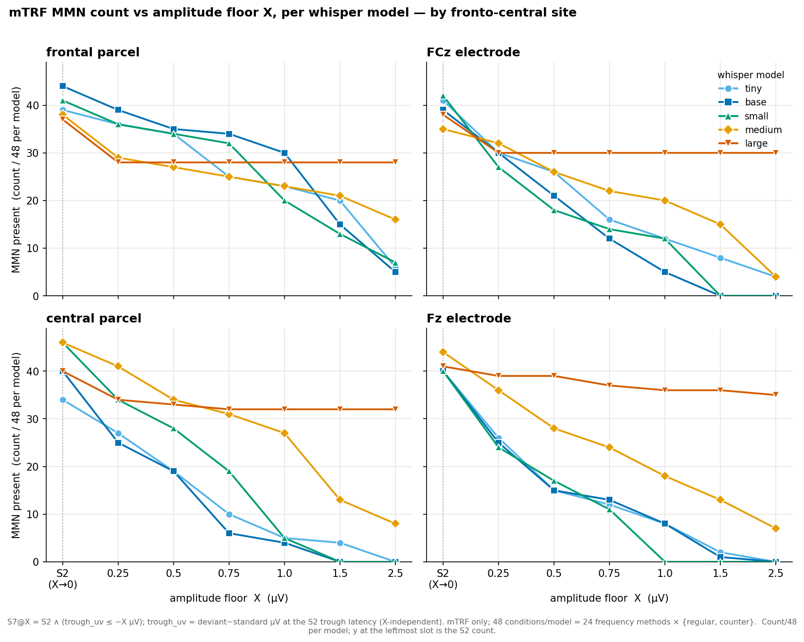

**Figure 2 — pooled count /336 vs the same floors, S2 total as the X→0 reference:**
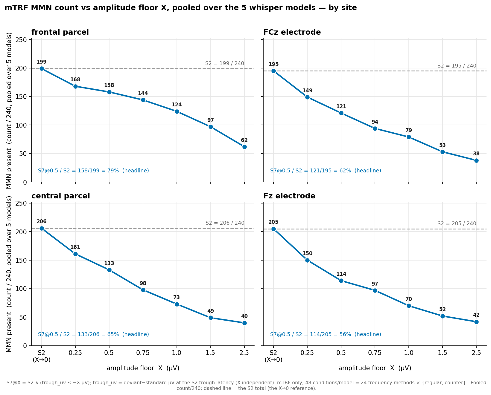

**Figure 3 — trough_uv distribution per model over its S2-passing conditions (symlog x; dotted floors at −0.25/−0.5/−0.75/−1.0/−1.5/−2.5 µV):**
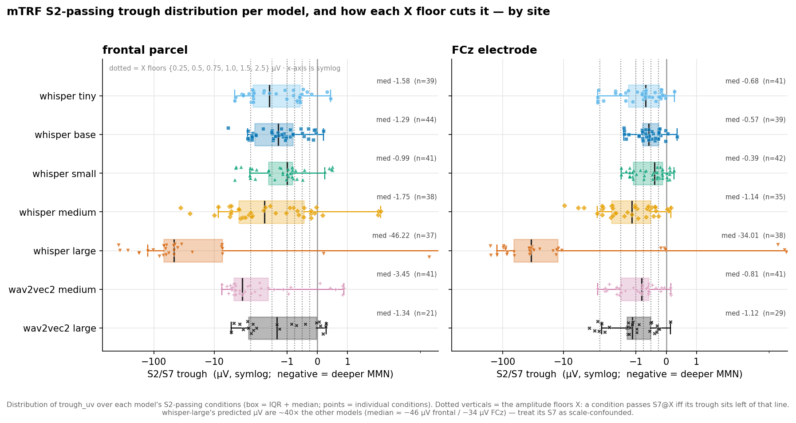

---

## Section 8c — Fz vs FCz: the two midline MMN electrodes, compared in µV

Section 8 contrasted a *parcel* with a single *electrode*. This subsection zooms into the two canonical
single-electrode midline sites — **Fz** and **FCz** — and asks how the model's predicted MMN **trough
amplitude (µV)** differs between them, matched condition-for-condition. **mTRF only** (encoder deferred);
**all 7 models**.

> **Data:** `outputs/results_24freq_7models/mmn_s7_roi.csv`, `roi ∈ {Fz, FCz}` (electrode kind).
> `trough_uv` = deviant−standard µV at the S2 trough latency (negative = deeper), X-independent. The
> paired test uses the conditions with an **S2 dip at both** electrodes (mTRF **n = 245**), matched on
> (model × method × direction).

**Table 37c. Fz vs FCz — shape and predicted µV trough (mTRF, /336)**

Retention cells are `S7@X / S2` as a % of that electrode's S2; the **0.5 headline** is bolded and the
**0.25 / 2.5 bookends** are shown alongside the rest of the sweep.

| Electrode | S2 (/336) | median S2 trough (µV) | S7@0.25 | **S7@0.5** | S7@0.75 | S7@1.0 | S7@1.5 | S7@2.5 |
| --------- | --------- | --------------------- | ------- | ---------- | ------- | ------ | ------ | ------ |
| Fz | 275 | −0.78 | 77% | **62%** | 52% | 35% | 24% | 17% |
| FCz | 265 | −0.79 | 80% | **66%** | 52% | 42% | 27% | 16% |

The two electrodes track each other across the whole sweep (they cross at 0.75 and again near 2.5), which
is the point: **Fz and FCz are near-interchangeable at every floor**, and both fall far below the frontal
parcel (84% → 36% over the same sweep; Table 36).

**What the data show.**
- **They capture the same response.** S2 fires at comparable rates (Fz 275/336 vs FCz 265/336), and the
  two electrodes' predicted trough depths are **strongly correlated** across matched conditions
  (Pearson **r = +0.71** over the six normal-scale models; whisper-large's ~40× scale inflates the raw
  pooled r to +0.91, and the scale-free rank correlation over all 7 is Spearman **ρ = +0.78**) — Fz and
  FCz are reading one underlying frontal MMN.
- **FCz is the modestly deeper of the two — on the *paired* comparison.** The marginal medians are
  effectively tied (**Fz −0.78 vs FCz −0.79 µV**), but marginals mix different condition sets; the matched
  test is the informative one. Across the 245 conditions with an S2 dip at both sites, **FCz has the
  deeper predicted trough in 158/245 (64%)**, median paired difference Fz − FCz = **+0.13 µV** (Fz the
  shallower), Wilcoxon **p = 0.002**. Excluding whisper-large the direction *strengthens* — FCz deeper in
  **144/207 (70%)**, median **+0.15 µV**, **p = 2×10⁻⁷**. The FCz-deeper direction holds within five of
  the six normal-scale models (FCz deeper in 62–92% of pairs: tiny 92%, small 83%, wav2vec2-medium 71%,
  base 63%, medium 62%) and **reverses only for whisper-large** (37%, where the µV scale artifact
  dominates) and **wav2vec2-large** (37%). Consequently the 0.5 µV floor retains slightly more of FCz's
  S2 (**66% vs 62%**) — though across the full sweep the two are near-interchangeable (Table 37c: 80% vs
  77% at the 0.25 bookend; 16% vs 17% at 2.5, where Fz is marginally *ahead*).
- **Both remain shallow single midline electrodes**, far shallower than the pooled **frontal parcel**
  (median −1.72 µV, 79% retained; Section 8) — so for an absolute-µV criterion an ROI/parcel still beats
  either lone electrode.

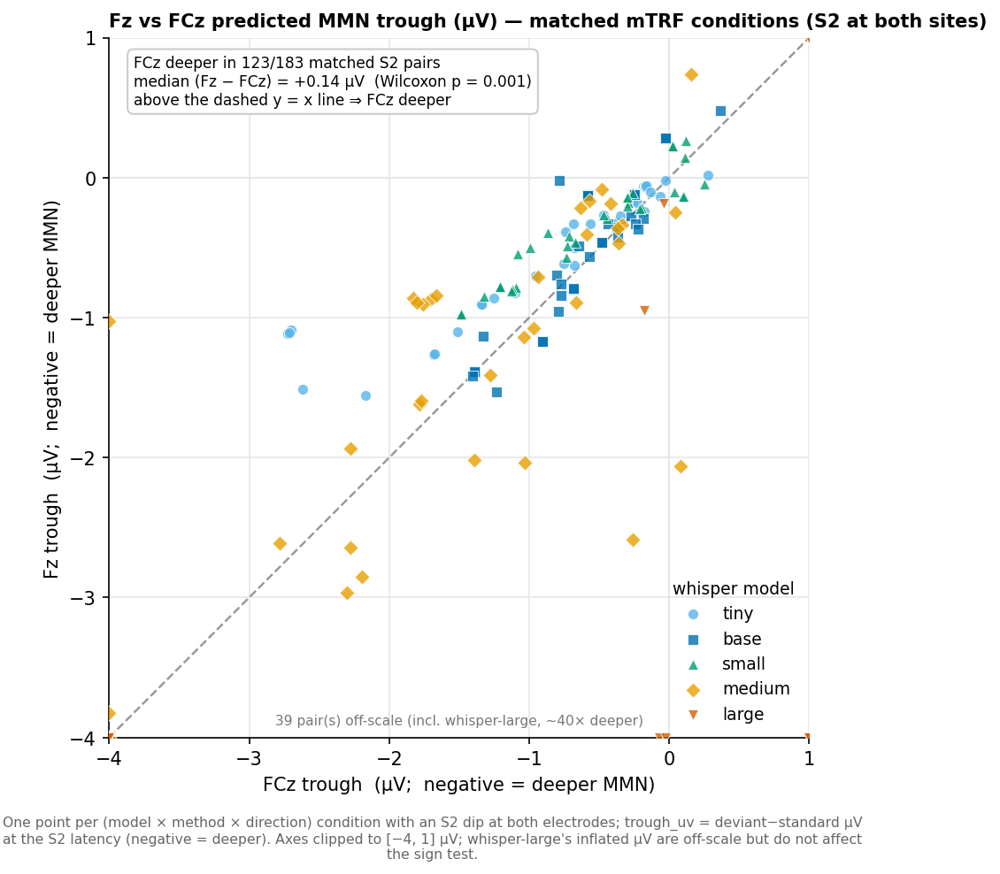

(The FCz panel of the Section-8b trough-distribution figure shows the same per-model picture.)

**Literature context (brief).** Both Fz and FCz are excellent electrodes for capturing the auditory
MMN, and our predicted-µV comparison is consistent with the standard EEG account:
- **Fz is the historical standard.** The MMN is a frontally-distributed ERP whose scalp topography
  peaks over frontal/frontocentral regions; standard caps use **Fz** as the primary frontal node, so it
  is the most widely cited benchmark for MMN amplitude/latency across clinical and cognitive studies.
  Use Fz when replicating classic, foundational oddball paradigms.
- **FCz is often preferred in modern high-density studies.** The MMN generator sits in auditory cortex
  and projects a field whose absolute maximum frequently lands **slightly below Fz — at FCz**, or
  between the two. Our data agree: FCz is the modestly deeper site on the matched comparison. Use FCz in
  high-density (≥ 64-channel) montages aimed at the absolute scalp peak.
- **Or use both.** Grouping fronto-central electrodes (Fz, FCz, F1, F2) into a **region-of-interest
  cluster** gives the most robust measurement — the spatial-pooling advantage Section 8 quantifies: the
  pooled frontal parcel's predicted trough is ~2× deeper and survives the amplitude floor far better
  than either lone electrode.
---

## Section 9 — Deviance-scaling: does MMN amplitude grow with the physical deviant size?

**Idea & rationale.** In humans the MMN is not all-or-none: its amplitude **grows lawfully with
the magnitude of the deviance** — a larger frequency separation between standard and deviant
produces a larger (and earlier) MMN (Näätänen; Sams et al. 1985; Tiitinen et al. 1994). This
graded, "dose–response" behaviour is a hallmark of *genuine deviance detection* — the response
tracks how *unexpected* the deviant is — and it distinguishes a real MMN from a generic
stimulus-onset transient, which has no reason to scale with deviance. It is therefore a
**threshold-free functional test**: rather than asking whether the **S2/S7 trough** clears a fixed
amplitude floor X, we ask whether *that same trough's depth increases with the physical deviance
size across the stimulus set*. A lawful, monotonic dose–response is arguably more convincing than any
single-trace criterion because it validates the underlying **mechanism**, not the morphology.
Our method set is well suited to this because it spans a wide deviance range, from a near-threshold
1000→1050 Hz step up to a full 1000→2000 Hz octave.

**Methods (concise).**
- **MMN amplitude** = the **S2/S7 trough**: `trough_uv`, the deviant−standard difference wave **in
  µV at the S2 trough latency** (`current_argmin_ms`) — the *exact* quantity the S7 gate tests
  (Sections 4/7). Plotted in **signed µV: negative = deeper MMN**; a value ≥ 0 means no dip.
- **Reporting sites (per level):** the two canonical fronto-central sites from Section 8 —
  **parcel = frontal** and **electrode = FCz** — each a **single target** (no ROI averaging). The
  analysis is run and plotted **separately for each level**.
- **Deviance size** = `12 · |log₂(f_dev / f_std)|` **semitones** (perceptual log-frequency scale,
  symmetric so each regular/counter pair shares one value): 7 sizes spanning **0.84 → 12.0 st**.
- **Sample:** **20 methods × 4 models** (regular + counter) = **80 rows per site × mapping**.
  Source `mmn_s7_roi.csv` (`trough_uv` is X-independent).
- **Statistics:** **Spearman ρ** (rank monotonicity) is the **primary** test — it is robust to the
  deep single-site µV outliers (frontal troughs reach −36 µV; Table 31) that make the **OLS slope**
  unreliable. Both are reported, per site × mapping and per model; a **S2-passing-only** ρ is given
  for reference. Code + binned means: `plots/deviance_scaling_plots.py`,
  `plots/deviance_scaling_binned.csv`.

**Table 38. Deviance-scaling of the S2/S7 trough, per site × mapping** (n = 80)

| Site | Mapping | Spearman ρ | p (ρ) | OLS slope (µV/st) | p (slope) | S2-only ρ (n) |
| ---- | ------- | ---------- | ----- | ----------------- | --------- | ------------- |
| parcel — frontal | **mTRF** | **−0.28** | **0.011** | −0.079 | 0.63 (n.s.) | −0.40 (n=62) |
| parcel — frontal | encoder | +0.03 | 0.77 (n.s.) | −0.009 | 0.96 | −0.27 (n=21) |
| electrode — FCz | **mTRF** | **−0.29** | **0.009** | −0.058 | 0.19 (n.s.) | −0.32 (n=66) |
| electrode — FCz | encoder | +0.00 | 1.00 (n.s.) | +0.035 | 0.48 | −0.17 (n=25) |

A **negative ρ means the trough deepens (grows more negative in µV) with deviance** — the
human-like direction. The mTRF **deepens significantly at both reporting sites** on the rank test;
the encoder is flat at both. The OLS slope is n.s. because a handful of very deep single-site
troughs inflate the linear-fit variance — hence Spearman is the primary statistic. Restricting to
S2-passing troughs (where a genuine dip actually exists) **strengthens** the mTRF effect
(ρ −0.40 / −0.32).

**Table 39. Per-model consistency — mTRF Spearman ρ** (n = 20 each)

| Site | tiny | base | small | medium |
| ---- | ---- | ---- | ----- | ------ |
| parcel — frontal | −0.53 | −0.18 | −0.26 | −0.09 |
| electrode — FCz | −0.56 | −0.23 | −0.45 | −0.14 |

Same (deepening) direction in all four models at both sites, strongest in whisper-tiny/small and
weakest in whisper-medium (whose troughs are already deep across the board, leaving less room to
scale).

**Table 40. Dose–response — mean S2/S7 trough (`trough_uv`, µV; negative = deeper) by deviance size**

| Deviance (st) | Example stimulus | frontal · mTRF | frontal · enc | FCz · mTRF | FCz · enc | n/cell |
| ------------- | ---------------- | -------------- | ------------- | ---------- | --------- | ------ |
| 0.84 | 1000→1050 Hz | −0.53 | −1.02 | −0.26 | −0.14 | 8 |
| 1.07 | 1000→1064 Hz | −0.70 | −2.93 | −0.31 | −0.24 | 8 |
| 1.74 | 633→700 Hz | −4.78 | −0.50 | −1.27 | −0.32 | 8 |
| 3.16 | 1000→1200 Hz | −1.72 | −1.61 | −0.48 | −0.22 | 24 |
| 7.02 | 1000→1500 Hz | −1.63 | −0.30 | −0.69 | −0.49 | 16 |
| 7.92 | 633→1000 Hz | −4.39 | −3.10 | −1.45 | +0.60 | 8 |
| 12.00 | 1000→2000 Hz | −1.98 | −1.82 | −0.98 | +0.14 | 8 |

*(FCz · encoder: −0.14, −0.24, −0.32, −0.22, −0.49, **+0.60, +0.14** — it turns **positive** at the
two largest deviants, i.e. `trough_uv > 0` = no dip, anti-scaling.)* The mTRF columns grow **more
negative** with deviance (noisily for frontal, which is outlier-prone; more cleanly for FCz); the
encoder columns show no consistent deepening and FCz even reverses.

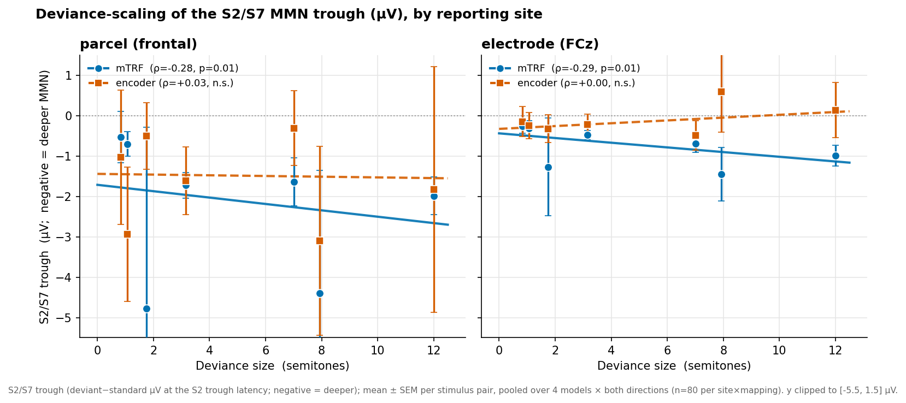

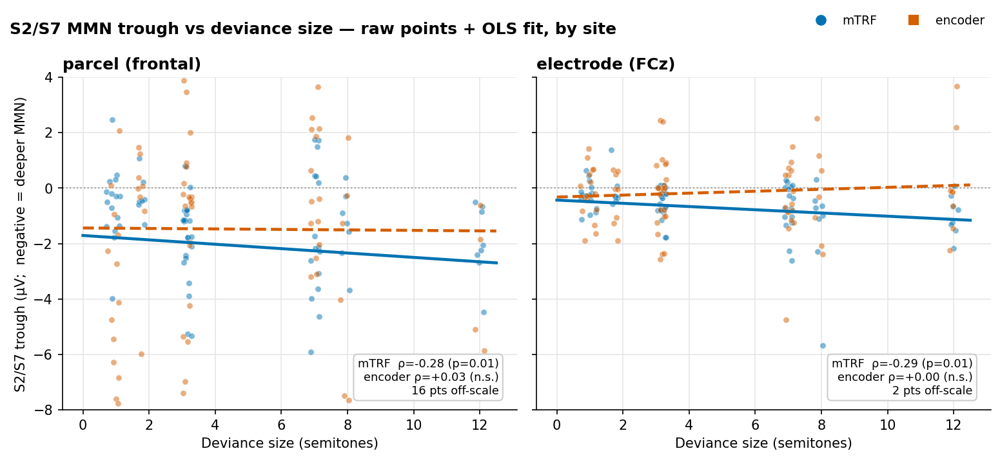

### Section 9 summary

- **The mTRF shows the human deviance-scaling law at both canonical fronto-central sites.** Using
  the S2/S7 trough itself, the trough **deepens (grows more negative in µV) monotonically with
  deviance size** at the **frontal parcel** (ρ = −0.28, p = 0.011) and the **FCz electrode**
  (ρ = −0.29, p = 0.009), in the same direction for every model (Table 39), and cleaner still on the
  S2-passing subset (ρ −0.40 / −0.32).
- **The encoder shows no deviance-scaling at either site** (ρ ≈ 0; at FCz it even reverses — the
  trough goes *positive* (no dip) at the largest deviants), consistent with its shape (S2) and
  amplitude (S7) deficits — its troughs behave like generic transients, not deviance-graded MMNs.
- **This converges with the S2/S7 conclusions by a threshold-free route:** the mTRF's in-silico MMN
  is the physiologically credible one not only in morphology and amplitude but in its *functional
  dependence on deviance magnitude*. The effect is more modest here than for the averaged committed
  ROI because a single-target trough is noisier than an averaged one — the direction and
  significance are unchanged.

**Caveats.** (1) The **OLS slope is n.s.** for the mTRF at both sites: a few very deep single-site
µV troughs (up to −36 µV, frontal) dominate the linear fit, so the **rank-based Spearman is the
primary statistic** and the figures clip those outliers off-scale (they remain in all stats).
(2) The frontal-parcel dose–response is visibly noisy for the same reason; FCz is the cleaner
single site. (3) Per-model, whisper-medium scales weakest (its troughs are deep regardless of
deviance). (4) The two 633-Hz-standard stimuli (methods 43/44) probe a different tonotopic region
but fall on the mTRF trend rather than driving it. (5) Amplitude is the S2/S7 trough on **all**
80 rows per cell (including no-MMN cases, where `trough_uv ≥ 0`, i.e. no dip); the S2-only ρ column isolates the
subset where a genuine trough exists and is stronger for the mTRF.

---
## Section 10 — Deviance-scaling on the 24-method / 7-model mTRF screen

**The question, re-asked on the current vintage.** Section 9 tested the human deviance-scaling law —
does the MMN trough deepen as the physical deviance grows? — on the **20-method / 4-model** screen
(mTRF + encoder). This section re-runs that exact test on the **24-method / 7-model mTRF screen** used by
Sections 7/8/8b/8c. **The Section-9 result does not replicate at the frontal parcel** (see the summary);
the two sections disagree, and Section 10 is the one on the current data.

> **Code:** `aux/analysis_with_counter/plots/deviance_scaling_plots_24freq_7models.py` (the 7-model
> companion; `deviance_scaling_plots.py` is unchanged and still generates Section 9's 4-model figures).
> **Data:** `outputs/results_24freq_7models/mmn_s7_roi.csv`, mTRF only.
> **Stats/binned CSVs:** `plots/deviance_scaling_stats_24freq_7models.csv`,
> `plots/deviance_scaling_binned_24freq_7models.csv`.

**Methods (concise).**
- **MMN amplitude** = the S2/S7 trough: `trough_uv`, the deviant−standard difference wave **in µV at the
  S2 trough latency** — the *exact* quantity the S7 gate tests (Sections 4/7). Signed µV: **negative =
  deeper MMN**; a value ≥ 0 means no dip. X-independent.
- **Reporting sites:** the two canonical fronto-central sites from Section 8 — **parcel = frontal** and
  **electrode = FCz** — each a single target (no ROI averaging), analysed separately.
- **Deviance size** = `12 · |log₂(f_dev / f_std)|` **semitones**, read from the **canonical stimulus
  metadata** (`data/metadata/literature_frequency_intensity_duration_metadata.csv`, `change_type ==
  Frequency`) — the same source the stimulus generator uses, not a hardcoded table. Symmetric, so each
  regular/counter pair shares one value. **10 sizes spanning 0.84 → 12.0 st** (vs Section 9's 7).
- **Sample:** 24 methods × {regular, counter} × 7 models = **336 rows per site**, mTRF only.
- **Statistics:** **Spearman ρ** is the **primary** test — rank-based, so it is immune both to the deep
  single-site µV outliers *and* to the cross-model µV scale spread. The OLS slope is reported but is
  **not interpretable pooled** (below). A **S2-passing-only** ρ is given for reference.

> **Scale caveat — pooling raw µV is meaningless here (worse than in Section 9).** whisper-large's
> predicted µV run **~40× every other model** (Section 7, caveat 2). Section 9 pooled 4 models of
> comparable scale; this set does not have that property. A pooled mean per deviance bin is dominated by
> whisper-large — at the frontal parcel, 7.02 st: **−13.2 µV pooled vs −1.4 µV** with whisper-large
> removed. So **the models are never pooled in raw µV**: Table 41's pooled row uses the **rank** statistic
> only, Table 43 excludes whisper-large, and the figures are per-model (symlog y / own-scale panels).
> The **wav2vec2 comparability caveat** (Section 7, caveat 3) applies here too.

### 10a · Pooled per site (Table 41)

**Table 41. Deviance-scaling of the S2/S7 trough, pooled per site** (mTRF, n = 336)

| Site | Spearman ρ | p (ρ) | S2-only ρ | p | n (S2) |
| ---- | ---------- | ----- | --------- | - | ------ |
| parcel — frontal | **−0.02** | 0.72 (n.s.) | −0.04 | 0.55 (n.s.) | 261 |
| electrode — FCz | **−0.23** | **2.4 × 10⁻⁵** | **−0.20** | **0.001** | 265 |

The pooled OLS slope is **not reported as interpretable** (frontal −1.16, p = 0.055; FCz −0.56,
p = 0.069): in µV it is dominated by whisper-large's scale, so it measures feature-norm spread rather
than deviance. Spearman is the statistic to read.

### 10b · Per model (Table 42)

**Table 42. Per-model deviance-scaling — mTRF Spearman ρ** (n = 48 per model per site)

Significance: \* p < 0.05, \*\* p < 0.01, \*\*\* p < 0.001. **Negative = the human-like (deepening)
direction; positive = anti-scaling** (the trough gets *shallower* as the deviant grows).

| Model | frontal ρ | frontal S2-only ρ (n) | FCz ρ | FCz S2-only ρ (n) |
| ----- | --------- | --------------------- | ----- | ----------------- |
| whisper-tiny | **−0.35\*** | −0.61\*\*\* (39) | **−0.38\*\*** | −0.60\*\*\* (41) |
| whisper-base | +0.03 | +0.13 (44) | **−0.50\*\*\*** | −0.49\*\*\* (39) |
| whisper-small | −0.23 | −0.26 (41) | −0.22 | −0.43\*\* (42) |
| whisper-medium | **+0.32\*** ↩ | +0.39\* (38) | −0.01 | **+0.35\*** ↩ (35) |
| whisper-large | **−0.33\*** | −0.38\* (37) | **−0.29\*** | −0.34\* (38) |
| wav2vec2-medium | **+0.30\*** ↩ | +0.31\* (41) | −0.08 | +0.08 (41) |
| wav2vec2-large | +0.12 | −0.15 (21) | **−0.30\*** | −0.06 (29) |

↩ = **significant reversal** (anti-scaling).

### 10c · Dose–response (Table 43)

**Table 43. Median S2/S7 trough (µV; negative = deeper) by deviance size** — **6 normal-scale models**
(whisper-large excluded; its ~40× µV would dominate every cell). `n/cell` = methods × 2 directions × 6
models.

| Deviance (st) | Example stimulus | # methods | frontal (µV) | FCz (µV) | n/cell |
| ------------- | ---------------- | --------- | ------------ | -------- | ------ |
| 0.84 | 1000→1050 Hz | 1 | −0.61 | −0.26 | 12 |
| 1.07 | 1000→1064 Hz | 1 | −0.93 | −0.45 | 12 |
| 1.74 | 633→700 Hz | 1 | −0.54 | −0.32 | 12 |
| 1.99 | 1000→1122 Hz | 1 | −2.38 | −0.73 | 12 |
| 3.16 | 1000→1200 Hz | 10 | −1.40 | −0.59 | 120 |
| 7.02 | 1000→1500 Hz | 2 | −1.92 | −0.73 | 24 |
| 7.92 | 633→1000 Hz | 1 | −1.30 | −0.68 | 12 |
| 8.84 | 600→1000 Hz | 1 | −1.33 | −0.47 | 12 |
| 10.65 | 1000→1850 Hz | 5 | −0.80 | −1.10 | 60 |
| 12.00 | 1000→2000 Hz | 1 | −1.75 | −1.00 | 12 |

**FCz descends fairly cleanly** (−0.26 → −1.00 µV from the smallest to the largest deviant), which is the
pooled ρ = −0.23. **The frontal column does not** — it wanders (−0.61 → −2.38 at 1.99 st → −0.80 at
10.65 st), which is the pooled ρ ≈ 0.

> **Design caveat — the deviance axis is badly unbalanced.** The 24 methods do **not** spread evenly over
> the 10 sizes: **3.16 st carries 10 methods (140 of 336 conditions) and 10.65 st carries 5 (70)** —
> together **63%** of the sample — while six of the ten sizes rest on a **single method** (14 conditions).
> So the trend is anchored by two clusters, and any single-method size (notably 1.99 st, the deepest
> frontal cell) is one stimulus, not a replicated estimate. This is a property of the literature-derived
> method set, not of the analysis.

**Figure 1 — median trough per deviance size, one line per model (symlog y; 2 panels, frontal | FCz):**
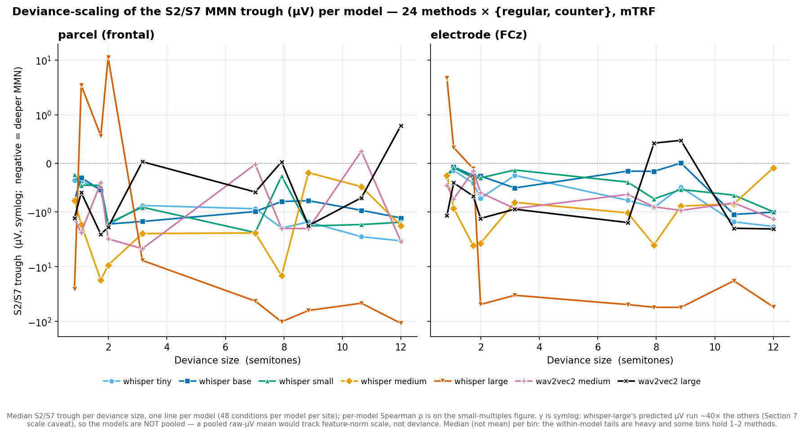

**Figure 2 — raw points + OLS fit, per model × site (small multiples, own y-scale per panel):**
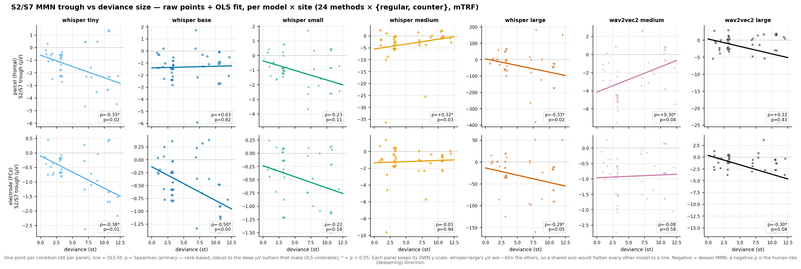

### Section 10 summary

- **The Section-9 deviance-scaling result does not replicate at the frontal parcel.** Section 9 reported
  ρ = −0.28 (p = 0.011) there on 20 methods × 4 models; on 24 methods × 7 models the effect is **gone**:
  **ρ = −0.02, p = 0.72** (S2-only −0.04, p = 0.55). **Section 9's claim that the trough deepens "in the
  same direction for every model" is false on this set.**
- **FCz survives, and is now the only site with the law.** **ρ = −0.23, p = 2.4 × 10⁻⁵** (S2-only −0.20,
  p = 0.001), consistent with Section 9's FCz ρ = −0.29. Section 9's own caveat — "FCz is the cleaner
  single site" — holds up.
- **Per model the picture is heterogeneous, not uniform.** At **FCz**, four of seven deepen significantly
  (tiny −0.38\*\*, base −0.50\*\*\*, large −0.29\*, wav2vec2-large −0.30\*) and none reverses. At the
  **frontal parcel** only **tiny (−0.35\*)** and **large (−0.33\*)** deepen, while **whisper-medium
  (+0.32\*)** and **wav2vec2-medium (+0.30\*)** **reverse significantly** — their troughs get *shallower*
  as the deviant grows, the anti-human direction. whisper-medium also reverses on the S2-only subset at
  FCz (+0.35\*). A criterion that "the mTRF shows the human deviance law" is therefore **model- and
  site-dependent**, not a property of the mTRF mapping as such.
- **Why the disagreement with Section 9 — unresolved.** The two screens differ in **two** ways at once:
  new models (whisper-large + both wav2vec2) **and** 14 extra methods with a wider, more unbalanced
  deviance axis. This data cannot separate those. Note the two models that reverse at frontal are
  **whisper-medium** — present in *both* screens, where Section 9 scored it ρ = −0.09 (frontal, n = 20,
  n.s.) — and **wav2vec2-medium**, which is new. So the reversal is **not** purely an artefact of the new
  models: whisper-medium's frontal ρ moved from −0.09 (n.s., 20 methods) to **+0.32\*** (48 conditions),
  i.e. the *added methods* flipped a model that both screens share. Reconciling Section 9 against this
  section should start there.
- **Reading guide.** Compare models with the **rank** statistic (Spearman), never the pooled µV slope or a
  pooled bin mean — whisper-large's ~40× scale makes those track feature-norm size rather than deviance.
  The encoder is **deferred** (not run on the 24-method set), so unlike Section 9 this section has no
  mTRF-vs-encoder contrast.

---

## Section 11 — Cross-model stimulus concordance: do the same stimuli drive the response?

**The question.** Sections 7–10 ask *how many* stimulus pairs clear a criterion and *whether depth tracks
deviance*. This section asks something prior to both: **do the 7 models agree on which oddballs are
easy and which are hard?** If the in-silico MMN is a property of the **stimulus**, all 7 models should
rank the 48 stimulus pairs similarly — the same deviants deep, the same deviants shallow. If it is a
property of the **model**, each model has its own idiosyncratic favourites and the rankings should be
unrelated. Reported per site, because Section 10 showed the two sites can disagree.

> **Code:** `aux/analysis_with_counter/plots/sec11_concordance_plots.py`.
> **Data:** `outputs/results_24freq_7models/mmn_s7_roi.csv`, mTRF only, `dip_uv_threshold == 0.25`
> (one row per stimulus pair — `s2` and `trough_uv` are X-independent). **Verified 48 stimulus pairs × 7
> models at each site before any statistic was computed.**
> **Stats/CSVs:** `plots/sec11_stats.csv` (183 statistics — including every κ and chance null quoted in
> prose below), `plots/sec11_stimulus_pairs.csv` (per-pair mean rank, both sites),
> `plots/sec11_per_pair_agreement.csv` (the full per-pair floor sweep behind Tables 48a/48b).
>
> **Terminology.** The **48** are **stimulus pairs** — ordered (standard → deviant), so 1000→1200 and
> 1200→1000 are two *distinct* pairs. The **24** are **methods**; each method contributes one regular and
> one counter pair. That split is what lets 11e/11i pair a method's two directions against each other.

**Methods (concise).**
- **Response height** = the S2/S7 trough `trough_uv`, the deviant−standard difference wave in µV at the
  S2 trough latency. **Sign: NEGATIVE = deeper = HIGHER response.** Throughout this section
  **"high response" means most negative**; ranks are taken so that **rank 1 = most negative**, and the
  script *asserts* that on load rather than assuming it.
- **Every cross-model statistic is rank-based.** The 48 stimulus pairs are ranked **within each model ×
  site**, and only the rankings are compared. This is not a stylistic choice — see the box below.
- **Deviance size** = `12 · |log₂(f_dev/f_std)|` semitones and **SOA** are read from the canonical
  stimulus metadata (`data/metadata/literature_frequency_intensity_duration_metadata.csv`,
  `change_type == Frequency`, 24 rows), never a hardcoded table.
- **Statistics:** **Kendall's W** (7 raters × 48 items, tie-corrected) with a permutation null (5000
  shuffles of each model's ranking independently); **pairwise Spearman** of within-model ranks;
  **Fleiss' κ** for the binary calls, against a permutation null that **preserves each model's own base
  rate**.

> **Scale trap — why nothing here uses raw µV.** `trough_uv` is **not comparable across models**:
> whisper-large's predicted µV run **~40×** the others (median S2 trough ≈ −27.3 µV frontal / −21.6 µV
> FCz on this set, vs ≈ −0.9 µV for whisper-small; Section 7, caveat 2), and wav2vec2-medium (≈ −2.8 µV
> frontal) sits ~3× above whisper-small. **Any cross-model comparison of raw µV would measure
> feature-norm scale, not response.** So this section never pools raw µV, never correlates raw µV across
> models, and never takes a cross-model mean trough — it ranks **within** each model first, then compares
> rankings.

### 11a · Continuous concordance — do the models order the stimuli the same way? (Table 44)

**Kendall's W — reliably above chance, but weak.** Ranking the 48 stimulus pairs within each model and
asking whether the 7 rankings agree gives **W = 0.266 at the frontal parcel (p = 2 × 10⁻⁴)** and
**W = 0.245 at FCz (p = 6 × 10⁻⁴)**, against a permutation **null mean of 0.142** (5000 shuffles of each
model's ranking independently; null p95 = 0.189 / 0.190). So the models share *some* common ordering — W is
roughly **double the null** and the permutation p is decisive — but **W ≈ 0.25 is a long way from
agreement**: the bulk of each model's ranking is not shared with the others.

**Dropping whisper-large barely moves W** (frontal 0.266 → **0.303**, p = 2 × 10⁻⁴; FCz 0.245 → **0.237**,
p = 0.016), so the concordance is not an artefact of its inflated scale — as expected, since ranks are
scale-free. Restricting to the **5 whisper models** raises it only to **0.369 / 0.320** (both p ≤ 0.001) —
even one architecture, one training objective and one fit protocol does not buy agreement.
*(The z-based view in 11h reaches the same conclusion by a different route, which is the point of running
both: the median across-model spread of z is well below independence but nowhere near zero.)*

**Table 44. Pairwise Spearman ρ of within-model stimulus pair ranks** (21 pairs; the 7×7 matrices are in
Figure 2 and `sec11_stats.csv`)

| Site | all pairs (21) | within-whisper (10) | whisper ↔ wav2vec2 (10) | within-wav2vec2 (1) |
| ---- | -------------- | ------------------- | ----------------------- | ------------------- |
| parcel — frontal | **+0.144** [−0.199, +0.525] | **+0.212** [−0.026, +0.525] | **+0.110** [−0.174, +0.364] | **−0.199** |
| electrode — FCz | **+0.119** [−0.261, +0.556] | **+0.150** [−0.261, +0.556] | **+0.122** [−0.234, +0.499] | **−0.216** |

Values are means, with [min, max] across the pairs in that block.

- **The typical pair of models barely agrees.** Mean ρ ≈ **+0.12 to +0.14** — a shared-variance of ~2%.
  No pair anywhere exceeds **ρ = +0.56**.
- **The family effect is small and site-dependent.** Within-whisper (+0.212) beats whisper↔wav2vec2
  (+0.110) at the **frontal parcel**, but at **FCz the gap nearly closes** (+0.150 vs +0.122). So "same
  architecture ⇒ same stimulus preferences" is **not** a clean story.
- **The two wav2vec2 models *anti*-correlate** (−0.199 frontal, −0.216 FCz) — the only same-family pair,
  and it disagrees at both sites. **whisper-medium is the whisper outlier**: it is the only whisper model
  that correlates negatively with its siblings at FCz (−0.26 with base, −0.19 with small). The three
  models that do hang together are **tiny / base / small** (ρ +0.30 to +0.56) — the small end of the
  whisper family, i.e. the pairs of models most alike in capacity.

### 11b · Binary agreement — and why "6 of 7 models agree" means nothing here (Figure 3)

**This is the section's most important negative result.** The tempting headline — *"all 7 models agree
that S2 is present on 10 of 48 frontal stimulus pairs"* — **is what chance already predicts**. S2 base rates
run **0.44 → 0.92 per model** (pooled 0.777 frontal / 0.789 FCz), so a null in which every model fires at
its own rate but on *unrelated* stimulus pairs still delivers **6.9 unanimous stimulus pairs by chance**
(observed 10, p = 0.087) at frontal and **8.7** at FCz (observed 9, p = 0.54). **No site, on either
criterion, shows more unanimity than chance.** Chance-corrected, the **frontal parcel's S2 agreement is
exactly zero (κ = −0.001, p = 0.25)** — the seven models' S2 calls are statistically independent given
their base rates. FCz's κ = +0.137 is real (p = 2 × 10⁻⁴) but "slight" on any conventional κ scale.

> **A raw agreement count is uninterpretable when base rates are this high.** Any future claim of the
> form "N of 7 models agree" on this screen must be reported against this null, not on its own.

### 11c · Consensus stimuli (Table 45)

**Table 45. Consensus-high and consensus-low stimulus pairs per site.** `mean %ile` = mean **within-model
percentile of response height** across the 7 models (**100 = deepest = highest response**); `SD` = spread
of that percentile across models (**the median SD over all 48 stimulus pairs is ≈ 27 points**, so an SD near
30 means the models substantially disagree about that very stimulus); `n S2` = models calling S2 present.

| Site | Rank | Stimulus pair | Deviance (st) | std→dev (Hz) | SOA (ms) | mean %ile | SD | n S2 |
| ---- | ---- | --------- | ------------- | ------------ | -------- | --------- | -- | ---- |
| **frontal** | high | method_53 | 3.16 | 1000→1200 | 333 | 72.6 | 16.9 | 5/7 |
| | high | method_18 **counter** | 10.65 | 1850→1000 | 200 | 72.6 | **35.9** | 5/7 |
| | high | method_19 **counter** | 10.65 | 1850→1000 | 200 | 71.4 | **35.8** | 5/7 |
| | high | method_17 **counter** | 10.65 | 1850→1000 | 200 | 69.9 | **36.3** | 5/7 |
| | high | method_55 **counter** | 12.00 | 2000→1000 | 500 | 69.6 | 30.8 | 6/7 |
| | high | method_10 **counter** | 1.99 | 1122→1000 | 300 | 69.0 | 29.2 | 7/7 |
| | low | method_27 **counter** | 1.07 | 1064→1000 | 900 | 30.7 | 20.1 | 5/7 |
| | low | method_74 | 7.02 | 1000→1500 | 1000 | 22.8 | 20.7 | 5/7 |
| | low | method_37 **counter** | 0.84 | 1050→1000 | 310 | 17.3 | 15.6 | 4/7 |
| | low | method_19 | 10.65 | 1000→1850 | 200 | 14.6 | 16.6 | 4/7 |
| | low | method_18 | 10.65 | 1000→1850 | 200 | 13.7 | 15.9 | 4/7 |
| | low | method_17 | 10.65 | 1000→1850 | 200 | 13.4 | 16.2 | 4/7 |
| **FCz** | high | method_21 | 10.65 | 1000→1850 | 500 | 82.1 | 15.7 | 6/7 |
| | high | method_20 | 10.65 | 1000→1850 | 500 | 81.2 | 16.5 | 6/7 |
| | high | method_55 **counter** | 12.00 | 2000→1000 | 500 | 76.3 | 28.3 | 6/7 |
| | high | method_10 **counter** | 1.99 | 1122→1000 | 300 | 72.9 | 13.0 | 7/7 |
| | high | method_44 **counter** | 7.92 | 1000→633 | 510 | 68.1 | 32.5 | 6/7 |
| | high | method_60 | 7.02 | 1000→1500 | 300 | 66.3 | 31.5 | 4/7 |
| | low | method_74 | 7.02 | 1000→1500 | 1000 | 31.9 | 27.1 | 6/7 |
| | low | method_43 **counter** | 1.74 | 700→633 | 510 | 31.3 | 18.8 | 6/7 |
| | low | method_72 **counter** | 3.16 | 1200→1000 | 500 | 26.7 | 17.3 | 5/7 |
| | low | method_75 **counter** | 3.16 | 1200→1000 | 500 | 25.8 | 14.3 | 6/7 |
| | low | method_37 **counter** | 0.84 | 1050→1000 | 310 | 21.9 | 17.1 | 5/7 |
| | low | method_27 **counter** | 1.07 | 1064→1000 | 900 | 16.1 | 17.2 | 4/7 |

- **The consensus is weak even at the extremes.** The deepest consensus stimulus pair reaches only the **73rd
  percentile** (frontal) / **82nd** (FCz) *on average* — if the models agreed, a consensus-high stimulus
  would sit near 100. Several of the "consensus-high" rows carry **SD ≈ 30–36 percentile points**, i.e.
  the models place the same stimulus anywhere from the top to the bottom of their own rankings.
- **The two sites only partly share their consensus.** The mean rankings correlate **ρ = +0.60
  (p = 8 × 10⁻⁶)** across the 48 stimulus pairs, but the **top-6 sets overlap on only 2 of 6** (method_55
  counter, method_10 counter) and the bottom-6 on **3 of 6** (method_74, method_37 counter, method_27
  counter). Widening to 12: **6/12 top, 8/12 bottom**. Note this ρ is *not* independent evidence — it
  compares the same 7 models to themselves at two sites.
- **The only stimuli both sites call low are the two smallest deviants** — method_37 counter (0.84 st)
  and method_27 counter (1.07 st) — plus method_74 (7.02 st, **SOA 1000 ms**, the longest in the set).
  method_74 being consensus-low *despite* a large deviant, at both sites, is the one hint that **SOA**
  may matter more than deviance size; with a single method at SOA 1000 this is **one stimulus, not a
  replicated estimate**, and cannot be tested on this set.

### 11d · Is it just deviance size? (Table 46)

Section 10 found FCz trough depth tracks deviance (ρ = −0.23, p = 2 × 10⁻⁵) while the frontal parcel does
not (ρ = −0.02, n.s.). So at FCz, "which stimuli are high" could partly be "which deviants are big" —
which would be **shared physics, not shared stimulus preference**. Two controls:

**Table 46. Concordance controlling for deviance size**

| Site | W — all 48 stimulus pairs | W — within the 3.16 st block (n = 20) | p | W — deviance-residualised ranks (n = 48) | p |
| ---- | --------------------- | ------------------------------------- | - | ---------------------------------------- | - |
| parcel — frontal | **0.266** (p = 2 × 10⁻⁴) | **0.127** | 0.62 (n.s.) | **0.273** | **2 × 10⁻⁴** |
| electrode — FCz | **0.245** (p = 6 × 10⁻⁴) | **0.155** | 0.36 (n.s.) | **0.199** | **0.031** |

*(3.16 st block: 10 methods × 2 directions = 20 stimulus pairs, the largest balanced block. Excluding
whisper-large: frontal W = 0.108, p = 0.88; FCz W = 0.181, p = 0.36 — same conclusion.)*

**The two controls disagree, and the disagreement is informative.**
- **Within the balanced 3.16 st block, concordance collapses to chance at both sites.** W falls to
  **0.127 (frontal)** and **0.155 (FCz)** against a **null mean of 0.142** — the point estimates land
  *on* the null. **Caveat: n = 20 is underpowered** (the null p95 is 0.217, so only W ≳ 0.22 would be
  detectable), so this is *suggestive*, not proof of zero. But the point estimate does not merely shrink,
  it reaches chance — when every stimulus pair has the **same** deviance size, the models stop agreeing.
- **Deviance-residualised ranks over all 48 retain the effect** (frontal 0.273, FCz 0.199, both
  significant). Residualising removes only the **linear-in-rank** deviance trend; whatever the models
  share is evidently *not* that linear trend, and survives it.
- **Reading the two together:** the shared component is **not** simple linear deviance-scaling (it
  survives residualising), but it also does **not appear within a fixed deviance size** (it vanishes in
  the 3.16 st block). The most economical reading is that the residual concordance rides on **coarse
  between-size structure** — the models agree roughly about big-vs-small deviants — and has little to say
  about individual stimuli. At **FCz** this is exactly Section 10's ρ = −0.23 reappearing as concordance.
  At **frontal**, where Section 10 found *no* deviance effect, the surviving W = 0.273 is **not**
  explained by deviance and remains unattributed.

### 11e · Direction check — does any of it survive the counter swap? (Table 47)

Each method has a **regular** and a **counter** version (standard/deviant frequencies swapped) — the same
two tones, the same SOA, the same deviance size, only the roles reversed. **If a stimulus effect is real,
it should survive the swap**: a method that is "hard" should be hard both ways.

**Table 47. Regular ↔ counter rank correlation, paired on the 24 methods, within model**
(Spearman ρ of the method's regular rank vs its counter rank, computed inside each model × site.)

| Model | frontal ρ | p | FCz ρ | p |
| ----- | --------- | - | ----- | - |
| whisper-tiny | −0.386 | 0.062 | −0.287 | 0.174 |
| whisper-base | −0.369 | 0.076 | +0.130 | 0.544 |
| whisper-small | −0.386 | 0.062 | −0.330 | 0.116 |
| whisper-medium | −0.190 | 0.373 | −0.147 | 0.493 |
| whisper-large | +0.015 | 0.945 | +0.182 | 0.395 |
| wav2vec2-medium | +0.357 | 0.087 | −0.313 | 0.136 |
| wav2vec2-large | **−0.425** | **0.038** | −0.109 | 0.613 |
| **mean** | **−0.198** | — | **−0.125** | — |
| **n positive / n significant** | 2/7 · 1/7 | — | 2/7 · 0/7 | — |

**The stimulus effect does not survive the swap — it inverts.** Not one model at either site shows the
positive correlation a genuine stimulus property would produce. **Mean ρ = −0.198 (frontal) and −0.125
(FCz)**; **12 of 14** model × site cells are negative or null, and the only nominally significant cell
(wav2vec2-large frontal, ρ = −0.425, p = 0.038, uncorrected across 14 tests) is **negative** — the
*opposite* of stimulus consistency.

**The clearest single illustration is methods 17/18/19** (1000 ↔ 1850 Hz, 10.65 st, SOA 200 ms). At the
**frontal parcel**, all three **counter** versions (1850→1000) are **consensus-high** (mean %ile 69.9,
72.6, 71.4 — Table 45) while all three **regular** versions (1000→1850) are **consensus-low** (13.4,
13.7, 14.6). **Same tone pair, same SOA, same deviance size, opposite ends of the ranking.** Whatever
makes 1850→1000 "easy" is not a property of the stimulus pair — it is a property of *which tone is the
standard*, i.e. of what the model's features do with that particular oddball, and it does not generalise.

### 11f · Per-stimulus-pair agreement across the amplitude floor (Tables 48a/48b)

Sections 11a–11e fix the criterion and ask how the models rank. This subsection fixes the **stimulus pair**
and asks **how many of the 7 models call it present**, as the amplitude floor X rises from S2 (no floor)
to 2.5 µV. **S7@X = S2 AND `trough_uv ≤ −X`, so the criteria are nested**
(S7@2.5 ⊆ S7@1.5 ⊆ … ⊆ S7@0.25 ⊆ S2) — the script asserts that nesting on every row. Rows are the **48
stimulus pairs** (regular and counter kept separate, since 11e shows they are not the same stimulus).
**c** = counter.

**The floor costs agreement, steadily and at both sites.** The mean number of models calling a stimulus pair
present falls from **5.44/7 (S2) to 1.94/7 (S7@2.5)** at the frontal parcel, and from **5.52/7 to
0.90/7** at FCz. **FCz falls faster** — by S7@1.0 the average FCz stimulus pair carries only **2.33** of 7
models, against **3.52** at frontal — which is the Section 8b/8c result (FCz troughs are shallower in µV)
showing up as agreement loss.

**Table 48a. Per-stimulus-pair agreement — parcel — frontal** (models calling the criterion present, of 7)

| Stimulus pair | std→dev (Hz) | S2 | S7@0.25 | S7@0.5 | S7@0.75 | S7@1.0 | S7@1.5 | S7@2.5 |
| --- | --- | --- | --- | --- | --- | --- | --- | --- |
| method_09 | 600→1000 | 4 | 4 | 3 | 3 | 3 | 3 | 1 |
| method_09 **c** | 1000→600 | 6 | 5 | 5 | 5 | 5 | 4 | 2 |
| method_10 | 1000→1122 | 6 | 5 | 5 | 5 | 5 | 3 | 2 |
| method_10 **c** | 1122→1000 | 7 | 6 | 6 | 6 | 6 | 6 | 3 |
| method_12 | 1000→1200 | 6 | 6 | 6 | 5 | 5 | 3 | 2 |
| method_12 **c** | 1200→1000 | 7 | 6 | 4 | 4 | 3 | 2 | 1 |
| method_17 | 1000→1850 | 4 | 0 | 0 | 0 | 0 | 0 | 0 |
| method_17 **c** | 1850→1000 | 5 | 4 | 4 | 3 | 3 | 3 | 3 |
| method_18 | 1000→1850 | 4 | 0 | 0 | 0 | 0 | 0 | 0 |
| method_18 **c** | 1850→1000 | 5 | 4 | 4 | 4 | 3 | 3 | 3 |
| method_19 | 1000→1850 | 4 | 0 | 0 | 0 | 0 | 0 | 0 |
| method_19 **c** | 1850→1000 | 5 | 4 | 4 | 3 | 3 | 3 | 3 |
| method_20 | 1000→1850 | 4 | 4 | 4 | 4 | 3 | 2 | 1 |
| method_20 **c** | 1850→1000 | 6 | 6 | 6 | 6 | 5 | 4 | 4 |
| method_21 | 1000→1850 | 4 | 4 | 4 | 4 | 3 | 2 | 1 |
| method_21 **c** | 1850→1000 | 6 | 6 | 6 | 6 | 4 | 4 | 4 |
| method_27 | 1000→1064 | 4 | 4 | 3 | 3 | 3 | 2 | 0 |
| method_27 **c** | 1064→1000 | 5 | 3 | 2 | 2 | 2 | 2 | 1 |
| method_28 | 1000→1200 | 5 | 5 | 5 | 4 | 3 | 3 | 2 |
| method_28 **c** | 1200→1000 | 7 | 5 | 5 | 5 | 4 | 3 | 2 |
| method_29 | 1000→1200 | 6 | 6 | 6 | 5 | 4 | 4 | 3 |
| method_29 **c** | 1200→1000 | 7 | 5 | 5 | 5 | 4 | 3 | 2 |
| method_30 | 1000→1200 | 5 | 5 | 5 | 4 | 3 | 3 | 2 |
| method_30 **c** | 1200→1000 | 7 | 5 | 5 | 5 | 4 | 3 | 2 |
| method_31 | 1000→1200 | 6 | 6 | 6 | 5 | 5 | 4 | 3 |
| method_31 **c** | 1200→1000 | 7 | 5 | 5 | 5 | 4 | 3 | 2 |
| method_32 | 1000→1200 | 6 | 6 | 6 | 5 | 5 | 4 | 3 |
| method_32 **c** | 1200→1000 | 7 | 5 | 5 | 5 | 4 | 4 | 2 |
| method_33 | 1000→1200 | 7 | 6 | 5 | 4 | 4 | 4 | 4 |
| method_33 **c** | 1200→1000 | 5 | 5 | 5 | 4 | 4 | 1 | 1 |
| method_37 | 1000→1050 | 4 | 4 | 4 | 2 | 2 | 1 | 0 |
| method_37 **c** | 1050→1000 | 4 | 2 | 2 | 2 | 2 | 1 | 1 |
| method_43 | 633→700 | 4 | 4 | 3 | 2 | 2 | 2 | 1 |
| method_43 **c** | 700→633 | 5 | 5 | 3 | 3 | 2 | 1 | 1 |
| method_44 | 633→1000 | 6 | 6 | 5 | 5 | 3 | 2 | 1 |
| method_44 **c** | 1000→633 | 5 | 5 | 5 | 5 | 5 | 4 | 3 |
| method_53 | 1000→1200 | 5 | 5 | 5 | 5 | 5 | 4 | 3 |
| method_53 **c** | 1200→1000 | 6 | 5 | 5 | 5 | 5 | 5 | 4 |
| method_55 | 1000→2000 | 5 | 4 | 4 | 3 | 3 | 2 | 0 |
| method_55 **c** | 2000→1000 | 6 | 6 | 5 | 5 | 5 | 5 | 4 |
| method_60 | 1000→1500 | 5 | 5 | 5 | 5 | 5 | 4 | 3 |
| method_60 **c** | 1500→1000 | 5 | 5 | 5 | 5 | 5 | 5 | 5 |
| method_72 | 1000→1200 | 6 | 5 | 5 | 5 | 5 | 4 | 2 |
| method_72 **c** | 1200→1000 | 7 | 6 | 6 | 5 | 3 | 2 | 0 |
| method_74 | 1000→1500 | 5 | 2 | 2 | 2 | 2 | 2 | 1 |
| method_74 **c** | 1500→1000 | 3 | 3 | 3 | 3 | 3 | 3 | 2 |
| method_75 | 1000→1200 | 6 | 5 | 5 | 5 | 5 | 4 | 2 |
| method_75 **c** | 1200→1000 | 7 | 6 | 6 | 6 | 3 | 2 | 1 |
| **mean /7** | | **5.44** | **4.54** | **4.31** | **4.00** | **3.52** | **2.88** | **1.94** |

**Table 48b. Per-stimulus-pair agreement — electrode — FCz** (models calling the criterion present, of 7)

| Stimulus pair | std→dev (Hz) | S2 | S7@0.25 | S7@0.5 | S7@0.75 | S7@1.0 | S7@1.5 | S7@2.5 |
| --- | --- | --- | --- | --- | --- | --- | --- | --- |
| method_09 | 600→1000 | 6 | 5 | 5 | 4 | 4 | 2 | 2 |
| method_09 **c** | 1000→600 | 5 | 5 | 3 | 3 | 2 | 1 | 1 |
| method_10 | 1000→1122 | 5 | 4 | 3 | 3 | 2 | 2 | 2 |
| method_10 **c** | 1122→1000 | 7 | 7 | 7 | 5 | 3 | 3 | 2 |
| method_12 | 1000→1200 | 6 | 6 | 3 | 3 | 2 | 1 | 1 |
| method_12 **c** | 1200→1000 | 6 | 4 | 3 | 3 | 2 | 2 | 1 |
| method_17 | 1000→1850 | 1 | 1 | 1 | 0 | 0 | 0 | 0 |
| method_17 **c** | 1850→1000 | 6 | 5 | 5 | 4 | 4 | 2 | 2 |
| method_18 | 1000→1850 | 1 | 1 | 0 | 0 | 0 | 0 | 0 |
| method_18 **c** | 1850→1000 | 6 | 5 | 4 | 4 | 4 | 2 | 2 |
| method_19 | 1000→1850 | 1 | 1 | 1 | 0 | 0 | 0 | 0 |
| method_19 **c** | 1850→1000 | 6 | 5 | 5 | 4 | 4 | 2 | 2 |
| method_20 | 1000→1850 | 6 | 6 | 6 | 6 | 4 | 2 | 1 |
| method_20 **c** | 1850→1000 | 7 | 6 | 5 | 4 | 4 | 3 | 1 |
| method_21 | 1000→1850 | 6 | 6 | 6 | 6 | 4 | 2 | 1 |
| method_21 **c** | 1850→1000 | 7 | 6 | 4 | 4 | 4 | 3 | 1 |
| method_27 | 1000→1064 | 4 | 4 | 3 | 2 | 2 | 1 | 0 |
| method_27 **c** | 1064→1000 | 4 | 2 | 1 | 1 | 0 | 0 | 0 |
| method_28 | 1000→1200 | 6 | 3 | 3 | 3 | 3 | 3 | 1 |
| method_28 **c** | 1200→1000 | 6 | 6 | 6 | 3 | 3 | 1 | 1 |
| method_29 | 1000→1200 | 6 | 4 | 3 | 3 | 3 | 3 | 1 |
| method_29 **c** | 1200→1000 | 6 | 6 | 6 | 3 | 3 | 1 | 1 |
| method_30 | 1000→1200 | 7 | 4 | 3 | 3 | 3 | 3 | 1 |
| method_30 **c** | 1200→1000 | 6 | 6 | 6 | 3 | 3 | 1 | 1 |
| method_31 | 1000→1200 | 6 | 4 | 3 | 3 | 3 | 2 | 1 |
| method_31 **c** | 1200→1000 | 6 | 6 | 6 | 3 | 3 | 1 | 1 |
| method_32 | 1000→1200 | 6 | 3 | 3 | 3 | 3 | 3 | 1 |
| method_32 **c** | 1200→1000 | 6 | 6 | 6 | 3 | 3 | 1 | 1 |
| method_33 | 1000→1200 | 6 | 6 | 4 | 2 | 1 | 1 | 0 |
| method_33 **c** | 1200→1000 | 7 | 4 | 3 | 3 | 2 | 2 | 2 |
| method_37 | 1000→1050 | 4 | 4 | 1 | 1 | 1 | 0 | 0 |
| method_37 **c** | 1050→1000 | 5 | 2 | 1 | 1 | 0 | 0 | 0 |
| method_43 | 633→700 | 5 | 4 | 2 | 2 | 2 | 1 | 1 |
| method_43 **c** | 700→633 | 6 | 4 | 2 | 0 | 0 | 0 | 0 |
| method_44 | 633→1000 | 4 | 3 | 3 | 3 | 2 | 1 | 0 |
| method_44 **c** | 1000→633 | 6 | 6 | 5 | 3 | 3 | 3 | 2 |
| method_53 | 1000→1200 | 6 | 4 | 3 | 3 | 3 | 2 | 2 |
| method_53 **c** | 1200→1000 | 6 | 6 | 6 | 5 | 3 | 3 | 2 |
| method_55 | 1000→2000 | 7 | 6 | 4 | 3 | 3 | 1 | 0 |
| method_55 **c** | 2000→1000 | 6 | 5 | 5 | 4 | 3 | 3 | 1 |
| method_60 | 1000→1500 | 4 | 4 | 4 | 3 | 3 | 3 | 2 |
| method_60 **c** | 1500→1000 | 7 | 5 | 5 | 4 | 4 | 3 | 2 |
| method_72 | 1000→1200 | 7 | 5 | 5 | 4 | 1 | 1 | 0 |
| method_72 **c** | 1200→1000 | 5 | 2 | 1 | 1 | 0 | 0 | 0 |
| method_74 | 1000→1500 | 6 | 3 | 3 | 3 | 3 | 0 | 0 |
| method_74 **c** | 1500→1000 | 4 | 3 | 2 | 2 | 2 | 0 | 0 |
| method_75 | 1000→1200 | 7 | 5 | 5 | 4 | 1 | 1 | 0 |
| method_75 **c** | 1200→1000 | 6 | 3 | 2 | 1 | 0 | 0 | 0 |
| **mean /7** | | **5.52** | **4.40** | **3.67** | **2.88** | **2.33** | **1.50** | **0.90** |

### 11g · How many stimulus pairs do k models agree on — and is that more than chance? (Tables 49a–49b)

**Tables 49a/49b** are the distribution of the Table-48 counts: for each criterion, how many of the 48
stimulus pairs have exactly **k** of 7 models calling it present. Rows sum to 48. k = 0 is included (no
model calls it) — without it the rows would not sum, and the "no model agrees" cell is itself informative.

> **These are raw counts — read them against the chance null, which is not in the table.** The null that
> matters preserves **each model's own base rate** at that floor but scrambles *which* stimulus pairs it
> fires on; because base rates here are high, it already puts most pairs at k = 5–7 on its own.
> **Figure 3 overlays that null on the S2 row** and is the honest way to read this table; the key
> comparisons for every floor are quoted in the two paragraphs below and the full set lives in
> `plots/sec11_stats.csv`. A k-count from this table cited without the null is not a finding — that is
> the whole lesson of 11b.

**Table 49a. Agreement-count distribution — parcel — frontal** — stimulus pairs (of 48) on which exactly k of the 7 models call the criterion present; rows sum to 48

| Criterion | base rate | k=0 | k=1 | k=2 | k=3 | k=4 | k=5 | k=6 | k=7 |
| --- | --- | --- | --- | --- | --- | --- | --- | --- | --- |
| S2 | 0.78 | 0 | 0 | 0 | 1 | 10 | 14 | 13 | 10 |
| S7@0.25 | 0.65 | 3 | 0 | 2 | 2 | 10 | 18 | 13 | 0 |
| S7@0.5 | 0.62 | 3 | 0 | 3 | 5 | 8 | 20 | 9 | 0 |
| S7@0.75 | 0.57 | 3 | 0 | 5 | 7 | 8 | 21 | 4 | 0 |
| S7@1.0 | 0.50 | 3 | 0 | 6 | 15 | 9 | 14 | 1 | 0 |
| S7@1.5 | 0.41 | 3 | 4 | 11 | 13 | 13 | 3 | 1 | 0 |
| S7@2.5 | 0.28 | 7 | 12 | 13 | 10 | 5 | 1 | 0 | 0 |

**Table 49b. Agreement-count distribution — electrode — FCz** — stimulus pairs (of 48) on which exactly k of the 7 models call the criterion present; rows sum to 48

| Criterion | base rate | k=0 | k=1 | k=2 | k=3 | k=4 | k=5 | k=6 | k=7 |
| --- | --- | --- | --- | --- | --- | --- | --- | --- | --- |
| S2 | 0.79 | 0 | 3 | 0 | 0 | 6 | 5 | 25 | 9 |
| S7@0.25 | 0.63 | 0 | 3 | 3 | 6 | 12 | 9 | 14 | 1 |
| S7@0.5 | 0.52 | 1 | 6 | 4 | 14 | 5 | 9 | 8 | 1 |
| S7@0.75 | 0.41 | 4 | 5 | 4 | 21 | 10 | 2 | 2 | 0 |
| S7@1.0 | 0.33 | 8 | 4 | 9 | 18 | 9 | 0 | 0 | 0 |
| S7@1.5 | 0.21 | 11 | 14 | 11 | 12 | 0 | 0 | 0 | 0 |
| S7@2.5 | 0.13 | 17 | 19 | 12 | 0 | 0 | 0 | 0 | 0 |

**The same numbers read cumulatively (Table 50) make the collapse easier to see.** Because the
criteria nest, the natural question is not "how many pairs have *exactly* k models" but "how many have
**at least** k" — the set of pairs all 7 models agree on is a subset of the set 6 agree on, and so on.

**Table 50. Cumulative agreement — stimulus pairs (of 48) on which AT LEAST k of the 7 models call
the criterion present.** The sets nest — every pair counted under ≥7 is also counted under ≥6, and so
on — so each row is non-decreasing left to right, and each row is the reverse cumulative sum of its
Table 49a/49b row (both asserted in code).

| Site | Criterion | ≥7 | ≥6 | ≥5 | ≥4 | ≥3 | ≥2 | ≥1 |
| --- | --- | --- | --- | --- | --- | --- | --- | --- |
| **parcel — frontal** | S2 | 10 | 23 | 37 | 47 | 48 | 48 | 48 |
|  | S7@0.25 | 0 | 13 | 31 | 41 | 43 | 45 | 45 |
|  | S7@0.5 | 0 | 9 | 29 | 37 | 42 | 45 | 45 |
|  | S7@0.75 | 0 | 4 | 25 | 33 | 40 | 45 | 45 |
|  | S7@1.0 | 0 | 1 | 15 | 24 | 39 | 45 | 45 |
|  | S7@1.5 | 0 | 1 | 4 | 17 | 30 | 41 | 45 |
|  | S7@2.5 | 0 | 0 | 1 | 6 | 16 | 29 | 41 |
| **electrode — FCz** | S2 | 9 | 34 | 39 | 45 | 45 | 45 | 48 |
|  | S7@0.25 | 1 | 15 | 24 | 36 | 42 | 45 | 48 |
|  | S7@0.5 | 1 | 9 | 18 | 23 | 37 | 41 | 47 |
|  | S7@0.75 | 0 | 2 | 4 | 14 | 35 | 39 | 44 |
|  | S7@1.0 | 0 | 0 | 0 | 9 | 27 | 36 | 40 |
|  | S7@1.5 | 0 | 0 | 0 | 0 | 12 | 23 | 37 |
|  | S7@2.5 | 0 | 0 | 0 | 0 | 0 | 12 | 31 |

**Figure 4 — the same table as survival curves (2 panels, frontal | FCz):**

**Read the ≥5 and ≥4 columns — they are worse than the unanimity column suggests.** At **FCz**, from
**S7@1.0 upward there is not one stimulus pair of 48 on which even 5 of 7 models agree** (≥5 = 0 at
S7@1.0, S7@1.5 and S7@2.5), and by **S7@1.5 not one has even a bare majority of 4** (≥4 = 0). The frontal
parcel degrades more slowly but ends in the same place: ≥5 falls **37 → 1** and ≥4 falls **47 → 6** across
the sweep. Only the **≥1 and ≥2** columns stay populated — i.e. at a clinically ordinary floor of 1 µV,
the honest description of this screen is *"some model somewhere shows an MMN"*, not *"the models show an
MMN"*.

**Unanimity does not survive the floor at all.** This is the sharpest result in 11f–11g. At the **frontal
parcel**, **k = 7 goes from 10 stimulus pairs (S2) to ZERO at every single amplitude floor** — including
S7@0.25, the most permissive one. At **FCz** it goes **9 → 1 → 1 → 0 → 0 → 0 → 0**. So **there is not one
stimulus pair in the entire 48 where all 7 models agree an MMN of ≥ 0.75 µV is present at the frontal parcel,
and none at ≥ 0.75 µV at FCz either.** The chance null makes the same point from the other side: at S2 the
null already expects 6.9 (frontal) / 8.7 (FCz) unanimous stimulus pairs, so the observed 10 / 9 are **not** a
finding; at every floor above it, both observed *and* null unanimity collapse together.

**Chance-corrected agreement never gets better than "slight", and mostly gets worse.** Fleiss' κ across the
whole floor sweep **never exceeds +0.137** at either site. A reasonable prior is that raising X should
*help* — it pushes the base rate away from the ceiling toward 0.5, where there is more room to disagree, so
κ has more to detect. **It does not.** Sweeping the floor S2 → 0.25 → 0.5 → 0.75 → 1.0 → 1.5 → 2.5, κ runs
**−0.001, +0.081, +0.077, +0.060, +0.020, +0.012, +0.029 at the frontal parcel** and **+0.137, +0.070,
+0.121, +0.029, +0.022, +0.004, −0.040 at FCz** (full values with permutation p in
`plots/sec11_stats.csv`). So at the frontal parcel κ peaks at **+0.081 (S7@0.25)** and decays to **n.s. by
S7@1.0 (p = 0.15)**; at FCz it peaks at **+0.137 (S2)** and is **n.s. from S7@0.75 upward (p = 0.11)**,
going **negative (−0.040) at S7@2.5**. The models'
amplitude calls are, to a good approximation, independent coin flips at their own individual base rates.
**The frontal S7@2.5 cell (κ = +0.029, p = 0.023) is the one nominal exception** and should not be
over-read: at a base rate of 0.28 the criterion fires on so few stimulus pairs that κ is estimated on very
thin data, and it sits inside a sweep whose neighbours (S7@1.0, S7@1.5) are both n.s.

### 11h · Every model on its own scale — the z view (Figure 5)

Ranks (11a–11e) discard magnitude. The complementary within-model normalisation keeps it:
**z = (trough_uv − mean) / SD** of that model's **own 48-pair trough distribution** at that site.
This is the second legitimate way past the scale trap — whisper-large's ~40× µV cancels because it is
divided by whisper-large's own SD. **Sign is inherited: z < 0 = deeper than that model's average = higher
response.** Standardising over all 48 stimulus pairs (not the S2-passing subset) keeps all 7 models in every
box.

**The boxes are wide — the models do not agree about individual stimuli.** The **median across-model SD of
z is 0.62 (frontal) / 0.72 (FCz)**. The scale is the thing to read here: because z is standardised to
SD = 1 within each model, **7 mutually independent models would give ≈ 0.78 / 0.87** (permutation null),
and perfect agreement would give 0. The observed spread is **reliably below the independence null**
(p = 2 × 10⁻⁴ / 4 × 10⁻⁴) — the same modest shared structure Kendall's W found — but it sits far closer to
independence than to agreement. Consistently, **all 7 models fall on the same side of their own average**
for only **4 of 48** stimulus pairs at each site (chance: 1.1 frontal, p = 0.015; 1.6 FCz, p = 0.062 — n.s.).

**The direction flip is visible in z, at both sites.** Methods 17/18/19 (1000 ↔ 1850 Hz, 10.65 st, SOA
200 ms) have **regular** median z of **+1.08 / +1.09 / +1.05** at frontal — i.e. more than a full SD
*shallower* than each model's own average — while their **counter** versions sit at **−1.13 / −1.16 /
−1.22**, more than a SD *deeper*. At FCz the same flip is present but weaker (regular ≈ +0.30, counter
≈ −1.2). Note also that the counter versions are where the models *disagree* most (across-model SD ≈ 1.8
vs ≈ 0.49 for the regular versions), so the flip is a large mean shift **and** a large spread increase.

**Figure 5 — within-model z per stimulus pair, box across the 7 models (2 panels, frontal | FCz; rows sorted
by median z, deepest at top):**

### 11i · Is 1000→1500 the same response as 1500→1000? (Figure 6)

Table 47 answered this in ranks, per model. Figure 6 answers it in **z**, pooled: one point per
**method × model** (24 × 7 = 168 per site), regular z on x, counter z on y, on the identity line if the
swap changes nothing.

**It is not the same response — and at the frontal parcel it actively inverts.** The cloud is not on the
diagonal at either site: **frontal Pearson r = −0.313, FCz r = −0.169**.

> **The naive p-value here is wrong, and the correct null changes one of the two verdicts.** Because z is
> standardised within each model, **all 48 of a model's z values sum to zero**, which mechanically induces
> a *negative* regular↔counter correlation even under random pairing. The right null therefore is not
> r = 0: it is a **re-pairing null** that randomly re-matches each model's regular stimulus pairs to its
> counter stimulus pairs, preserving every marginal and the sum-to-zero constraint. That null is centred at
> **r = −0.059 (frontal) / −0.070 (FCz)**, confirming the artefact is real but small.
> - **frontal: r = −0.313 vs null mean −0.059, p = 2 × 10⁻⁴ — a genuine inversion.** Deeper regular
>   predicts *shallower* counter, well beyond the constraint.
> - **FCz: r = −0.169 vs null mean −0.070, p = 0.077 — not significant.** Its naive p = 0.029 (against
>   r = 0) is an artefact of the constraint. The honest FCz statement is that the swap **destroys** the
>   relationship rather than inverting it: regular tells you nothing about counter, in either direction.

Either way, **no site shows the positive correlation a genuine stimulus property requires.** A method that
is "hard" for a model in one direction is not hard for it in the other.

**Figure 6 — regular vs counter within-model z, one point per method × model, identity line (2 panels):**
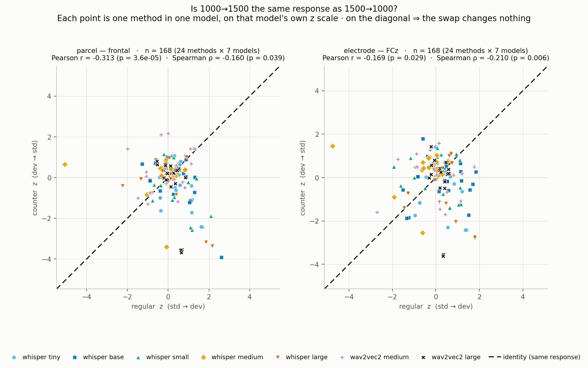

### Section 11 summary

- **Direct answer: no — the same stimuli do *not* drive high responses across models. On this screen the
  in-silico MMN is predominantly a property of the MODEL, not of the stimulus.** The models share a
  small, statistically reliable, but substantively weak common ordering, and every attempt to pin it to
  the stimulus fails.
- **The four converging lines:**
  1. **Concordance is weak.** Kendall's W ≈ **0.27 (frontal) / 0.25 (FCz)** against a null mean of 0.142
     — reliably above chance (p ≤ 6 × 10⁻⁴) but far from agreement. The mean pairwise Spearman between
     two models is **+0.14 / +0.12** (~2% shared variance); the best pair anywhere reaches only +0.56.
  2. **Binary agreement is at or near chance.** The frontal parcel's S2 agreement is **exactly zero once
     chance-corrected (κ = −0.001, p = 0.25)**; FCz reaches only **κ = +0.137**. **Unanimity is never
     above chance** at either site on either criterion — the apparent "10 of 48 stimulus pairs where all 7
     agree" (frontal S2) is **6.9 by chance**, p = 0.087.
  3. **What agreement exists does not survive a deviance control.** Inside the balanced 3.16 st block, W
     drops to the null mean at both sites (0.127 / 0.155 vs null 0.142) — though n = 20 is underpowered.
  4. **It does not survive the direction swap.** Regular ↔ counter rank correlation is **negative on
     average at both sites** (mean −0.198 / −0.125), positive for only 2 of 7 models per site, with
     methods 17/18/19 landing at *opposite ends* of the frontal ranking depending only on which tone is
     the standard. On within-model **z** (11i), against a re-pairing null that accounts for z's
     sum-to-zero constraint: **frontal genuinely inverts** (r = −0.313 vs null −0.059, p = 2 × 10⁻⁴)
     while **FCz simply loses the relationship** (r = −0.169 vs null −0.070, p = 0.077, n.s.).
  5. **Raising the amplitude floor destroys what little agreement there is** (11f–11g). Mean models
     calling a stimulus pair present falls **5.44 → 1.94 /7** (frontal) and **5.52 → 0.90 /7** (FCz) from S2
     to S7@2.5. **Unanimity collapses to zero**: at the frontal parcel **not one of the 48 stimulus pairs has
     all 7 models agreeing at *any* amplitude floor**, and at FCz none above S7@0.5. Read cumulatively
     (Table 50), it is worse than unanimity alone suggests: at **FCz, from S7@1.0 upward not one pair of
     48 has even 5 of 7 models agreeing**, and by **S7@1.5 not even a bare majority of 4**. Fleiss' κ
     **never exceeds +0.137** at any floor or site, and is **n.s. from S7@1.0 upward at frontal and S7@0.75
     upward at FCz** — contrary to the expectation that a lower base rate would give κ more to detect.
- **Per-site verdict — this time the two sites agree on the verdict but not on the reason.**
  - **frontal parcel: model-driven, unambiguously.** Chance-level binary agreement (κ ≈ 0), concordance
    collapsing in the balanced block, negative direction correlations. The one loose end is that its
    residualised W = 0.273 survives while Section 10 found **no** frontal deviance effect — so frontal's
    modest shared ordering is **not** deviance and is currently **unattributed**.
  - **FCz: model-driven, with a small genuine shared component that is largely deviance size.** κ =
    +0.137 (p = 2 × 10⁻⁴) is real but slight, and it is the same signal Section 10 measured as ρ = −0.23
    — i.e. the models agree that **bigger deviants go deeper**, which is shared physics, not shared
    stimulus preference. Consistent with this, its concordance is the one that weakens most when
    whisper-large is dropped (0.245 → 0.237) and inside the fixed-deviance block (→ 0.155).
- **What agreement there is, is carried by whisper tiny / base / small** (ρ +0.30 to +0.56) — the small
  end of one family. **whisper-medium anti-correlates with its own siblings at FCz** (−0.26 with base),
  and **the two wav2vec2 models anti-correlate with each other at both sites** (−0.199 / −0.216). Model
  family is a weak and inconsistent predictor of stimulus preference.
- **Reading guide.** Never compare `trough_uv` across models in this section's spirit — **rank within
  model (11a–11e) or z-score within model (11h–11i)**; both cancel the scale, and they agree. And do not
  read a bare agreement count off this screen: with S2 base rates of 0.44–0.92, "most models agree" is the
  null hypothesis, not the finding. **Two nulls in this section changed a verdict that the naive
  statistic got wrong** — the base-rate null (11b: 10/48 unanimous → chance) and the re-pairing null
  (11i: FCz's r = −0.169, p = 0.029 → n.s. at p = 0.077). Both are cheap; run them.

**Caveats (all load-bearing here).**
- **whisper-large is scale-inflated** (~40× the other models' µV; Section 7, caveat 2). Its *ranks* and
  its z-scored S2 shape are fine, but its **raw µV and its absolute-µV S7 counts are a scale artifact**.
  Its concordance contribution is shown **both included and excluded** (11a and Table 46): dropping it moves
  W by ≤ 0.04, so no conclusion here rests on it.
- **wav2vec2 is not a controlled match to whisper** — self-supervised rather than ASR, 10 s/10 s +
  `PCA_VAR = 0.95` vs whisper's 30 s/10 s with no PCA, layers medium = `encoder.layers.2` /
  large = `encoder.layers.12`. The **whisper ↔ wav2vec2** block of Table 44 therefore confounds
  architecture, training objective, and fit protocol; it is not a clean cross-architecture contrast.
- **The deviance axis is badly unbalanced** (Section 10's design caveat, and it bites harder here):
  **3.16 st carries 10 methods (140 of 336 stimulus pairs) and 10.65 st carries 5 (70)** — together
  **62.5%** — while **seven of the ten sizes rest on a single method** (14 stimulus pairs each: 0.84, 1.07,
  1.74, 1.99, 7.92, 8.84 and 12.00 st). Every single-method claim in Table 45 —
  method_74's SOA-1000 consensus-low, method_37/27's small-deviant consensus-low — is **one stimulus, not
  a replicated estimate**.
- **Encoder deferred** — not run on the 24-method set, so this section has no mTRF-vs-encoder concordance
  contrast.

**Figure 1 — within-model rank heatmap (48 stimulus pairs × 7 models, rows sorted by mean rank; 2 panels,
frontal | FCz).** Consistent rows would mean stimulus-driven; the rows are visibly noisy:

**Figure 2 — pairwise Spearman of within-model ranks (7×7, models blocked by family; 2 panels).**
Diverging scale with a neutral gray midpoint at ρ = 0; the full −1…+1 range is kept so weak correlations
are not visually inflated:
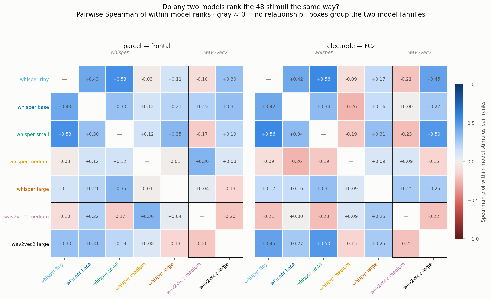

**Figure 3 — S2 agreement-count distribution, observed vs the base-rate-preserving chance null
(2 panels).** The observed bars sit inside the null's 95% interval almost everywhere:
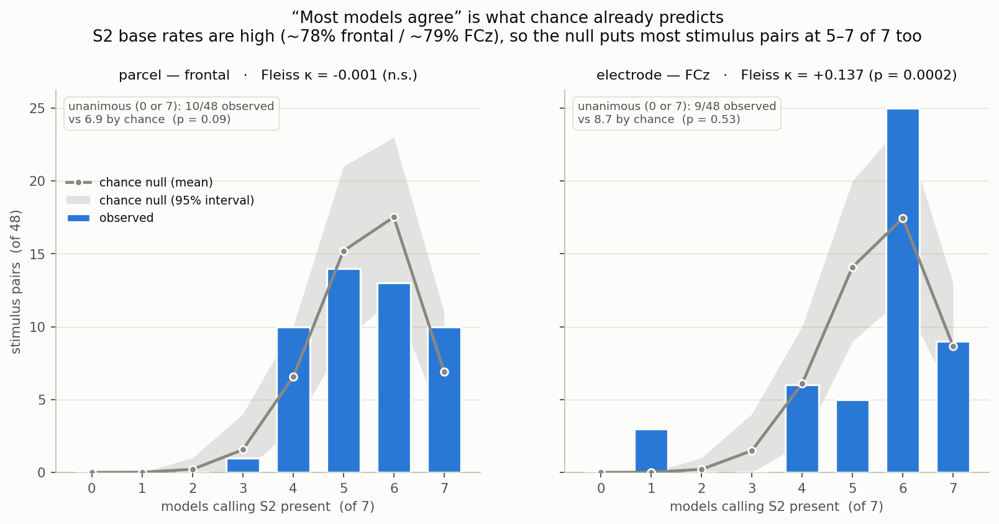

---

*Generated by `scripts/generate_counter_analysis_docs.py` and manually reviewed/expanded.*
*Sections 7–10 and the S7 columns (Tables 13–14b, 25–30) added by hand from
`analyze_mmn_criteria_s5_s6.py` (S7 column), `analyze_mmn_s7_roi.py` (Sections 7–8),
`aux/analysis_with_counter/plots/deviance_scaling_plots.py` (Section 9, 20-method / 4-model),
`aux/analysis_with_counter/plots/deviance_scaling_plots_24freq_7models.py` (Section 10, 24-method /
7-model), and `aux/analysis_with_counter/plots/sec11_concordance_plots.py` (Section 11, cross-model
stimulus concordance).*
