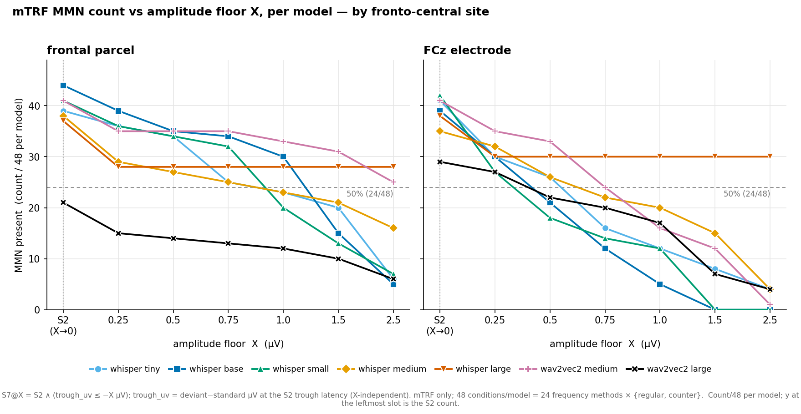
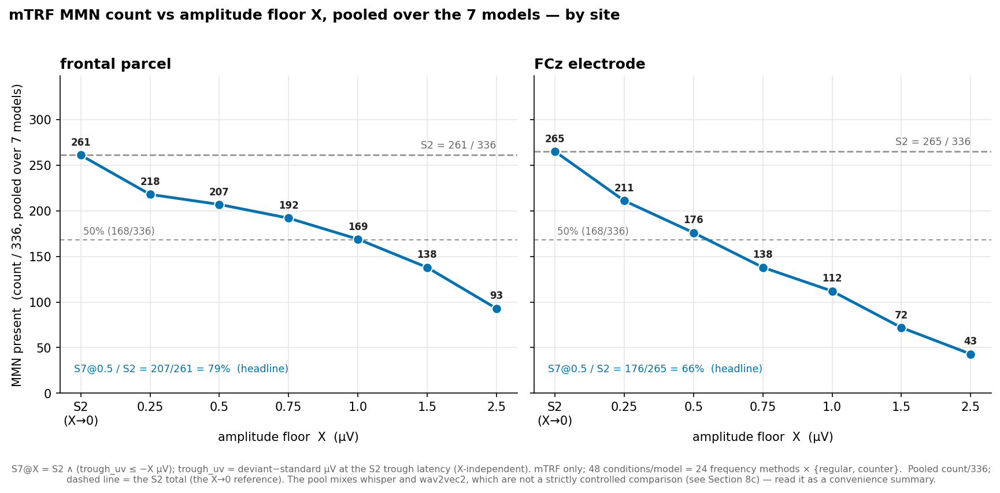
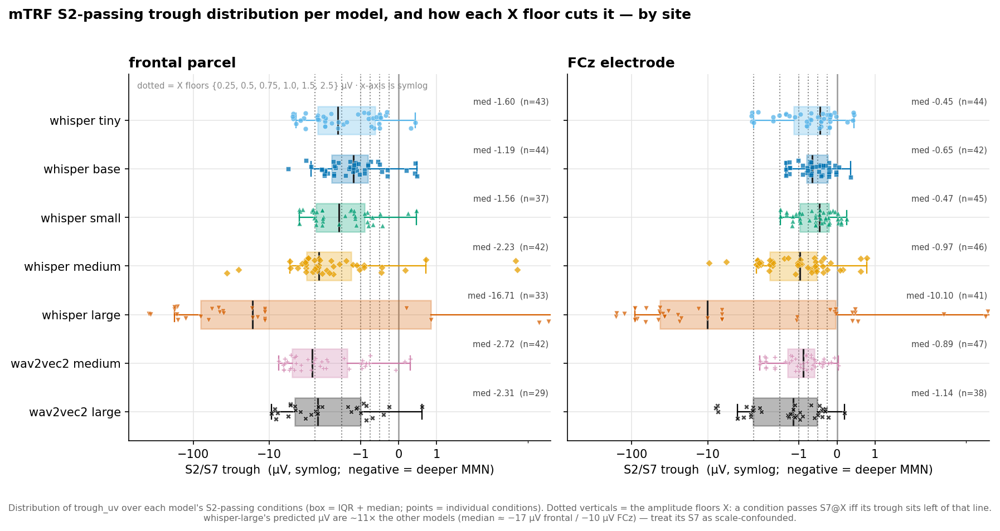
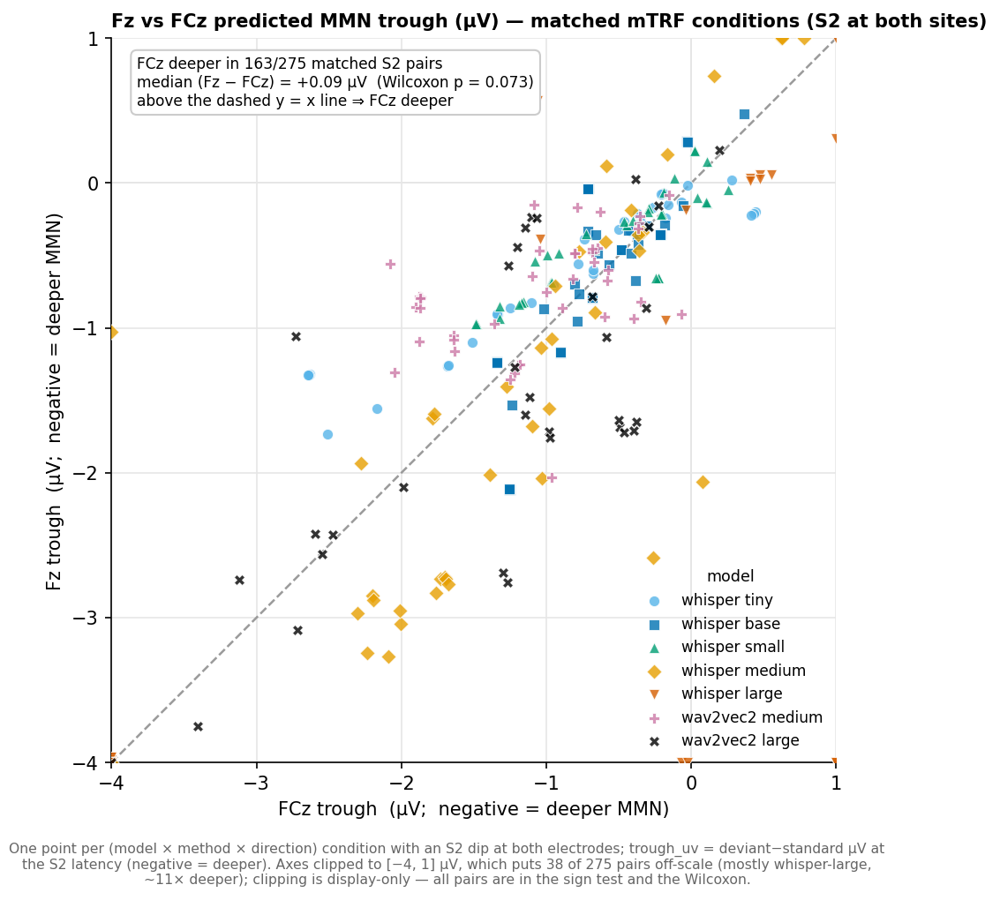
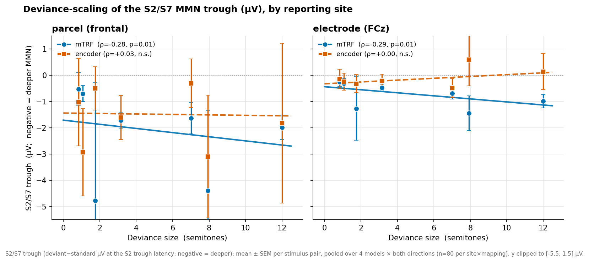
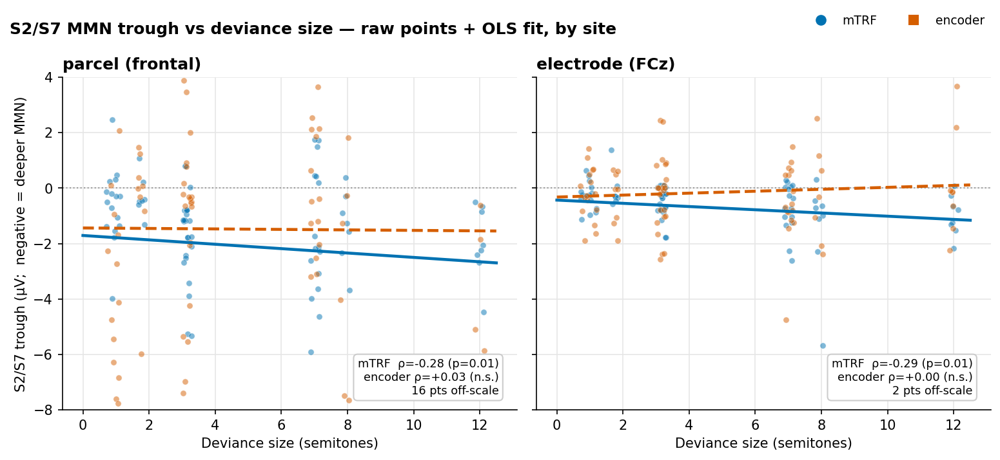
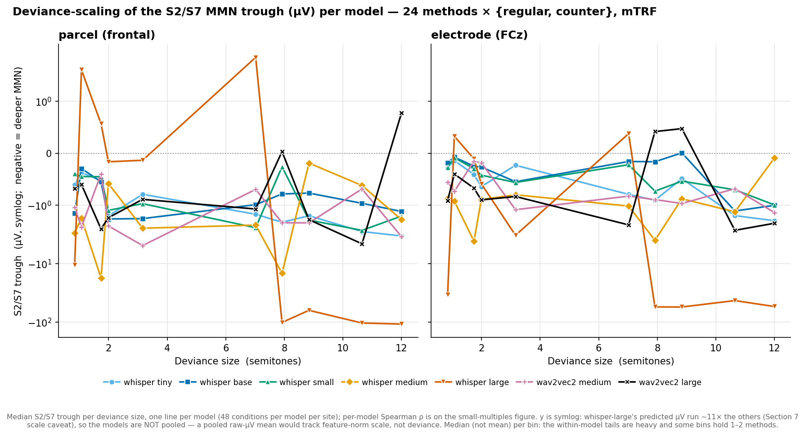
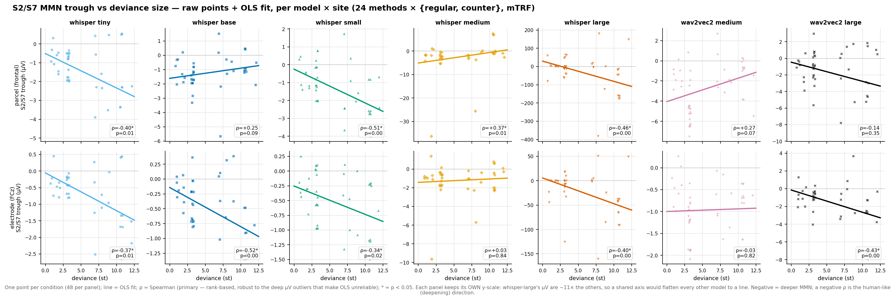
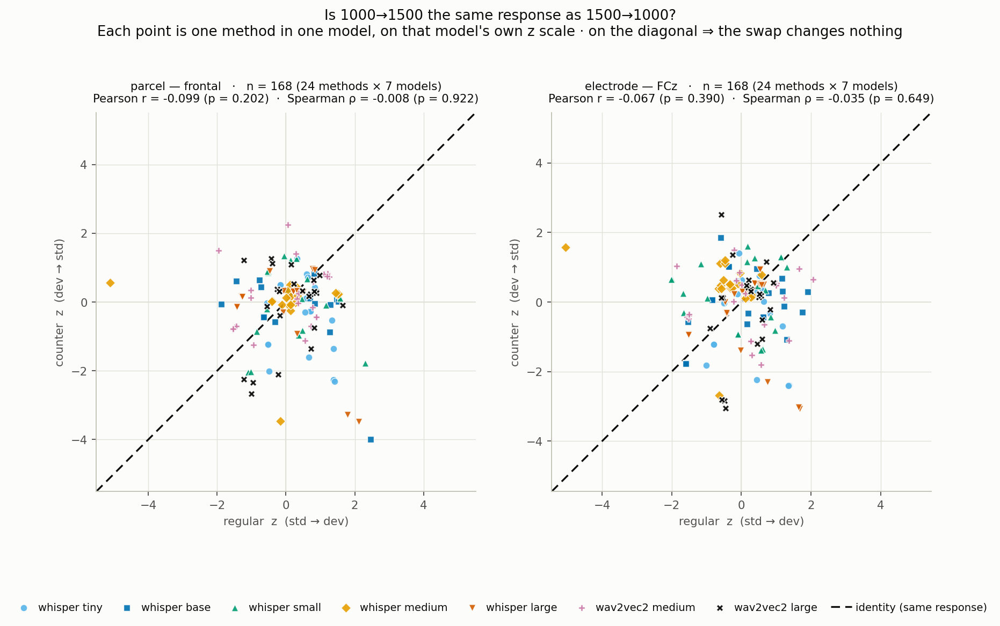
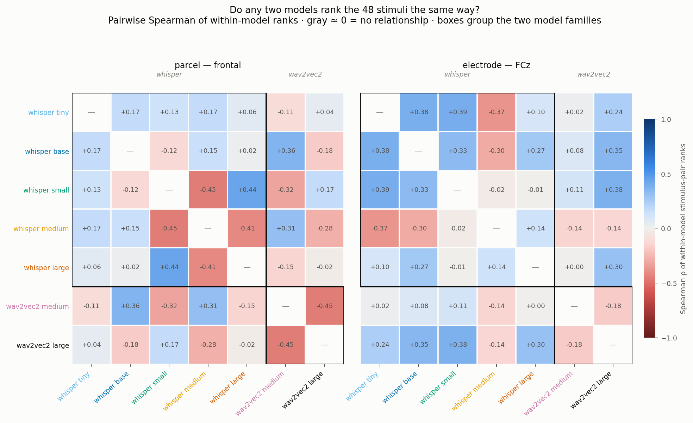

# In-Silico MMN Results Analysis — With Counterbalanced Methods

> ⚠️ **Data-vintage flag (2026-07).** **Sections 7, 8, 8b, 8c, 10 and 11** have been updated to the
> **24-frequency screen** — 24 methods × {regular, counter} = **48 conditions per model per site**,
> **mTRF only**, for **all 7 models**: whisper (tiny, base, small, medium, large) + **wav2vec2 (medium,
> large)**; denominators **/48** per model and **/336** pooled; source
> `outputs/results_soafix_full/mmn_s7_roi.csv`. **All other sections (0b, 1–6, the Cross-Method
> Comparisons, and 9) still report the older 10-method / 4-model screen** (20 conditions per model,
> mTRF + encoder; denominators /20, /40, /80, /160; source `outputs/results_with_counter/*.csv`, and for
> Section 9 `plots/deviance_scaling_plots.py`). The two vintages are **not directly comparable** and
> should be reconciled separately.
>
> ⚠️ **Sections 9 and 10 test the same law on two different vintages, and Section 10 is the one on the
> current data.** Both ask whether the MMN trough deepens with deviance size. **Section 9** (20 methods ×
> 4 models) reports the effect at *both* sites and "the same direction for every model". **Section 10**
> (24 methods × 7 models, mTRF) also finds it at **both** sites — FCz **ρ = −0.268, p = 6.3 × 10⁻⁷** and
> the frontal parcel **ρ = −0.123, p = 0.024** — so the two vintages agree on the headline, with the
> effect roughly twice as strong at FCz. Where they part company is **uniformity**: on the wider screen
> the law is **not** in the same direction for every model — **whisper-medium reverses significantly at
> the frontal parcel** (ρ = +0.37), and whisper-base and wav2vec2-medium lean the same way without
> reaching significance. **Read Section 9's per-model claim against Section 10's Table 42**; the pooled
> frontal-parcel result itself replicates.
>
> Three caveats introduced in Section 7 govern every µV number in 7/8/8b/8c: (1) X is calibrated to each
> model's **own ~4×-shrunk** trough distribution, **not** to literature µV; (2) the shrinkage is
> **model-dependent** — whisper-large's predicted µV run ~9× (frontal) to ~13× (FCz) the other models, so
> its absolute-µV S7 counts are **scale-inflated**; and (3) **wav2vec2 is not a controlled match to
> whisper** (different pretraining objective, window, and PCA), so the pooled **/336** totals are a
> convenience summary rather than a controlled contrast.

> **Extends `aux/results_analysis.md`** by adding 10 counterbalanced stimulus pairs
> (standard/deviant frequencies swapped) to every analysis. Scope: 4 Whisper models
> × 2 levels (parcels, electrodes) × 20 methods (10 regular + 10 counter) × 2 mappings
> (mTRF, encoder) = **320 (model, level, mapping, method)** combinations.
> All metric definitions and section structure are identical to `aux/results_analysis.md`;
> only counts, tables, and observations are updated. See that document for full method
> descriptions, criterion definitions, and the Section 3 pre-tone baseline analysis
> (which is not repeated here as the counterbalanced stimuli use the same baseline design).

## Key motivation for counterbalancing

Adding counterbalanced pairs (where the former deviant frequency becomes the new standard
and vice versa) provides a within-stimulus control for frequency-preference artifacts. If
the in-silico MMN signal reflects genuine deviance detection — the model responding to
*unexpectedness* rather than to a specific frequency — it should appear when *either*
frequency plays the deviant role. Conversely, if the signal is driven by a frequency bias
(e.g. the model simply responds more strongly to higher-pitched tones regardless of context),
only the direction where the "preferred" frequency is deviant would show MMN. Section 0b
(below) tests this directly using the S2 criterion (interior trough + 50% recovery in
100–240 ms), which requires a genuine dip-and-recover shape and is therefore more
diagnostic than the magnitude-only C0 threshold.

---

## Section 0b — Counterbalanced analysis (S2 criterion)

> All tables in this section use the **S2 criterion** (baseline-normalised peak < 0 in
> 100–240 ms AND trough is interior to the window AND 50% depth recovery before window
> end). S2 is preferred over C0 here because it filters out ramp responses that merely
> cross zero at the window edge, which is the dominant failure mode for the encoder. C0
> counts are reported alongside S2 in Sections 1–4 for completeness.

### Aggregate per-method comparison (n/8 per cell = 4 models × 2 levels)

**Table CB-0. mTRF — S2 criterion**

| Method | Source | Stimulus | Regular (n/8) | Counter (n/8) |
| ------ | ------ | -------- | ------------- | ------------- |
| method_27 | Schall_1999a | 1000→1064 Hz | 4/8 | 6/8 |
| method_37 | Javitt_2000a | 1000→1050 Hz | 8/8 | 6/8 |
| method_43 | Michie_2000b | 633→700 Hz | 6/8 | 6/8 |
| method_44 | Michie_2000c | 633→1000 Hz | 6/8 | 8/8 |
| method_53 | Salisbury_2002a | 1000→1200 Hz | 6/8 | 7/8 |
| method_55 | Shinozaki_2002a | 1000→2000 Hz | 7/8 | 8/8 |
| method_60 | Umbricht_2003a | 1000→1500 Hz | 4/8 | 8/8 |
| method_72 | Bodatsch_2011 | 1000→1200 Hz | 8/8 | 8/8 |
| method_74 | Domjan_2012 | 1000→1500 Hz | 8/8 | 6/8 |
| method_75 | Karger_2014 | 1000→1200 Hz | 8/8 | 8/8 |
| **Total** | | | **65/80** | **71/80** |

**Table CB-0b. mTRF — S4 criterion** (tone-end-relative dip+recovery scan; included for comparison)

| Method | Source | Stimulus | Regular (n/8) | Counter (n/8) |
| ------ | ------ | -------- | ------------- | ------------- |
| method_27 | Schall_1999a | 1000→1064 Hz | 8/8 | 5/8 |
| method_37 | Javitt_2000a | 1000→1050 Hz | 8/8 | 8/8 |
| method_43 | Michie_2000b | 633→700 Hz | 6/8 | 6/8 |
| method_44 | Michie_2000c | 633→1000 Hz | 8/8 | 8/8 |
| method_53 | Salisbury_2002a | 1000→1200 Hz | 8/8 | 7/8 |
| method_55 | Shinozaki_2002a | 1000→2000 Hz | 7/8 | 8/8 |
| method_60 | Umbricht_2003a | 1000→1500 Hz | 4/8 | 8/8 |
| method_72 | Bodatsch_2011 | 1000→1200 Hz | 8/8 | 8/8 |
| method_74 | Domjan_2012 | 1000→1500 Hz | 8/8 | 7/8 |
| method_75 | Karger_2014 | 1000→1200 Hz | 8/8 | 8/8 |
| **Total** | | | **73/80** | **71/80** |

**Table CB-0c. Encoder — S2 criterion**

| Method | Source | Stimulus | Regular (n/8) | Counter (n/8) |
| ------ | ------ | -------- | ------------- | ------------- |
| method_27 | Schall_1999a | 1000→1064 Hz | 2/8 | 5/8 |
| method_37 | Javitt_2000a | 1000→1050 Hz | 1/8 | 2/8 |
| method_43 | Michie_2000b | 633→700 Hz | 2/8 | 3/8 |
| method_44 | Michie_2000c | 633→1000 Hz | 2/8 | 3/8 |
| method_53 | Salisbury_2002a | 1000→1200 Hz | 1/8 | 1/8 |
| method_55 | Shinozaki_2002a | 1000→2000 Hz | 2/8 | 5/8 |
| method_60 | Umbricht_2003a | 1000→1500 Hz | 2/8 | 2/8 |
| method_72 | Bodatsch_2011 | 1000→1200 Hz | 2/8 | 1/8 |
| method_74 | Domjan_2012 | 1000→1500 Hz | 0/8 | 2/8 |
| method_75 | Karger_2014 | 1000→1200 Hz | 2/8 | 1/8 |
| **Total** | | | **16/80** | **25/80** |

**Table CB-0d. Encoder — S4 criterion**

| Method | Source | Stimulus | Regular (n/8) | Counter (n/8) |
| ------ | ------ | -------- | ------------- | ------------- |
| method_27 | Schall_1999a | 1000→1064 Hz | 4/8 | 5/8 |
| method_37 | Javitt_2000a | 1000→1050 Hz | 2/8 | 3/8 |
| method_43 | Michie_2000b | 633→700 Hz | 2/8 | 4/8 |
| method_44 | Michie_2000c | 633→1000 Hz | 3/8 | 4/8 |
| method_53 | Salisbury_2002a | 1000→1200 Hz | 1/8 | 1/8 |
| method_55 | Shinozaki_2002a | 1000→2000 Hz | 5/8 | 5/8 |
| method_60 | Umbricht_2003a | 1000→1500 Hz | 3/8 | 3/8 |
| method_72 | Bodatsch_2011 | 1000→1200 Hz | 2/8 | 2/8 |
| method_74 | Domjan_2012 | 1000→1500 Hz | 2/8 | 4/8 |
| method_75 | Karger_2014 | 1000→1200 Hz | 2/8 | 2/8 |
| **Total** | | | **26/80** | **33/80** |

Under mTRF (S2), regular and counter totals are nearly symmetric (65 vs 71/80),
confirming bidirectionality. Under the encoder (S2), counts are uniformly low in both
directions (16 vs 25/80) — the encoder rarely produces genuine troughs under S2
regardless of direction. The counter-biased encoder totals (25 vs 16) partly reflect
whisper-small's counter-heavy C0 calls (16/20 counter vs 6/20 regular) mostly
failing S2 as expected for ramp responses. Method_60 (1000→1500 Hz) shows the largest
directional gap under mTRF S2 (regular 4/8, counter 8/8) — reliably more bidirectional
in the counter direction across both mappings. Methods 72 and 75 (1000→1200 Hz) are
the most symmetric and highest-scoring under mTRF S2 (8/8 in both directions).

---

### Regular vs counter split

**Table CB-1a. mTRF MMN counts: regular vs counterbalanced — S2 criterion** (n/10 per set)

| Model | Set | Parcels (n/10) | Electrodes (n/10) | Total (n/20) |
| ------ | ----------- | -------------- | ----------------- | ------------ |
| tiny | regular | 8/10 | 9/10 | 17/20 |
| tiny | counter | 9/10 | 9/10 | 18/20 |
| base | regular | 6/10 | 6/10 | 12/20 |
| base | counter | 10/10 | 9/10 | 19/20 |
| small | regular | 9/10 | 10/10 | 19/20 |
| small | counter | 10/10 | 9/10 | 19/20 |
| medium | regular | 9/10 | 8/10 | 17/20 |
| medium | counter | 8/10 | 7/10 | 15/20 |

**Table CB-1b. Encoder MMN counts: regular vs counterbalanced — S2 criterion** (n/10 per set)

| Model | Set | Parcels (n/10) | Electrodes (n/10) | Total (n/20) |
| ------ | ----------- | -------------- | ----------------- | ------------ |
| tiny | regular | 1/10 | 2/10 | 3/20 |
| tiny | counter | 3/10 | 2/10 | 5/20 |
| base | regular | 3/10 | 6/10 | 9/20 |
| base | counter | 2/10 | 5/10 | 7/20 |
| small | regular | 4/10 | 0/10 | 4/20 |
| small | counter | 4/10 | 4/10 | 8/20 |
| medium | regular | 0/10 | 0/10 | 0/20 |
| medium | counter | 3/10 | 2/10 | 5/20 |

Under S2, the encoder's counts collapse dramatically relative to C0 — tiny falls from
11/20 (C0 regular) to 3/20 (S2 regular). Whisper-medium drops to 0/20 regular under S2,
confirming those C0 positives were entirely ramp responses. The mTRF S2 counts stay
close to C0, with the most notable change being whisper-base regular (7→6 parcels,
7→6 electrodes) — a minor tightening driven by a borderline method_27 case.

### Agreement between regular and counter versions

**Table CB-2a. Regular ↔ counter agreement — mTRF — S2 criterion**
(n = 20 pairs per model = 10 method-bases × 2 levels)

| Model | Both MMN | Both no-MMN | Disagree |
| ------ | -------- | ----------- | -------- |
| tiny | 15/20 | 0/20 | 5/20 |
| base | 11/20 | 0/20 | 9/20 |
| small | 18/20 | 0/20 | 2/20 |
| medium | 13/20 | 1/20 | 6/20 |

**Table CB-2b. Regular ↔ counter agreement — encoder — S2 criterion**

| Model | Both MMN | Both no-MMN | Disagree |
| ------ | -------- | ----------- | -------- |
| tiny | 1/20 | 13/20 | 6/20 |
| base | 5/20 | 9/20 | 6/20 |
| small | 1/20 | 9/20 | 10/20 |
| medium | 0/20 | 15/20 | 5/20 |

### Per-method regular vs counter MMN count (across all model×level)

**Table CB-3a. mTRF: per-method-base regular vs counter — S2 criterion** (n/8 per cell = 4 models × 2 levels)

| Method | Regular (Std→Dev) | Counter (Dev→Std) | Regular MMN (n/8) | Counter MMN (n/8) |
| ------ | ----------------- | ----------------- | ----------------- | ----------------- |
| method_27 | 1000→1064 Hz | 1064→1000 Hz | 4/8 | 6/8 |
| method_37 | 1000→1050 Hz | 1050→1000 Hz | 8/8 | 6/8 |
| method_43 | 633→700 Hz | 700→633 Hz | 6/8 | 6/8 |
| method_44 | 633→1000 Hz | 1000→633 Hz | 6/8 | 8/8 |
| method_53 | 1000→1200 Hz | 1200→1000 Hz | 6/8 | 7/8 |
| method_55 | 1000→2000 Hz | 2000→1000 Hz | 7/8 | 8/8 |
| method_60 | 1000→1500 Hz | 1500→1000 Hz | 4/8 | 8/8 |
| method_72 | 1000→1200 Hz | 1200→1000 Hz | 8/8 | 8/8 |
| method_74 | 1000→1500 Hz | 1500→1000 Hz | 8/8 | 6/8 |
| method_75 | 1000→1200 Hz | 1200→1000 Hz | 8/8 | 8/8 |

**Table CB-3b. Encoder: per-method-base regular vs counter — S2 criterion** (n/8 per cell)

| Method | Regular (Std→Dev) | Counter (Dev→Std) | Regular MMN (n/8) | Counter MMN (n/8) |
| ------ | ----------------- | ----------------- | ----------------- | ----------------- |
| method_27 | 1000→1064 Hz | 1064→1000 Hz | 2/8 | 5/8 |
| method_37 | 1000→1050 Hz | 1050→1000 Hz | 1/8 | 2/8 |
| method_43 | 633→700 Hz | 700→633 Hz | 2/8 | 3/8 |
| method_44 | 633→1000 Hz | 1000→633 Hz | 2/8 | 3/8 |
| method_53 | 1000→1200 Hz | 1200→1000 Hz | 1/8 | 1/8 |
| method_55 | 1000→2000 Hz | 2000→1000 Hz | 2/8 | 5/8 |
| method_60 | 1000→1500 Hz | 1500→1000 Hz | 2/8 | 2/8 |
| method_72 | 1000→1200 Hz | 1200→1000 Hz | 2/8 | 1/8 |
| method_74 | 1000→1500 Hz | 1500→1000 Hz | 0/8 | 2/8 |
| method_75 | 1000→1200 Hz | 1200→1000 Hz | 2/8 | 1/8 |

### Summary of counterbalanced findings (S2)

**mTRF is highly bidirectional under S2.** Tables CB-2a shows 11–18/20 "both MMN" pairs
per model (55–90% bidirectionality). The "both no-MMN" cell is zero or one for every
model, so every disagreement is a marginal single-direction case rather than a systematic
asymmetry. Notably:

- **whisper-base** shows a striking counter advantage: regular 12/20 vs counter 19/20.
  Under S2, the counterbalanced stimuli produce more genuine trough-shaped responses for
  base than the originals. Methods 43 (633→700 Hz), 44 (633→1000 Hz), and 60
  (1000→1500 Hz) all flip from below-threshold in the regular direction to clear S2 positives
  in the counter direction for base, accounting for most of the 9/20 disagreements.
- **whisper-small** shows near-perfect bidirectionality: 18/20 both-MMN, 2/20 disagree —
  the strongest counterbalance result of any model under S2.
- **Per-method (Table CB-3a)**: methods 72 and 75 achieve 8/8 in both directions — the most
  symmetric and highest-confidence methods. Method 60 (regular 4/8, counter 8/8) shows the
  largest directional gap, consistent with the 633 Hz standard evoking a strong neural
  baseline that suppresses the deviance signal in the regular direction.

**Encoder is dominated by "both no-MMN" under S2.** Table CB-2b shows 9–15/20
"both no-MMN" as the dominant category per model — the encoder rarely produces genuine
troughs in either direction. The small residual disagreement (5–10/20) reflects cases where
one direction passes S2 while the other does not; these are not systematic directional biases
but rather marginal borderline cases. Per Table CB-3b, only methods 27 and 55 produce
encoder S2 counter counts ≥5/8, suggesting those two stimulus pairs generate the most
shape-reliable counter responses.

**Overall verdict on the control (S2):** mTRF results hold up strongly under the
counterbalanced control with S2 — bidirectionality is confirmed at 55–90% per model and
both-no-MMN is essentially zero, meaning every mTRF S2 positive is bidirectionally
supported. The encoder's S2 bidirectionality is uninformative (both directions mostly fail
S2), which is consistent with the encoder's already-known shape-quality deficit rather
than a specific frequency-preference artifact.

---

## Section 1 — Method A (mTRF), all 20 methods

> **Data:** `outputs/results_with_counter/mmn_results_table.csv` (320 rows).
> Aggregations below filter to `mapping=="mtrf"`. The ROI mean for parcels is
> `{frontal, central}` averaged; for electrodes it is `{Fz, FCz, Cz, FC2, F1, F2}`
> (FC1 absent from this montage). All definitions unchanged from `results_analysis.md`.

**Table 1a. Mean MMN per model × method (mTRF)**

| Model | Method | Stimulus | Type | MMN (parcels) | MMN (electrodes) |
| ------ | ------ | -------- | ---- | ------------- | ---------------- |
| tiny | method_27 | 1000→1064 Hz | regular | -0.87 | -0.78 |
| tiny | method_27_counter | 1064→1000 Hz | counter | +0.10 | +0.14 |
| tiny | method_37 | 1000→1050 Hz | regular | -0.25 | -0.30 |
| tiny | method_37_counter | 1050→1000 Hz | counter | -0.23 | -0.13 |
| tiny | method_43 | 633→700 Hz | regular | -0.61 | -0.49 |
| tiny | method_43_counter | 700→633 Hz | counter | -0.61 | -0.46 |
| tiny | method_44 | 633→1000 Hz | regular | -1.46 | -1.63 |
| tiny | method_44_counter | 1000→633 Hz | counter | -1.11 | -0.72 |
| tiny | method_53 | 1000→1200 Hz | regular | -1.04 | -0.83 |
| tiny | method_53_counter | 1200→1000 Hz | counter | -0.66 | -0.83 |
| tiny | method_55 | 1000→2000 Hz | regular | -1.43 | -1.28 |
| tiny | method_55_counter | 2000→1000 Hz | counter | -2.51 | -2.38 |
| tiny | method_60 | 1000→1500 Hz | regular | -0.56 | -0.40 |
| tiny | method_60_counter | 1500→1000 Hz | counter | -1.50 | -1.56 |
| tiny | method_72 | 1000→1200 Hz | regular | -0.96 | -0.78 |
| tiny | method_72_counter | 1200→1000 Hz | counter | -0.12 | -0.19 |
| tiny | method_74 | 1000→1500 Hz | regular | -0.58 | -0.53 |
| tiny | method_74_counter | 1500→1000 Hz | counter | -0.40 | -0.47 |
| tiny | method_75 | 1000→1200 Hz | regular | -0.95 | -0.77 |
| tiny | method_75_counter | 1200→1000 Hz | counter | -0.12 | -0.19 |
| base | method_27 | 1000→1064 Hz | regular | -0.01 | +0.02 |
| base | method_27_counter | 1064→1000 Hz | counter | -0.18 | -0.15 |
| base | method_37 | 1000→1050 Hz | regular | -0.48 | -0.38 |
| base | method_37_counter | 1050→1000 Hz | counter | -0.49 | -0.46 |
| base | method_43 | 633→700 Hz | regular | +0.02 | +0.05 |
| base | method_43_counter | 700→633 Hz | counter | -0.64 | -0.59 |
| base | method_44 | 633→1000 Hz | regular | +0.16 | +0.11 |
| base | method_44_counter | 1000→633 Hz | counter | -0.48 | -0.59 |
| base | method_53 | 1000→1200 Hz | regular | -0.31 | -0.36 |
| base | method_53_counter | 1200→1000 Hz | counter | -0.71 | -0.72 |
| base | method_55 | 1000→2000 Hz | regular | -1.44 | -1.42 |
| base | method_55_counter | 2000→1000 Hz | counter | -0.77 | -0.61 |
| base | method_60 | 1000→1500 Hz | regular | +0.43 | -0.12 |
| base | method_60_counter | 1500→1000 Hz | counter | -2.03 | -1.66 |
| base | method_72 | 1000→1200 Hz | regular | -0.40 | -0.38 |
| base | method_72_counter | 1200→1000 Hz | counter | -0.51 | -0.38 |
| base | method_74 | 1000→1500 Hz | regular | -0.06 | -0.06 |
| base | method_74_counter | 1500→1000 Hz | counter | -0.69 | -0.52 |
| base | method_75 | 1000→1200 Hz | regular | -0.40 | -0.38 |
| base | method_75_counter | 1200→1000 Hz | counter | -0.50 | -0.38 |
| small | method_27 | 1000→1064 Hz | regular | +0.30 | -0.21 |
| small | method_27_counter | 1064→1000 Hz | counter | -0.64 | -0.14 |
| small | method_37 | 1000→1050 Hz | regular | -0.21 | -0.20 |
| small | method_37_counter | 1050→1000 Hz | counter | -0.14 | -0.30 |
| small | method_43 | 633→700 Hz | regular | -0.22 | -0.17 |
| small | method_43_counter | 700→633 Hz | counter | -0.33 | -0.33 |
| small | method_44 | 633→1000 Hz | regular | -0.57 | -0.64 |
| small | method_44_counter | 1000→633 Hz | counter | -0.10 | -0.53 |
| small | method_53 | 1000→1200 Hz | regular | -0.48 | -0.18 |
| small | method_53_counter | 1200→1000 Hz | counter | -0.23 | -0.69 |
| small | method_55 | 1000→2000 Hz | regular | -0.68 | -0.81 |
| small | method_55_counter | 2000→1000 Hz | counter | -1.01 | -0.54 |
| small | method_60 | 1000→1500 Hz | regular | -0.64 | -0.42 |
| small | method_60_counter | 1500→1000 Hz | counter | -0.77 | -0.59 |
| small | method_72 | 1000→1200 Hz | regular | -0.20 | -0.13 |
| small | method_72_counter | 1200→1000 Hz | counter | -0.40 | -0.09 |
| small | method_74 | 1000→1500 Hz | regular | -0.40 | -0.25 |
| small | method_74_counter | 1500→1000 Hz | counter | -0.71 | +0.04 |
| small | method_75 | 1000→1200 Hz | regular | -0.21 | -0.14 |
| small | method_75_counter | 1200→1000 Hz | counter | -0.40 | -0.09 |
| medium | method_27 | 1000→1064 Hz | regular | -0.29 | -0.28 |
| medium | method_27_counter | 1064→1000 Hz | counter | -0.31 | -0.29 |
| medium | method_37 | 1000→1050 Hz | regular | -0.30 | -0.14 |
| medium | method_37_counter | 1050→1000 Hz | counter | +0.06 | +0.01 |
| medium | method_43 | 633→700 Hz | regular | -3.26 | -3.76 |
| medium | method_43_counter | 700→633 Hz | counter | +0.12 | -0.32 |
| medium | method_44 | 633→1000 Hz | regular | -0.41 | -0.74 |
| medium | method_44_counter | 1000→633 Hz | counter | -2.05 | -2.57 |
| medium | method_53 | 1000→1200 Hz | regular | -0.55 | -0.32 |
| medium | method_53_counter | 1200→1000 Hz | counter | -0.12 | -0.11 |
| medium | method_55 | 1000→2000 Hz | regular | +0.00 | -0.26 |
| medium | method_55_counter | 2000→1000 Hz | counter | -0.71 | -0.57 |
| medium | method_60 | 1000→1500 Hz | regular | -1.33 | -0.61 |
| medium | method_60_counter | 1500→1000 Hz | counter | -0.59 | -0.70 |
| medium | method_72 | 1000→1200 Hz | regular | -0.66 | -0.50 |
| medium | method_72_counter | 1200→1000 Hz | counter | -0.33 | -0.11 |
| medium | method_74 | 1000→1500 Hz | regular | -0.59 | -0.34 |
| medium | method_74_counter | 1500→1000 Hz | counter | -0.46 | -0.31 |
| medium | method_75 | 1000→1200 Hz | regular | -0.63 | -0.49 |
| medium | method_75_counter | 1200→1000 Hz | counter | -0.34 | -0.11 |

**Table 1b. Per-model MMN count summary — mTRF** (n/20 per level, 10 regular + 10 counter)

| Model | Parcels (n/20) | Electrodes (n/20) | Total (n/40) |
| ------ | -------------- | ----------------- | ------------ |
| tiny | 19/20 | 19/20 | 38/40 |
| base | 17/20 | 17/20 | 34/40 |
| small | 19/20 | 19/20 | 38/40 |
| medium | 17/20 | 19/20 | 36/40 |
| **Total** | **72/80** | **74/80** | **146/160** |

**Comparison to original (regular only, n/10 per level):** tiny 10/10→19/20 (stable at ~95%), base 7/10→17/20 (improves: 70%→85% — counter methods are consistently positive for base), small 9/10→19/20 (stable at 95%), medium 9+10/20→36/40 (90%). No model degrades under the counterbalanced control; base actually improves.

**Table 1c. Per-method average across models — mTRF** (pooled over all 4 models × 2 levels = 8 cells)

| Method | Stimulus | Type | Avg MMN across models |
| ------ | -------- | ---- | --------------------- |
| method_27 | 1000→1064 Hz | regular | -0.26 |
| method_27_counter | 1064→1000 Hz | counter | -0.18 |
| method_37 | 1000→1050 Hz | regular | -0.28 |
| method_37_counter | 1050→1000 Hz | counter | -0.21 |
| method_43 | 633→700 Hz | regular | -1.06 |
| method_43_counter | 700→633 Hz | counter | -0.40 |
| method_44 | 633→1000 Hz | regular | -0.65 |
| method_44_counter | 1000→633 Hz | counter | -1.02 |
| method_53 | 1000→1200 Hz | regular | -0.51 |
| method_53_counter | 1200→1000 Hz | counter | -0.51 |
| method_55 | 1000→2000 Hz | regular | -0.91 |
| method_55_counter | 2000→1000 Hz | counter | -1.14 |
| method_60 | 1000→1500 Hz | regular | -0.46 |
| method_60_counter | 1500→1000 Hz | counter | -1.18 |
| method_72 | 1000→1200 Hz | regular | -0.50 |
| method_72_counter | 1200→1000 Hz | counter | -0.27 |
| method_74 | 1000→1500 Hz | regular | -0.35 |
| method_74_counter | 1500→1000 Hz | counter | -0.44 |
| method_75 | 1000→1200 Hz | regular | -0.50 |
| method_75_counter | 1200→1000 Hz | counter | -0.27 |

Notable: methods_53, 55, 60 show equal or stronger average MMN in the counter direction; methods_43, 72, 75 show weaker counter MMN, suggesting the 633 Hz and 1200 Hz standards evoke stronger baseline responses that diminish the counter deviance signal. Method_44 (633→1000 Hz) shows a stronger counter (−1.02) than regular (−0.65).

**Table 1d. Per-model average across stimuli — mTRF** (mean and count over all 20 methods for each model)

| Model | Avg MMN across stimuli | n methods with MMN (≥1 level) |
| ------ | ---------------------- | ----------------------------- |
| tiny | -0.76 | 19/20 |
| base | -0.46 | 17/20 |
| small | -0.36 | 19/20 |
| medium | -0.63 | 18/20 |

**Table 1e. Mean MMN per model, level separated — mTRF**

| Model | Mean MMN parcels (avg across 20 methods) | Mean MMN electrodes (avg across 20 methods) |
| ------ | ---------------------------------------- | ------------------------------------------- |
| tiny | -0.79 | -0.73 |
| base | -0.47 | -0.45 |
| small | -0.40 | -0.32 |
| medium | -0.64 | -0.63 |

---

## Section 2 — Method B (encoder), all 20 methods

> Same data source as Section 1, filtered to `mapping=="encoder"`.

**Table 2a. Mean MMN per model × method (encoder)**

| Model | Method | Stimulus | Type | MMN (parcels) | MMN (electrodes) |
| ------ | ------ | -------- | ---- | ------------- | ---------------- |
| tiny | method_27 | 1000→1064 Hz | regular | -0.78 | -0.11 |
| tiny | method_27_counter | 1064→1000 Hz | counter | +0.06 | -0.09 |
| tiny | method_37 | 1000→1050 Hz | regular | -0.42 | -0.89 |
| tiny | method_37_counter | 1050→1000 Hz | counter | +0.14 | -0.12 |
| tiny | method_43 | 633→700 Hz | regular | +0.28 | +0.06 |
| tiny | method_43_counter | 700→633 Hz | counter | -0.21 | -0.25 |
| tiny | method_44 | 633→1000 Hz | regular | +0.26 | -0.12 |
| tiny | method_44_counter | 1000→633 Hz | counter | -2.52 | +0.31 |
| tiny | method_53 | 1000→1200 Hz | regular | +0.51 | -1.49 |
| tiny | method_53_counter | 1200→1000 Hz | counter | -0.41 | +0.21 |
| tiny | method_55 | 1000→2000 Hz | regular | +1.79 | -0.04 |
| tiny | method_55_counter | 2000→1000 Hz | counter | -4.35 | -0.45 |
| tiny | method_60 | 1000→1500 Hz | regular | -2.53 | +1.07 |
| tiny | method_60_counter | 1500→1000 Hz | counter | -3.34 | -1.91 |
| tiny | method_72 | 1000→1200 Hz | regular | -6.53 | +0.41 |
| tiny | method_72_counter | 1200→1000 Hz | counter | +0.44 | -0.47 |
| tiny | method_74 | 1000→1500 Hz | regular | -0.06 | +0.25 |
| tiny | method_74_counter | 1500→1000 Hz | counter | -0.27 | -0.26 |
| tiny | method_75 | 1000→1200 Hz | regular | -6.49 | +0.41 |
| tiny | method_75_counter | 1200→1000 Hz | counter | +0.44 | -0.52 |
| base | method_27 | 1000→1064 Hz | regular | +1.63 | -0.48 |
| base | method_27_counter | 1064→1000 Hz | counter | -2.43 | -0.14 |
| base | method_37 | 1000→1050 Hz | regular | +2.33 | -0.41 |
| base | method_37_counter | 1050→1000 Hz | counter | -10.37 | -0.81 |
| base | method_43 | 633→700 Hz | regular | -0.17 | -0.45 |
| base | method_43_counter | 700→633 Hz | counter | +0.09 | +0.02 |
| base | method_44 | 633→1000 Hz | regular | -0.77 | +1.15 |
| base | method_44_counter | 1000→633 Hz | counter | -7.84 | +0.05 |
| base | method_53 | 1000→1200 Hz | regular | -1.64 | -2.87 |
| base | method_53_counter | 1200→1000 Hz | counter | -0.71 | +0.97 |
| base | method_55 | 1000→2000 Hz | regular | -2.41 | -0.30 |
| base | method_55_counter | 2000→1000 Hz | counter | -1.00 | -0.84 |
| base | method_60 | 1000→1500 Hz | regular | +0.72 | -1.17 |
| base | method_60_counter | 1500→1000 Hz | counter | -5.06 | -2.03 |
| base | method_72 | 1000→1200 Hz | regular | -2.89 | -0.36 |
| base | method_72_counter | 1200→1000 Hz | counter | +0.43 | -0.98 |
| base | method_74 | 1000→1500 Hz | regular | +1.65 | +0.57 |
| base | method_74_counter | 1500→1000 Hz | counter | -1.64 | -0.34 |
| base | method_75 | 1000→1200 Hz | regular | -2.91 | -0.37 |
| base | method_75_counter | 1200→1000 Hz | counter | +0.40 | -0.97 |
| small | method_27 | 1000→1064 Hz | regular | -0.42 | +0.02 |
| small | method_27_counter | 1064→1000 Hz | counter | -1.09 | -0.87 |
| small | method_37 | 1000→1050 Hz | regular | +0.22 | +0.60 |
| small | method_37_counter | 1050→1000 Hz | counter | -0.52 | -0.81 |
| small | method_43 | 633→700 Hz | regular | +0.28 | +0.12 |
| small | method_43_counter | 700→633 Hz | counter | -0.46 | -0.53 |
| small | method_44 | 633→1000 Hz | regular | +0.87 | +1.38 |
| small | method_44_counter | 1000→633 Hz | counter | -0.27 | -2.54 |
| small | method_53 | 1000→1200 Hz | regular | +0.77 | +0.15 |
| small | method_53_counter | 1200→1000 Hz | counter | -1.15 | -0.42 |
| small | method_55 | 1000→2000 Hz | regular | -0.30 | -1.25 |
| small | method_55_counter | 2000→1000 Hz | counter | -1.61 | -0.65 |
| small | method_60 | 1000→1500 Hz | regular | +0.19 | -1.74 |
| small | method_60_counter | 1500→1000 Hz | counter | +1.85 | +0.33 |
| small | method_72 | 1000→1200 Hz | regular | -0.19 | +1.37 |
| small | method_72_counter | 1200→1000 Hz | counter | +0.37 | -2.58 |
| small | method_74 | 1000→1500 Hz | regular | +0.34 | +0.04 |
| small | method_74_counter | 1500→1000 Hz | counter | -0.38 | -0.18 |
| small | method_75 | 1000→1200 Hz | regular | -0.20 | +1.35 |
| small | method_75_counter | 1200→1000 Hz | counter | +0.33 | -2.57 |
| medium | method_27 | 1000→1064 Hz | regular | -0.18 | +0.01 |
| medium | method_27_counter | 1064→1000 Hz | counter | -0.88 | -0.11 |
| medium | method_37 | 1000→1050 Hz | regular | -0.30 | +0.48 |
| medium | method_37_counter | 1050→1000 Hz | counter | +0.32 | -0.46 |
| medium | method_43 | 633→700 Hz | regular | +0.25 | +0.07 |
| medium | method_43_counter | 700→633 Hz | counter | -1.10 | -0.39 |
| medium | method_44 | 633→1000 Hz | regular | -1.59 | +0.02 |
| medium | method_44_counter | 1000→633 Hz | counter | -1.14 | -0.17 |
| medium | method_53 | 1000→1200 Hz | regular | -1.02 | -0.97 |
| medium | method_53_counter | 1200→1000 Hz | counter | +0.37 | +0.39 |
| medium | method_55 | 1000→2000 Hz | regular | +2.61 | +0.25 |
| medium | method_55_counter | 2000→1000 Hz | counter | -0.66 | +0.19 |
| medium | method_60 | 1000→1500 Hz | regular | +1.29 | -2.76 |
| medium | method_60_counter | 1500→1000 Hz | counter | +0.36 | -2.47 |
| medium | method_72 | 1000→1200 Hz | regular | -1.06 | -0.10 |
| medium | method_72_counter | 1200→1000 Hz | counter | +0.60 | +0.06 |
| medium | method_74 | 1000→1500 Hz | regular | -0.21 | -0.24 |
| medium | method_74_counter | 1500→1000 Hz | counter | -0.59 | +0.13 |
| medium | method_75 | 1000→1200 Hz | regular | -1.04 | -0.10 |
| medium | method_75_counter | 1200→1000 Hz | counter | +0.63 | +0.06 |

The same large extreme values as the original appear in encoder/parcels/tiny for methods_72 (−6.53) and _75 (−6.49) and in method_55_counter/tiny (−4.35) and method_37_counter/base (−10.37). As in the original analysis, these extreme values reflect the z-score-denominator instability (near-zero baseline SD) on smooth ramp responses, not a literal 10× stronger MMN — see `results_analysis.md` Notes & caveats.

**Table 2b. Per-model MMN count summary — encoder** (n/20 per level)

| Model | Parcels (n/20) | Electrodes (n/20) | Total (n/40) |
| ------ | -------------- | ----------------- | ------------ |
| tiny | 12/20 | 13/20 | 25/40 |
| base | 13/20 | 15/20 | 28/40 |
| small | 11/20 | 11/20 | 22/40 |
| medium | 12/20 | 10/20 | 22/40 |
| **Total** | **48/80** | **49/80** | **97/160** |

**Comparison to original (regular only):** tiny 11/20→25/40 (55%→62%), base 14/20→28/40 (70%→70%), small 6/20→22/40 (30%→55%), medium 12/20→22/40 (60%→55%). Whisper-small shows the largest shift — counter methods are positive at a much higher rate than regular, confirming the asymmetry flagged in Section 0b.

**Table 2c. Per-method average across models — encoder**

| Method | Stimulus | Type | Avg MMN across models |
| ------ | -------- | ---- | --------------------- |
| method_27 | 1000→1064 Hz | regular | -0.04 |
| method_27_counter | 1064→1000 Hz | counter | -0.69 |
| method_37 | 1000→1050 Hz | regular | +0.20 |
| method_37_counter | 1050→1000 Hz | counter | -1.58 |
| method_43 | 633→700 Hz | regular | +0.06 |
| method_43_counter | 700→633 Hz | counter | -0.35 |
| method_44 | 633→1000 Hz | regular | +0.15 |
| method_44_counter | 1000→633 Hz | counter | -1.77 |
| method_53 | 1000→1200 Hz | regular | -0.82 |
| method_53_counter | 1200→1000 Hz | counter | -0.09 |
| method_55 | 1000→2000 Hz | regular | +0.04 |
| method_55_counter | 2000→1000 Hz | counter | -1.17 |
| method_60 | 1000→1500 Hz | regular | -0.62 |
| method_60_counter | 1500→1000 Hz | counter | -1.53 |
| method_72 | 1000→1200 Hz | regular | -1.17 |
| method_72_counter | 1200→1000 Hz | counter | -0.27 |
| method_74 | 1000→1500 Hz | regular | +0.29 |
| method_74_counter | 1500→1000 Hz | counter | -0.44 |
| method_75 | 1000→1200 Hz | regular | -1.17 |
| method_75_counter | 1200→1000 Hz | counter | -0.28 |

**Table 2d. Per-model average across stimuli — encoder**

| Model | Avg MMN across stimuli | n methods with MMN (≥1 level) |
| ------ | ---------------------- | ----------------------------- |
| tiny | -0.70 | 12/20 |
| base | -1.06 | 14/20 |
| small | -0.25 | 11/20 |
| medium | -0.24 | 11/20 |

**Table 2e. Mean MMN per model, level separated — encoder**

| Model | Mean MMN parcels (avg across 20 methods) | Mean MMN electrodes (avg across 20 methods) |
| ------ | ---------------------------------------- | ------------------------------------------- |
| tiny | -1.20 | -0.20 |
| base | -1.63 | -0.49 |
| small | -0.07 | -0.44 |
| medium | -0.17 | -0.31 |

---

## Cross-Method Comparisons (updated, 20 methods)

**Table 3. mTRF vs. encoder agreement** (per model × level, over all 20 methods)

| Model | Level | Both MMN | Both no-MMN | Agree | Disagree |
| ------ | ---------- | -------- | ----------- | ----- | -------- |
| tiny | parcels | 12 | 1 | 13/20 | 7/20 |
| tiny | electrodes | 12 | 0 | 12/20 | 8/20 |
| base | parcels | 11 | 1 | 12/20 | 8/20 |
| base | electrodes | 13 | 1 | 14/20 | 6/20 |
| small | parcels | 10 | 0 | 10/20 | 10/20 |
| small | electrodes | 10 | 0 | 10/20 | 10/20 |
| medium | parcels | 11 | 2 | 13/20 | 7/20 |
| medium | electrodes | 9 | 0 | 9/20 | 11/20 |

Agreement is generally moderate (10–14/20), similar to the original 10-method analysis (2–8/10). The mTRF–encoder disagreement does not worsen or improve substantially when counter methods are added, suggesting the two mapping methods disagree on a consistent subset of stimuli rather than counter stimuli specifically driving more disagreement.

**Table 4. Stimulus-method consistency** (MMN count across all 32 model×level×mapping cells per method)

| Method | Stimulus (source) | mTRF (n/8) | Encoder (n/8) | Total (n/16) |
| ------ | ----------------- | ---------- | ------------- | ------------ |
| method_75 | 1000→1200 Hz (Karger_2014) | 8/8 | 6/8 | 14/16 |
| method_75_counter | 1200→1000 Hz (Karger_2014) | 8/8 | 3/8 | 11/16 |
| method_74 | 1000→1500 Hz (Domjan_2012) | 8/8 | 3/8 | 11/16 |
| method_74_counter | 1500→1000 Hz (Domjan_2012) | 7/8 | 7/8 | 14/16 |
| method_72 | 1000→1200 Hz (Bodatsch_2011) | 8/8 | 6/8 | 14/16 |
| method_72_counter | 1200→1000 Hz (Bodatsch_2011) | 8/8 | 3/8 | 11/16 |
| method_60 | 1000→1500 Hz (Umbricht_2003a) | 7/8 | 4/8 | 11/16 |
| method_60_counter | 1500→1000 Hz (Umbricht_2003a) | 8/8 | 5/8 | 13/16 |
| method_53 | 1000→1200 Hz (Salisbury_2002a) | 8/8 | 5/8 | 13/16 |
| method_53_counter | 1200→1000 Hz (Salisbury_2002a) | 8/8 | 4/8 | 12/16 |
| method_55 | 1000→2000 Hz (Shinozaki_2002a) | 7/8 | 5/8 | 12/16 |
| method_55_counter | 2000→1000 Hz (Shinozaki_2002a) | 8/8 | 7/8 | 15/16 |
| method_37 | 1000→1050 Hz (Javitt_2000a) | 8/8 | 4/8 | 12/16 |
| method_37_counter | 1050→1000 Hz (Javitt_2000a) | 6/8 | 6/8 | 12/16 |
| method_43 | 633→700 Hz (Michie_2000b) | 6/8 | 2/8 | 8/16 |
| method_43_counter | 700→633 Hz (Michie_2000b) | 7/8 | 6/8 | 13/16 |
| method_44 | 633→1000 Hz (Michie_2000c) | 6/8 | 3/8 | 9/16 |
| method_44_counter | 1000→633 Hz (Michie_2000c) | 8/8 | 6/8 | 14/16 |
| method_27 | 1000→1064 Hz (Schall_1999a) | 6/8 | 5/8 | 11/16 |
| method_27_counter | 1064→1000 Hz (Schall_1999a) | 6/8 | 7/8 | 13/16 |

Notable pattern: methods 43 and 44 (633 Hz standard) show low regular totals (8/16, 9/16) but their counter versions score 13/16 and 14/16 — the reversal is consistent across both mTRF and encoder. Method_55_counter (2000→1000 Hz) is the highest-scoring single method (15/16). Method_74_counter matches method_74 in mTRF (7 vs 8/8) and outperforms the regular direction in the encoder (7 vs 3/8).

---

## Section 4 — Shape metrics C0–S6 (updated, 20 methods)

> **Code:** `scripts/analyze_mmn_criteria_s5_s6.py --roi_variant current`
> **Data:** `outputs/results_with_counter/mmn_criteria_s5_s6.csv`
>
> **Important note on S4 values:** The S4 criterion here comes from
> `analyze_mmn_criteria_s5_s6.py` (column `current__S4_specificity`), which may differ
> slightly from the S4 computed by `analyze_mmn_criteria.py` used in the original
> `results_analysis.md` Tables 13–14. The C0–S3 and S5–S6 counts are computed from the
> same definitions. The relative ordering of criteria and the mTRF-vs-encoder gap
> are unaffected by this minor implementation difference.

> **New criterion S7 (amplitude-gated MMN).** S7 = **S2 AND** the deviant−standard
> difference wave, **in microvolts**, at the S2 trough latency ≤ **−X µV** (headline
> **X = 1.0 µV**, *provisional — pending a literature amplitude threshold; TODO*). Unlike
> C0–S6, which score a **z-scored** (dimensionless, baseline-SD-unit) difference, S7 tests
> an **absolute amplitude** taken from a *separate* mean-only baseline-corrected difference
> wave (`analyze_mmn_criteria_s5_s6.py --dip_uv_threshold`, column `current__S7_uv_gated`).
> Units are made comparable across mappings: the mTRF predicts native EEG **Volts** (×1e6 →
> µV); the encoder predicts **z-units**, converted to native µV via the per-target `eeg_sd`
> in the checkpoint `model__<layer>.pt` (the additive mean cancels in deviant−standard). **By
> construction S7 ⊆ S2**, so S7 ≤ S2 in every cell below.
>
> **Scale caveat:** ridge/encoder predictions systematically **under-estimate** true MMN
> amplitude, so the model's predicted µV scale need **not** match literature EEG µV (a
> literature MMN is ≈ 1–5 µV, ~3 µV typical peak; Duncan et al. 2009). X is therefore
> calibrated to the **model's own** predicted-µV distribution, not to the literature:
> across the 20-method set the median S2-passing trough is ≈ **−0.9 µV** (mTRF, current
> ROI). On the native EEG scale **1.0 µV** is only ≈ 33% of a typical ~3 µV human peak
> MMN, but because the model's predictions are ~4× amplitude-shrunk, on the model's own
> scale 1.0 µV sits **just beyond** the median trough magnitude — so it removes slightly
> **more than half** of the S2-passing mTRF troughs (not merely the shallowest 0 → −0.5 µV
> tail), keeping the deeper, clearer ones. See **Section 7** for the full ROI / X-sweep
> breakdown and the µV-trough distribution.

### Results — mTRF (n/40 per model = 20 methods × 2 levels)

**Table 13. MMN-present counts per criterion, by model — mTRF**

| Model | C0 (n/40) | S1 (n/40) | S2 (n/40) | S3 (n/40) | S4 (n/40) | S5 (n/40) | S6 (n/40) | S7 (n/40) |
| ------ | --------- | --------- | --------- | --------- | --------- | --------- | --------- | --------- |
| tiny | 38/40 | 13/40 | 35/40 | 13/40 | 24/40 | 31/40 | 17/40 | 17/40 |
| base | 32/40 | 15/40 | 31/40 | 15/40 | 18/40 | 29/40 | 15/40 | 7/40 |
| small | 38/40 | 24/40 | 38/40 | 24/40 | 26/40 | 37/40 | 16/40 | 8/40 |
| medium | 34/40 | 25/40 | 32/40 | 23/40 | 18/40 | 28/40 | 13/40 | 26/40 |
| **Total** | **142/160** | **77/160** | **136/160** | **75/160** | **86/160** | **125/160** | **61/160** | **58/160** |

The mTRF shape-criterion picture is broadly preserved: C0 and S2 remain very high (89–95% and 85–95% per model), S1/S3 penalise substantially (edge-rejection effect unchanged), and S6 is the most restrictive. The S2/C0 retention rate across models is 35/38, 31/32, 38/38, 32/34 — roughly 92–100%, essentially identical to the original 92–100% in `results_analysis.md`. Counter methods do not degrade shape quality. **S7 (amplitude gate at 1.0 µV) tightens S2 to 58/160 — an S7/S2 retention of 43%** (58 of 136 S2-positives clear the 1.0 µV floor); it now sits just below S6 (61/160) rather than between S6 and S2, removing slightly more than half of the genuine mTRF troughs along with the shallow-amplitude ones. whisper-medium retains the most (26/32 = 81%), whisper-small the least (8/38 = 21%), reflecting its shallower predicted troughs.

**Table 13b. Regular vs counter breakdown — mTRF** (n/20 per set)

| Model | Set | C0 (n/20) | S1 (n/20) | S2 (n/20) | S3 (n/20) | S4 (n/20) | S5 (n/20) | S6 (n/20) | S7 (n/20) |
| ------ | ------- | --------- | --------- | --------- | --------- | --------- | --------- | --------- | --------- |
| tiny | regular | 20/20 | 8/20 | 17/20 | 8/20 | 16/20 | 19/20 | 10/20 | 8/20 |
| tiny | counter | 18/20 | 5/20 | 18/20 | 5/20 | 8/20 | 12/20 | 7/20 | 9/20 |
| base | regular | 12/20 | 4/20 | 12/20 | 4/20 | 6/20 | 15/20 | 7/20 | 2/20 |
| base | counter | 20/20 | 11/20 | 19/20 | 11/20 | 12/20 | 14/20 | 8/20 | 5/20 |
| small | regular | 19/20 | 11/20 | 19/20 | 11/20 | 14/20 | 17/20 | 6/20 | 3/20 |
| small | counter | 19/20 | 13/20 | 19/20 | 13/20 | 12/20 | 20/20 | 10/20 | 5/20 |
| medium | regular | 19/20 | 17/20 | 17/20 | 15/20 | 10/20 | 14/20 | 9/20 | 16/20 |
| medium | counter | 15/20 | 8/20 | 15/20 | 8/20 | 8/20 | 14/20 | 4/20 | 10/20 |

Counter methods maintain high S2 rates (15–19/20) across all models, confirming that their C0 positives are predominantly genuine dip-and-recover troughs rather than ramps — the same shape quality as the regular stimuli. S7 remains roughly balanced across regular and counter overall (e.g. tiny 8/9); base and small skew slightly counter (2/5 and 3/5) while medium skews regular (16/10), but there is no systematic direction bias — counter troughs are broadly as deep in µV as the regular ones.

### Results — Encoder (n/40 per model)

**Table 14. MMN-present counts per criterion, by model — encoder**

| Model | C0 (n/40) | S1 (n/40) | S2 (n/40) | S3 (n/40) | S4 (n/40) | S5 (n/40) | S6 (n/40) | S7 (n/40) |
| ------ | --------- | --------- | --------- | --------- | --------- | --------- | --------- | --------- |
| tiny | 24/40 | 11/40 | 8/40 | 5/40 | 7/40 | 15/40 | 7/40 | 3/40 |
| base | 27/40 | 11/40 | 16/40 | 5/40 | 14/40 | 19/40 | 6/40 | 6/40 |
| small | 22/40 | 13/40 | 12/40 | 8/40 | 10/40 | 9/40 | 4/40 | 8/40 |
| medium | 22/40 | 5/40 | 5/40 | 2/40 | 8/40 | 22/40 | 6/40 | 4/40 |
| **Total** | **95/160** | **40/160** | **41/160** | **20/160** | **39/160** | **65/160** | **23/160** | **21/160** |

The encoder's shape-gating collapse is preserved: S2/C0 retention is 8/24, 16/27, 12/22, 5/22 (33–59%) — slightly higher than the original 38% in `results_analysis.md`, but still far below mTRF's 92–100%. Adding counter methods does not rescue the encoder's shape problem. **S7 lands at 21/160** — an S7/S2 retention of 51% (21 of 41), slightly *above* the mTRF's 43% at this X: when the encoder *does* produce a genuine S2 trough, that trough is usually of adequate µV amplitude. So even at the tighter 1.0 µV floor S7 does not disproportionately punish the encoder; the encoder's deficit is upstream (it rarely passes S2 at all: 41/160 vs mTRF 136/160), not in amplitude.

**Table 14b. Regular vs counter breakdown — encoder** (n/20 per set)

| Model | Set | C0 (n/20) | S1 (n/20) | S2 (n/20) | S3 (n/20) | S4 (n/20) | S5 (n/20) | S6 (n/20) | S7 (n/20) |
| ------ | ------- | --------- | --------- | --------- | --------- | --------- | --------- | --------- | --------- |
| tiny | regular | 11/20 | 4/20 | 3/20 | 2/20 | 2/20 | 4/20 | 2/20 | 0/20 |
| tiny | counter | 13/20 | 7/20 | 5/20 | 3/20 | 5/20 | 11/20 | 5/20 | 3/20 |
| base | regular | 13/20 | 6/20 | 9/20 | 4/20 | 7/20 | 10/20 | 4/20 | 2/20 |
| base | counter | 14/20 | 5/20 | 7/20 | 1/20 | 7/20 | 9/20 | 2/20 | 4/20 |
| small | regular | 6/20 | 3/20 | 4/20 | 2/20 | 3/20 | 2/20 | 0/20 | 2/20 |
| small | counter | 16/20 | 10/20 | 8/20 | 6/20 | 7/20 | 7/20 | 4/20 | 6/20 |
| medium | regular | 12/20 | 2/20 | 0/20 | 0/20 | 1/20 | 6/20 | 1/20 | 0/20 |
| medium | counter | 10/20 | 3/20 | 5/20 | 2/20 | 7/20 | 16/20 | 5/20 | 4/20 |

Notably, whisper-small counter methods show substantially higher C0 (16 vs 6/20) and S2 (8 vs 4/20) counts. Whisper-medium counter shows higher S5 (16 vs 6/20) and S6 (5 vs 1/20) — suggesting the counter direction for medium produces more genuine recovering troughs at later latencies, outside the fixed 100–240 ms window. S7 follows S2: the encoder's amplitude-qualified troughs concentrate in the counter direction (small 2 reg vs 6 counter; medium 0 reg vs 4 counter), i.e. the few encoder MMNs that clear the µV floor come disproportionately from the swapped-frequency stimuli.

---

## Section 5 — ROI sensitivity (updated, 20 methods)

> **Data:** `outputs/results_with_counter/mmn_roi_variants.csv` (1280 rows = 20 methods × 4 models × 2 levels × 4 ROI variants per level × 2 mappings).
> C0 criterion (peak < 0 in 100–240 ms) only — shape criteria are not recomputed per ROI variant.
> ROI variants: electrodes {Fz, FCz, Fz+FCz, current7}; parcels {central, current2, frontal, temporal}.

### MMN count per ROI variant (n/20 per model = 20 methods)

**Table 5a. mTRF — electrodes** (C0 count per single-site and multi-site ROI variant)

| Model | FCz (n/20) | Fz (n/20) | Fz+FCz (n/20) | current7 (n/20) |
| ------ | ---------- | --------- | ------------- | --------------- |
| tiny | 17/20 | 18/20 | 19/20 | 19/20 |
| base | 16/20 | 16/20 | 16/20 | 16/20 |
| small | 19/20 | 18/20 | 16/20 | 19/20 |
| medium | 17/20 | 19/20 | 18/20 | 17/20 |
| **Total** | **69/80** | **71/80** | **69/80** | **71/80** |

**Table 5b. mTRF — parcels**

| Model | central (n/20) | current2 (n/20) | frontal (n/20) | temporal (n/20) |
| ------ | -------------- | --------------- | -------------- | --------------- |
| tiny | 17/20 | 19/20 | 20/20 | 18/20 |
| base | 16/20 | 16/20 | 18/20 | 18/20 |
| small | 19/20 | 19/20 | 13/20 | 14/20 |
| medium | 19/20 | 17/20 | 17/20 | 17/20 |
| **Total** | **71/80** | **71/80** | **68/80** | **67/80** |

**Table 5c. Encoder — electrodes**

| Model | FCz (n/20) | Fz (n/20) | Fz+FCz (n/20) | current7 (n/20) |
| ------ | ---------- | --------- | ------------- | --------------- |
| tiny | 12/20 | 13/20 | 11/20 | 12/20 |
| base | 13/20 | 14/20 | 14/20 | 14/20 |
| small | 12/20 | 13/20 | 12/20 | 11/20 |
| medium | 10/20 | 11/20 | 11/20 | 10/20 |
| **Total** | **47/80** | **51/80** | **48/80** | **47/80** |

**Table 5d. Encoder — parcels**

| Model | central (n/20) | current2 (n/20) | frontal (n/20) | temporal (n/20) |
| ------ | -------------- | --------------- | -------------- | --------------- |
| tiny | 13/20 | 12/20 | 12/20 | 12/20 |
| base | 13/20 | 13/20 | 13/20 | 15/20 |
| small | 12/20 | 11/20 | 10/20 | 10/20 |
| medium | 12/20 | 12/20 | 13/20 | 12/20 |
| **Total** | **50/80** | **48/80** | **48/80** | **49/80** |

### Mean ROI peak per variant

**Table 5e. mTRF — electrodes** (mean z-score peak across 20 methods)

| Model | FCz | Fz | Fz+FCz | current7 |
| ------ | --- | -- | ------ | -------- |
| tiny | −0.76 | −0.61 | −0.66 | −0.66 |
| base | −0.50 | −0.42 | −0.45 | −0.35 |
| small | −0.41 | −0.40 | −0.39 | −0.27 |
| medium | −0.60 | −0.43 | −0.48 | −0.48 |

**Table 5f. mTRF — parcels**

| Model | central | current2 | frontal | temporal |
| ------ | ------- | -------- | ------- | -------- |
| tiny | −0.75 | −0.77 | −0.84 | −0.72 |
| base | −0.51 | −0.39 | −0.44 | −0.46 |
| small | −0.60 | −0.37 | −0.20 | −0.22 |
| medium | −0.57 | −0.58 | −0.70 | −0.67 |

**Table 5g. Encoder — electrodes**

| Model | FCz | Fz | Fz+FCz | current7 |
| ------ | --- | -- | ------ | -------- |
| tiny | −0.16 | −0.29 | −0.20 | −0.09 |
| base | −0.33 | −0.69 | −0.49 | −0.32 |
| small | −0.28 | −0.31 | −0.28 | −0.34 |
| medium | −0.29 | −0.21 | −0.25 | −0.17 |

**Table 5h. Encoder — parcels**

| Model | central | current2 | frontal | temporal |
| ------- | ------- | -------- | ------- | -------- |
| tiny | −1.29 | −1.20 | −1.11 | −1.11 |
| base | −1.78 | −1.62 | −1.48 | −1.36 |
| small | −0.06 | −0.05 | −0.08 | −0.06 |
| medium | −0.15 | −0.17 | −0.19 | −0.18 |

### Correlation between ROI variants (continuous peak, n=160 runs pooled across all models × mappings × methods)

**Table 5i. Electrodes: Pearson r vs current7**

| Variant | r vs current7 |
| ------- | ------------- |
| FCz | +0.951 |
| Fz+FCz | +0.871 |
| Fz | +0.615 |

**Table 5j. Parcels: Pearson r vs current2**

| Variant | r vs current2 |
| ------- | ------------- |
| frontal | +0.977 |
| central | +0.974 |
| temporal | +0.958 |

### Section 5 summary

**Electrodes:** FCz tracks current7 most faithfully in continuous peak values (r=+0.951),
outperforming Fz (r=+0.615) and Fz+FCz (r=+0.871). Notably, Fz and current7 agree on
the same binary MMN count (71/80 each under mTRF), but FCz has lower count agreement
(69/80) — suggesting Fz and current7 agree on direction but not on peak magnitude, while
FCz agrees better on magnitude but slightly worse on binary calls. The low r=0.615 for Fz
vs current7 (continuous) indicates that Fz peak magnitude diverges from the broadband
ROI for some methods, likely where energy is distributed more centrally than frontally.
For reporting, current7 remains the primary ROI; Fz is the recommended canonical
single-electrode for figures/tables where a single site is needed, but FCz should be noted
as the stronger continuous proxy.

**Parcels:** All three single-parcel variants track current2 closely (r=0.958–0.977).
Central (r=0.974) and frontal (r=0.977) have essentially equivalent correlations, but
frontal has notably lower MMN counts for whisper-small (13/20 vs 19/20 for current2 and
central) — suggesting frontal is less reliable for the smaller model where the spatial
distribution of mTRF weights may produce weaker frontal projections. Central remains the
recommended single-parcel ROI: it matches current2 in count (both 71/80 under mTRF) and
has high continuous correlation (r=0.974).

**Encoder ROI sensitivity:** The encoder shows minimal sensitivity to ROI choice in both
directions — all variants give counts within ±3 of each other for both electrodes and
parcels. This is consistent with the encoder's lower signal-to-noise (more marginal peaks)
making ROI choice less impactful than for mTRF.

---

## Section 6 — Shape criteria under Fz/central ROI (updated, 20 methods)

> **Code:** `scripts/analyze_mmn_criteria_s5_s6.py --roi_variant fz_central`
> **Data:** `outputs/results_with_counter/mmn_criteria_s5_s6_fz_central.csv`

**Table 25. Electrodes — Fz only — mTRF** (n/20 per model)

| Model | C0 (n/20) | S1 (n/20) | S2 (n/20) | S3 (n/20) | S4 (n/20) | S5 (n/20) | S6 (n/20) | S7 (n/20) |
| ------ | --------- | --------- | --------- | --------- | --------- | --------- | --------- | --------- |
| tiny | 18/20 | 9/20 | 15/20 | 6/20 | 11/20 | 14/20 | 7/20 | 3/20 |
| base | 16/20 | 8/20 | 16/20 | 8/20 | 11/20 | 18/20 | 11/20 | 3/20 |
| small | 18/20 | 12/20 | 18/20 | 12/20 | 12/20 | 20/20 | 8/20 | 0/20 |
| medium | 19/20 | 14/20 | 19/20 | 14/20 | 10/20 | 13/20 | 5/20 | 12/20 |
| **Total** | **71/80** | **43/80** | **68/80** | **40/80** | **44/80** | **65/80** | **31/80** | **18/80** |

**Table 26. Parcels — central only — mTRF** (n/20 per model)

| Model | C0 (n/20) | S1 (n/20) | S2 (n/20) | S3 (n/20) | S4 (n/20) | S5 (n/20) | S6 (n/20) | S7 (n/20) |
| ------ | --------- | --------- | --------- | --------- | --------- | --------- | --------- | --------- |
| tiny | 17/20 | 7/20 | 15/20 | 7/20 | 11/20 | 17/20 | 8/20 | 2/20 |
| base | 16/20 | 8/20 | 16/20 | 8/20 | 12/20 | 15/20 | 8/20 | 1/20 |
| small | 19/20 | 14/20 | 19/20 | 14/20 | 14/20 | 19/20 | 12/20 | 1/20 |
| medium | 19/20 | 13/20 | 19/20 | 13/20 | 10/20 | 13/20 | 6/20 | 11/20 |
| **Total** | **71/80** | **42/80** | **69/80** | **42/80** | **47/80** | **64/80** | **34/80** | **15/80** |

**Table 27. Electrodes — Fz only — encoder** (n/20 per model)

| Model | C0 (n/20) | S1 (n/20) | S2 (n/20) | S3 (n/20) | S4 (n/20) | S5 (n/20) | S6 (n/20) | S7 (n/20) |
| ------ | --------- | --------- | --------- | --------- | --------- | --------- | --------- | --------- |
| tiny | 13/20 | 7/20 | 4/20 | 3/20 | 2/20 | 3/20 | 1/20 | 0/20 |
| base | 14/20 | 3/20 | 11/20 | 3/20 | 8/20 | 12/20 | 3/20 | 0/20 |
| small | 13/20 | 6/20 | 4/20 | 3/20 | 9/20 | 5/20 | 4/20 | 1/20 |
| medium | 11/20 | 3/20 | 4/20 | 2/20 | 3/20 | 8/20 | 2/20 | 0/20 |
| **Total** | **51/80** | **19/80** | **23/80** | **11/80** | **22/80** | **28/80** | **10/80** | **1/80** |

**Table 28. Parcels — central only — encoder** (n/20 per model)

| Model | C0 (n/20) | S1 (n/20) | S2 (n/20) | S3 (n/20) | S4 (n/20) | S5 (n/20) | S6 (n/20) | S7 (n/20) |
| ------ | --------- | --------- | --------- | --------- | --------- | --------- | --------- | --------- |
| tiny | 13/20 | 7/20 | 5/20 | 4/20 | 4/20 | 7/20 | 3/20 | 1/20 |
| base | 13/20 | 8/20 | 6/20 | 4/20 | 7/20 | 8/20 | 3/20 | 2/20 |
| small | 12/20 | 6/20 | 8/20 | 4/20 | 4/20 | 7/20 | 2/20 | 2/20 |
| medium | 12/20 | 2/20 | 4/20 | 2/20 | 7/20 | 12/20 | 3/20 | 4/20 |
| **Total** | **50/80** | **23/80** | **23/80** | **14/80** | **22/80** | **34/80** | **11/80** | **9/80** |

### Combined (parcels + electrodes, Fz/central ROI)

**Table 29. mTRF, combined (Fz + central)** (n/40 per model)

| Model | C0 (n/40) | S1 (n/40) | S2 (n/40) | S3 (n/40) | S4 (n/40) | S5 (n/40) | S6 (n/40) | S7 (n/40) |
| ------ | --------- | --------- | --------- | --------- | --------- | --------- | --------- | --------- |
| tiny | 35/40 | 16/40 | 30/40 | 13/40 | 22/40 | 31/40 | 15/40 | 5/40 |
| base | 32/40 | 16/40 | 32/40 | 16/40 | 23/40 | 33/40 | 19/40 | 4/40 |
| small | 37/40 | 26/40 | 37/40 | 26/40 | 26/40 | 39/40 | 20/40 | 1/40 |
| medium | 38/40 | 27/40 | 38/40 | 27/40 | 20/40 | 26/40 | 11/40 | 23/40 |
| **Total** | **142/160** | **85/160** | **137/160** | **82/160** | **91/160** | **129/160** | **65/160** | **33/160** |

**Comparison to original Table 29 (n/20):** As fractions — C0: 88% (vs 86% original), S2: 86% (vs 80%), S6: 41% (vs 39%). The mTRF Fz/central picture is essentially unchanged or slightly improved when counter methods are added. **S7 (1.0 µV floor) = 33/160 (21%)** — now well below S6 (65/160), and by a different mechanism (amplitude, not latency envelope); on the narrower Fz/central ROI the single-site troughs are shallower, so S7 retains just 33/137 = 24% of S2 here vs 58/136 = 43% under the full ROI (Table 13).

**Table 30. Encoder, combined (Fz + central)** (n/40 per model)

| Model | C0 (n/40) | S1 (n/40) | S2 (n/40) | S3 (n/40) | S4 (n/40) | S5 (n/40) | S6 (n/40) | S7 (n/40) |
| ------ | --------- | --------- | --------- | --------- | --------- | --------- | --------- | --------- |
| tiny | 26/40 | 14/40 | 9/40 | 7/40 | 6/40 | 10/40 | 4/40 | 1/40 |
| base | 27/40 | 11/40 | 17/40 | 7/40 | 15/40 | 20/40 | 6/40 | 2/40 |
| small | 25/40 | 12/40 | 12/40 | 7/40 | 13/40 | 12/40 | 6/40 | 3/40 |
| medium | 23/40 | 5/40 | 8/40 | 4/40 | 10/40 | 20/40 | 5/40 | 4/40 |
| **Total** | **101/160** | **42/160** | **46/160** | **25/160** | **44/160** | **62/160** | **21/160** | **10/160** |

**Comparison to original Table 30 (n/20):** C0: 63% (vs 60%), S2: 29% (vs 24%), S6: 13% (vs 7.5%). The encoder's absolute counts improve with counter methods (97/160 C0-positive vs 48/80=60%), but the S2/C0 retention ratio stays low (46/101=46%) — shape quality is not rescued by adding counter stimuli. **S7 = 10/160**, now falling below S6 (21/160), and retains only 10/46 = 22% of S2 on the Fz/central ROI — so on the single-site ROI the encoder loses roughly three-quarters of its (already scarce) S2 troughs to the amplitude floor.

### Summary

The Section 4 and Section 6 findings from `results_analysis.md` are preserved with 20 methods:
**encoder still collapses far more than mTRF under shape gating** (S2/C0 retention: 96% for mTRF Fz/central vs 46% for encoder), the edge-rejection penalty on mTRF under S1/S3 persists, and the mTRF-vs-encoder gap at S6 is maintained (65/142=46% mTRF S6/C0 vs 21/101=21% encoder). The narrowing to Fz/central still does not rescue the encoder's shape problem, confirming all original Section 6 conclusions. **The new S7 amplitude gate (1.0 µV) reinforces this**: mTRF keeps 33/160 amplitude-qualified MMNs vs the encoder's 10/160 (Fz/central), so requiring a genuine microvolt-scale trough — not just a z-scored dip — widens rather than closes the mTRF−encoder gap. S7 is now the strictest usable criterion (amplitude-gated), landing below S6 in aggregate (33 vs 65/160 mTRF; 10 vs 21/160 encoder) and at or below S6 in every model × mapping cell except whisper-medium mTRF; see **Section 7** for the full ROI-option and X-sweep breakdown.

---

## Section 7 — Amplitude-gated MMN (S2 vs S7) across ROI options

> **Code:** `scripts/analyze_mmn_s7_roi.py`
> **Data:** `outputs/results_soafix_full/mmn_s7_roi.csv` — the **24-frequency screen**: 24 methods ×
> {regular, counter} = **48 conditions per model per site**, **mTRF only**, for **all 7 models** —
> whisper (tiny, base, small, medium, large) + wav2vec2 (medium, large). Predictions under
> `outputs/insilico_mmn_predictions_soafix/`.
>
> This section asks how the shape verdict **S2** and the amplitude-gated verdict **S7** behave at a
> single fronto-central *reporting site* rather than the committed averaged ROI. The **µV-trough
> calibration** (Table 31) is read over the full fronto-central ROI set — the **frontal** and
> **central parcels** plus **each electrode of the frontal/central 10-20 clusters** (Fz, F3, F4, FCz —
> frontal; Cz, C3, C4 — central). The per-model **criterion tables** (Tables 32–33) then report the two
> canonical fronto-central sites, the **frontal parcel** and the **FCz electrode**. Each site is a
> **single target** (no averaging); all 48 conditions (24 frequency methods × {regular, counter}) are
> pooled per model. **Denominators: /48 per model per site, /336 pooled over the 7 models.**
>
> **Encoder deferred.** The attention encoder was not run on the 24-method set, so Sections 7/8/8b/8c
> are **mTRF-only**; the encoder comparison is deferred to a future encoder screen.
>
> **Definitions.** **S2** = interior trough in 100–240 ms with ≥50% recovery — X-independent.
> **S7@X** = `S2 AND (trough_uv ≤ −X µV)`, so **S7 ⊆ S2** in every cell. **trough_uv** = the signed
> deviant−standard µV depth at the S2 trough latency (negative = deeper MMN), carried X-independently in
> the CSV. **When a single floor is quoted the headline is X = 0.5 µV;** the calibration sweep
> {0.25 … 2.5} (Table 31) and the reporting sweep {0.25, 0.5, 0.75, 1.0, 1.5, 2.5} (Tables 32–33) are
> shown below — the **0.25 and 2.5 bookends are always reported** in every Section 7/8/8b/8c table and
> figure, since the models converge at the lenient end and separate hardest at the strict end.
>
> **Scale caveat 1 — X is calibrated to the model, not to the literature (the ~4× shrinkage).** The
> mTRF's predicted µV are **regularization-shrunk** (~4×), so the model's predicted µV scale need **not**
> match literature EEG µV (a literature MMN is ≈ 1–5 µV, ~3 µV typical peak; Duncan et al. 2009). X is
> therefore calibrated to **each model's own predicted-µV trough distribution** (Table 31), not to the
> literature: on the native EEG scale 0.5 µV would be a small fraction of a ~3 µV human peak, but on the
> model's own shrunk scale it sits *shallower than the median trough* and so acts as a
> lenient-but-nontrivial floor. **Do not read X as a literature-comparable amplitude.**
>
> **Scale caveat 2 — the shrinkage is model-dependent (important).** The mTRF's predicted-amplitude
> scale **grows with model size**, and the µV path applies **no** cross-model amplitude standardization.
> The median S2-passing trough at the frontal parcel runs **−1.19 µV (whisper-base), −1.56 (small),
> −1.60 (tiny), −2.23 (medium), −2.31 (wav2vec2-large), −2.72 (wav2vec2-medium)** — and then
> **−16.71 µV for whisper-large**. So the *absolute* µV floor is **not comparable across models** — it
> confounds MMN depth with the model's internal feature-norm scale. **whisper-large clears any µV floor
> trivially** (median S2 trough **−16.71 µV frontal / −10.10 µV FCz**, ≈ **9×** the other six models'
> median frontal and ≈ **13×** at FCz); read its S7 counts as **scale-inflated**. The scale-robust
> comparisons are the z-scored **S2** shape rate and the **within-model S7/S2 retention** ratio, not the
> raw S7 count.
>
> **Comparability caveat 3 — wav2vec2 is not a controlled match to whisper.** The two wav2vec2 models are
> **pretrained self-supervised (NOT ASR)** — `facebook/wav2vec2-base` (our **medium**, 12 layers) and
> `facebook/wav2vec2-large` (our **large**, 24 layers) — and their mTRF was fit under a **different
> protocol**: **10 s/10 s** windows versus whisper's **30 s/10 s** (both with **no PCA**,
> `pca_var=None`); MMN features were extracted with a **10 s** window. Chosen layers are
> **medium = `encoder.layers.2`** and **large = `encoder.layers.12`** (both sites), with D2 test
> r ≈ **0.20/0.22** (medium) and **0.21/0.24** (large). So wav2vec2's test r and its #/48 counts are
> **not a strictly controlled comparison** to whisper's, and **pooling all 7 models into the /336 totals
> (and the Section-8b pooled figure) is a convenience summary**, not a controlled contrast. Per-model
> columns are the honest unit of comparison.

### 7a · µV-trough calibration (Table 31)

Signed µV trough at the S2 latency, over the **S2-passing** traces (the ones S7 can gate), grouped by
`mTRF × ROI-kind`. **`n` is the TOTAL number of traces** in the group (all model × method × direction ×
roi_option rows — the denominator S2 is out of); **`no threshold (S2)`** is the S2-passing count (the
X→0 point of the sweep); `min / med / max` are over the S2-passing troughs; each `≤ −X` column is the
**S7 count** (`S2 AND trough_uv ≤ −X µV`). The parcel kind pools the frontal and central parcels
(48 × 7 × 2 = 672 traces); the electrode kind pools the seven fronto-central electrodes (48 × 7 × 7 =
2352).

**Table 31. Predicted µV-trough distribution and S7 counts over the fronto-central ROI set (mTRF)**

| mTRF × kind | n (total) | min | med | max | no threshold (S2) | ≤ −0.25 | ≤ −0.5 | ≤ −0.75 | ≤ −1.0 | ≤ −1.5 | ≤ −2.0 | ≤ −2.5 |
| ----------- | --------- | ------- | ----- | ------- | ----------------- | ------- | ------ | ------- | ------ | ------ | ------ | ------ |
| mTRF × parcel | 672 | −382.78 | −1.07 | +148.04 | 568 | 473 | 416 | 363 | 298 | 216 | 167 | 137 |
| mTRF × electrode | 2352 | −628.96 | −1.26 | +229.78 | 1949 | 1632 | 1434 | 1262 | 1105 | 860 | 703 | 576 |

The median S2-passing trough is ≈ **−1.1 to −1.3 µV** (parcel −1.07, electrode −1.26). So the
**X = 0.5 µV headline sits *shallower* than the typical trough** and keeps ≈ **73%** of S2 (parcel
416/568 = 73%, electrode 1434/1949 = 74%) — it trims the shallow (0 → −0.5 µV) tail without amputating
the bulk. Deeper floors cut in: **0.75 µV** keeps 64–65% (363/568 = 64%, 1262/1949 = 65%) and **1.0 µV**,
at about the median, keeps just over half (298/568 = 52%, 1105/1949 = 57%); by **1.5 µV** only 38–44% of
S2 survives. The extreme min/max (−383 … +148 µV parcel; −629 … +230 electrode) are two effects at once:
genuinely noisy single-target outliers, **and** the whisper-large scale inflation — its predicted µV run
≈ 9–13× the other models (median S2 trough −16.71 µV frontal; see scale caveat 2), so most of its troughs
fall in the deep tail regardless of any real MMN. The ROI-mean criteria of Sections 4/6 average the
single-target noise down.

### 7b · S2 → S7 at the two fronto-central reporting sites (Tables 32–33)

Present-count **n/48 per model**; the **Total** column is **n/336** (48 conditions × 7 models). Rows are
the shape verdict `S2` and the amplitude-gated `S7@X` for the reporting sweep X ∈ {**0.25**, 0.5, 0.75,
1.0, 1.5, **2.5**} µV (each computed from `trough_uv`). The **0.25 and 2.5 bookends are always shown**:
0.25 is where the models nearly converge and 2.5 is where they are furthest apart, so a sweep stopping at
1.5 hides both ends of the floor's effect. By construction **S7 ⊆ S2**, so every S7 row ≤ the S2 row. The
**X = 0.5 µV headline** row is bolded. **whisper-large's counts are scale-inflated** (its predicted µV
run ~9–13× the others), and the **Total** column pools whisper with the differently-trained wav2vec2 models
(caveat 3) — read both as summaries, not controlled contrasts.

**Table 32. mTRF — frontal parcel**

| Criterion | whisper-tiny | whisper-base | whisper-small | whisper-medium | whisper-large | wav2vec2-medium | wav2vec2-large | Total (n/336) |
| --------- | ------------ | ------------ | ------------- | -------------- | ------------- | --------------- | -------------- | ------------- |
| S2 | 43 | 44 | 37 | 42 | 33 | 42 | 29 | 270 |
| S7@0.25 | 41 | 40 | 35 | 38 | 23 | 39 | 27 | 243 |
| **S7@0.5** | **35** | **36** | **33** | **36** | **23** | **39** | **26** | **228** |
| S7@0.75 | 29 | 34 | 31 | 36 | 23 | 39 | 25 | 217 |
| S7@1.0 | 26 | 30 | 27 | 34 | 23 | 32 | 21 | 193 |
| S7@1.5 | 23 | 17 | 19 | 30 | 23 | 30 | 17 | 159 |
| S7@2.5 | 8 | 3 | 9 | 17 | 23 | 23 | 12 | 95 |

**Table 33. mTRF — FCz electrode**

| Criterion | whisper-tiny | whisper-base | whisper-small | whisper-medium | whisper-large | wav2vec2-medium | wav2vec2-large | Total (n/336) |
| --------- | ------------ | ------------ | ------------- | -------------- | ------------- | --------------- | -------------- | ------------- |
| S2 | 44 | 42 | 45 | 46 | 41 | 47 | 38 | 303 |
| S7@0.25 | 30 | 31 | 30 | 40 | 28 | 43 | 36 | 238 |
| **S7@0.5** | **20** | **23** | **22** | **35** | **28** | **37** | **29** | **194** |
| S7@0.75 | 16 | 13 | 15 | 26 | 28 | 29 | 26 | 153 |
| S7@1.0 | 12 | 8 | 8 | 22 | 28 | 21 | 23 | 122 |
| S7@1.5 | 8 | 0 | 0 | 17 | 26 | 11 | 13 | 75 |
| S7@2.5 | 4 | 0 | 0 | 2 | 26 | 0 | 10 | 42 |

### 7c · Section 7 summary

- **Calibration (Table 31).** Median S2-passing trough ≈ **−1.1 µV parcel / −1.3 µV electrode** (−1.07,
  −1.26), so the **X = 0.5 µV headline** sits shallower than the typical trough and keeps ≈ **73%** of S2
  (73% parcel, 74% electrode). Across the full reported sweep: **0.25 µV keeps 83–84%** (the lenient
  bookend), 0.75 µV keeps 64–65%, 1.0 µV just over half (52–57%), 1.5 µV 38–44%, and the **2.5 µV bookend
  only 24–30%**. So 0.5 µV is the lenient-but-nontrivial floor — it trims the shallow (0 → −0.5 µV) tail
  without amputating the bulk, whereas 2.5 µV discards roughly three-quarters of the S2 troughs.
- **mTRF S2 → S7@0.5 attrition, per model (Tables 32–33).** **Frontal parcel:** S2 270/336 → S7@0.5
  228/336 (**84%** retained) — tiny 43→35 (81%), base 44→36 (82%), small 37→33 (89%), medium 42→36 (86%),
  large 33→23 (70%), wav2vec2-medium 42→39 (93%), wav2vec2-large 29→26 (90%). **FCz electrode:** S2
  303/336 → 194/336 (**64%**) — tiny 44→20 (45%), base 42→23 (55%), small 45→22 (49%), medium 46→35
  (76%), large 41→28 (68%), wav2vec2-medium 47→37 (79%), wav2vec2-large 38→29 (76%). The floor costs far
  more at the single electrode than at the pooled parcel (Section 8).
- **Yes — the 0.5 µV floor reorders the models vs S2, and most at FCz.** At **FCz** the S2 order
  wav2vec2-medium(47) > medium(46) > small(45) > tiny(44) > base(42) > large(41) > wav2vec2-large(38)
  becomes wav2vec2-medium(37) > medium(35) > wav2vec2-large(29) > large(28) > base(23) > small(22) >
  tiny(20) under S7@0.5: **whisper-tiny is 4th on shape but collapses to last** (its FCz troughs are the
  shallowest of any model, median −0.45 µV, with whisper-small next at −0.47), and by 1.5 µV both
  **whisper-small and whisper-base reach 0**. **whisper-large holds mid-table only because its predicted
  µV are ~13× larger at FCz** (caveat 2), not because its MMN is deeper. At the **frontal parcel** the
  reshuffle is milder but still real: **wav2vec2-medium takes the lead** (42 S2 → **39** S7@0.5, the top
  count at that floor), with whisper-base and whisper-medium tied behind it on 36. The floor ranks by
  predicted trough *depth*, which for whisper-large is dominated by scale inflation.
- **The two wav2vec2 models both sit inside the whisper spread, and wav2vec2-medium leads it.**
  **wav2vec2-medium is at the top of the whisper spread** at both sites: S2 47/48 FCz and 42/48 frontal
  (whisper spread 33–44 frontal, 41–46 FCz), and S7@0.5 **39/48 frontal (1st of 7)** / **37/48 FCz (1st
  of 7)**. It has the deepest troughs of any normal-scale model at the frontal parcel (median
  **−2.72 µV**), so it is the most floor-robust model there (still 30/48 at 1.5 µV). **wav2vec2-large
  falls just below the whisper spread on shape at both sites** — S2 **29/48** frontal and **38/48** FCz,
  last of 7 in both, against whisper's 33–44 and 41–46 — but it is markedly more floor-robust than its
  shape rank suggests: **26/48 frontal (6th) and 29/48 FCz (3rd)** at S7@0.5, because its troughs are
  comparatively deep (median −2.31 µV frontal, −1.14 µV FCz, the deepest of the six normal-scale models
  at FCz). Note this is **not** a controlled whisper-vs-wav2vec2 contrast (caveat 3: different
  pretraining objective, window, and PCA), so read it as "these wav2vec2 configurations behave this way",
  not "self-supervised models are better".
- **Scale caveats.** X is calibrated to each model's own (~4× shrunk) trough distribution, **not** to
  literature µV (caveat 1); and the shrinkage is **model-dependent**, so the absolute-µV S7 floor
  confounds MMN depth with feature-norm scale (caveat 2). Compare models with the z-scored **S2** rate and
  the **within-model S7/S2 retention**, not the raw S7 count; whisper-large's S7 is scale-inflated and
  should not be read as a deeper MMN. The full sweep is retained in `mmn_s7_roi.csv`, so a revised
  headline X is a one-line recompute from `trough_uv`.
- **Encoder deferred** — not run on the 24-method set; the mTRF-vs-encoder amplitude comparison awaits a
  future encoder screen.

---

## Section 8 — Which fronto-central site to report under an absolute-µV criterion (X = 0.5 µV)

**The question.** MMN is classically reported at a single fronto-central site. Section 7 leaves two
canonical options — the pooled **frontal parcel** and the single **FCz electrode**. They recover the
MMN *shape* (S2) about equally well; this section asks which one to report once an **absolute-µV floor**
(S7@0.5) is applied, and shows the choice is driven by amplitude, not shape. **mTRF only** (encoder
deferred); pooled counts are **/336** (48 conditions × 7 models).

> **Code / Data:** `scripts/analyze_mmn_s7_roi.py` → `outputs/results_soafix_full/mmn_s7_roi.csv`.
> Every number is recomputed at the **X = 0.5 µV** headline from the X-independent `trough_uv` column;
> per-model splits and the {0.25 … 2.5} µV sweep are in Section 7's site-tables (Tables 32–33), and the
> floor sweeps (per model and pooled) are plotted in **Section 8b**.
>
> **The /336 pool mixes whisper and wav2vec2**, which are not a strictly controlled comparison
> (Section 7, caveat 3) — it is a convenience summary. The site *contrast* below is nonetheless
> within-condition (the same 336 conditions are scored at both sites), so the parcel-vs-FCz conclusion
> does not depend on the pool being controlled.

**1 · Shape (S2) is comparable at the two sites.** S2 fires on **270/336 (80%)** conditions at the
frontal parcel and **303/336 (90%)** at FCz — both sites recover the MMN *morphology* on the large
majority of conditions, with FCz ahead by 33 conditions. So on shape alone FCz is, if anything, the
better site.

**2 · The µV floor splits them, and reverses the ordering.** Applying the 0.5 µV floor retains **84%
(228/270)** of S2 at the frontal parcel but only **64% (194/303)** at FCz (Table 36). The *same* shape
verdict survives an absolute-µV floor markedly more often at the pooled parcel than at the single
electrode — enough to overturn FCz's shape advantage: 228 vs 194 conditions in absolute terms.

**Table 36. S2 → S7 retention at the two fronto-central sites, across the floor sweep** (mTRF, pooled
/336). Cells are `S7@X count (% of that site's S2)`; the **0.5 headline** column is bolded, and the
**0.25 / 2.5 bookends** are shown because the site gap *only exists in the middle of the range*.

| Site | S2 (/336) | S7@0.25 | **S7@0.5** | S7@0.75 | S7@1.0 | S7@1.5 | S7@2.5 |
| ---- | --------- | ------- | ---------- | ------- | ------ | ------ | ------ |
| frontal parcel | 270 | 243 (90%) | **228 (84%)** | 217 (80%) | 193 (71%) | 159 (59%) | 95 (35%) |
| FCz electrode | 303 | 238 (79%) | **194 (64%)** | 153 (50%) | 122 (40%) | 75 (25%) | 42 (14%) |

**The bookends show the split is present across the whole range and widens with the floor.** At
**X = 0.25** the parcel is already ahead (90% vs 79% — an 11-point gap); the gap widens at the 0.5
headline (84% vs 64%, 20 points), reaches **30 points at X = 0.75** (80% vs 50%), and at **X = 2.5** the
parcel still keeps **two and a half times** the share FCz does (35% vs 14%). So "the frontal parcel is
more amplitude-robust" holds at every floor in the sweep, and the penalty for choosing FCz grows as the
criterion tightens.

**3 · The cause is amplitude, not shape.** The frontal-parcel S2-passing troughs are ≈ **2.5× deeper** in
µV than FCz's: median **−1.93 µV (parcel) vs −0.78 µV (FCz)** (Table 37). A parcel pools a spatial
region, so its predicted difference wave is deeper and less noisy than a single electrode's; a fixed
0.5 µV floor therefore removes more FCz troughs while keeping more parcel ones. Section 8b's
trough-distribution figure makes this visible: the FCz distribution sits to the *right* (shallower) of
the frontal parcel's for every model. The split is **robust to the whisper-large scale artifact**:
excluding whisper-large, retention is still **86% (parcel) vs 63% (FCz)** and the median troughs are
−1.86 vs −0.71 µV — so the parcel's advantage is not an artefact of large's inflated µV.

**Table 37. Median S2-passing predicted µV trough at each site** (mTRF; the calibration behind the split)

| Site | median S2 trough (µV) | n (S2) |
| ---- | --------------------- | ------ |
| frontal parcel | −1.93 | 270 |
| FCz electrode | −0.78 | 303 |

**4 · Recommendation.** When an absolute-µV criterion is in play, the **frontal parcel is the more
amplitude-robust fronto-central reporting site**: it keeps ≈ ⅚ of its mTRF S2 troughs at 0.5 µV, whereas
**FCz discards ≈ ⅓** of them purely because a single electrode's predicted trough is shallower — not
because the shape is worse (FCz's S2 rate is in fact the higher of the two, 90% vs 80%). Report the frontal parcel when
S7 matters; FCz at 0.5 µV is the stricter, more conservative choice and will understate the count. By
construction S7 ⊆ S2, so S7 ≤ S2 in every cell above. **Encoder comparison deferred** to a future encoder
screen.

---

## Section 8b — mTRF amplitude-floor figures (24-method screen)

Figures for Sections 7–8 on the **24-method / 7-model mTRF screen**, each a **2-panel row of the two
canonical reporting sites** — **frontal parcel** (left) · **FCz electrode** (right). Generated by
`aux/analysis_with_counter/plots/sec8b_mtrf_plots.py`; S7@X is computed from the X-independent
`trough_uv`. Model colours are the 7-slot Okabe–Ito `MODEL_STYLE` (validated: worst pair separation
ΔE = 17.9 under protanopia/deuteranopia simulation, above the ΔE ≥ 12 target), and every series carries a
distinct marker, so identity is never colour-alone. (The superseded 10-method / 4-model figures are kept
under `plots/old_sec78_plots/`; the superseded 5-model 2×2-site figures under
`plots/old_sec78_plots/5model_24freq/`.)

**Read.**
- **The floor cuts S2 monotonically, and the frontal parcel is more robust at every floor in the sweep.**
  The bookends bracket the effect: at **X = 0.25** the parcel is already ahead (243/270 = 90% vs 238/303 =
  79%), at the **0.5 headline** the parcel keeps **84%** vs **64%**, and by **X = 2.5** the parcel keeps
  **35%** (95/336) against FCz's **14%** (42/336) — two and a half times the share. The frontal parcel's
  median trough is −1.93 µV against FCz's −0.78 µV — **spatial pooling buys depth**, which is exactly what
  an absolute-µV floor rewards.
- **Per model,** whisper-tiny has the shallowest FCz troughs (median −0.45 µV) and falls furthest
  (44 S2 → 30 at 0.25 → 20 at 0.5 → 4 at 2.5); **whisper-base and whisper-small collapse hardest at the
  strict end**, both reaching **0** at 1.5 and 2.5 from S2 rates of 42 and 45. **whisper-large is the flat
  line** — its predicted µV are ~9× (frontal) to ~13× (FCz) the others (a scale artifact; Section 7
  caveat 2), so it is **essentially unchanged across the entire sweep** (23/48 frontal at *every* floor
  from 0.25 to 2.5; 28/48 FCz from 0.25 through 1.0, then 26/48). The 2.5 bookend is what makes that
  artifact unmissable: at the strictest floor whisper-large retains 26/48 at FCz while four of the other
  six models are at 4 or below. **wav2vec2-medium is the most floor-robust normal-scale model at the
  frontal parcel** (deepest frontal troughs, median −2.72 µV; 42 S2 → 23 even at 2.5 µV), while
  **wav2vec2-large starts lowest on shape** (29/48 frontal S2) yet holds its count better than either
  whisper-base or whisper-small at the strict end (12/48 frontal, 10/48 FCz at 2.5).
- **Trough distribution (symlog x):** six models cluster around the 0.5–1.5 µV floors; whisper-large sits
  roughly an order of magnitude deeper in both panels. Every model's FCz distribution sits shallower than
  its frontal-parcel one — the per-model version of the site split.

**Figure 1 — MMN count /48 per model vs the amplitude floor X ∈ {S2 (X→0), 0.25, 0.5, 0.75, 1.0, 1.5, 2.5} µV:**

**Figure 2 — pooled count /336 vs the same floors, S2 total as the X→0 reference:**

**Figure 3 — trough_uv distribution per model over its S2-passing conditions (symlog x; dotted floors at −0.25/−0.5/−0.75/−1.0/−1.5/−2.5 µV):**

---

## Section 8c — Fz vs FCz: the two midline MMN electrodes, compared in µV

Section 8 contrasted a *parcel* with a single *electrode*. This subsection zooms into the two canonical
single-electrode midline sites — **Fz** and **FCz** — and asks how the model's predicted MMN **trough
amplitude (µV)** differs between them, matched condition-for-condition. **mTRF only** (encoder deferred);
**all 7 models**.

> **Data:** `outputs/results_soafix_full/mmn_s7_roi.csv`, `roi ∈ {Fz, FCz}` (electrode kind).
> `trough_uv` = deviant−standard µV at the S2 trough latency (negative = deeper), X-independent. The
> paired test uses the conditions with an **S2 dip at both** electrodes (mTRF **n = 275**), matched on
> (model × method × direction).

**Table 37c. Fz vs FCz — shape and predicted µV trough (mTRF, /336)**

Retention cells are `S7@X / S2` as a % of that electrode's S2; the **0.5 headline** is bolded and the
**0.25 / 2.5 bookends** are shown alongside the rest of the sweep.

| Electrode | S2 (/336) | median S2 trough (µV) | S7@0.25 | **S7@0.5** | S7@0.75 | S7@1.0 | S7@1.5 | S7@2.5 |
| --------- | --------- | --------------------- | ------- | ---------- | ------- | ------ | ------ | ------ |
| Fz | 291 | −0.69 | 76% | **58%** | 48% | 37% | 27% | 18% |
| FCz | 303 | −0.78 | 79% | **64%** | 50% | 40% | 25% | 14% |

The two electrodes track each other across the whole sweep — FCz is a few points ahead from 0.25 through
1.0, Fz edges ahead at 1.5 and 2.5, so the curves cross once between 1.0 and 1.5 — which is the point:
**Fz and FCz are near-interchangeable at every floor**, and both fall far below the frontal parcel
(90% → 35% over the same sweep; Table 36).

**What the data show.**
- **They capture the same response.** S2 fires at comparable rates (Fz 291/336 vs FCz 303/336), and the
  two electrodes' predicted trough depths are **strongly correlated** across matched conditions
  (Pearson **r = +0.71** over the six normal-scale models; whisper-large's ~13× FCz scale inflates the raw
  pooled r to +0.95, and the scale-free rank correlation over all 7 is Spearman **ρ = +0.78**) — Fz and
  FCz are reading one underlying frontal MMN.
- **FCz is the modestly deeper of the two, but the pooled paired test does not reach significance.** The
  marginal medians already favour FCz (**Fz −0.69 vs FCz −0.78 µV**), though marginals mix different
  condition sets; the matched test is the informative one. Across the 275 conditions with an S2 dip at
  both sites, **FCz has the deeper predicted trough in 163/275 (59%)**, median paired difference
  Fz − FCz = **+0.09 µV** (Fz the shallower), Wilcoxon **p = 0.073 — n.s.**. Excluding whisper-large the
  direction *sharpens* into significance — FCz deeper in **144/234 (62%)**, median **+0.09 µV**,
  **p = 0.021**. The FCz-deeper direction is **carried by three of the six normal-scale models** (tiny
  85%, small 76%, wav2vec2-medium 71%), is a coin-flip for **whisper-base** (54%), and **reverses** for
  **whisper-medium** (42%) and **wav2vec2-large** (36%) — as well as for **whisper-large** (46%, where the
  µV scale artifact dominates). So "FCz is deeper" is a tendency across models, not a property of each.
  Consequently the 0.5 µV floor retains somewhat more of FCz's S2 (**64% vs 58%**) — though across the
  full sweep the two are near-interchangeable (Table 37c: 79% vs 76% at the 0.25 bookend; 14% vs 18% at
  2.5, where Fz is *ahead*).
- **Both remain shallow single midline electrodes**, far shallower than the pooled **frontal parcel**
  (median −1.93 µV, 84% retained; Section 8) — so for an absolute-µV criterion an ROI/parcel still beats
  either lone electrode.

(The FCz panel of the Section-8b trough-distribution figure shows the same per-model picture.)

**Literature context (brief).** Both Fz and FCz are excellent electrodes for capturing the auditory
MMN, and our predicted-µV comparison is consistent with the standard EEG account:
- **Fz is the historical standard.** The MMN is a frontally-distributed ERP whose scalp topography
  peaks over frontal/frontocentral regions; standard caps use **Fz** as the primary frontal node, so it
  is the most widely cited benchmark for MMN amplitude/latency across clinical and cognitive studies.
  Use Fz when replicating classic, foundational oddball paradigms.
- **FCz is often preferred in modern high-density studies.** The MMN generator sits in auditory cortex
  and projects a field whose absolute maximum frequently lands **slightly below Fz — at FCz**, or
  between the two. Our data lean the same way, weakly: FCz is the modestly deeper site on the matched
  comparison, though only once whisper-large's scale artifact is excluded. Use FCz in high-density
  (≥ 64-channel) montages aimed at the absolute scalp peak.
- **Or use both.** Grouping fronto-central electrodes (Fz, FCz, F1, F2) into a **region-of-interest
  cluster** gives the most robust measurement — the spatial-pooling advantage Section 8 quantifies: the
  pooled frontal parcel's predicted trough is ~2.5× deeper and survives the amplitude floor far better
  than either lone electrode.
---

## Section 9 — Deviance-scaling: does MMN amplitude grow with the physical deviant size?

**Idea & rationale.** In humans the MMN is not all-or-none: its amplitude **grows lawfully with
the magnitude of the deviance** — a larger frequency separation between standard and deviant
produces a larger (and earlier) MMN (Näätänen; Sams et al. 1985; Tiitinen et al. 1994). This
graded, "dose–response" behaviour is a hallmark of *genuine deviance detection* — the response
tracks how *unexpected* the deviant is — and it distinguishes a real MMN from a generic
stimulus-onset transient, which has no reason to scale with deviance. It is therefore a
**threshold-free functional test**: rather than asking whether the **S2/S7 trough** clears a fixed
amplitude floor X, we ask whether *that same trough's depth increases with the physical deviance
size across the stimulus set*. A lawful, monotonic dose–response is arguably more convincing than any
single-trace criterion because it validates the underlying **mechanism**, not the morphology.
Our method set is well suited to this because it spans a wide deviance range, from a near-threshold
1000→1050 Hz step up to a full 1000→2000 Hz octave.

**Methods (concise).**
- **MMN amplitude** = the **S2/S7 trough**: `trough_uv`, the deviant−standard difference wave **in
  µV at the S2 trough latency** (`current_argmin_ms`) — the *exact* quantity the S7 gate tests
  (Sections 4/7). Plotted in **signed µV: negative = deeper MMN**; a value ≥ 0 means no dip.
- **Reporting sites (per level):** the two canonical fronto-central sites from Section 8 —
  **parcel = frontal** and **electrode = FCz** — each a **single target** (no ROI averaging). The
  analysis is run and plotted **separately for each level**.
- **Deviance size** = `12 · |log₂(f_dev / f_std)|` **semitones** (perceptual log-frequency scale,
  symmetric so each regular/counter pair shares one value): 7 sizes spanning **0.84 → 12.0 st**.
- **Sample:** **20 methods × 4 models** (regular + counter) = **80 rows per site × mapping**.
  Source `mmn_s7_roi.csv` (`trough_uv` is X-independent).
- **Statistics:** **Spearman ρ** (rank monotonicity) is the **primary** test — it is robust to the
  deep single-site µV outliers (frontal troughs reach −36 µV; Table 31) that make the **OLS slope**
  unreliable. Both are reported, per site × mapping and per model; a **S2-passing-only** ρ is given
  for reference. Code + binned means: `plots/deviance_scaling_plots.py`,
  `plots/deviance_scaling_binned.csv`.

**Table 38. Deviance-scaling of the S2/S7 trough, per site × mapping** (n = 80)

| Site | Mapping | Spearman ρ | p (ρ) | OLS slope (µV/st) | p (slope) | S2-only ρ (n) |
| ---- | ------- | ---------- | ----- | ----------------- | --------- | ------------- |
| parcel — frontal | **mTRF** | **−0.28** | **0.011** | −0.079 | 0.63 (n.s.) | −0.40 (n=62) |
| parcel — frontal | encoder | +0.03 | 0.77 (n.s.) | −0.009 | 0.96 | −0.27 (n=21) |
| electrode — FCz | **mTRF** | **−0.29** | **0.009** | −0.058 | 0.19 (n.s.) | −0.32 (n=66) |
| electrode — FCz | encoder | +0.00 | 1.00 (n.s.) | +0.035 | 0.48 | −0.17 (n=25) |

A **negative ρ means the trough deepens (grows more negative in µV) with deviance** — the
human-like direction. The mTRF **deepens significantly at both reporting sites** on the rank test;
the encoder is flat at both. The OLS slope is n.s. because a handful of very deep single-site
troughs inflate the linear-fit variance — hence Spearman is the primary statistic. Restricting to
S2-passing troughs (where a genuine dip actually exists) **strengthens** the mTRF effect
(ρ −0.40 / −0.32).

**Table 39. Per-model consistency — mTRF Spearman ρ** (n = 20 each)

| Site | tiny | base | small | medium |
| ---- | ---- | ---- | ----- | ------ |
| parcel — frontal | −0.53 | −0.18 | −0.26 | −0.09 |
| electrode — FCz | −0.56 | −0.23 | −0.45 | −0.14 |

Same (deepening) direction in all four models at both sites, strongest in whisper-tiny/small and
weakest in whisper-medium (whose troughs are already deep across the board, leaving less room to
scale).

**Table 40. Dose–response — mean S2/S7 trough (`trough_uv`, µV; negative = deeper) by deviance size**

| Deviance (st) | Example stimulus | frontal · mTRF | frontal · enc | FCz · mTRF | FCz · enc | n/cell |
| ------------- | ---------------- | -------------- | ------------- | ---------- | --------- | ------ |
| 0.84 | 1000→1050 Hz | −0.53 | −1.02 | −0.26 | −0.14 | 8 |
| 1.07 | 1000→1064 Hz | −0.70 | −2.93 | −0.31 | −0.24 | 8 |
| 1.74 | 633→700 Hz | −4.78 | −0.50 | −1.27 | −0.32 | 8 |
| 3.16 | 1000→1200 Hz | −1.72 | −1.61 | −0.48 | −0.22 | 24 |
| 7.02 | 1000→1500 Hz | −1.63 | −0.30 | −0.69 | −0.49 | 16 |
| 7.92 | 633→1000 Hz | −4.39 | −3.10 | −1.45 | +0.60 | 8 |
| 12.00 | 1000→2000 Hz | −1.98 | −1.82 | −0.98 | +0.14 | 8 |

*(FCz · encoder: −0.14, −0.24, −0.32, −0.22, −0.49, **+0.60, +0.14** — it turns **positive** at the
two largest deviants, i.e. `trough_uv > 0` = no dip, anti-scaling.)* The mTRF columns grow **more
negative** with deviance (noisily for frontal, which is outlier-prone; more cleanly for FCz); the
encoder columns show no consistent deepening and FCz even reverses.

### Section 9 summary

- **The mTRF shows the human deviance-scaling law at both canonical fronto-central sites.** Using
  the S2/S7 trough itself, the trough **deepens (grows more negative in µV) monotonically with
  deviance size** at the **frontal parcel** (ρ = −0.28, p = 0.011) and the **FCz electrode**
  (ρ = −0.29, p = 0.009), in the same direction for every model (Table 39), and cleaner still on the
  S2-passing subset (ρ −0.40 / −0.32).
- **The encoder shows no deviance-scaling at either site** (ρ ≈ 0; at FCz it even reverses — the
  trough goes *positive* (no dip) at the largest deviants), consistent with its shape (S2) and
  amplitude (S7) deficits — its troughs behave like generic transients, not deviance-graded MMNs.
- **This converges with the S2/S7 conclusions by a threshold-free route:** the mTRF's in-silico MMN
  is the physiologically credible one not only in morphology and amplitude but in its *functional
  dependence on deviance magnitude*. The effect is more modest here than for the averaged committed
  ROI because a single-target trough is noisier than an averaged one — the direction and
  significance are unchanged.

**Caveats.** (1) The **OLS slope is n.s.** for the mTRF at both sites: a few very deep single-site
µV troughs (up to −36 µV, frontal) dominate the linear fit, so the **rank-based Spearman is the
primary statistic** and the figures clip those outliers off-scale (they remain in all stats).
(2) The frontal-parcel dose–response is visibly noisy for the same reason; FCz is the cleaner
single site. (3) Per-model, whisper-medium scales weakest (its troughs are deep regardless of
deviance). (4) The two 633-Hz-standard stimuli (methods 43/44) probe a different tonotopic region
but fall on the mTRF trend rather than driving it. (5) Amplitude is the S2/S7 trough on **all**
80 rows per cell (including no-MMN cases, where `trough_uv ≥ 0`, i.e. no dip); the S2-only ρ column isolates the
subset where a genuine trough exists and is stronger for the mTRF.

---
## Section 10 — Deviance-scaling on the 24-method / 7-model mTRF screen

**The question, re-asked on the current vintage.** Section 9 tested the human deviance-scaling law —
does the MMN trough deepen as the physical deviance grows? — on the **20-method / 4-model** screen
(mTRF + encoder). This section re-runs that exact test on the **24-method / 7-model mTRF screen** used by
Sections 7/8/8b/8c. **The law holds at both sites on this screen** (see the summary), roughly twice as
strongly at FCz; Section 10 is the one on the current data.

> **Code:** `aux/analysis_with_counter/plots/deviance_scaling_plots_24freq_7models.py` (the 7-model
> companion; `deviance_scaling_plots.py` is unchanged and still generates Section 9's 4-model figures).
> **Data:** `outputs/results_soafix_full/mmn_s7_roi.csv`, mTRF only.
> **Stats/binned CSVs:** `plots/deviance_scaling_stats_24freq_7models.csv`,
> `plots/deviance_scaling_binned_24freq_7models.csv`.

**Methods (concise).**
- **MMN amplitude** = the S2/S7 trough: `trough_uv`, the deviant−standard difference wave **in µV at the
  S2 trough latency** — the *exact* quantity the S7 gate tests (Sections 4/7). Signed µV: **negative =
  deeper MMN**; a value ≥ 0 means no dip. X-independent.
- **Reporting sites:** the two canonical fronto-central sites from Section 8 — **parcel = frontal** and
  **electrode = FCz** — each a single target (no ROI averaging), analysed separately.
- **Deviance size** = `12 · |log₂(f_dev / f_std)|` **semitones**, read from the **canonical stimulus
  metadata** (`data/metadata/literature_frequency_intensity_duration_metadata.csv`, `change_type ==
  Frequency`) — the same source the stimulus generator uses, not a hardcoded table. Symmetric, so each
  regular/counter pair shares one value. **10 sizes spanning 0.84 → 12.0 st** (vs Section 9's 7).
- **Sample:** 24 methods × {regular, counter} × 7 models = **336 rows per site**, mTRF only.
- **Statistics:** **Spearman ρ** is the **primary** test — rank-based, so it is immune both to the deep
  single-site µV outliers *and* to the cross-model µV scale spread. The OLS slope is reported but is
  **not interpretable pooled** (below). A **S2-passing-only** ρ is given for reference.

> **Scale caveat — pooling raw µV is meaningless here (worse than in Section 9).** whisper-large's
> predicted µV run **~9× (frontal) to ~13× (FCz) every other model** (Section 7, caveat 2). Section 9
> pooled 4 models of comparable scale; this set does not have that property. A pooled mean per deviance
> bin is dominated by whisper-large — at the frontal parcel, 10.65 st: **−15.3 µV pooled vs −1.6 µV** with
> whisper-large removed. So **the models are never pooled in raw µV**: Table 41's pooled row uses the **rank** statistic
> only, Table 43 excludes whisper-large, and the figures are per-model (symlog y / own-scale panels).
> The **wav2vec2 comparability caveat** (Section 7, caveat 3) applies here too.

### 10a · Pooled per site (Table 41)

**Table 41. Deviance-scaling of the S2/S7 trough, pooled per site** (mTRF, n = 336)

| Site | Spearman ρ | p (ρ) | S2-only ρ | p | n (S2) |
| ---- | ---------- | ----- | --------- | - | ------ |
| parcel — frontal | **−0.123** | **0.024** | **−0.177** | **0.0035** | 270 |
| electrode — FCz | **−0.268** | **6.3 × 10⁻⁷** | **−0.251** | **9.8 × 10⁻⁶** | 303 |

**Both sites show the human-like deepening direction**, and both are significant on the rank statistic;
FCz's effect is about twice the size of the frontal parcel's, and holds up an order of magnitude more
strongly in p. The S2-only restriction does not change either verdict.

The pooled OLS slope is **not reported as interpretable** (frontal −1.56, p = 0.008; FCz −0.81,
p = 0.003): in µV it is dominated by whisper-large's scale, so it measures feature-norm spread rather
than deviance — its nominal significance here is exactly the artifact the scale caveat warns about.
Spearman is the statistic to read.

### 10b · Per model (Table 42)

**Table 42. Per-model deviance-scaling — mTRF Spearman ρ** (n = 48 per model per site)

Significance: \* p < 0.05, \*\* p < 0.01, \*\*\* p < 0.001. **Negative = the human-like (deepening)
direction; positive = anti-scaling** (the trough gets *shallower* as the deviant grows).

| Model | frontal ρ | frontal S2-only ρ (n) | FCz ρ | FCz S2-only ρ (n) |
| ----- | --------- | --------------------- | ----- | ----------------- |
| whisper-tiny | **−0.40\*\*** | −0.71\*\*\* (43) | **−0.37\*** | −0.35\* (44) |
| whisper-base | +0.25 | +0.38\* (44) | **−0.52\*\*\*** | −0.60\*\*\* (42) |
| whisper-small | **−0.51\*\*\*** | −0.56\*\*\* (37) | **−0.34\*** | −0.39\*\* (45) |
| whisper-medium | **+0.37\*** ↩ | +0.28 (42) | +0.03 | +0.09 (46) |
| whisper-large | **−0.46\*\*\*** | −0.45\*\* (33) | **−0.40\*\*** | −0.45\*\* (41) |
| wav2vec2-medium | +0.27 | +0.25 (42) | −0.03 | +0.02 (47) |
| wav2vec2-large | −0.14 | −0.67\*\*\* (29) | **−0.43\*\*** | −0.48\*\* (38) |

↩ = **significant reversal** (anti-scaling). **Only one cell in the table reverses significantly**
(whisper-medium at the frontal parcel); wav2vec2-medium and whisper-base lean positive at that site but
neither reaches p < 0.05 (p = 0.068 and 0.090).

### 10c · Dose–response (Table 43)

**Table 43. Median S2/S7 trough (µV; negative = deeper) by deviance size** — **6 normal-scale models**
(whisper-large excluded; its ~9–13× µV would dominate every cell). `n/cell` = methods × 2 directions × 6
models.

| Deviance (st) | Example stimulus | # methods | frontal (µV) | FCz (µV) | n/cell |
| ------------- | ---------------- | --------- | ------------ | -------- | ------ |
| 0.84 | 1000→1050 Hz | 1 | −1.01 | −0.36 | 12 |
| 1.07 | 1000→1064 Hz | 1 | −0.93 | −0.45 | 12 |
| 1.74 | 633→700 Hz | 1 | −0.54 | −0.32 | 12 |
| 1.99 | 1000→1122 Hz | 1 | −1.59 | −0.45 | 12 |
| 3.16 | 1000→1200 Hz | 10 | −1.77 | −0.66 | 120 |
| 7.02 | 1000→1500 Hz | 2 | −2.12 | −0.81 | 24 |
| 7.92 | 633→1000 Hz | 1 | −1.30 | −0.68 | 12 |
| 8.84 | 600→1000 Hz | 1 | −1.33 | −0.47 | 12 |
| 10.65 | 1000→1850 Hz | 5 | −1.08 | −1.26 | 60 |
| 12.00 | 1000→2000 Hz | 1 | −1.75 | −1.00 | 12 |

**FCz descends fairly cleanly** (−0.36 → −1.00 µV from the smallest to the largest deviant, with the
deepest cell at 10.65 st), which is the pooled ρ = −0.268. **The frontal column climbs more raggedly** —
it deepens from −1.01 at 0.84 st to −2.12 at 7.02 st, then gives most of it back at 10.65 st (−1.08)
before recovering at 12.00 st (−1.75). That non-monotonic middle is why the frontal ρ = −0.123 is real
but half the size of FCz's.

> **Design caveat — the deviance axis is badly unbalanced.** The 24 methods do **not** spread evenly over
> the 10 sizes: **3.16 st carries 10 methods (140 of 336 conditions) and 10.65 st carries 5 (70)** —
> together **62.5%** of the sample — while **seven** of the ten sizes rest on a **single method**
> (14 conditions). So the trend is anchored by two clusters, and any single-method size (notably 12.00 st,
> the deepest single-method frontal cell) is one stimulus, not a replicated estimate. This is a property
> of the literature-derived method set, not of the analysis.

**Figure 1 — median trough per deviance size, one line per model (symlog y; 2 panels, frontal | FCz):**

**Figure 2 — raw points + OLS fit, per model × site (small multiples, own y-scale per panel):**

### Section 10 summary

- **The deviance-scaling law holds at both reporting sites.** At the **frontal parcel** ρ = **−0.123,
  p = 0.024** (S2-only −0.177, p = 0.0035, n = 270); at **FCz** ρ = **−0.268, p = 6.3 × 10⁻⁷** (S2-only
  −0.251, p = 9.8 × 10⁻⁶, n = 303). Both are in the human-like deepening direction, so Section 9's
  headline replicates on the wider screen at both sites.
- **FCz is the stronger site by a factor of about two.** Its ρ is roughly twice the frontal parcel's and
  its p is four orders of magnitude smaller, on a sample only 12% larger. Section 9's own caveat — "FCz is
  the cleaner single site" — holds up, and the frontal parcel's weaker showing is a matter of **effect
  size, not sign**.
- **Per model the picture is heterogeneous, not uniform.** At **FCz**, five of seven deepen significantly
  (tiny −0.37\*, base −0.52\*\*\*, small −0.34\*, large −0.40\*\*, wav2vec2-large −0.43\*\*) and **none
  reverses**; the two exceptions (whisper-medium +0.03, wav2vec2-medium −0.03) are flat rather than
  reversed. At the **frontal parcel** three deepen significantly — **small (−0.51\*\*\*)**, **large
  (−0.46\*\*\*)** and **tiny (−0.40\*\*)** — while **whisper-medium (+0.37\*)** is the **one significant
  reversal** in the whole table: its troughs get *shallower* as the deviant grows, the anti-human
  direction. whisper-base (+0.25) and wav2vec2-medium (+0.27) lean the same way but fall short of
  significance. So a claim that "the mTRF shows the human deviance law" is well supported in aggregate but
  still **model- and site-dependent**, and Section 9's "same direction for every model" is not true here.
- **Where Section 9 and this screen part company.** Not on the pooled result — that replicates at both
  sites — but on **whisper-medium**, the model present in *both* screens. Section 9 scored it ρ = −0.09
  (frontal, n = 20, n.s.); on 48 conditions it is **+0.37\*,** a significant anti-scaling reversal. Since
  the model is shared, the change is attributable to the **added methods and their wider, more unbalanced
  deviance axis**, not to the new models. Reconciling Section 9 against this section should start there.
- **Reading guide.** Compare models with the **rank** statistic (Spearman), never the pooled µV slope or a
  pooled bin mean — whisper-large's ~9–13× scale makes those track feature-norm size rather than deviance
  (the pooled OLS slope is nominally significant at both sites for exactly that reason).
  The encoder is **deferred** (not run on the 24-method set), so unlike Section 9 this section has no
  mTRF-vs-encoder contrast.

---

## Section 11 — Cross-model stimulus concordance: do the same stimuli drive the response?

**The question.** Sections 7–10 ask *how many* stimulus pairs clear a criterion and *whether depth tracks
deviance*. This section asks something prior to both: **do the 7 models agree on which oddballs are
easy and which are hard?** If the in-silico MMN is a property of the **stimulus**, all 7 models should
rank the 48 stimulus pairs similarly — the same deviants deep, the same deviants shallow. If it is a
property of the **model**, each model has its own idiosyncratic favourites and the rankings should be
unrelated. Reported per site, because Section 10 showed the two sites can differ substantially in how
strongly the same effect registers.

> **Code:** `aux/analysis_with_counter/plots/sec11_concordance_plots.py`.
> **Data:** `outputs/results_soafix_full/mmn_s7_roi.csv`, mTRF only, `dip_uv_threshold == 0.25`
> (one row per stimulus pair — `s2` and `trough_uv` are X-independent). **Verified 48 stimulus pairs × 7
> models at each site before any statistic was computed.**
> **Stats/CSVs:** `plots/sec11_stats.csv` (281 statistics — including every κ and chance null quoted in
> prose below), `plots/sec11_stimulus_pairs.csv` (per-pair mean rank, both sites),
> `plots/sec11_per_pair_agreement.csv` (the full per-pair floor sweep behind Tables 48a/48b).
>
> **Terminology.** The **48** are **stimulus pairs** — ordered (standard → deviant), so 1000→1200 and
> 1200→1000 are two *distinct* pairs. The **24** are **methods**; each method contributes one regular and
> one counter pair. That split is what lets 11e/11i pair a method's two directions against each other.

**Methods (concise).**
- **Response height** = the S2/S7 trough `trough_uv`, the deviant−standard difference wave in µV at the
  S2 trough latency. **Sign: NEGATIVE = deeper = HIGHER response.** Throughout this section
  **"high response" means most negative**; ranks are taken so that **rank 1 = most negative**, and the
  script *asserts* that on load rather than assuming it.
- **Every cross-model statistic is rank-based.** The 48 stimulus pairs are ranked **within each model ×
  site**, and only the rankings are compared. This is not a stylistic choice — see the box below.
- **Deviance size** = `12 · |log₂(f_dev/f_std)|` semitones and **SOA** are read from the canonical
  stimulus metadata (`data/metadata/literature_frequency_intensity_duration_metadata.csv`,
  `change_type == Frequency`, 24 rows), never a hardcoded table.
- **Statistics:** **Kendall's W** (7 raters × 48 items, tie-corrected) with a permutation null (5000
  shuffles of each model's ranking independently); **pairwise Spearman** of within-model ranks;
  **Fleiss' κ** for the binary calls, against a permutation null that **preserves each model's own base
  rate**.

> **Scale trap — why nothing here uses raw µV.** `trough_uv` is **not comparable across models**:
> whisper-large's predicted µV run **~9× (frontal) to ~13× (FCz)** the others (median S2 trough
> **−16.71 µV frontal / −10.10 µV FCz** on this set, vs −1.56 / −0.47 µV for whisper-small; Section 7,
> caveat 2), and wav2vec2-medium (−2.72 µV frontal) sits ~1.7× above whisper-small.
> **Any cross-model comparison of raw µV would measure
> feature-norm scale, not response.** So this section never pools raw µV, never correlates raw µV across
> models, and never takes a cross-model mean trough — it ranks **within** each model first, then compares
> rankings.

### 11a · Continuous concordance — do the models order the stimuli the same way? (Table 44)

**Kendall's W — weak at FCz, and indistinguishable from chance at the frontal parcel.** Ranking the 48
stimulus pairs within each model and asking whether the 7 rankings agree gives **W = 0.124 at the frontal
parcel (p = 0.74 — n.s.)** and **W = 0.222 at FCz (p = 0.005)**, against a permutation **null mean of
0.142** (5000 shuffles of each model's ranking independently; null p95 = 0.190 at both sites). So the
**frontal parcel's rankings sit *on* the null** — the models there share no detectable common ordering at
all — while FCz clears it reliably but by a modest margin: **W = 0.22 is a long way from agreement**, and
the bulk of each model's ranking is not shared with the others.

**Dropping whisper-large barely moves W** (frontal 0.124 → **0.144**, p = 0.76; FCz 0.222 → **0.230**,
p = 0.031), so what concordance there is at FCz is not an artefact of its inflated scale — as expected,
since ranks are scale-free. Restricting to the **5 whisper models** raises it only to **0.213 (frontal,
p = 0.35 — still n.s.) / 0.274 (FCz, p = 0.036)** — even one architecture, one training objective and one
fit protocol does not buy agreement.
*(The z-based view in 11h reaches the same conclusion by a different route, which is the point of running
both: the across-model spread of z is below independence at FCz and at independence at frontal.)*

**Table 44. Pairwise Spearman ρ of within-model stimulus pair ranks** (21 pairs; the 7×7 matrices are in
Figure 2 and `sec11_stats.csv`)

| Site | all pairs (21) | within-whisper (10) | whisper ↔ wav2vec2 (10) | within-wav2vec2 (1) |
| ---- | -------------- | ------------------- | ----------------------- | ------------------- |
| parcel — frontal | **−0.022** [−0.448, +0.436] | **+0.016** [−0.448, +0.436] | **−0.017** [−0.316, +0.360] | **−0.448** |
| electrode — FCz | **+0.092** [−0.369, +0.394] | **+0.092** [−0.369, +0.394] | **+0.119** [−0.145, +0.381] | **−0.177** |

Values are means, with [min, max] across the pairs in that block.

- **The typical pair of models does not agree at all.** Mean ρ is **−0.02 at the frontal parcel** — the
  average pair of models is, if anything, very slightly *anti*-correlated — and **+0.09 at FCz**, under 1%
  shared variance. No pair anywhere exceeds **ρ = +0.44**.
- **There is no consistent family effect.** At the **frontal parcel** within-whisper (+0.016) and
  whisper↔wav2vec2 (−0.017) are both indistinguishable from zero; at **FCz** the cross-family block
  (+0.119) is if anything *above* the within-whisper block (+0.092). So "same architecture ⇒ same
  stimulus preferences" is **not** supported at either site.
- **The two wav2vec2 models *anti*-correlate** (−0.448 frontal, −0.177 FCz) — the only same-family pair,
  and it disagrees at both sites, strongly so at the parcel. **whisper-medium is the whisper outlier**: it
  correlates negatively with its siblings at **both** sites (frontal −0.45 with small, −0.41 with large;
  FCz −0.37 with tiny, −0.30 with base). The models that do hang together are **tiny / base / small at
  FCz** (ρ +0.33 to +0.39) — the small end of the whisper family, i.e. the pairs most alike in capacity —
  but that cluster **does not survive the move to the frontal parcel**, where base↔small is −0.12.

### 11b · Binary agreement — and why "6 of 7 models agree" means nothing here (Figure 3)

**This is the section's most important negative result.** The tempting headline — *"all 7 models agree
that S2 is present on 27 of 48 FCz stimulus pairs"* — **is very nearly what chance already predicts**. S2
base rates run **0.60 → 0.92 per model at frontal (pooled 0.804) and 0.79 → 0.98 at FCz (pooled 0.902)**,
so a null in which every model fires at its own rate but on *unrelated* stimulus pairs already delivers
**22.9 unanimous stimulus pairs by chance** at FCz (observed 27, p = 0.026) and **9.7** at frontal
(observed 9, p = 0.72). At the **frontal parcel unanimity is below what chance expects**; at **FCz** the
observed excess is **4.1 pairs over a null of 22.9** — nominally p = 0.026 and uncorrected, which is a
thin margin on which to claim the models agree about anything. Chance-corrected, the **frontal parcel's S2
agreement is essentially zero and slightly negative (κ = −0.024, p = 0.62)** — the seven models' S2 calls
are statistically independent given their base rates. FCz's κ = **+0.070** is nominally real (p = 0.016)
but "slight" on any conventional κ scale.

> **A raw agreement count is uninterpretable when base rates are this high.** Any future claim of the
> form "N of 7 models agree" on this screen must be reported against this null, not on its own.

### 11c · Consensus stimuli (Table 45)

**Table 45. Consensus-high and consensus-low stimulus pairs per site.** `mean %ile` = mean **within-model
percentile of response height** across the 7 models (**100 = deepest = highest response**); `SD` = spread
of that percentile across models (**the median SD over all 48 stimulus pairs is ≈ 30 points at frontal and
≈ 25 at FCz**, so an SD near 30 means the models substantially disagree about that very stimulus);
`n S2` = models calling S2 present.

| Site | Rank | Stimulus pair | Deviance (st) | std→dev (Hz) | SOA (ms) | mean %ile | SD | n S2 |
| ---- | ---- | --------- | ------------- | ------------ | -------- | --------- | -- | ---- |
| **frontal** | high | method_19 **counter** | 10.65 | 1850→1000 | 200 | 67.8 | **31.9** | 7/7 |
| | high | method_55 **counter** | 12.00 | 2000→1000 | 500 | 66.9 | **31.8** | 6/7 |
| | high | method_60 **counter** | 7.02 | 1500→1000 | 300 | 66.6 | **34.8** | 5/7 |
| | high | method_18 **counter** | 10.65 | 1850→1000 | 200 | 65.3 | **32.8** | 7/7 |
| | high | method_17 **counter** | 10.65 | 1850→1000 | 200 | 64.7 | **33.7** | 7/7 |
| | high | method_53 **counter** | 3.16 | 1200→1000 | 333 | 62.3 | 21.1 | 7/7 |
| | low | method_55 | 12.00 | 1000→2000 | 500 | 38.3 | **32.9** | 5/7 |
| | low | method_27 | 1.07 | 1000→1064 | 900 | 37.4 | 14.7 | 4/7 |
| | low | method_37 **counter** | 0.84 | 1050→1000 | 310 | 35.6 | 27.9 | 6/7 |
| | low | method_43 **counter** | 1.74 | 700→633 | 510 | 34.0 | 23.5 | 5/7 |
| | low | method_27 **counter** | 1.07 | 1064→1000 | 900 | 27.1 | 18.9 | 5/7 |
| | low | method_74 | 7.02 | 1000→1500 | 1000 | 22.2 | 19.8 | 5/7 |
| **FCz** | high | method_21 | 10.65 | 1000→1850 | 500 | 82.4 | 17.7 | 6/7 |
| | high | method_20 | 10.65 | 1000→1850 | 500 | 81.5 | 18.9 | 6/7 |
| | high | method_55 **counter** | 12.00 | 2000→1000 | 500 | 75.7 | **31.1** | 6/7 |
| | high | method_19 **counter** | 10.65 | 1850→1000 | 200 | 71.7 | **38.2** | 7/7 |
| | high | method_18 **counter** | 10.65 | 1850→1000 | 200 | 70.5 | **36.4** | 7/7 |
| | high | method_17 **counter** | 10.65 | 1850→1000 | 200 | 69.9 | **36.6** | 7/7 |
| | low | method_10 | 1.99 | 1000→1122 | 300 | 32.2 | 25.2 | 6/7 |
| | low | method_43 **counter** | 1.74 | 700→633 | 510 | 31.3 | 20.4 | 6/7 |
| | low | method_74 | 7.02 | 1000→1500 | 1000 | 30.1 | 27.2 | 6/7 |
| | low | method_72 **counter** | 3.16 | 1200→1000 | 500 | 22.5 | 16.4 | 5/7 |
| | low | method_75 **counter** | 3.16 | 1200→1000 | 500 | 21.6 | 13.3 | 6/7 |
| | low | method_27 **counter** | 1.07 | 1064→1000 | 900 | 17.9 | 18.8 | 4/7 |

- **The consensus is weak even at the extremes — and at the frontal parcel it barely exists.** The
  deepest consensus stimulus pair reaches only the **68th percentile** (frontal) / **82nd** (FCz) *on
  average*, and the shallowest only falls to the **22nd** / **18th** — if the models agreed, the extremes
  would approach 100 and 0. At frontal the entire 48-pair range is compressed into **22–68**, which is
  the same fact Kendall's W reports as W = 0.124 (n.s.). Five of the six frontal "consensus-high" rows
  carry **SD ≈ 32–35 percentile points**, i.e. the models place the same stimulus anywhere from the top
  to the bottom of their own rankings.
- **The two sites only partly share their consensus.** The mean rankings correlate **ρ = +0.59
  (p = 1 × 10⁻⁵)** across the 48 stimulus pairs, and the **top-6 sets overlap on 4 of 6** (method_17/18/19
  counter, method_55 counter) while the bottom-6 overlap on **3 of 6** (method_74, method_43 counter,
  method_27 counter). Widening to 12: **6/12 top, 6/12 bottom**. Note this ρ is *not* independent
  evidence — it compares the same 7 models to themselves at two sites.
- **The stimuli both sites call low are the small deviants plus method_74** — method_27 counter (1.07 st)
  and method_43 counter (1.74 st) — plus method_74 (7.02 st, **SOA 1000 ms**, the longest in the set).
  method_74 being consensus-low *despite* a large deviant, at both sites, is the one hint that **SOA**
  may matter more than deviance size; with a single method at SOA 1000 this is **one stimulus, not a
  replicated estimate**, and cannot be tested on this set.

### 11d · Is it just deviance size? (Table 46)

Section 10 found trough depth tracks deviance at both sites, twice as strongly at FCz (ρ = −0.268,
p = 6 × 10⁻⁷) as at the frontal parcel (ρ = −0.123, p = 0.024). So at FCz — the only site with
concordance to explain — "which stimuli are high" could largely be "which deviants are big", which would
be **shared physics, not shared stimulus preference**. Two controls:

**Table 46. Concordance controlling for deviance size**

| Site | W — all 48 stimulus pairs | W — within the 3.16 st block (n = 20) | p | W — deviance-residualised ranks (n = 48) | p |
| ---- | --------------------- | ------------------------------------- | - | ---------------------------------------- | - |
| parcel — frontal | **0.124** (p = 0.74, n.s.) | **0.072** | 0.97 (n.s.) | **0.137** | 0.55 (n.s.) |
| electrode — FCz | **0.222** (p = 0.005) | **0.182** | 0.18 (n.s.) | **0.157** | 0.29 (n.s.) |

*(3.16 st block: 10 methods × 2 directions = 20 stimulus pairs, the largest balanced block. Excluding
whisper-large: frontal W = 0.075, p = 0.99; FCz W = 0.252, p = 0.056 — same conclusion.)*

**Both controls point the same way: FCz's concordance is deviance size.**
- **Within the balanced 3.16 st block, concordance is at or below chance at both sites.** W falls to
  **0.072 (frontal)** and **0.182 (FCz)** against a **null mean of 0.143**, and neither is significant
  (p = 0.97 / 0.18). **Caveat: n = 20 is underpowered** (the null p95 is ≈ 0.22, so only W ≳ 0.22 would
  be detectable), so this is *suggestive*, not proof of zero. But when every stimulus pair carries the
  **same** deviance size, the models stop agreeing at both sites.
- **Deviance-residualised ranks over all 48 do not retain the effect either** (frontal 0.137, p = 0.55;
  FCz 0.157, p = 0.29 — both n.s.). Residualising removes the **linear-in-rank** deviance trend, and
  FCz's W drops from 0.222 to a non-significant 0.157 when it does.
- **Reading the two together:** the two controls now agree. FCz's modest shared ordering **is** the
  deviance trend — it fails to survive either removing that trend (residualised W n.s.) or holding
  deviance fixed (3.16 st block n.s.). That is Section 10's ρ = −0.268 reappearing as concordance and
  nothing beyond it: **shared physics, not shared stimulus preference**. At the **frontal parcel** there
  is no concordance to explain in the first place (W = 0.124, n.s.), so the controls have nothing to
  remove — consistent with its much weaker deviance effect (ρ = −0.123).

### 11e · Direction check — does any of it survive the counter swap? (Table 47)

Each method has a **regular** and a **counter** version (standard/deviant frequencies swapped) — the same
two tones, the same SOA, the same deviance size, only the roles reversed. **If a stimulus effect is real,
it should survive the swap**: a method that is "hard" should be hard both ways.

**Table 47. Regular ↔ counter rank correlation, paired on the 24 methods, within model**
(Spearman ρ of the method's regular rank vs its counter rank, computed inside each model × site.)

| Model | frontal ρ | p | FCz ρ | p |
| ----- | --------- | - | ----- | - |
| whisper-tiny | −0.394 | 0.057 | −0.264 | 0.212 |
| whisper-base | −0.143 | 0.504 | +0.261 | 0.218 |
| whisper-small | +0.102 | 0.636 | +0.077 | 0.722 |
| whisper-medium | +0.288 | 0.173 | −0.339 | 0.105 |
| whisper-large | +0.145 | 0.498 | +0.136 | 0.527 |
| wav2vec2-medium | +0.345 | 0.098 | +0.013 | 0.952 |
| wav2vec2-large | +0.078 | 0.716 | +0.145 | 0.498 |
| **mean** | **+0.060** | — | **+0.004** | — |
| **n positive / n significant** | 5/7 · 0/7 | — | 5/7 · 0/7 | — |

**The stimulus effect does not survive the swap — it simply disappears.** **Not one of the 14 model × site
cells reaches significance**, and the means sit essentially on zero: **+0.060 (frontal) and +0.004
(FCz)**. The individual coefficients scatter from −0.394 to +0.345 with no pattern by model or site — five
of seven are positive at each site, which is what unrelated rankings look like. A genuine stimulus
property would produce a **consistent, strong positive** correlation here; what the data show instead is
**no relationship in either direction** — neither the consistency a stimulus effect requires, nor a
systematic inversion.

**Methods 17/18/19 illustrate the size of the swing** (1000 ↔ 1850 Hz, 10.65 st, SOA 200 ms). At the
**frontal parcel** all three **counter** versions (1850→1000) are **consensus-high** (mean %ile 64.7,
65.3, 67.8 — Table 45) while the three **regular** versions (1000→1850) sit near the middle of the
ranking (40.4, 41.3, 38.9). At **FCz** the counter versions again lead (69.9, 70.5, 71.7) over the
regular ones (55.0, 54.7, 55.0). Same tone pair, same SOA, same deviance size, a 15–27 percentile-point
gap depending only on **which tone is the standard**. But the across-model SD on those very pairs is the
largest in the set (**≈ 45 points** for the frontal regular versions, ≈ 32–38 for the counters), so the
models do not even agree with each other about the gap — it is a property of what each model's features
do with that particular oddball, and it does not generalise.

### 11f · Per-stimulus-pair agreement across the amplitude floor (Tables 48a/48b)

Sections 11a–11e fix the criterion and ask how the models rank. This subsection fixes the **stimulus pair**
and asks **how many of the 7 models call it present**, as the amplitude floor X rises from S2 (no floor)
to 2.5 µV. **S7@X = S2 AND `trough_uv ≤ −X`, so the criteria are nested**
(S7@2.5 ⊆ S7@1.5 ⊆ … ⊆ S7@0.25 ⊆ S2) — the script asserts that nesting on every row. Rows are the **48
stimulus pairs** (regular and counter kept separate, since 11e shows they are not the same stimulus).
**c** = counter.

**The floor costs agreement, steadily and at both sites.** The mean number of models calling a stimulus pair
present falls from **5.62/7 (S2) to 1.98/7 (S7@2.5)** at the frontal parcel, and from **6.31/7 to
0.88/7** at FCz. **FCz starts higher and falls faster** — it leads on shape (6.31 vs 5.62 at S2) but is
already behind by S7@0.25 (4.96 vs 5.06), and by S7@1.0 the average FCz stimulus pair carries only
**2.54** of 7 models against **4.02** at frontal — which is the Section 8b/8c result (FCz troughs are
shallower in µV) showing up as agreement loss.

**Table 48a. Per-stimulus-pair agreement — parcel — frontal** (models calling the criterion present, of 7)

| Stimulus pair | std→dev (Hz) | S2 | S7@0.25 | S7@0.5 | S7@0.75 | S7@1.0 | S7@1.5 | S7@2.5 |
| --- | --- | --- | --- | --- | --- | --- | --- | --- |
| method_09 | 600→1000 | 4 | 4 | 3 | 3 | 3 | 3 | 1 |
| method_09 **c** | 1000→600 | 6 | 5 | 5 | 5 | 5 | 4 | 2 |
| method_10 | 1000→1122 | 6 | 5 | 5 | 5 | 5 | 3 | 0 |
| method_10 **c** | 1122→1000 | 6 | 5 | 5 | 5 | 5 | 4 | 2 |
| method_12 | 1000→1200 | 6 | 6 | 6 | 5 | 5 | 3 | 2 |
| method_12 **c** | 1200→1000 | 7 | 6 | 4 | 4 | 3 | 2 | 1 |
| method_17 | 1000→1850 | 6 | 3 | 3 | 3 | 3 | 3 | 3 |
| method_17 **c** | 1850→1000 | 7 | 7 | 7 | 7 | 6 | 4 | 4 |
| method_18 | 1000→1850 | 5 | 3 | 3 | 3 | 3 | 3 | 3 |
| method_18 **c** | 1850→1000 | 7 | 7 | 7 | 7 | 6 | 4 | 4 |
| method_19 | 1000→1850 | 6 | 3 | 3 | 3 | 3 | 3 | 3 |
| method_19 **c** | 1850→1000 | 7 | 7 | 7 | 7 | 5 | 4 | 4 |
| method_20 | 1000→1850 | 4 | 4 | 4 | 4 | 3 | 2 | 1 |
| method_20 **c** | 1850→1000 | 6 | 6 | 6 | 6 | 5 | 4 | 4 |
| method_21 | 1000→1850 | 4 | 4 | 4 | 4 | 3 | 2 | 1 |
| method_21 **c** | 1850→1000 | 6 | 6 | 6 | 6 | 4 | 4 | 4 |
| method_27 | 1000→1064 | 4 | 4 | 3 | 3 | 3 | 2 | 0 |
| method_27 **c** | 1064→1000 | 5 | 3 | 2 | 2 | 2 | 2 | 1 |
| method_28 | 1000→1200 | 6 | 6 | 6 | 5 | 5 | 5 | 2 |
| method_28 **c** | 1200→1000 | 5 | 5 | 5 | 5 | 4 | 4 | 2 |
| method_29 | 1000→1200 | 6 | 6 | 5 | 5 | 5 | 5 | 2 |
| method_29 **c** | 1200→1000 | 5 | 5 | 5 | 5 | 5 | 4 | 2 |
| method_30 | 1000→1200 | 6 | 6 | 6 | 5 | 5 | 5 | 2 |
| method_30 **c** | 1200→1000 | 5 | 5 | 5 | 5 | 5 | 4 | 2 |
| method_31 | 1000→1200 | 6 | 6 | 5 | 5 | 5 | 5 | 2 |
| method_31 **c** | 1200→1000 | 5 | 5 | 5 | 5 | 4 | 4 | 2 |
| method_32 | 1000→1200 | 6 | 6 | 5 | 5 | 5 | 5 | 2 |
| method_32 **c** | 1200→1000 | 5 | 5 | 5 | 5 | 4 | 4 | 2 |
| method_33 | 1000→1200 | 7 | 6 | 5 | 4 | 4 | 4 | 4 |
| method_33 **c** | 1200→1000 | 5 | 5 | 5 | 4 | 4 | 1 | 1 |
| method_37 | 1000→1050 | 7 | 7 | 6 | 6 | 5 | 3 | 1 |
| method_37 **c** | 1050→1000 | 6 | 4 | 4 | 3 | 2 | 1 | 1 |
| method_43 | 633→700 | 4 | 4 | 3 | 2 | 2 | 2 | 1 |
| method_43 **c** | 700→633 | 5 | 5 | 3 | 3 | 2 | 1 | 1 |
| method_44 | 633→1000 | 6 | 6 | 5 | 5 | 3 | 2 | 1 |
| method_44 **c** | 1000→633 | 5 | 5 | 5 | 5 | 5 | 4 | 3 |
| method_53 | 1000→1200 | 6 | 6 | 6 | 4 | 3 | 3 | 3 |
| method_53 **c** | 1200→1000 | 7 | 6 | 6 | 6 | 6 | 4 | 3 |
| method_55 | 1000→2000 | 5 | 4 | 4 | 3 | 3 | 2 | 0 |
| method_55 **c** | 2000→1000 | 6 | 6 | 5 | 5 | 5 | 5 | 4 |
| method_60 | 1000→1500 | 5 | 4 | 4 | 4 | 4 | 4 | 1 |
| method_60 **c** | 1500→1000 | 5 | 5 | 5 | 5 | 5 | 5 | 3 |
| method_72 | 1000→1200 | 6 | 5 | 5 | 5 | 5 | 4 | 2 |
| method_72 **c** | 1200→1000 | 7 | 6 | 6 | 5 | 3 | 2 | 0 |
| method_74 | 1000→1500 | 5 | 2 | 2 | 2 | 2 | 2 | 1 |
| method_74 **c** | 1500→1000 | 3 | 3 | 3 | 3 | 3 | 3 | 2 |
| method_75 | 1000→1200 | 6 | 5 | 5 | 5 | 5 | 4 | 2 |
| method_75 **c** | 1200→1000 | 7 | 6 | 6 | 6 | 3 | 2 | 1 |
| **mean /7** | | **5.62** | **5.06** | **4.75** | **4.52** | **4.02** | **3.31** | **1.98** |

**Table 48b. Per-stimulus-pair agreement — electrode — FCz** (models calling the criterion present, of 7)

| Stimulus pair | std→dev (Hz) | S2 | S7@0.25 | S7@0.5 | S7@0.75 | S7@1.0 | S7@1.5 | S7@2.5 |
| --- | --- | --- | --- | --- | --- | --- | --- | --- |
| method_09 | 600→1000 | 6 | 5 | 5 | 4 | 4 | 2 | 2 |
| method_09 **c** | 1000→600 | 5 | 5 | 3 | 3 | 2 | 1 | 1 |
| method_10 | 1000→1122 | 6 | 3 | 3 | 3 | 2 | 0 | 0 |
| method_10 **c** | 1122→1000 | 6 | 6 | 3 | 1 | 1 | 1 | 0 |
| method_12 | 1000→1200 | 6 | 6 | 3 | 3 | 2 | 1 | 1 |
| method_12 **c** | 1200→1000 | 6 | 4 | 3 | 3 | 2 | 2 | 1 |
| method_17 | 1000→1850 | 7 | 5 | 4 | 4 | 4 | 3 | 2 |
| method_17 **c** | 1850→1000 | 7 | 6 | 6 | 5 | 5 | 3 | 3 |
| method_18 | 1000→1850 | 7 | 5 | 4 | 4 | 4 | 3 | 2 |
| method_18 **c** | 1850→1000 | 7 | 6 | 6 | 5 | 5 | 3 | 3 |
| method_19 | 1000→1850 | 7 | 5 | 4 | 4 | 4 | 3 | 1 |
| method_19 **c** | 1850→1000 | 7 | 6 | 6 | 5 | 5 | 3 | 3 |
| method_20 | 1000→1850 | 6 | 6 | 6 | 6 | 4 | 2 | 1 |
| method_20 **c** | 1850→1000 | 7 | 6 | 5 | 4 | 4 | 3 | 1 |
| method_21 | 1000→1850 | 6 | 6 | 6 | 6 | 4 | 2 | 1 |
| method_21 **c** | 1850→1000 | 7 | 6 | 4 | 4 | 4 | 3 | 1 |
| method_27 | 1000→1064 | 4 | 4 | 3 | 2 | 2 | 1 | 0 |
| method_27 **c** | 1064→1000 | 4 | 2 | 1 | 1 | 0 | 0 | 0 |
| method_28 | 1000→1200 | 7 | 5 | 4 | 3 | 3 | 3 | 1 |
| method_28 **c** | 1200→1000 | 7 | 6 | 5 | 3 | 2 | 0 | 0 |
| method_29 | 1000→1200 | 7 | 5 | 4 | 3 | 3 | 3 | 1 |
| method_29 **c** | 1200→1000 | 7 | 6 | 5 | 3 | 2 | 0 | 0 |
| method_30 | 1000→1200 | 7 | 5 | 5 | 3 | 3 | 3 | 1 |
| method_30 **c** | 1200→1000 | 7 | 6 | 5 | 3 | 2 | 0 | 0 |
| method_31 | 1000→1200 | 7 | 5 | 4 | 3 | 3 | 3 | 1 |
| method_31 **c** | 1200→1000 | 7 | 6 | 5 | 3 | 2 | 0 | 0 |
| method_32 | 1000→1200 | 7 | 5 | 4 | 3 | 3 | 3 | 1 |
| method_32 **c** | 1200→1000 | 7 | 6 | 5 | 3 | 2 | 0 | 0 |
| method_33 | 1000→1200 | 6 | 6 | 4 | 2 | 1 | 1 | 0 |
| method_33 **c** | 1200→1000 | 7 | 4 | 3 | 3 | 2 | 2 | 2 |
| method_37 | 1000→1050 | 7 | 4 | 3 | 3 | 2 | 1 | 1 |
| method_37 **c** | 1050→1000 | 7 | 6 | 4 | 3 | 1 | 1 | 1 |
| method_43 | 633→700 | 5 | 4 | 2 | 2 | 2 | 1 | 1 |
| method_43 **c** | 700→633 | 6 | 4 | 2 | 0 | 0 | 0 | 0 |
| method_44 | 633→1000 | 4 | 3 | 3 | 3 | 2 | 1 | 0 |
| method_44 **c** | 1000→633 | 6 | 6 | 5 | 3 | 3 | 3 | 2 |
| method_53 | 1000→1200 | 7 | 5 | 4 | 3 | 3 | 2 | 1 |
| method_53 **c** | 1200→1000 | 7 | 7 | 7 | 4 | 2 | 2 | 2 |
| method_55 | 1000→2000 | 7 | 6 | 4 | 3 | 3 | 1 | 0 |
| method_55 **c** | 2000→1000 | 6 | 5 | 5 | 4 | 3 | 3 | 1 |
| method_60 | 1000→1500 | 5 | 4 | 4 | 4 | 4 | 2 | 1 |
| method_60 **c** | 1500→1000 | 7 | 6 | 5 | 4 | 4 | 2 | 2 |
| method_72 | 1000→1200 | 7 | 5 | 5 | 4 | 1 | 1 | 0 |
| method_72 **c** | 1200→1000 | 5 | 2 | 1 | 1 | 0 | 0 | 0 |
| method_74 | 1000→1500 | 6 | 3 | 3 | 3 | 3 | 0 | 0 |
| method_74 **c** | 1500→1000 | 4 | 3 | 2 | 2 | 2 | 0 | 0 |
| method_75 | 1000→1200 | 7 | 5 | 5 | 4 | 1 | 1 | 0 |
| method_75 **c** | 1200→1000 | 6 | 3 | 2 | 1 | 0 | 0 | 0 |
| **mean /7** | | **6.31** | **4.96** | **4.04** | **3.19** | **2.54** | **1.56** | **0.88** |

### 11g · How many stimulus pairs do k models agree on — and is that more than chance? (Tables 49a–49b)

**Tables 49a/49b** are the distribution of the Table-48 counts: for each criterion, how many of the 48
stimulus pairs have exactly **k** of 7 models calling it present. Rows sum to 48. k = 0 is included (no
model calls it) — without it the rows would not sum, and the "no model agrees" cell is itself informative.

> **These are raw counts — read them against the chance null, which is not in the table.** The null that
> matters preserves **each model's own base rate** at that floor but scrambles *which* stimulus pairs it
> fires on; because base rates here are high, it already puts most pairs at k = 5–7 on its own.
> **Figure 3 overlays that null on the S2 row** and is the honest way to read this table; the key
> comparisons for every floor are quoted in the two paragraphs below and the full set lives in
> `plots/sec11_stats.csv`. A k-count from this table cited without the null is not a finding — that is
> the whole lesson of 11b.

**Table 49a. Agreement-count distribution — parcel — frontal** — stimulus pairs (of 48) on which exactly k of the 7 models call the criterion present; rows sum to 48

| Criterion | base rate | k=0 | k=1 | k=2 | k=3 | k=4 | k=5 | k=6 | k=7 |
| --- | --- | --- | --- | --- | --- | --- | --- | --- | --- |
| S2 | 0.80 | 0 | 0 | 0 | 1 | 5 | 14 | 19 | 9 |
| S7@0.25 | 0.72 | 0 | 0 | 1 | 5 | 8 | 14 | 16 | 4 |
| S7@0.5 | 0.68 | 0 | 0 | 2 | 8 | 6 | 19 | 10 | 3 |
| S7@0.75 | 0.65 | 0 | 0 | 3 | 9 | 7 | 21 | 5 | 3 |
| S7@1.0 | 0.57 | 0 | 0 | 5 | 14 | 7 | 19 | 3 | 0 |
| S7@1.5 | 0.47 | 0 | 3 | 11 | 9 | 18 | 7 | 0 | 0 |
| S7@2.5 | 0.28 | 4 | 14 | 16 | 7 | 7 | 0 | 0 | 0 |

**Table 49b. Agreement-count distribution — electrode — FCz** — stimulus pairs (of 48) on which exactly k of the 7 models call the criterion present; rows sum to 48

| Criterion | base rate | k=0 | k=1 | k=2 | k=3 | k=4 | k=5 | k=6 | k=7 |
| --- | --- | --- | --- | --- | --- | --- | --- | --- | --- |
| S2 | 0.90 | 0 | 0 | 0 | 0 | 4 | 4 | 13 | 27 |
| S7@0.25 | 0.71 | 0 | 0 | 2 | 5 | 7 | 14 | 19 | 1 |
| S7@0.5 | 0.58 | 0 | 2 | 4 | 10 | 13 | 13 | 5 | 1 |
| S7@0.75 | 0.46 | 1 | 4 | 4 | 22 | 12 | 3 | 2 | 0 |
| S7@1.0 | 0.36 | 4 | 5 | 16 | 10 | 10 | 3 | 0 | 0 |
| S7@1.5 | 0.22 | 12 | 12 | 9 | 15 | 0 | 0 | 0 | 0 |
| S7@2.5 | 0.12 | 19 | 19 | 7 | 3 | 0 | 0 | 0 | 0 |

**The same numbers read cumulatively (Table 50) make the collapse easier to see.** Because the
criteria nest, the natural question is not "how many pairs have *exactly* k models" but "how many have
**at least** k" — the set of pairs all 7 models agree on is a subset of the set 6 agree on, and so on.

**Table 50. Cumulative agreement — stimulus pairs (of 48) on which AT LEAST k of the 7 models call
the criterion present.** The sets nest — every pair counted under ≥7 is also counted under ≥6, and so
on — so each row is non-decreasing left to right, and each row is the reverse cumulative sum of its
Table 49a/49b row (both asserted in code).

| Site | Criterion | ≥7 | ≥6 | ≥5 | ≥4 | ≥3 | ≥2 | ≥1 |
| --- | --- | --- | --- | --- | --- | --- | --- | --- |
| **parcel — frontal** | S2 | 9 | 28 | 42 | 47 | 48 | 48 | 48 |
|   | S7@0.25 | 4 | 20 | 34 | 42 | 47 | 48 | 48 |
|   | S7@0.5 | 3 | 13 | 32 | 38 | 46 | 48 | 48 |
|   | S7@0.75 | 3 | 8 | 29 | 36 | 45 | 48 | 48 |
|   | S7@1.0 | 0 | 3 | 22 | 29 | 43 | 48 | 48 |
|   | S7@1.5 | 0 | 0 | 7 | 25 | 34 | 45 | 48 |
|   | S7@2.5 | 0 | 0 | 0 | 7 | 14 | 30 | 44 |
| **electrode — FCz** | S2 | 27 | 40 | 44 | 48 | 48 | 48 | 48 |
|   | S7@0.25 | 1 | 20 | 34 | 41 | 46 | 48 | 48 |
|   | S7@0.5 | 1 | 6 | 19 | 32 | 42 | 46 | 48 |
|   | S7@0.75 | 0 | 2 | 5 | 17 | 39 | 43 | 47 |
|   | S7@1.0 | 0 | 0 | 3 | 13 | 23 | 39 | 44 |
|   | S7@1.5 | 0 | 0 | 0 | 0 | 15 | 24 | 36 |
|   | S7@2.5 | 0 | 0 | 0 | 0 | 3 | 10 | 29 |

**Figure 4 — the same table as survival curves (2 panels, frontal | FCz):**

**Read the ≥5 and ≥4 columns — they are worse than the unanimity column suggests.** At **FCz**, from
**S7@1.5 upward there is not one stimulus pair of 48 on which even 5 of 7 models agree** (≥5 = 0 at both
S7@1.5 and S7@2.5), and at those same floors **not one has even a bare majority of 4** (≥4 = 0). The
frontal parcel degrades more slowly but ends in the same place: ≥5 falls **42 → 0** and ≥4 falls
**47 → 7** across the sweep. Only the **≥1 and ≥2** columns stay populated at the strict end — i.e. at a
clinically ordinary floor of 2.5 µV, the honest description of this screen is *"some model somewhere shows
an MMN"*, not *"the models show an MMN"*.

**Unanimity does not survive the floor.** This is the sharpest result in 11f–11g. At the **frontal
parcel**, **k = 7 goes from 9 stimulus pairs (S2) to 4 → 3 → 3 and then to ZERO from S7@1.0 upward**. At
**FCz** the collapse is far more abrupt: **27 → 1 → 1 → 0 → 0 → 0 → 0** — a single permissive floor of
0.25 µV destroys 26 of the 27 unanimous calls. So **there is not one stimulus pair in the entire 48 where
all 7 models agree an MMN of ≥ 1.0 µV is present at either site.** The chance null makes the same point
from the other side: at S2 the null already expects 9.7 (frontal) / 22.9 (FCz) unanimous stimulus pairs,
so the observed 9 / 27 are **not** a finding; at every floor above it, both observed *and* null unanimity
collapse together.

**Chance-corrected agreement is at zero almost everywhere, and never gets beyond "slight".** Fleiss' κ
across the whole floor sweep **never exceeds +0.070** at either site — and that maximum is the S2 cell at
FCz, before any floor is applied. A reasonable prior is that raising X should *help* — it pushes the base
rate away from the ceiling toward 0.5, where there is more room to disagree, so κ has more to detect.
**It does not.** Sweeping the floor S2 → 0.25 → 0.5 → 0.75 → 1.0 → 1.5 → 2.5, κ runs
**−0.024, +0.004, +0.004, −0.002, −0.035, −0.039, −0.008 at the frontal parcel** and **+0.070, −0.004,
+0.008, −0.028, +0.013, +0.022, +0.002 at FCz** (full values with permutation p in
`plots/sec11_stats.csv`). At the **frontal parcel not one cell in the sweep is significant** (p = 0.28 at
best) and four of the seven are negative; at **FCz** only the floor-free S2 cell reaches a conventional
threshold (+0.070, p = 0.016). The models' amplitude calls are, to a good approximation, independent coin
flips at their own individual base rates. **The two nominally significant FCz cells at the strict end
(S7@1.5, κ = +0.022, p = 0.032; S7@2.5, κ = +0.002, p = 0.009) should not be over-read**: at base rates of
0.22 and 0.12 the criterion fires on so few stimulus pairs that κ is estimated on very thin data, and the
effect sizes are indistinguishable from zero regardless of the p-value.

### 11h · Every model on its own scale — the z view (Figure 5)

Ranks (11a–11e) discard magnitude. The complementary within-model normalisation keeps it:
**z = (trough_uv − mean) / SD** of that model's **own 48-pair trough distribution** at that site.
This is the second legitimate way past the scale trap — whisper-large's ~9–13× µV cancels because it is
divided by whisper-large's own SD. **Sign is inherited: z < 0 = deeper than that model's average = higher
response.** Standardising over all 48 stimulus pairs (not the S2-passing subset) keeps all 7 models in every
box.

**The boxes are wide — the models do not agree about individual stimuli.** The **median across-model SD of
z is 0.82 (frontal) / 0.77 (FCz)**. The scale is the thing to read here: because z is standardised to
SD = 1 within each model, **7 mutually independent models would give ≈ 0.85 / 0.88** (permutation null),
and perfect agreement would give 0. At **FCz** the observed spread is **reliably below the independence
null** (p = 0.002) — the same modest shared structure Kendall's W found — but it sits far closer to
independence than to agreement. At the **frontal parcel it is not below the null at all** (0.82 vs 0.85,
p = 0.20), the z-domain restatement of that site's non-significant W. Consistently, **all 7 models fall on
the same side of their own average** for only **3 of 48** stimulus pairs at frontal (chance 1.3, p = 0.13
— n.s.) and **4 of 48** at FCz (chance 1.3, p = 0.034).

**The direction shift is visible in z, and it points opposite ways at the two sites.** Methods 17/18/19
(1000 ↔ 1850 Hz, 10.65 st, SOA 200 ms) have **regular** median z of **+1.21 / +1.11 / +1.26** at frontal —
i.e. more than a full SD *shallower* than each model's own average — while their **counter** versions sit
essentially **at** each model's average (**+0.08 / +0.07 / +0.01**). At **FCz** both directions are deeper
than average and the counter versions are the deeper pair (regular ≈ −0.42, counter ≈ −1.35). So the swap
moves these stimuli by more than a full SD at frontal and by ≈ 0.9 SD at FCz, but **not in the same
direction at the two sites** — at frontal it moves them from shallow to average, at FCz from deep to
deeper. Note also that these are the pairs where the models *disagree* most, with across-model SD of z
around **1.35–1.55** at both sites against a median of ≈ 0.8, so the shift is a large mean move **and** a
large spread increase.

**Figure 5 — within-model z per stimulus pair, box across the 7 models (2 panels, frontal | FCz; rows sorted
by median z, deepest at top):**

### 11i · Is 1000→1500 the same response as 1500→1000? (Figure 6)

Table 47 answered this in ranks, per model. Figure 6 answers it in **z**, pooled: one point per
**method × model** (24 × 7 = 168 per site), regular z on x, counter z on y, on the identity line if the
swap changes nothing.

**It is not the same response — the cloud simply has no structure.** It is nowhere near the diagonal at
either site, and the correlations are weak and negative: **frontal Pearson r = −0.099, FCz r = −0.067**.
Neither is significant even on the naive test (p = 0.20 / 0.39).

> **The naive p-value here would be wrong anyway, and the correct null confirms both verdicts.** Because z
> is standardised within each model, **all 48 of a model's z values sum to zero**, which mechanically
> induces a *negative* regular↔counter correlation even under random pairing. The right null therefore is
> not r = 0: it is a **re-pairing null** that randomly re-matches each model's regular stimulus pairs to
> its counter stimulus pairs, preserving every marginal and the sum-to-zero constraint. That null is
> centred at **r = −0.031 (frontal) / −0.053 (FCz)**, confirming the artefact is real but small.
> - **frontal: r = −0.099 vs null mean −0.031, p = 0.18 — not significant.** Most of the small negative
>   correlation is the sum-to-zero constraint; what remains does not clear the null.
> - **FCz: r = −0.067 vs null mean −0.053, p = 0.42 — not significant.** Here the observed value is
>   almost exactly the null.
>
> **Neither site inverts.** The honest statement at both is that the swap **destroys** the relationship
> rather than reversing it: regular tells you nothing about counter, in either direction.

Either way, **no site shows the positive correlation a genuine stimulus property requires.** A method that
is "hard" for a model in one direction is not hard for it in the other.

**Figure 6 — regular vs counter within-model z, one point per method × model, identity line (2 panels):**

### Section 11 summary

- **Direct answer: no — the same stimuli do *not* drive high responses across models. On this screen the
  in-silico MMN is predominantly a property of the MODEL, not of the stimulus.** At FCz the models share
  a small, statistically reliable, but substantively weak common ordering; at the frontal parcel they
  share no detectable ordering at all. Every attempt to pin the FCz component to the stimulus fails.
- **The five converging lines:**
  1. **Concordance is weak at FCz and absent at the frontal parcel.** Kendall's W = **0.124 (frontal,
     p = 0.74 — n.s.) / 0.222 (FCz, p = 0.005)** against a null mean of 0.142. The mean pairwise Spearman
     between two models is **−0.02 / +0.09** (under 1% shared variance); the best pair anywhere reaches
     only +0.44.
  2. **Binary agreement is at or near chance.** The frontal parcel's S2 agreement is **essentially zero
     once chance-corrected (κ = −0.024, p = 0.62)**; FCz reaches only **κ = +0.070** (p = 0.016).
     Unanimity is **below chance at frontal** (observed 9 vs 9.7 expected, p = 0.72) and barely above it
     at FCz — the apparent "27 of 48 stimulus pairs where all 7 agree" (FCz S2) is **22.9 by chance**,
     p = 0.026 uncorrected.
  3. **What agreement exists does not survive a deviance control.** Inside the balanced 3.16 st block, W
     falls to **0.072 / 0.182** against a null of 0.143, n.s. at both sites — though n = 20 is
     underpowered — and **deviance-residualised ranks are n.s. too** (0.137 / 0.157). FCz's concordance
     is the deviance trend and nothing more.
  4. **It does not survive the direction swap.** Regular ↔ counter rank correlation is **essentially zero
     on average at both sites** (mean +0.060 / +0.004), with **not one of the 14 model × site cells
     significant** and coefficients scattering from −0.39 to +0.35. On within-model **z** (11i), against a
     re-pairing null that accounts for z's sum-to-zero constraint, **neither site shows any relationship**:
     frontal r = −0.099 vs null −0.031 (p = 0.18) and FCz r = −0.067 vs null −0.053 (p = 0.42). The swap
     destroys the relationship rather than reversing it.
  5. **Raising the amplitude floor destroys what little agreement there is** (11f–11g). Mean models
     calling a stimulus pair present falls **5.62 → 1.98 /7** (frontal) and **6.31 → 0.88 /7** (FCz) from S2
     to S7@2.5. **Unanimity collapses**: at FCz a single 0.25 µV floor takes it from **27 of 48 pairs to
     1**, and by **S7@1.0 not one of the 48 pairs has all 7 models agreeing at either site**. Read
     cumulatively (Table 50), it is worse than unanimity alone suggests: at **FCz, from S7@1.5 upward not
     one pair of 48 has even 5 of 7 models agreeing** — nor even a bare majority of 4. Fleiss' κ **never
     exceeds +0.070** at any floor or site and is **never significant at any floor at the frontal
     parcel**; at FCz only the floor-free S2 cell carries both significance and a non-trivial κ (the two
     nominally significant strict-end cells sit at κ = +0.022 and +0.002, i.e. zero). Contrary to the
     expectation that a lower base rate would give κ more to detect, it detects less.
- **Per-site verdict — the two sites reach the same verdict by different routes.**
  - **frontal parcel: model-driven, unambiguously — there is nothing left to explain.** Kendall's W is
    **at the null** (0.124 vs 0.142, p = 0.74), chance-level binary agreement (κ = −0.024), a mean
    pairwise Spearman of **−0.02**, and z-spread indistinguishable from independence (0.82 vs 0.85). This
    site shows no shared stimulus ordering at all.
  - **FCz: model-driven, with a small genuine shared component that is entirely deviance size.** κ =
    +0.070 (p = 0.016) is nominally real but slight, and W = 0.222 is the same signal Section 10 measured
    as ρ = −0.268 — i.e. the models agree that **bigger deviants go deeper**, which is shared physics, not
    shared stimulus preference. Both controls confirm it: the concordance is n.s. inside the fixed-deviance
    block (0.182) **and** n.s. once the deviance trend is residualised out (0.157).
- **What little agreement there is, is carried by whisper tiny / base / small at FCz** (ρ +0.33 to +0.39)
  — the small end of one family — and **does not transfer to the frontal parcel**, where base↔small is
  −0.12. **whisper-medium anti-correlates with its own siblings at both sites** (frontal −0.45 with small;
  FCz −0.37 with tiny), and **the two wav2vec2 models anti-correlate with each other at both sites**
  (−0.448 / −0.177). Model family is a weak and inconsistent predictor of stimulus preference.
- **Reading guide.** Never compare `trough_uv` across models in this section's spirit — **rank within
  model (11a–11e) or z-score within model (11h–11i)**; both cancel the scale, and they agree. And do not
  read a bare agreement count off this screen: with S2 base rates of 0.60–0.98, "most models agree" is the
  null hypothesis, not the finding. **The base-rate null is what keeps 11b honest** — 27 of 48 unanimous
  FCz calls sounds decisive until the null puts 22.9 of them there by construction — and the **re-pairing
  null** (11i) does the same for z's sum-to-zero artefact, absorbing most of the apparent negative
  correlation at both sites. Both are cheap; run them.

**Caveats (all load-bearing here).**
- **whisper-large is scale-inflated** (~9× the other models' µV at frontal, ~13× at FCz; Section 7,
  caveat 2). Its *ranks* and its z-scored S2 shape are fine, but its **raw µV and its absolute-µV S7
  counts are a scale artifact**. Its concordance contribution is shown **both included and excluded**
  (11a and Table 46): dropping it moves W by ≤ 0.02, so no conclusion here rests on it.
- **wav2vec2 is not a controlled match to whisper** — self-supervised rather than ASR, 10 s/10 s
  vs whisper's 30 s/10 s windows (both with no PCA), layers medium = `encoder.layers.2` /
  large = `encoder.layers.12`. The **whisper ↔ wav2vec2** block of Table 44 therefore confounds
  architecture, training objective, and fit protocol; it is not a clean cross-architecture contrast.
- **The deviance axis is badly unbalanced** (Section 10's design caveat, and it bites harder here):
  **3.16 st carries 10 methods (140 of 336 stimulus pairs) and 10.65 st carries 5 (70)** — together
  **62.5%** — while **seven of the ten sizes rest on a single method** (14 stimulus pairs each: 0.84, 1.07,
  1.74, 1.99, 7.92, 8.84 and 12.00 st). Every single-method claim in Table 45 —
  method_74's SOA-1000 consensus-low, method_27/43's small-deviant consensus-low, method_55's appearance
  as consensus-high counter *and* consensus-low regular at frontal — is **one stimulus, not a replicated
  estimate**.
- **Encoder deferred** — not run on the 24-method set, so this section has no mTRF-vs-encoder concordance
  contrast.

**Figure 1 — within-model rank heatmap (48 stimulus pairs × 7 models, rows sorted by mean rank; 2 panels,
frontal | FCz).** Consistent rows would mean stimulus-driven; the rows are visibly noisy:

**Figure 2 — pairwise Spearman of within-model ranks (7×7, models blocked by family; 2 panels).**
Diverging scale with a neutral gray midpoint at ρ = 0; the full −1…+1 range is kept so weak correlations
are not visually inflated:

**Figure 3 — S2 agreement-count distribution, observed vs the base-rate-preserving chance null
(2 panels).** The frontal bars track the null closely; the FCz bars depart from it only modestly:

---

*Generated by `scripts/generate_counter_analysis_docs.py` and manually reviewed/expanded.*
*Sections 7–10 and the S7 columns (Tables 13–14b, 25–30) added by hand from
`analyze_mmn_criteria_s5_s6.py` (S7 column), `analyze_mmn_s7_roi.py` (Sections 7–8),
`aux/analysis_with_counter/plots/deviance_scaling_plots.py` (Section 9, 20-method / 4-model),
`aux/analysis_with_counter/plots/deviance_scaling_plots_24freq_7models.py` (Section 10, 24-method /
7-model), and `aux/analysis_with_counter/plots/sec11_concordance_plots.py` (Section 11, cross-model
stimulus concordance).*
