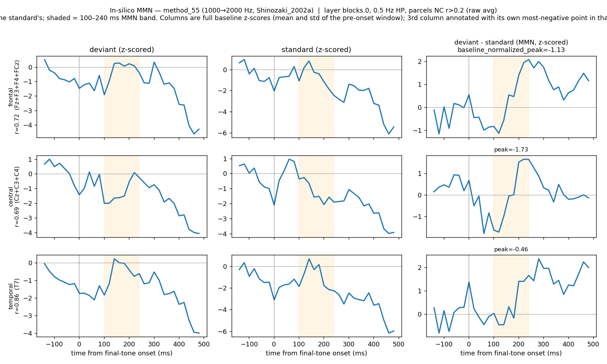
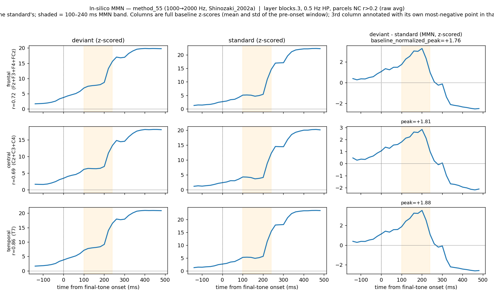
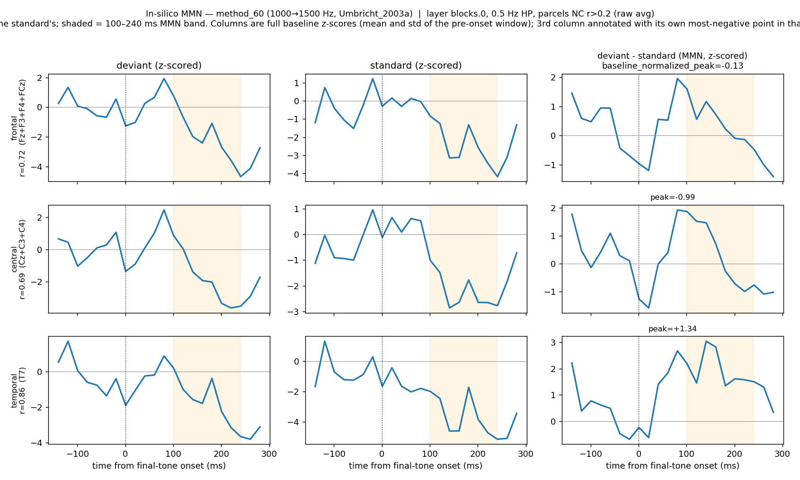
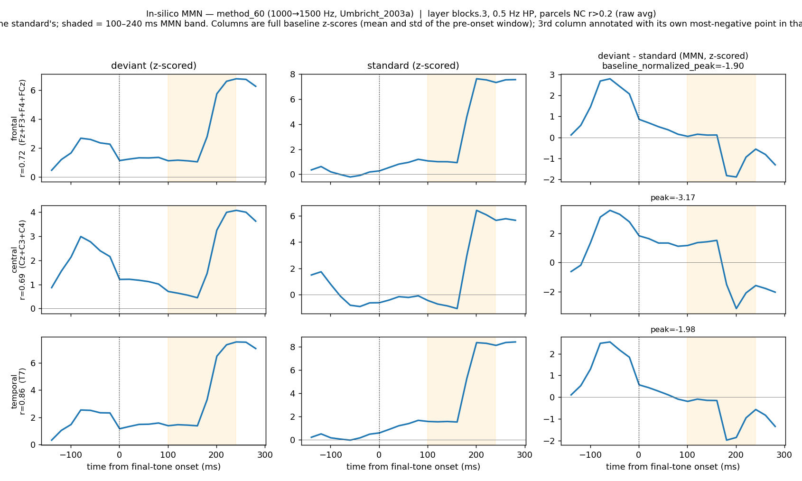

# In-Silico MMN Results Analysis

**Scope:** 4 Whisper models (tiny/base/small/medium) × 2 target levels (parcels, electrodes) ×
10 literature classic-oddball stimulus methods × 2 independent mapping methods (mTRF, encoder)
= 160 (model, level, mapping, method) combinations, all complete (`outputs/results/mmn_results_table.csv`).

## What MMN means

**Mismatch negativity (MMN)** is an auditory event-related potential: a negative-going EEG
deflection, typically ~100–250 ms after an unexpected ("deviant") sound embedded among repeated
("standard") sounds, largest at fronto-central scalp sites (Näätänen et al., 1978; Näätänen &
Picton, 1987; peak ≈170 ms per Sams et al., 1985; window per Umbricht & Krljes, 2005). It reflects
automatic pre-attentive detection of acoustic deviance and is reduced or absent in some clinical
populations (e.g. schizophrenia) — the motivation for using it as an in-silico screening signal
here.

**How this document operationalizes it.** For each (model, level, mapping, method) run:

1. Predict EEG for the deviant-train average and the standard, time-locked to the final/critical
  tone.
2. Z-score each trace within a pre-onset baseline window (3× that stimulus method's SOA).
3. `diff = z(deviant) − z(standard)`; `baseline_normalized_peak` = the most-negative point of
  `diff` within the 100–240 ms post-onset window.
4. **MMN present** (per run, per target) := `baseline_normalized_peak < 0` — the deviant response
  dips below the standard's in that window. "Mean MMN" in the tables below averages that value
   over a fronto-central ROI:
  - **Electrodes:** ROI = `{Fz, FCz, Cz, FC1, FC2, F1, F2}` — the exact ROI already used by
  `insilico_mmn_electrodes.py`'s built-in verdict.
  - **Parcels:** ROI = `{frontal, central}` — the natural parcel-level analog; no parcel-level
  verdict previously existed in the pipeline, so this generalizes the electrode criterion.

This is a **magnitude/negativity criterion only** — it checks that the deviant response dips below
the standard's somewhere in the window, but not that the dip has the characteristic MMN *shape*
(a trough that rises back toward baseline within the window, rather than e.g. the tail of an
unrelated ascending trend). See the shape-criteria caveat below.

This document deliberately does **not** discuss fit quality (encoder probe accuracy on held-out
EEG) — only MMN presence/absence and response magnitude are covered here.

---

## Section 1 — Method A (mTRF)

> **Code:** `scripts/build_mmn_results_table.py` (`python scripts/build_mmn_results_table.py --predictions_root outputs/insilico_mmn_predictions --out outputs/results/mmn_results_table.csv`)
> · **Data:** `outputs/results/mmn_results_table.csv` (raw per-target table; Tables 1a–1e below are
> aggregations — mean/count per model × method × level, filtered to `mapping=="mtrf"` — computed
> directly from it).

**Table 1a. Mean MMN per model × method**

| Model  | Method    | Stimulus name | MMN (parcels) | MMN (electrodes) |
| ------ | --------- | ------------- | ------------- | ---------------- |
| tiny   | method_27 | 1000→1064 Hz  | -0.87         | -0.78            |
| tiny   | method_37 | 1000→1050 Hz  | -0.25         | -0.30            |
| tiny   | method_43 | 633→700 Hz    | -0.61         | -0.49            |
| tiny   | method_44 | 633→1000 Hz   | -1.46         | -1.63            |
| tiny   | method_53 | 1000→1200 Hz  | -1.04         | -0.83            |
| tiny   | method_55 | 1000→2000 Hz  | -1.43         | -1.28            |
| tiny   | method_60 | 1000→1500 Hz  | -0.56         | -0.40            |
| tiny   | method_72 | 1000→1200 Hz  | -0.96         | -0.78            |
| tiny   | method_74 | 1000→1500 Hz  | -0.58         | -0.53            |
| tiny   | method_75 | 1000→1200 Hz  | -0.95         | -0.77            |
| base   | method_27 | 1000→1064 Hz  | -0.01         | +0.02            |
| base   | method_37 | 1000→1050 Hz  | -0.48         | -0.38            |
| base   | method_43 | 633→700 Hz    | +0.02         | +0.05            |
| base   | method_44 | 633→1000 Hz   | +0.16         | +0.11            |
| base   | method_53 | 1000→1200 Hz  | -0.31         | -0.36            |
| base   | method_55 | 1000→2000 Hz  | -1.44         | -1.42            |
| base   | method_60 | 1000→1500 Hz  | +0.43         | -0.12            |
| base   | method_72 | 1000→1200 Hz  | -0.40         | -0.38            |
| base   | method_74 | 1000→1500 Hz  | -0.06         | -0.06            |
| base   | method_75 | 1000→1200 Hz  | -0.40         | -0.38            |
| small  | method_27 | 1000→1064 Hz  | +0.30         | -0.21            |
| small  | method_37 | 1000→1050 Hz  | -0.21         | -0.20            |
| small  | method_43 | 633→700 Hz    | -0.22         | -0.17            |
| small  | method_44 | 633→1000 Hz   | -0.57         | -0.64            |
| small  | method_53 | 1000→1200 Hz  | -0.48         | -0.18            |
| small  | method_55 | 1000→2000 Hz  | -0.68         | -0.81            |
| small  | method_60 | 1000→1500 Hz  | -0.64         | -0.42            |
| small  | method_72 | 1000→1200 Hz  | -0.20         | -0.13            |
| small  | method_74 | 1000→1500 Hz  | -0.40         | -0.25            |
| small  | method_75 | 1000→1200 Hz  | -0.21         | -0.14            |
| medium | method_27 | 1000→1064 Hz  | -0.29         | -0.28            |
| medium | method_37 | 1000→1050 Hz  | -0.30         | -0.14            |
| medium | method_43 | 633→700 Hz    | -3.26         | -3.76            |
| medium | method_44 | 633→1000 Hz   | -0.41         | -0.74            |
| medium | method_53 | 1000→1200 Hz  | -0.55         | -0.32            |
| medium | method_55 | 1000→2000 Hz  | +0.00         | -0.26            |
| medium | method_60 | 1000→1500 Hz  | -1.33         | -0.61            |
| medium | method_72 | 1000→1200 Hz  | -0.66         | -0.50            |
| medium | method_74 | 1000→1500 Hz  | -0.59         | -0.34            |
| medium | method_75 | 1000→1200 Hz  | -0.63         | -0.49            |

**Table 1b. Per-model MMN count summary** (rows ordered tiny → medium)

| Model  | Parcels (n/10) | Electrodes (n/10) | Total (n/20) |
| ------ | -------------- | ----------------- | ------------ |
| tiny   | 10/10          | 10/10             | 20/20        |
| base   | 7/10           | 7/10              | 14/20        |
| small  | 9/10           | 10/10             | 19/20        |
| medium | 9/10           | 10/10             | 19/20        |

**Table 1c. Per-method average across models** (parcels + electrodes pooled, i.e. averaged over
the 8 model×level cells for that method)

| Method    | Stimulus name | Average MMN/response across models |
| --------- | ------------- | ---------------------------------- |
| method_27 | 1000→1064 Hz  | -0.26                              |
| method_37 | 1000→1050 Hz  | -0.28                              |
| method_43 | 633→700 Hz    | -1.06                              |
| method_44 | 633→1000 Hz   | -0.65                              |
| method_53 | 1000→1200 Hz  | -0.51                              |
| method_55 | 1000→2000 Hz  | -0.91                              |
| method_60 | 1000→1500 Hz  | -0.46                              |
| method_72 | 1000→1200 Hz  | -0.50                              |
| method_74 | 1000→1500 Hz  | -0.35                              |
| method_75 | 1000→1200 Hz  | -0.50                              |

**Table 1d. Per-model average across stimuli** (each method's parcels/electrodes mean pooled
into one value first, then averaged over the 10 methods)

| Model  | Average MMN/response across stimuli | Number of stimuli showing MMN |
| ------ | ----------------------------------- | ----------------------------- |
| tiny   | -0.83                               | 10/10                         |
| base   | -0.27                               | 6/10                          |
| small  | -0.32                               | 9/10                          |
| medium | -0.77                               | 10/10                         |

**Table 1e. Mean MMN per model, averaged across stimuli** (parcels and electrodes kept separate,
unlike Table 1d — each column is that level's mean over the 10 methods)

| Model  | Mean MMN in parcels (avg across stimuli) | Mean MMN in electrodes (avg across stimuli) |
| ------ | ---------------------------------------- | ------------------------------------------- |
| tiny   | -0.87                                    | -0.78                                       |
| base   | -0.25                                    | -0.29                                       |
| small  | -0.33                                    | -0.32                                       |
| medium | -0.80                                    | -0.74                                       |

---

## Section 2 — Method B (encoder)

> **Code:** `scripts/build_mmn_results_table.py` (same invocation as Section 1) · **Data:**
> `outputs/results/mmn_results_table.csv` (same raw table as Section 1; Tables 2a–2e are the
> identical aggregation filtered to `mapping=="encoder"` instead of `"mtrf"`).

**Table 2a. Mean MMN per model × method**

| Model  | Method    | Stimulus name | MMN (parcels) | MMN (electrodes) |
| ------ | --------- | ------------- | ------------- | ---------------- |
| tiny   | method_27 | 1000→1064 Hz  | -0.78         | -0.11            |
| tiny   | method_37 | 1000→1050 Hz  | -0.42         | -0.89            |
| tiny   | method_43 | 633→700 Hz    | +0.28         | +0.06            |
| tiny   | method_44 | 633→1000 Hz   | +0.26         | -0.12            |
| tiny   | method_53 | 1000→1200 Hz  | +0.51         | -1.49            |
| tiny   | method_55 | 1000→2000 Hz  | +1.79         | -0.04            |
| tiny   | method_60 | 1000→1500 Hz  | -2.53         | +1.07            |
| tiny   | method_72 | 1000→1200 Hz  | -6.53         | +0.41            |
| tiny   | method_74 | 1000→1500 Hz  | -0.06         | +0.25            |
| tiny   | method_75 | 1000→1200 Hz  | -6.49         | +0.41            |
| base   | method_27 | 1000→1064 Hz  | +1.63         | -0.48            |
| base   | method_37 | 1000→1050 Hz  | +2.33         | -0.41            |
| base   | method_43 | 633→700 Hz    | -0.17         | -0.45            |
| base   | method_44 | 633→1000 Hz   | -0.77         | +1.15            |
| base   | method_53 | 1000→1200 Hz  | -1.64         | -2.87            |
| base   | method_55 | 1000→2000 Hz  | -2.41         | -0.30            |
| base   | method_60 | 1000→1500 Hz  | +0.72         | -1.17            |
| base   | method_72 | 1000→1200 Hz  | -2.89         | -0.36            |
| base   | method_74 | 1000→1500 Hz  | +1.65         | +0.57            |
| base   | method_75 | 1000→1200 Hz  | -2.91         | -0.37            |
| small  | method_27 | 1000→1064 Hz  | -0.42         | +0.02            |
| small  | method_37 | 1000→1050 Hz  | +0.22         | +0.60            |
| small  | method_43 | 633→700 Hz    | +0.28         | +0.12            |
| small  | method_44 | 633→1000 Hz   | +0.87         | +1.38            |
| small  | method_53 | 1000→1200 Hz  | +0.77         | +0.15            |
| small  | method_55 | 1000→2000 Hz  | -0.30         | -1.25            |
| small  | method_60 | 1000→1500 Hz  | +0.19         | -1.74            |
| small  | method_72 | 1000→1200 Hz  | -0.19         | +1.37            |
| small  | method_74 | 1000→1500 Hz  | +0.34         | +0.04            |
| small  | method_75 | 1000→1200 Hz  | -0.20         | +1.35            |
| medium | method_27 | 1000→1064 Hz  | -0.18         | +0.01            |
| medium | method_37 | 1000→1050 Hz  | -0.30         | +0.48            |
| medium | method_43 | 633→700 Hz    | +0.25         | +0.07            |
| medium | method_44 | 633→1000 Hz   | -1.59         | +0.02            |
| medium | method_53 | 1000→1200 Hz  | -1.02         | -0.97            |
| medium | method_55 | 1000→2000 Hz  | +2.61         | +0.25            |
| medium | method_60 | 1000→1500 Hz  | +1.29         | -2.76            |
| medium | method_72 | 1000→1200 Hz  | -1.06         | -0.10            |
| medium | method_74 | 1000→1500 Hz  | -0.21         | -0.24            |
| medium | method_75 | 1000→1200 Hz  | -1.04         | -0.10            |

**Table 2b. Per-model MMN count summary** (rows ordered tiny → medium)

| Model  | Parcels (n/10) | Electrodes (n/10) | Total (n/20) |
| ------ | -------------- | ----------------- | ------------ |
| tiny   | 6/10           | 5/10              | 11/20        |
| base   | 6/10           | 8/10              | 14/20        |
| small  | 4/10           | 2/10              | 6/20         |
| medium | 7/10           | 5/10              | 12/20        |

**Table 2c. Per-method average across models** (parcels + electrodes pooled, i.e. averaged over
the 8 model×level cells for that method)

| Method    | Stimulus name | Average MMN/response across models |
| --------- | ------------- | ---------------------------------- |
| method_27 | 1000→1064 Hz  | -0.04                              |
| method_37 | 1000→1050 Hz  | +0.20                              |
| method_43 | 633→700 Hz    | +0.06                              |
| method_44 | 633→1000 Hz   | +0.15                              |
| method_53 | 1000→1200 Hz  | -0.82                              |
| method_55 | 1000→2000 Hz  | +0.04                              |
| method_60 | 1000→1500 Hz  | -0.62                              |
| method_72 | 1000→1200 Hz  | -1.17                              |
| method_74 | 1000→1500 Hz  | +0.29                              |
| method_75 | 1000→1200 Hz  | -1.17                              |

**Table 2d. Per-model average across stimuli** (each method's parcels/electrodes mean pooled
into one value first, then averaged over the 10 methods)

| Model  | Average MMN/response across stimuli | Number of stimuli showing MMN |
| ------ | ----------------------------------- | ----------------------------- |
| tiny   | -0.72                               | 6/10                          |
| base   | -0.46                               | 6/10                          |
| small  | +0.18                               | 3/10                          |
| medium | -0.23                               | 7/10                          |

**Table 2e. Mean MMN per model, averaged across stimuli** (parcels and electrodes kept separate,
unlike Table 2d — each column is that level's mean over the 10 methods)

| Model  | Mean MMN in parcels (avg across stimuli) | Mean MMN in electrodes (avg across stimuli) |
| ------ | ---------------------------------------- | ------------------------------------------- |
| tiny   | -1.40                                    | -0.05                                       |
| base   | -0.45                                    | -0.47                                       |
| small  | +0.16                                    | +0.20                                       |
| medium | -0.13                                    | -0.33                                       |

---

## Cross-Method Comparisons

> **Code:** ad hoc pairwise aggregation over `outputs/results/mmn_results_table.csv` (pivoting
> Tables 1a/2a's per-target verdicts to compare `mapping=="mtrf"` vs `mapping=="encoder"` for the
> same model × level × method); no standalone script was saved for this comparison. · **Data:**
> `outputs/results/mmn_results_table.csv` (same file as Sections 1–2).

**Table 3. mTRF vs. encoder agreement** (per model × level, over the 10 methods)

| Model  | Level      | Both MMN | Both no-MMN | Agree | Disagree |
| ------ | ---------- | -------- | ----------- | ----- | -------- |
| tiny   | parcels    | 6        | 0           | 6/10  | 4/10     |
| tiny   | electrodes | 5        | 0           | 5/10  | 5/10     |
| base   | parcels    | 4        | 1           | 5/10  | 5/10     |
| base   | electrodes | 6        | 1           | 7/10  | 3/10     |
| small  | parcels    | 3        | 0           | 3/10  | 7/10     |
| small  | electrodes | 2        | 0           | 2/10  | 8/10     |
| medium | parcels    | 7        | 1           | 8/10  | 2/10     |
| medium | electrodes | 5        | 0           | 5/10  | 5/10     |

**Table 4. Stimulus-method consistency** (MMN count across all 16 model × level × mapping combinations)

| Method    | Stimulus (source)              | mTRF (n/8) | Encoder (n/8) | Total (n/16) |
| --------- | ------------------------------ | ---------- | ------------- | ------------ |
| method_27 | 1000→1064 Hz (Schall_1999a)    | 6/8        | 5/8           | 11/16        |
| method_37 | 1000→1050 Hz (Javitt_2000a)    | 8/8        | 4/8           | 12/16        |
| method_43 | 633→700 Hz (Michie_2000b)      | 6/8        | 2/8           | 8/16         |
| method_44 | 633→1000 Hz (Michie_2000c)     | 6/8        | 3/8           | 9/16         |
| method_53 | 1000→1200 Hz (Salisbury_2002a) | 8/8        | 5/8           | 13/16        |
| method_55 | 1000→2000 Hz (Shinozaki_2002a) | 7/8        | 5/8           | 12/16        |
| method_60 | 1000→1500 Hz (Umbricht_2003a)  | 7/8        | 4/8           | 11/16        |
| method_72 | 1000→1200 Hz (Bodatsch_2011)   | 8/8        | 6/8           | 14/16        |
| method_74 | 1000→1500 Hz (Domjan_2012)     | 8/8        | 3/8           | 11/16        |
| method_75 | 1000→1200 Hz (Karger_2014)     | 8/8        | 6/8           | 14/16        |

---

## Notes & caveats

> **Code:** none new — these are observations synthesized from Sections 1–4 above. · **Data:**
> `outputs/results/mmn_results_table.csv` (Tables 1–4) and `outputs/results/mmn_criteria_comparison.csv`
> (the shape-criterion caveat below, formalized later in Section 4).

- `**whisper-tiny` under mTRF is 100% MMN-positive (20/20)** — every single stimulus method
triggers the criterion at both levels. That is unusually clean compared to every other
model/mapping combination and is worth treating with some skepticism rather than as a strong
positive finding: it may reflect a systematic negative drift in the predicted timecourse
(e.g. baseline-window variance sensitivity, the same mechanism below) rather than 10
independent genuine effects.
- **A handful of encoder runs show extreme mean MMN values** (e.g. `whisper-tiny`/parcels/method_72:
-6.53, method_75: -6.49; `whisper-base`/parcels/method_72: -2.89, method_75: -2.91). Direct
inspection of the underlying figures shows the predicted deviant/standard traces for these
particular (model, method) pairs are smooth monotonic ramps rather than oscillatory
ERP-like shapes; the pre-onset baseline sits on the near-flat part of that ramp, so its variance
is tiny and the z-scored peak metric is inflated by dividing by a near-zero baseline std. This
is a property of those specific predicted-response shapes interacting with the z-scoring
metric, not a data-pipeline bug — but it means these particular cells shouldn't be read as
"10x stronger MMN" in a literal sense.
  - `whisper-medium`/electrodes/mTRF/method_43 (-3.76) is the analogous case on the mTRF side.
- **The threshold is exactly 0**, so several verdicts are marginal (e.g. `base`/method_27/parcels
mTRF: -0.01; `base`/method_43/parcels mTRF: +0.02). Treat rows within roughly ±0.1 of zero as
"no clear evidence either way" rather than a confident verdict.
- **mTRF is far more uniformly MMN-positive than the encoder** (Table 1b/2b totals: mTRF ranges
14–20/20 per model; encoder ranges 6–14/20). Table 3 shows agreement between the two mappings
is generally weak-to-moderate (2–8 out of 10 per model/level), so the two independent mapping
methods are not strongly corroborating each other's verdicts at the individual-method level —
worth investigating further before treating either mapping's verdict as ground truth.
- Fit quality (encoder probe accuracy on held-out EEG) is intentionally excluded from this
document per request; these tables describe MMN presence/absence and response magnitude only.
- **Stimulus sources are provisional, not yet fully vetted.** The 10 methods were selected to get
the pipeline running end-to-end, with the expectation that 1–2 may be swapped in/out later once
the literature list is reviewed more carefully. Current inclusion criteria: most recent
publication year per paper, only one method permitted per paper, frequency variants only
(no duration/intensity deviants in this round). Treat the per-method rows (Tables 1a/1c/2a/2c,
Table 4) as more provisional than the per-model rollups (1b/1d/1e/2b/2d/2e) — a future swap could
shift individual method rows without necessarily changing the overall per-model picture much, or
could change it a lot; this hasn't been stress-tested.
- **The magnitude criterion can be satisfied by curve shapes that aren't a real MMN trough.**
Because `baseline_normalized_peak` is just "most negative point in the 100–240 ms window," it
doesn't distinguish a genuine dip-and-recover trough from e.g. a monotonically ascending (or
descending) curve that simply happens to be most negative right at the window's edge — in which
case the "peak" is really just wherever the window cut off an unrelated trend, not a deviance
response. The smooth-ramp cases already flagged above (`whisper-tiny`/`whisper-base` encoder
parcels, several methods) are examples of this: visually, those curves don't dip-and-recover, they
ramp through the window. **Open question: should a shape-based criterion be added** (e.g. require
the window's minimum to fall strictly inside the window rather than at either edge, and/or require
the curve to rise back toward baseline after the trough by some margin)? This would need the full
per-time-point curves (saved in the prediction h5s on jed, not in the local CSV) rather than just
the scalar `peak`/`n7v1_peak` already extracted — not yet implemented, flagging for discussion
before deciding whether to add it.

---

## Section 3 — Pre-tone baseline window comparison (excluding the N-1 tone window to prevent leakage)

> **Code:** ad hoc paired comparison between the two CSVs below (Pearson/Spearman correlation,
> sign agreement, per-method and per-mapping breakdowns); no standalone script was saved for this
> comparison. · **Data:** `outputs/results/mmn_results_table.csv` (original 3-tone baseline) and
> `outputs_new_pre_tone_baseline/results/mmn_results_table.csv` (new 2-tone baseline, built by the
> same `scripts/build_mmn_results_table.py` against a separate `outputs_new_pre_tone_baseline/`
> predictions tree).

### Rationale

The baseline window used for z-scoring (`finalize_method()`) originally spanned the 4th-, 3rd-,
and 2nd-to-last tone before the critical tone (`[-3×SOA, 0)`). The 2nd-to-last tone (N-1) sits
immediately before the critical-tone onset, and EEG responses to a tone often include a large
negative dip of their own — so including N-1 in the "quiet" baseline risks leaking some of that
response's amplitude into the baseline statistics. Because the MMN verdict is itself a *trough*
(a negative deflection), a baseline that is already partly dipping could systematically work
against detecting the deviant's trough (i.e. disadvantage the observed MMN). This comparison
tests whether dropping the N-1 tone from the baseline changes the results.

### Setup

Both runs are otherwise identical (same models, stimuli, mapping methods, lag/window settings) —
the only change is the baseline window passed to `finalize_method()`:

| Run                                    | Baseline window    | Tones included                |
| -------------------------------------- | ------------------ | ----------------------------- |
| `outputs/` (original)                  | `[-3×SOA, 0)`      | N-2, N-3, N-4 (3 tones)       |
| `outputs_new_pre_tone_baseline/` (new) | `[-3×SOA, -1×SOA)` | N-2, N-3 (2 tones, drops N-1) |

Both result tables (`outputs/results/mmn_results_table.csv`,
`outputs_new_pre_tone_baseline/results/mmn_results_table.csv`) have identical shape — 160 rows
(4 models × {parcels, electrodes} × {mTRF, encoder} × 10 methods) — so every run lines up 1:1
for a paired comparison.

### Headline numbers

**Table 5. Overall agreement between the two baseline windows**

| Comparison                                                         | Value     |
| ------------------------------------------------------------------ | --------- |
| Paired electrode/parcel peak values compared                       | 4160      |
| Pearson r, all paired peak values (raw)                            | 0.32      |
| Pearson r, all paired peak values (excl. 1 outlier run, see below) | 0.79      |
| Spearman ρ, all paired peak values                                 | 0.82      |
| Sign agreement (MMN present/absent), electrode/parcel level (raw)  | 92.8%     |
| Sign agreement, electrode/parcel level (excl. outlier run)         | 93.7%     |
| ROI-level verdict flips (frontal+central mean, 80 runs)            | 4/80 (5%) |
| MMN-present count, ROI level — original baseline                   | 58/80     |
| MMN-present count, ROI level — new baseline                        | 58/80     |

**Table 6. Per-mapping agreement (ROI-mean peak, excluding the 1 outlier run)**

| Mapping | n runs | Pearson r | Mean |diff| |
| ------- | ------ | --------- | ----------- |
| mTRF    | 40     | 0.97      | 0.10        |
| Encoder | 39     | 0.76      | 0.90        |

**Table 7. The 4 runs whose ROI-level verdict flips**

| Model          | Level   | Mapping | Method    | Peak (original) | Peak (new) |
| -------------- | ------- | ------- | --------- | --------------- | ---------- |
| whisper-base   | parcels | encoder | method_55 | -2.41           | +3.61      |
| whisper-medium | parcels | mtrf    | method_55 | +0.00           | -0.10      |
| whisper-tiny   | parcels | encoder | method_44 | +0.26           | -0.66      |
| whisper-tiny   | parcels | encoder | method_60 | -2.53           | +1.24      |

**Table 8. Per-method sensitivity to the baseline window** (mean/max |diff| across all
electrode+parcel peak columns, pooled over models and mappings, n=416 values per method)

| Method    | Stimulus name | SOA (ms) | Mean |diff| | Max |diff| |
| --------- | ------------- | -------- | ----------- | ---------- |
| method_53 | 1000→1200 Hz  | 333      | 3.13        | 37.50      |
| method_60 | 1000→1500 Hz  | 300      | 1.02        | 5.90       |
| method_37 | 1000→1050 Hz  | 310      | 0.63        | 7.53       |
| method_55 | 1000→2000 Hz  | 500      | 0.38        | 6.50       |
| method_27 | 1000→1064 Hz  | 900      | 0.36        | 3.42       |
| method_72 | 1000→1200 Hz  | 500      | 0.25        | 1.55       |
| method_75 | 1000→1200 Hz  | 500      | 0.24        | 1.47       |
| method_74 | 1000→1500 Hz  | 1000     | 0.23        | 1.83       |
| method_44 | 633→1000 Hz   | 510      | 0.23        | 1.75       |
| method_43 | 633→700 Hz    | 510      | 0.20        | 1.89       |

### Per-mapping breakdown (parcels/electrodes × mTRF/encoder)

Same "before" (original 3-tone baseline) vs. "now" (new 2-tone baseline excluding N-1) comparison
as Table 5, but broken out per mapping method instead of pooled, with explicit delta columns
(`now − before`). Mean MMN is the ROI-mean `baseline_normalized_peak` (frontal+central for
parcels; Fz/FCz/Cz/FC2/F1/F2 for electrodes — FC1 isn't present in this montage), averaged over
the 10 stimulus methods; the count column is how many of those 10 methods are MMN-present
(ROI-mean peak < 0).

**Table 9. Parcels — mTRF**

| Model  | Mean MMN (before) | Mean MMN (now) | Δ mean MMN | MMN count (before, /10) | MMN count (now, /10) | Δ count |
| ------ | ----------------- | -------------- | ---------- | ----------------------- | -------------------- | ------- |
| tiny   | -0.87             | -0.83          | +0.04      | 10/10                   | 10/10                | 0       |
| base   | -0.25             | -0.25          | -0.00      | 7/10                    | 7/10                 | 0       |
| small  | -0.33             | -0.35          | -0.02      | 9/10                    | 9/10                 | 0       |
| medium | -0.80             | -1.02          | -0.21      | 9/10                    | 10/10                | +1      |

**Table 10. Parcels — encoder**

| Model  | Mean MMN (before) | Mean MMN (now) | Δ mean MMN | MMN count (before, /10) | MMN count (now, /10) | Δ count |
| ------ | ----------------- | -------------- | ---------- | ----------------------- | -------------------- | ------- |
| tiny   | -1.40             | -0.81          | +0.59      | 6/10                    | 6/10                 | 0       |
| base   | -0.45             | +0.58          | +1.03      | 6/10                    | 5/10                 | -1      |
| small  | +0.16             | +0.66          | +0.50      | 4/10                    | 4/10                 | 0       |
| medium | -0.13             | -0.20          | -0.07      | 7/10                    | 7/10                 | 0       |

**Table 11. Electrodes — mTRF**

| Model  | Mean MMN (before) | Mean MMN (now) | Δ mean MMN | MMN count (before, /10) | MMN count (now, /10) | Δ count |
| ------ | ----------------- | -------------- | ---------- | ----------------------- | -------------------- | ------- |
| tiny   | -0.78             | -0.78          | +0.00      | 10/10                   | 10/10                | 0       |
| base   | -0.29             | -0.33          | -0.04      | 7/10                    | 7/10                 | 0       |
| small  | -0.32             | -0.34          | -0.03      | 10/10                   | 10/10                | 0       |
| medium | -0.74             | -0.97          | -0.22      | 10/10                   | 10/10                | 0       |

**Table 12. Electrodes — encoder**

| Model  | Mean MMN (before) | Mean MMN (now) | Δ mean MMN | MMN count (before, /10) | MMN count (now, /10) | Δ count |
| ------ | ----------------- | -------------- | ---------- | ----------------------- | -------------------- | ------- |
| tiny   | -0.05             | +1.17          | +1.22      | 5/10                    | 4/10                 | -1      |
| base   | -0.47             | -0.30          | +0.17      | 8/10                    | 7/10                 | -1      |
| small  | +0.20             | +0.37          | +0.17      | 2/10                    | 2/10                 | 0       |
| medium | -0.33             | -0.14          | +0.19      | 5/10                    | 7/10                 | +2      |

Mirrors the pooled finding: **mTRF is essentially baseline-window-invariant** (Tables 9/11 — all
Δ count = 0 except one +1, Δ mean MMN mostly under 0.05 in magnitude except `medium`), while
**encoder shows larger swings in mean magnitude and more count flips** (Tables 10/12), consistent
with the z-score-denominator instability described below being concentrated in the encoder mapping.

### Structural risk

- Dropping the N-1 tone shrinks the baseline to 2 tone-cycles instead of 3, so the z-score's
baseline SD is estimated from fewer samples — for one run (`whisper-tiny`/encoder/`method_53`)
this denominator collapsed ~5× (confirmed directly in the raw prediction h5), flipping the sign
and inflating the peak by an order of magnitude; short-SOA, encoder-mapped runs are the most
exposed to this failure mode.

---

## Section 4 — Comparison of different possible MMN shape metrics using existing ROI definitions

> **Code:** `scripts/analyze_mmn_criteria.py` (`python scripts/analyze_mmn_criteria.py --predictions_root outputs/insilico_mmn_predictions --out outputs/results/mmn_criteria_comparison.csv`)
> · **Data:** `outputs/results/mmn_criteria_comparison.csv` (per-run) and
> `outputs/results/mmn_criteria_comparison__per_target.csv` (per-target detail).
> · **S5/S6 code:** `scripts/analyze_mmn_criteria_s5_s6.py` (`--roi_variant current`) ·
> **S5/S6 data:** `outputs/results/mmn_criteria_s5_s6.csv`.

### Metric definitions

C0–S3 share the same magnitude gate (the windowed trough must be `< 0`) and are evaluated on the
same ROI-mean z-scored `deviant − standard` curve over the current 100–240 ms window
(`{frontal, central}` for parcels, `{Fz, FCz, Cz, FC1, FC2, F1, F2}` for electrodes); C0 is the
metric already used everywhere else in this document. S4 and S5/S6 search outside this fixed
window — S4 over a per-method, tone-end-relative window; S5/S6 over the entire post-onset trace —
so they are not "the same window," just the same underlying ROI-mean trace.

| ID     | Name                             | Definition                                                                                                                                                                                                                                                                                                                                                                                                                                                                                                                                                                                         |
| ------ | -------------------------------- | -------------------------------------------------------------------------------------------------------------------------------------------------------------------------------------------------------------------------------------------------------------------------------------------------------------------------------------------------------------------------------------------------------------------------------------------------------------------------------------------------------------------------------------------------------------------------------------------------- |
| **C0** | current (magnitude only)         | The most negative point of the curve in the 100–240 ms window is below 0. No shape requirement.                                                                                                                                                                                                                                                                                                                                                                                                                                                                                                    |
| **S1** | interior argmin                  | Like C0, plus the trough may not sit at either edge of the window — it must be at least one time-bin inside both the 100 ms and 240 ms boundaries.                                                                                                                                                                                                                                                                                                                                                                                                                                                 |
| **S2** | trough + recovery                | Like C0, plus after the trough the curve must climb back up by at least 50% of the trough's depth within 120 ms (a genuine dip-and-recover, not a caurve still descending).                                                                                                                                                                                                                                                                                                                                                                                                                        |
| **S3** | interior & recovery              | S1 **and** S2 both required.                                                                                                                                                                                                                                                                                                                                                                                                                                                                                                                                                                       |
| **S4** | tone-end-relative dip + recovery | Per method, using the final/critical tone's real duration (`tone_end_ms`, looked up by `method_id` from `data/metadata/literature_frequency_intensity_duration_metadata.csv`): scans **every sample** — not just a window's argmin — in `[tone_end_ms, tone_end_ms+250]` for one that dips below 0 and recovers ≥50% of its own depth by the **absolute** deadline `tone_end_ms+400` (clipped to `t.max()`). True if **any** sample qualifies; does not require the qualifying point to be the window's most negative point. Supersedes a retired control-window-specificity test (see Rationale). |
| **S5** | unbound dip + recovery           | Like S2 (trough + recovery), but the trough search is not restricted to the 100–240 ms window — it runs over the entire available post-onset trace (`[0, t.max()]`, where `t.max()` varies by run/method, ≈281–981 ms across the 160 runs). Recovery is now checked against the same **absolute** deadline as S4 (`tone_end_ms+400`, clipped to `t.max()`) instead of a fixed 120 ms window after the trough.                                                                                                                                                                                      |
| **S6** | envelope-guarded unbound search  | Like S5 (now deadline-bound), plus the located trough's latency must fall inside a literature-derived plausibility envelope (default 90–250 ms, the union across the 10 source papers' own MMN windows — see `aux/mmn_criterion_investigation.md`).                                                                                                                                                                                                                                                                                                                                                |

### Relationship between criteria

- **S6 ⊆ S5 — guaranteed, by construction.** S6 is literally `S5 AND (90 ≤ global_argmin_ms ≤ 250)`; adding an AND condition can only narrow the true set, never widen it. Every S6-true run
is necessarily S5-true; the reverse does not hold.
- **S2 vs. S5 — NOT a subset relationship either direction**, despite S5 looking like "S2 with a
wider window." The reason: both criteria locate *their own* trough first (argmin within
whichever window), then check recovery *from that specific point*. Widening the search window
can relocate the trough entirely — so a run can flip either way (S2-true/S5-false, or
S2-false/S5-true), not just gain positives.

### Rationale

The magnitude-only criterion (C0) used everywhere above is satisfied by any curve whose
lowest point in the window is negative — it cannot distinguish a genuine MMN dip-and-recover
from a curve that is simply still ramping downward when the window cuts off (see the
"magnitude criterion can be satisfied by curve shapes that aren't a real MMN trough" caveat
above). A handful of runs already flagged as extreme outliers (e.g. `whisper-tiny`/encoder/
parcels/`method_72`/`method_75`, peaks ≈ −6.5) turned out on inspection to be smooth monotonic
ramps rather than oscillatory MMN-like responses, with their true (much later) trough sitting
outside the scored window. `aux/mmn_criterion_investigation.md` worked through candidate shape-aware criteria to catch this systematically; this section reports the actual counts from running those criteria over all 160 runs, on the existing 100–240 ms window and ROI definitions (the window itself is not varied — see that document's Q2 for why it was kept as-is). S4/S5/S6 (added below) directly target this limitation: S4 by scanning a per-method, tone-end-relative window for any qualifying dip-and-recover sample (not just the deepest one), S5/S6 by searching the entire available post-onset trace instead of the fixed window, with S6 additionally guarding against implausibly early/late "troughs" the unbound search can otherwise pick up (e.g. baseline-noise spikes near t≈0). Note also that 3 of the 10 methods in use (37, 53, 60 — 50–100 ms tones) have `t.max()` shorter than `tone_end_ms+400`, so their S4 dip window and S5/S6 recovery deadline get clipped to `t.max()` for every run using those methods (48/160 rows, consistently across all models/mappings) — this is expected, not a bug.

### Results — mTRF

**Table 13. MMN-present counts per criterion, by model** (n/20 = parcels + electrodes pooled, 10 methods each)

| Model            | C0 (n/20) | S1 (n/20) | S2 (n/20) | S3 (n/20) | S4 (n/20) | S5 (n/20) | S6 (n/20) |
| ---------------- | --------- | --------- | --------- | --------- | --------- | --------- | --------- |
| tiny             | 20/20     | 8/20      | 17/20     | 8/20      | 18/20     | 19/20     | 10/20     |
| base             | 12/20     | 4/20      | 12/20     | 4/20      | 16/20     | 15/20     | 7/20      |
| small            | 19/20     | 11/20     | 19/20     | 11/20     | 20/20     | 17/20     | 6/20      |
| medium           | 19/20     | 17/20     | 17/20     | 15/20     | 19/20     | 14/20     | 9/20      |
| **Total (n/80)** | **70/80** | **40/80** | **65/80** | **38/80** | **73/80** | **65/80** | **32/80** |

### Results — Encoder

**Table 14. MMN-present counts per criterion, by model** (n/20 = parcels + electrodes pooled, 10 methods each)

| Model            | C0 (n/20) | S1 (n/20) | S2 (n/20) | S3 (n/20) | S4 (n/20) | S5 (n/20) | S6 (n/20) |
| ---------------- | --------- | --------- | --------- | --------- | --------- | --------- | --------- |
| tiny             | 11/20     | 4/20      | 3/20      | 2/20      | 6/20      | 4/20      | 2/20      |
| base             | 13/20     | 6/20      | 9/20      | 4/20      | 10/20     | 10/20     | 4/20      |
| small            | 6/20      | 3/20      | 4/20      | 2/20      | 5/20      | 2/20      | 0/20      |
| medium           | 12/20     | 2/20      | 0/20      | 0/20      | 5/20      | 6/20      | 1/20      |
| **Total (n/80)** | **42/80** | **15/80** | **16/80** | **8/80**  | **26/80** | **22/80** | **7/80**  |

### Summary

- **Encoder counts collapse far more under shape gating than mTRF.** Under the recommended
S2 criterion, mTRF retains 65/70 (93%) of its C0-positive runs, but encoder retains only
16/42 (38%) — consistent with the earlier suspicion that a larger share of the encoder's
magnitude-only "MMN present" verdicts are non-MMN-shaped curves (ramps), not genuine troughs.
- **S1/S3 (interior-only) penalize mTRF disproportionately** (70→40 and 70→38) compared to
S2/S4 (70→65 and **70→73**) — several genuine mTRF troughs sit right at the window's 100 ms
edge and get wrongly rejected by an interior-only test, and the redefined S4 is now *more*
permissive than S2 for mTRF (it no longer requires the qualifying dip to be the deepest point
in its window), reinforcing rather than just matching the case for preferring S2/S4 over S1/S3,
per the recommendation in `aux/mmn_criterion_investigation.md`.
- **4 of the 5 previously flagged smooth-ramp cases behave exactly as predicted** — all four
`whisper-{tiny,base}`/parcels/encoder/`method_{72,75}` runs reject under every shape criterion,
including the redefined S4 (no sample in their tone-end-relative dip window ever recovers). The
fifth, `whisper-medium`/electrodes/mTRF/`method_43`, unexpectedly stays **present under all of
S1–S4** (global trough at 171 ms; new-S4 qualifying sample at 50.9 ms) — same anomaly as before,
now also confirmed under the redefined S4, and still worth a second look at that specific trace.
- **All 3 clear-trough sanity checks stay present under S2 and the redefined S4**, including
`whisper-base`/mTRF/parcels/`method_55` (S1/S3-failing edge trough at 100 ms, but an S4-
qualifying sample at 80.9 ms) — the concrete real-data example that rules out S1/S3 as a
standalone criterion.
- **S5 (now deadline-bound) rescues 8/160 runs** that C0 missed entirely — fewer than the
13/160 reported under the old fixed-120ms recovery rule, because some previously-rescued
troughs sit close to or past their method's `tone_end_ms+400` deadline. E.g.
`whisper-tiny`/parcels/encoder/`method_44` still rescues (current_peak=+0.26 → global_peak=
−1.03 at 31 ms, recovering well inside its 300.9 ms deadline); `whisper-base`/electrodes/mtrf/
`method_44` is a new rescue (+0.19 → −0.36 at 51 ms). mTRF retains far more under S5 than C0
alone would predict (65/80 vs 70/80 C0 — close, unlike before), while encoder's S5 count
(22/80) remains *lower* than its C0 count (42/80) — the unbound search, now deadline-gated,
still finds fewer encoder runs with genuine recovering troughs than the windowed
magnitude-only test flags as "present."
- **S6's envelope guard rejects 48/87 (55%) of S5-positive runs** — down from the old 61%,
since the deadline-bound recovery test itself already screens out some of the spurious
early/late troughs that previously relied on the envelope to be caught.
- **The mTRF-vs-encoder gap persists under the redefined S5/S6**: mTRF retains 32/65 (49%) of
its S5-positives after the envelope guard vs encoder's 7/22 (32%) — and as an absolute share of
all runs, mTRF S6=32/80 (40%) vs encoder S6=7/80 (8.75%), a gap comparable in size to the old
one, now on different underlying S5 numbers.
- **Flagged-case re-check under the redefined S4/S5/S6**: all 4 confirmed smooth ramps
(`whisper-{tiny,base}`/parcels/encoder/`method_{72,75}`) **reject under S4, S5, and S6** —
their true (later) trough at 301–321 ms is more negative than the windowed peak with no
qualifying recovery by any deadline (e.g. `method_72`: current_peak=−6.53 → global_peak=−8.60,
still descending), confirming these are genuine non-recovering ramps. The 5th flagged case,
`whisper-medium`/electrodes/mTRF/`method_43`, **stays present under S4, S5, and S6** (global
trough at 171 ms identical to its current-window trough). All 3 clear-trough sanity checks
also stay present under S4/S5/S6 — unchanged conclusion, now resting on the new machinery.

---

## Section 5 — ROI sensitivity comparison

> **Code:** `scripts/analyze_mmn_roi_variants.py` (`python scripts/analyze_mmn_roi_variants.py --predictions_root outputs/insilico_mmn_predictions --out outputs/results/mmn_roi_variants.csv`)
> · **Data:** `outputs/results/mmn_roi_variants.csv`.

### ROI definitions

| Level      | Variant    | Definition                                                                        |
| ---------- | ---------- | --------------------------------------------------------------------------------- |
| Electrodes | `Fz`       | Single electrode                                                                  |
| Electrodes | `FCz`      | Single electrode                                                                  |
| Electrodes | `Fz_FCz`   | Mean of `Fz`, `FCz`                                                               |
| Electrodes | `current7` | `{Fz, FCz, Cz, FC1, FC2, F1, F2}` — the ROI used everywhere else in this document |
| Parcels    | `frontal`  | Single parcel                                                                     |
| Parcels    | `temporal` | Single parcel                                                                     |
| Parcels    | `central`  | Single parcel                                                                     |
| Parcels    | `current2` | `{frontal, central}` — the ROI used everywhere else in this document              |

### Rationale

The MMN literature more commonly reports a single best-performing electrode (Fz or FCz) rather
than an averaged scalp ROI, and MMN's intracranial generators include auditory/temporal cortex
even though the classic scalp topography is fronto-central. This section checks whether the
broader averaged ROI used elsewhere in this document (`current7`/`current2`) dilutes or
stabilizes the magnitude-only (C0) verdict relative to single canonical sites, on the same
100–240 ms window and the same 160 runs.

### Results — present-count by ROI variant (n/10 methods per model; n/40 total per mapping)

**Table 15. Electrodes, mTRF**

| Model            | Fz        | FCz       | Fz_FCz    | current7  |
| ---------------- | --------- | --------- | --------- | --------- |
| tiny             | 10/10     | 10/10     | 10/10     | 10/10     |
| base             | 6/10      | 6/10      | 6/10      | 6/10      |
| small            | 9/10      | 10/10     | 9/10      | 10/10     |
| medium           | 9/10      | 10/10     | 10/10     | 10/10     |
| **Total (n/40)** | **34/40** | **36/40** | **35/40** | **36/40** |

**Table 16. Electrodes, Encoder**

| Model            | Fz        | FCz       | Fz_FCz    | current7  |
| ---------------- | --------- | --------- | --------- | --------- |
| tiny             | 5/10      | 5/10      | 4/10      | 5/10      |
| base             | 7/10      | 6/10      | 7/10      | 7/10      |
| small            | 4/10      | 3/10      | 3/10      | 2/10      |
| medium           | 7/10      | 5/10      | 6/10      | 5/10      |
| **Total (n/40)** | **23/40** | **19/40** | **20/40** | **19/40** |

**Table 17. Parcels, mTRF**

| Model            | frontal   | temporal  | central   | current2  |
| ---------------- | --------- | --------- | --------- | --------- |
| tiny             | 10/10     | 9/10      | 10/10     | 10/10     |
| base             | 8/10      | 8/10      | 6/10      | 6/10      |
| small            | 6/10      | 6/10      | 9/10      | 9/10      |
| medium           | 9/10      | 9/10      | 10/10     | 9/10      |
| **Total (n/40)** | **33/40** | **32/40** | **35/40** | **34/40** |

**Table 18. Parcels, Encoder**

| Model            | frontal   | temporal  | central   | current2  |
| ---------------- | --------- | --------- | --------- | --------- |
| tiny             | 6/10      | 6/10      | 7/10      | 6/10      |
| base             | 6/10      | 5/10      | 6/10      | 6/10      |
| small            | 4/10      | 4/10      | 5/10      | 4/10      |
| medium           | 7/10      | 7/10      | 7/10      | 7/10      |
| **Total (n/40)** | **23/40** | **22/40** | **25/40** | **23/40** |

**Table 23. Electrodes, combined (mTRF + Encoder)** (Table 15 + Table 16, n/20 per model)

| Model            | Fz        | FCz       | Fz_FCz    | current7  |
| ---------------- | --------- | --------- | --------- | --------- |
| tiny             | 15/20     | 15/20     | 14/20     | 15/20     |
| base             | 13/20     | 12/20     | 13/20     | 13/20     |
| small            | 13/20     | 13/20     | 12/20     | 12/20     |
| medium           | 16/20     | 15/20     | 16/20     | 15/20     |
| **Total (n/80)** | **57/80** | **55/80** | **55/80** | **55/80** |

Winner: Fz (using C0)  

**Table 24. Parcels, combined (mTRF + Encoder)** (Table 17 + Table 18, n/20 per model)

| Model            | frontal   | temporal  | central   | current2  |
| ---------------- | --------- | --------- | --------- | --------- |
| tiny             | 16/20     | 15/20     | 17/20     | 16/20     |
| base             | 14/20     | 13/20     | 12/20     | 12/20     |
| small            | 10/20     | 10/20     | 14/20     | 13/20     |
| medium           | 16/20     | 16/20     | 17/20     | 16/20     |
| **Total (n/80)** | **56/80** | **54/80** | **60/80** | **57/80** |

Winner: Central (using C0)  

Continuous-magnitude check (mean peak across the 10 methods per model)

**Table 19. Electrodes, mTRF**

| Model   | Fz        | FCz       | Fz_FCz    | current7  |
| ------- | --------- | --------- | --------- | --------- |
| tiny    | -0.70     | -0.84     | -0.74     | -0.70     |
| base    | -0.28     | -0.28     | -0.28     | -0.21     |
| small   | -0.40     | -0.48     | -0.43     | -0.27     |
| medium  | -0.59     | -0.78     | -0.67     | -0.63     |
| **avg** | **-0.49** | **-0.59** | **-0.53** | **-0.45** |

**Table 20. Electrodes, Encoder**

| Model   | Fz        | FCz       | Fz_FCz    | current7  |
| ------- | --------- | --------- | --------- | --------- |
| tiny    | -0.06     | +0.03     | -0.01     | +0.07     |
| base    | -0.07     | -0.12     | -0.08     | -0.29     |
| small   | +0.10     | +0.42     | +0.29     | +0.30     |
| medium  | -0.47     | -0.32     | -0.39     | -0.14     |
| **avg** | **-0.12** | **+0.00** | **-0.05** | **-0.01** |

**Table 21. Parcels, mTRF**

| Model   | frontal   | temporal  | central   | current2  |
| ------- | --------- | --------- | --------- | --------- |
| tiny    | -0.86     | -0.50     | -0.89     | -0.83     |
| base    | -0.29     | -0.24     | -0.20     | -0.18     |
| small   | -0.13     | -0.12     | -0.54     | -0.30     |
| medium  | -0.85     | -0.84     | -0.75     | -0.76     |
| **avg** | **-0.53** | **-0.43** | **-0.60** | **-0.52** |

**Table 22. Parcels, Encoder**

| Model   | frontal   | temporal  | central   | current2  |
| ------- | --------- | --------- | --------- | --------- |
| tiny    | -1.22     | -1.22     | -1.57     | -1.39     |
| base    | +0.16     | +0.34     | -1.05     | -0.42     |
| small   | +0.14     | +0.19     | +0.17     | +0.17     |
| medium  | -0.12     | -0.21     | -0.13     | -0.13     |
| **avg** | **-0.26** | **-0.23** | **-0.65** | **-0.44** |

### Agreement with the current ROI (Pearson r on peak, pooled across applicable runs)

| Comparison           | n   | r      |
| -------------------- | --- | ------ |
| current7 vs Fz       | 80  | +0.764 |
| current7 vs FCz      | 80  | +0.947 |
| current7 vs Fz_FCz   | 80  | +0.927 |
| current2 vs frontal  | 80  | +0.962 |
| current2 vs temporal | 80  | +0.932 |
| current2 vs central  | 80  | +0.971 |

### Disagreement lists

**Fz vs FCz sign disagreement** (12 of 80 electrode runs, 15%):

| Model  | Mapping | Method    | Fz        | FCz       |
| ------ | ------- | --------- | --------- | --------- |
| base   | encoder | method_27 | +0.31     | -0.46     |
| base   | encoder | method_37 | -0.20     | +0.21     |
| base   | encoder | method_60 | -0.95     | +0.71     |
| base   | mtrf    | method_60 | -0.88     | +0.27     |
| base   | mtrf    | method_74 | +0.17     | -0.03     |
| medium | encoder | method_27 | -0.06     | +0.02     |
| medium | encoder | method_44 | -0.21     | +0.33     |
| medium | mtrf    | method_37 | +0.04     | -0.22     |
| small  | encoder | method_43 | -0.07     | +0.36     |
| small  | mtrf    | method_27 | +0.35     | -0.04     |
| tiny   | encoder | method_55 | +0.14     | -0.06     |
| tiny   | encoder | method_60 | **-1.02** | **+2.96** |

**frontal/temporal/central sign disagreement** (14 of 80 parcel runs, 17.5%):

| Model  | Mapping | Method    | frontal | temporal | central   |
| ------ | ------- | --------- | ------- | -------- | --------- |
| base   | encoder | method_53 | -0.39   | +0.08    | **-2.88** |
| base   | mtrf    | method_27 | -0.04   | -0.01    | +0.02     |
| base   | mtrf    | method_43 | +0.06   | +0.05    | -0.01     |
| base   | mtrf    | method_44 | -0.13   | -0.06    | +0.46     |
| base   | mtrf    | method_74 | -0.14   | -0.27    | +0.03     |
| medium | mtrf    | method_55 | +0.05   | +0.11    | -0.04     |
| small  | encoder | method_37 | -0.25   | -0.10    | +0.69     |
| small  | encoder | method_55 | +0.04   | +0.05    | -0.65     |
| small  | encoder | method_60 | +0.44   | +0.79    | -0.06     |
| small  | mtrf    | method_72 | +0.08   | +0.01    | -0.49     |
| small  | mtrf    | method_74 | +0.12   | +0.16    | -0.92     |
| small  | mtrf    | method_75 | +0.08   | +0.00    | -0.50     |
| tiny   | encoder | method_44 | +0.62   | +0.69    | -0.11     |
| tiny   | mtrf    | method_60 | -0.13   | +1.34    | -0.99     |

### Summary

- **The continuous magnitude is largely ROI-invariant.** Every single-site/single-parcel variant
correlates with its current multi-site ROI at r ≥ 0.76 (electrodes) or r ≥ 0.93 (parcels), pooled
across all 80 applicable runs each — the ROI choice is not driving wholesale disagreement in the
underlying signal.
- **FCz tracks `current7` almost exactly (r=0.947); Fz is the outlier (r=0.764), and is also where
the present-count diverges most** — in encoder/electrodes, Fz is present in 23/40 vs. 19/40 for
FCz/current7, a 4-run (10%) swing entirely driven by Fz, not FCz. If a single canonical site were
chosen for this dataset, FCz is the closer match to the existing multi-site ROI than Fz.
- **Parcels are more interchangeable than electrodes.** All three parcel variants sit within
r ≥ 0.93 of `current2`, and present-counts cluster tightly (32–35/40 mTRF, 22–25/40 encoder) — no
single parcel stands out as systematically different, including `temporal`, despite it being the
one parcel most tied to MMN's intracranial auditory generators rather than the scalp-projected
fronto-central topography.
- **Sign disagreements are a real minority effect, not pure borderline noise.** ~15–18% of runs
flip sign between single-site/parcel choices, and a handful are large, not borderline —
`whisper-tiny`/encoder/`method_60` swings from Fz=-1.02 to FCz=+2.96, and
`whisper-base`/encoder/`method_53` swings from frontal=-0.39 to central=-2.88. These look like
genuine site-specific divergence in a few runs rather than threshold noise near zero.
- **Encoder is disproportionately responsible for the electrode-level disagreements** (8 of 12
Fz/FCz flips are encoder runs, vs. 4 mTRF) — consistent with Section 4's finding that encoder
verdicts are generally less stable/more shape-ambiguous than mTRF's.
- **Net takeaway**: the existing multi-site ROI (`current7`/`current2`) is a reasonable,
conservative choice — it doesn't obviously dilute a stronger single-site effect, and FCz/central
are the closest single-site proxies if a narrower ROI were ever preferred. The minority of large
sign-disagreement runs (especially `whisper-tiny`/encoder/`method_60`) are worth a closer look the same way Section 4 flagged smooth-ramp outliers.

---

## Section 6 — Shape-aware criteria under single-site ROI (Fz / central)

> **Code:** `scripts/analyze_mmn_criteria_fz_central.py` (`python scripts/analyze_mmn_criteria_fz_central.py --predictions_root outputs/insilico_mmn_predictions --out outputs/results/mmn_criteria_fz_central.csv`; monkey-patches the ROI constants in
> `scripts/analyze_mmn_criteria.py` before reusing its loop) · **Data:**
> `outputs/results/mmn_criteria_fz_central.csv` (per-run) and
> `outputs/results/mmn_criteria_fz_central__per_target.csv` (per-target detail).
> · **S5/S6 code:** `scripts/analyze_mmn_criteria_s5_s6.py --roi_variant fz_central` ·
> **S5/S6 data:** `outputs/results/mmn_criteria_s5_s6_fz_central.csv`.

### Rationale

Section 5 found that, for the magnitude-only (C0) verdict, `Fz` (electrodes) and `central`
(parcels) are each the best-correlated single-site stand-in for their respective current
averaged ROI. This section checks whether that holds for the *shape-aware* criteria (S1–S4)
too — narrowing the ROI to one site removes any smoothing-by-averaging, which could plausibly
make trough shape noisier (more S1/S3 edge-rejections) or cleaner (less dilution from off-peak
sites). Metric definitions (including the redefined S4 and deadline-bound S5/S6) are unchanged
from Section 4's table; only the scoring ROI changes (`{Fz}` instead of
`{Fz, FCz, Cz, FC1, FC2, F1, F2}`; `{central}` instead of `{frontal, central}`). The
window-clipping limitation S5/S6 address (Section 4) is identical here — it is a property of
the fixed scoring window, not of which ROI feeds the trace — so S4/S5/S6 are recomputed under
Fz/central below using the same definitions, unchanged from Section 4's table.

### Results — mTRF

**Table 25. Electrodes, mTRF — Fz only** (n/10 per model, 10 methods each)

| Model            | C0 (n/10) | S1 (n/10) | S2 (n/10) | S3 (n/10) | S4 (n/10) | S5 (n/10) | S6 (n/10) | Total (n/70) |
| ---------------- | --------- | --------- | --------- | --------- | --------- | --------- | --------- | ------------ |
| tiny             | 10/10     | 7/10      | 7/10      | 4/10      | 9/10      | 9/10      | 4/10      | 50/70        |
| base             | 6/10      | 3/10      | 6/10      | 3/10      | 8/10      | 9/10      | 3/10      | 38/70        |
| small            | 9/10      | 6/10      | 9/10      | 6/10      | 10/10     | 10/10     | 4/10      | 54/70        |
| medium           | 9/10      | 8/10      | 9/10      | 8/10      | 9/10      | 7/10      | 5/10      | 55/70        |
| **Total (n/40)** | **34/40** | **24/40** | **31/40** | **21/40** | **36/40** | **35/40** | **16/40** | **197/280**  |

**Table 26. Parcels, mTRF — central only** (n/10 per model, 10 methods each)

| Model            | C0 (n/10) | S1 (n/10) | S2 (n/10) | S3 (n/10) | S4 (n/10) | S5 (n/10) | S6 (n/10) | Total (n/70) |
| ---------------- | --------- | --------- | --------- | --------- | --------- | --------- | --------- | ------------ |
| tiny             | 10/10     | 4/10      | 8/10      | 4/10      | 9/10      | 9/10      | 3/10      | 47/70        |
| base             | 6/10      | 3/10      | 6/10      | 3/10      | 8/10      | 7/10      | 2/10      | 35/70        |
| small            | 9/10      | 5/10      | 9/10      | 5/10      | 10/10     | 9/10      | 4/10      | 51/70        |
| medium           | 10/10     | 9/10      | 10/10     | 9/10      | 10/10     | 8/10      | 6/10      | 62/70        |
| **Total (n/40)** | **35/40** | **21/40** | **33/40** | **21/40** | **37/40** | **33/40** | **15/40** | **195/280**  |

### Results — Encoder

**Table 27. Electrodes, Encoder — Fz only** (n/10 per model, 10 methods each)

| Model            | C0 (n/10) | S1 (n/10) | S2 (n/10) | S3 (n/10) | S4 (n/10) | S5 (n/10) | S6 (n/10) | Total (n/70) |
| ---------------- | --------- | --------- | --------- | --------- | --------- | --------- | --------- | ------------ |
| tiny             | 5/10      | 4/10      | 1/10      | 1/10      | 1/10      | 0/10      | 0/10      | 12/70        |
| base             | 7/10      | 2/10      | 6/10      | 2/10      | 8/10      | 7/10      | 3/10      | 35/70        |
| small            | 4/10      | 1/10      | 0/10      | 0/10      | 1/10      | 0/10      | 0/10      | 6/70         |
| medium           | 7/10      | 2/10      | 2/10      | 1/10      | 4/10      | 2/10      | 1/10      | 19/70        |
| **Total (n/40)** | **23/40** | **9/40**  | **9/40**  | **4/40**  | **14/40** | **9/40**  | **4/40**  | **72/280**   |

**Table 28. Parcels, Encoder — central only** (n/10 per model, 10 methods each)

| Model            | C0 (n/10) | S1 (n/10) | S2 (n/10) | S3 (n/10) | S4 (n/10) | S5 (n/10) | S6 (n/10) | Total (n/70) |
| ---------------- | --------- | --------- | --------- | --------- | --------- | --------- | --------- | ------------ |
| tiny             | 7/10      | 4/10      | 2/10      | 2/10      | 3/10      | 1/10      | 0/10      | 19/70        |
| base             | 6/10      | 4/10      | 2/10      | 2/10      | 3/10      | 4/10      | 1/10      | 22/70        |
| small            | 5/10      | 2/10      | 5/10      | 2/10      | 5/10      | 4/10      | 1/10      | 24/70        |
| medium           | 7/10      | 1/10      | 1/10      | 1/10      | 2/10      | 4/10      | 0/10      | 16/70        |
| **Total (n/40)** | **25/40** | **11/40** | **10/40** | **7/40**  | **13/40** | **13/40** | **2/40**  | **81/280**   |

### Combined (parcels + electrodes pooled) — for direct comparison to Table 13/14

**Table 29. mTRF, combined** (= Table 25 + Table 26, n/20 per model)

| Model            | C0 (n/20) | S1 (n/20) | S2 (n/20) | S3 (n/20) | S4 (n/20) | S5 (n/20) | S6 (n/20) |
| ---------------- | --------- | --------- | --------- | --------- | --------- | --------- | --------- |
| tiny             | 20/20     | 11/20     | 15/20     | 8/20      | 18/20     | 18/20     | 7/20      |
| base             | 12/20     | 6/20      | 12/20     | 6/20      | 16/20     | 16/20     | 5/20      |
| small            | 18/20     | 11/20     | 18/20     | 11/20     | 20/20     | 19/20     | 8/20      |
| medium           | 19/20     | 17/20     | 19/20     | 17/20     | 19/20     | 15/20     | 11/20     |
| **Total (n/80)** | **69/80** | **45/80** | **64/80** | **42/80** | **73/80** | **68/80** | **31/80** |

**Table 30. Encoder, combined** (= Table 27 + Table 28, n/20 per model)

| Model            | C0 (n/20) | S1 (n/20) | S2 (n/20) | S3 (n/20) | S4 (n/20) | S5 (n/20) | S6 (n/20) |
| ---------------- | --------- | --------- | --------- | --------- | --------- | --------- | --------- |
| tiny             | 12/20     | 8/20      | 3/20      | 3/20      | 4/20      | 1/20      | 0/20      |
| base             | 13/20     | 6/20      | 8/20      | 4/20      | 11/20     | 11/20     | 4/20      |
| small            | 9/20      | 3/20      | 5/20      | 2/20      | 6/20      | 4/20      | 1/20      |
| medium           | 14/20     | 3/20      | 3/20      | 2/20      | 6/20      | 6/20      | 1/20      |
| **Total (n/80)** | **48/80** | **20/80** | **19/80** | **11/80** | **27/80** | **22/80** | **6/80**  |

### Comparison against Section 4 (current7/current2) - Comparing ROI for MMN of mean of electrodes/parcels vs. specific electrode (Fz) and parcel (central)

| Criterion | mTRF current7/current2 | mTRF Fz/central (combined) | Encoder current7/current2 | Encoder Fz/central (combined) |
| --------- | ---------------------- | -------------------------- | ------------------------- | ----------------------------- |
| C0        | 70/80                  | 69/80                      | 42/80                     | 48/80                         |
| S1        | 40/80                  | 45/80                      | 15/80                     | 20/80                         |
| S2        | 65/80                  | 64/80                      | 16/80                     | 19/80                         |
| S3        | 38/80                  | 42/80                      | 8/80                      | 11/80                         |
| S4        | 73/80                  | 73/80                      | 26/80                     | 27/80                         |
| S5        | 65/80                  | 68/80                      | 22/80                     | 22/80                         |
| S6        | 32/80                  | 31/80                      | 7/80                      | 6/80                          |

### Summary

- **C0 barely moves under mTRF** (70→69) but **rises noticeably under encoder** (42→48) —
single-site Fz/central crosses the present/absent threshold for a few more encoder runs than the
averaged ROI does, consistent with Section 5's weaker correlations on the encoder side.
- **The core Section 4 finding is unchanged**: encoder still collapses far more than mTRF under
shape gating. S2/C0 retention is 64/69=92.8% (mTRF) vs 19/48=39.6% (encoder) under Fz/central —
essentially identical to the original 65/70=92.9% vs 16/42=38.1%. Narrowing the ROI does not
rescue the encoder's shape problem.
- **The S1/S3 edge-rejection penalty on mTRF persists**: 69→45/42 under Fz/central vs 70→40/38
under current7/current2 — same qualitative gap that motivated preferring S2/S4 over S1/S3 in
Section 4. Under the redefined S4, mTRF retains even more: 69→**73/80** under Fz/central
(identical to the 73/80 under current7/current2) — S4 is now the *most* permissive shape
criterion for mTRF in both ROI variants, not just competitive with S2.
- **The per-level S4 asymmetry flips relative to S2 (Tables 25–28)**: under encoder, S2
retention is still weaker for electrodes/Fz (9/40, 22.5%) than parcels/central (10/40, 25%) —
unchanged from before. But the redefined S4's retention is electrodes/Fz **14/40 (35%)** vs
parcels/central **13/40 (32.5%)** — Fz is now slightly *higher*. The tone-end-relative,
scan-every-sample test is evidently less sensitive to which single site is used than the old
control-window test was; the S2-based asymmetry favoring `central` does not carry over to S4.
- **All previously flagged cases behave identically.** The 4 confirmed smooth ramps
(`whisper-{tiny,base}`/parcels/encoder/`method_{72,75}`) reject under S4 (and S5/S6) in both ROI
variants — no sample in their tone-end-relative dip window ever recovers. The 5th flagged case
(`whisper-medium`/electrodes/mTRF/`method_43`) stays present under all of S1–S4 (new-S4
qualifying sample at 70.9 ms) — reproducing the same "worth a second look" anomaly noted in
Section 4. All 3 clear-trough sanity checks stay present under S2 and the redefined S4,
including `whisper-base`/mTRF/parcels/`method_55` — the same concrete edge case that argues
against S1/S3 as standalone criteria, independent of ROI choice.
- **S5 (deadline-bound) moves modestly when narrowing the ROI**: mTRF 65/80→68/80, encoder
22/80→22/80 (identical count, though not necessarily the identical runs). **S6 moves similarly
to before**: mTRF 32/80→31/80, encoder 7/80→6/80 — narrowing to a single site still costs mTRF
slightly more envelope-plausible troughs than it costs encoder.
- **Rescue count drops more from the deadline-bound recovery test than from ROI narrowing**:
8/160 (current) vs 10/160 (Fz/central) — both well below the old fixed-120ms-recovery numbers
(13/160, 14/160), consistent with some previously-rescued troughs sitting near/past their
method's `tone_end_ms+400` deadline.
- **Envelope pullback**: 48/87 (55%, current) vs 53/90 (59%, Fz/central) of S5-true runs fail
the 90–250 ms guard — both lower than the old ~61%/65%, for the same reason: the deadline-bound
recovery test pre-filters some of what the envelope used to catch on its own.
- **The mTRF-vs-encoder gap persists under Fz/central for S6**: mTRF S6/S5 retention is
31/68 (46%) vs encoder's 6/22 (27%) — comparable to current variant's 32/65 (49%) vs 7/22 (32%).
As with C0–S4, narrowing the ROI does not rescue the encoder's shape problem under the unbound
criteria either.

**Bottom line:** Narrowing to single-site ROI (Fz/central) still does not change Section 4's
structural conclusions — encoder responses remain far less shape-confirmed than mTRF regardless
of whether the ROI is the averaged scalp/parcel set or the single best-correlated site. The
redefined S4 and deadline-bound S5/S6 change two things from the old picture: (1) S4 is now the
most permissive mTRF criterion in both ROI variants rather than roughly tracking S2's
restrictiveness, and (2) the Fz-vs-central asymmetry for encoder seen under S2 does **not**
reproduce under the new S4 — it appears specific to the old control-window-style test, not a
general property of single-site ROIs.

---

## Appendix — example qualifying responses (whisper-tiny, parcels, Encoder only)

This appendix shows one concrete example response per criterion (C0, S1, S2, S3, S4, S5, S6),
all from `whisper-tiny`, `parcels` level, **encoder mapping**, `--roi_variant current` — using
the existing trace plots already generated for Sections 1–3 (no new figures). Two caveats apply
to every example below: (1) the verdict's ROI mean is `{frontal, central}` averaged together,
but the plots show frontal and central as **separate rows**, not pre-averaged — the central row
of the third (diff) column is the closest single-panel proxy to the scored trace, not the trace
itself; (2) the plots shade only the fixed 100–240 ms window — they do not visually mark S4's
tone-end-relative dip window or the S5/S6 deadline-bound recovery horizon, so each caption below
spells out the relevant times and values in words, pulled from
`outputs/results/mmn_criteria_s5_s6.csv`. Within this single model/level/mapping slice there are
only 10 runs (one per method), so a couple of examples below necessarily reuse the same
underlying run across adjacent sections — noted explicitly where it happens.

### C0 — current (magnitude only)

Encoder, `method_27`. The windowed trough is `current_peak = -0.78` at
`current_argmin_ms = 220.9` ms — right at the window's right edge (`current_interior = False`).
C0 only requires the trough be negative, so it passes (`current__C0_current = True`); every
other criterion rejects it: S1 fails on position, S2 fails on recovery
(`recovery_frac = -0.13` — the curve is still descending, not recovering), and even the unbound
search finds a much deeper, later trough (`global_peak = -11.16` at `global_argmin_ms = 700.9`)
that sits past its own recovery deadline (`600` ms), so `global__S5 = False` by construction.
C0 alone calls this run "MMN present"; nothing else agrees.

### C0 — why magnitude alone is not sufficient (two more examples)

Encoder, `method_72` and `method_75` — the two runs already flagged in Section 4's rationale as
extreme outliers. Both have a huge windowed trough (`current_peak ≈ -6.5` for each, roughly 5–8×
the magnitude of a typical run) sitting at the window's right edge
(`current_argmin_ms = 220.9`, `current_interior = False`), so C0 passes confidently for both
(`current__C0_current = True`). But neither is a real dip-and-recover: the curve is still
descending when the window cuts off (`current_recovery_frac = -0.107` for both), and the
unbound search confirms it — the true trough is even deeper and later
(`global_peak ≈ -8.6` at `global_argmin_ms = 300.9` for both), recovering only `~0.23–0.24` of
its depth by the deadline, well under the 50% threshold. Every shape-aware criterion (S1–S6)
correctly rejects both runs. This is the concrete case for why magnitude alone is not a usable
MMN-presence criterion: it is most confident exactly where the shape is least MMN-like — a
smooth monotonic ramp, not an oscillatory dip-and-recover.

### S1 — interior argmin

Encoder, `method_37`. The trough is `current_peak = -0.42` at `current_argmin_ms = 210.9` ms,
comfortably inside both the 100 ms and 240 ms boundaries (`current_interior = True`), so S1
passes alongside C0. Note S1 alone is still not sufficient here: recovery is negligible
(`recovery_frac = 0.019`, `current__S2_recovery = False`) — an interior trough is not on its own
evidence of a genuine dip-and-recover.

### S2 — trough + recovery

Encoder, `method_60`. The trough is `current_peak = -2.53` at `current_argmin_ms = 200.9` ms,
recovering `recovery_frac = 0.576` (≥50%) of that depth within 120 ms, so
`current__S2_recovery = True`. (This run also happens to be interior — see the S3 example below
— so it does not by itself isolate S2's "edge trough that still recovers" case; no
non-interior-but-recovering run exists in this particular 10-method slice.)

### S3 — interior & recovery

Encoder, `method_60` (same run as the S2 example above). Interior
(`current_interior = True`) **and** recovers (`recovery_frac = 0.576`), so
S3 = S1 AND S2 passes cleanly. This run passes every criterion C0–S6 in the table — the
"textbook" example for this slice.

### S4 — tone-end-relative dip + recovery

Encoder, `method_55`. The fixed-window argmin is actually positive
(`current_peak = +1.79`), so even C0 fails here (`current__C0_current = False`) — there is no
dip at all in the 100–240 ms window. But a different sample, at
`s4__qualifying_argmin_ms = 280.9` ms, dips below 0 within the tone-end-relative dip window
`[tone_end_ms=50, 300]` ms and recovers by the deadline, so `s4__dip_recovery = True`. Notably,
the unbound search doesn't catch this either: its own global trough sits even later
(`global_argmin_ms = 460.9`), past its own deadline (`450` ms), so `global__S5 = False`. This is
the strongest case for S4 occupying its own niche: it can succeed where *both* C0 and the
unbound S5 search fail, because it scans every sample in a per-method window instead of trusting
either the fixed window's or the whole trace's own argmin.

### S5 — unbound dip + recovery

Encoder, `method_44`. In the fixed 100–240 ms window there is no dip at all
(`current_peak = +0.26`, `current__C0_current = False`). Searching the entire trace finds a
trough at `global_argmin_ms = 30.9` ms (`global_peak = -1.03`), well before the fixed window
even starts, recovering strongly (`global_recovery_frac = 8.24`) by the deadline
(`tone_end_ms+400`, clipped to `450` ms for this run), so `global__S5 = True`. A genuine rescue:
a trough the fixed window misses entirely. (`global__S6_envelope_recovery = False` here, since
30.9 ms falls outside the 90–250 ms envelope — not used as the S6 example.)

### S6 — envelope-guarded unbound search

Encoder, `method_60` (same run as the S2/S3 examples above — the only run in this slice that
clears the full S2→S3→S6 chain). The unbound search finds its trough at
`global_argmin_ms = 200.9` ms (`global_peak = -2.53`), inside the 90–250 ms literature envelope,
recovering by the deadline (`recovery_frac = 0.576`), so `global__S5 = True` and, with the
envelope guard satisfied, `global__S6_envelope_recovery = True` — a clean envelope-plausible
pass.

### Known limitations of S1–S6

Each shape-aware criterion closes a specific gap in the one before it, but each also has its own
blind spot, visible either in the examples above or in the full 160-run counts (Tables 13/14):

- **S1 (interior argmin)** only checks that the trough is one sample away from the window
boundary — it says nothing about whether the curve actually turns around afterward. 9/160 runs
are S1-true but S2-false (e.g. `whisper-base`/encoder/electrodes/`method_53`,
`recovery_frac = 0.248`); an interior trough can still belong to a curve that is substantially
still descending when the window ends, exactly like the `method_37` example above
(`recovery_frac = 0.019`).
- **S2 (trough + recovery)** has no minimum-depth floor: because recovery is scored as a
*fraction* of the trough's own depth, an arbitrarily small, noise-scale dip that happens to
bounce back passes just as well as a large one. `whisper-tiny`/encoder/electrodes/`method_55`
has `current_peak = -0.0209` — essentially a flat trace — yet `recovery_frac = 3.974`,
satisfying S2. The test can't distinguish a genuine small MMN from baseline jitter.
- **S3 (S1 AND S2)** inherits both limitations rather than removing them: the interior threshold
is still a single arbitrary bin, and the recovery test still has no absolute depth floor.
Requiring both narrows the false-positive rate somewhat (a run has to clear two independent
gates) but doesn't close either gap on its own.
- **S4 (tone-end-relative scan)** is the most permissive shape-aware criterion in both tables
(mTRF 73/80, encoder 26/80 — more than triple S3's encoder count of 8/80, and for mTRF even
exceeding C0 once pooled by model in Table 13). This follows directly from dropping *both* the
single-argmin constraint and the minimum-depth floor at once: scanning every sample in a
250 ms-wide window for *any* qualifying dip-and-recover means one lucky noise sample among
several dozen can satisfy it, with no requirement that it be the curve's dominant feature.
Nothing in the test distinguishes "the one genuine MMN sample" from "one lucky sample out of
many."
- **S5 (unbound search)** drops the fixed window entirely, so the global trough can land
anywhere in `[0, t.max()]` — including implausibly early (a baseline/onset transient, not an
MMN) or implausibly late (drift or an unrelated later component). Concretely, 48 of the 87
S5-true runs (55%) have their global argmin outside the 90–250 ms literature envelope,
including several essentially at trace start (e.g. `whisper-base`/mTRF/`method_60`, both ROI
levels, `global_argmin_ms ≈ 0.9`). S5 alone cannot tell these apart from a genuine MMN — that
gap is exactly what S6 is built to close.
- **S6 (envelope guard)** closes most of S5's gap but not all of it: the 90–250 ms envelope is a
wide heuristic band (the union across 10 source papers' own windows), not a per-stimulus
plausibility check — a coincidental noise trough that happens to land inside 90–250 ms by
chance would still pass, since the envelope only constrains latency, not the trough's
robustness beyond what S5 already checks. It is also the most restrictive criterion in both
tables (32/80 mTRF, 7/80 encoder), so the flip side of guarding against implausible latencies
is a real risk of rejecting genuine MMN responses whose true latency, for this paradigm, falls
outside the literature-derived range.

### mTRF vs. Encoder — expressiveness gap on the same stimulus

The criterion-by-criterion counts above (Tables 13/14) show encoder lagging mTRF on every
single criterion (e.g. C0 70/80 vs 42/80, S3 38/80 vs 8/80) — this section shows what that gap
actually looks like on the same stimulus, by comparing the two mappings' response to identical
`method_55` and `method_60` inputs (`whisper-tiny`, parcels, same ROI mean, same time-locking).

**`method_55` — mTRF finds a textbook dip-and-recover; encoder finds nothing.**

mTRF: `current_peak = -1.43` at `current_argmin_ms = 120.9` ms — interior, recovering
(`recovery_frac = 2.31`) — passes C0 through S3 and S6 cleanly (the same run used as the S3
example earlier in this appendix's first draft).

Encoder, identical stimulus: `current_peak = +1.79` — **positive**, i.e. no dip at all in the
100–240 ms window (`current__C0_current = False`). The two mappings don't just disagree on
*shape*, they disagree on whether there's a response in the window in the first place. (S4
still finds a real, if late, dip-and-recover for this run outside the fixed window — see the S4
example above — but the fixed-window picture the rest of this document mostly reports on is a
flat or rising curve here, not a trough.)

**`method_60` — the exception: encoder is the one with real shape here.**

mTRF, identical stimulus: `current_peak = -0.56`, off-center and *not* recovering
(`recovery_frac = -0.101`, `current__S2_recovery = False`); the unbound search does find a
deeper trough (`global_peak = -1.39`), but at `global_argmin_ms = 20.9` ms — implausibly early,
outside the 90–250 ms envelope, so `global__S6_envelope_recovery = False` too. By every
criterion in this table, mTRF shows essentially no usable MMN shape for this stimulus.

Encoder, identical stimulus: `current_peak = -2.53` at `current_argmin_ms = 200.9` ms — interior,
recovering (`recovery_frac = 0.576`), envelope-plausible — passes every criterion C0–S6 (the
same run used as the S2/S3/S6 example above).

**Takeaway:** the aggregate counts say encoder is *generally* less shape-confirmed than mTRF,
not *always* — `method_60` is a direct counterexample on the very same model/level. What's
consistent is that the two mappings frequently disagree about the *same* stimulus, sometimes
sharply (`method_55`'s sign flip between a clear trough and no dip at all), rather than encoder
producing a uniformly attenuated version of the same response mTRF sees.

